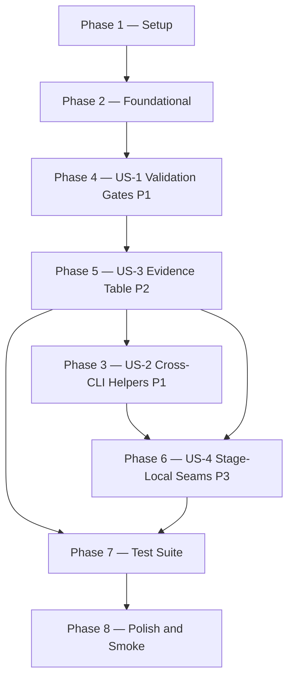

# Tasks: Skills Pipeline Augmentation

**Input**: `.specify/specs/031-skills-pipeline-augmentation/`

**Prerequisites**: plan.md ✓ · spec.md ✓ · data-model.md ✓ · contracts/ ✓ · research.md ✓

**Scope**: Workflow/platform feature — no application runtime, no VSCode UI, no
deployment target. `DEPLOY_IN_SCOPE = false` for this feature's own `/6` run.

**Protected files** — preserve numbered-stage sequencing and untouched utility
truth while implementing 031:
`extension/src/autonomous/PipelineStateManager.ts` ·
`extension/resources/bash-scripts/pipeline-state.sh` ·
`.specify/commands/gofer_constitution.md` ·
`.specify/commands/gofer_hydrate.md`

**High-risk files** — modify only when required for truthful cross-CLI parity or
installer/runtime repair:
`extension/src/council/CommandGenerator.ts` ·
`extension/src/council/CrossPlatformCommandRouter.ts` ·
`tests/integration/cross-platform-parity.test.ts`

---

## Overview

| Metric | Value |
| --- | --- |
| Total tasks | 39 |
| Phases | 8 |
| User stories | 4 (US-1 P1, US-2 P1, US-3 P2, US-4 P3) |
| Plan phases covered | 6 / 6 |
| Acceptance criteria covered | 18 / 18 |
| Parallel opportunities | 17 tasks marked [P] |

---

## Dependencies: Phase Graph



> **Note**: Rollout order is intentional: complete `/6` hardening first
> (Phases 4 → 5), then roll out standalone helpers (Phase 3), then stage-local
> seams (Phase 6). Phase 6 depends on Phase 3 for helper definitions and on
> Phase 5 because T020 re-runs the generator after all numbered-stage
> modifications are complete.

---

## Phase 1: Setup

**Purpose**: Confirm baseline state of the repo before any files are written. These
checks produce the reference counts used by Phase 7 count-update tasks.

- [x] T001 Verify baseline `.specify/commands/` inventory: run
  `ls .specify/commands/ | sort` and confirm the directory contains exactly the
  pre-feature set (**19 files total**): 14 numbered/lettered stage files
  `0_*.md` through `10_*.md` plus `6a_gofer_engineering_review.md`, 2 utility
  command files `.specify/commands/gofer_constitution.md` and
  `.specify/commands/gofer_hydrate.md`, and 3 control commands
  `gofer_plan.md`, `gofer_side.md`, `gofer_personality.md`. Record the exact
  file list as the baseline for Phase 7 count assertions.

- [x] T002 Verify test-suite baseline: run `npm test` from the repo root and
  record the real pass count and test-file inventory as the pre-feature baseline.
  This output is required evidence for the validation truthfulness standard this
  feature introduces.

**Checkpoint**: Baseline confirmed. Proceed to Phase 2.

---

## Phase 2: Foundational (Blocking Prerequisite)

**Purpose**: Register the five new helpers in `canonical-descriptions.mjs` and
confirm the Codex budget ceiling is satisfied. This is a shared prerequisite that
MUST complete before any helper command file is authored (Phase 3) or any `/6`
hardening begins (Phase 4), because budget overrun blocks generator emission.

**⚠️ CRITICAL**: No Phase 3 or Phase 4 work can begin until this phase passes the
wire-format budget check.

- [x] T003 Update `.specify/scripts/node/canonical-descriptions.mjs` and
  `.specify/scripts/node/codex-doctor.mjs`: add five new helper entries to the
  `CANONICAL_DESCRIPTIONS` map exactly as specified in plan.md §Phase-2 T2.1,
  revise the existing `6_gofer_validate` description to truthful 110-point
  evidence-backed wording, and expand the doctor canonical skill inventory to
  include the same five helpers (reassessing the bundle-threshold heuristic if
  required):
  ```javascript
  'gofer:vocabulary': 'Extract domain terminology into a canonical feature glossary.',
  'gofer:diagnose':   'Run a reproduce-minimize-instrument-fix loop for bugs and failing tests.',
  'gofer:tdd':        'Guide a red-green-refactor loop tied to spec acceptance criteria.',
  'gofer:spec-summary': 'Generate a business-friendly summary of feature value and scope.',
  'gofer:zoom-out':   'Show how the current feature connects to broader system boundaries.',
  ```
  After updating both files, run both budget checks from plan.md:
  ```bash
  node -e "import('.specify/scripts/node/canonical-descriptions.mjs').then(m => console.log(m.validateDescriptions()))"
  node -e "import('.specify/scripts/node/canonical-descriptions.mjs').then(m => {
    let total = 0;
    for (const [key, value] of Object.entries(m.CANONICAL_DESCRIPTIONS)) {
      total += Buffer.byteLength(\`\${key}: \${value}\n\`, 'utf8');
    }
    console.log(\`wire-format bytes: \${total} / 2048\`);
    if (total > 2048) process.exit(1);
  })"
  ```
  If the wire-format total exceeds 2048 bytes, shorten descriptions before
  proceeding — do not accept a budget overrun. Covers: FR-006, NFR-002,
  SC-001 (prerequisite), helper frontmatter `description: ≤ 140 characters`.

**Checkpoint**: Budget ≤ 2048 bytes confirmed. `/6` hardening Phases 4 and 5 can
proceed next; helper rollout waits until that track is complete.

---

## Phase 3: User Story 2 — Cross-CLI Helper Commands (Priority: P1) 🎯 MVP

**Goal**: Author five Gofer-owned helper command definitions and emit them to all
four CLI surfaces (Claude, Copilot, Codex, Gemini) via the existing generator.

**Independent Test**: Run `npm run gofer:generate` and confirm five new helper
files appear under `.claude/commands/`, `.github/prompts/`, `.agents/skills/gofer/`,
and `.gemini/commands/gofer/` without errors.

**Covers**: US-2 AC-1 through AC-7 · FR-001–FR-008, FR-016, FR-017 · SC-001,
SC-002, SC-006, SC-007, SC-008 · NFR-001, NFR-002, NFR-003, NFR-006 ·
data-model entities `CommandDefinition`, `GeneratedSurfaceArtifact`,
`FeatureArtifact` · IAP-031-01, IAP-031-02, IAP-031-04 · EVT-031-01, EVT-031-02

### Implementation for User Story 2

- [x] T004 [P] [US2] Create `.specify/commands/gofer_vocabulary.md` (plan T1.1):
  - Frontmatter: `name: gofer:vocabulary`, `title: "Gofer Vocabulary"`,
    `category: control`, `surfaces:` all 9 surface keys identical to
    `gofer_side.md` (`claude`, `claude-mirror`, `copilot`, `vscode`, `codex`,
    `gemini`, `github-prompts`, `agents-skills`, `system-skills`),
    `description:` ≤ 140 chars.
  - Body (Gofer-owned): Instructions to extract domain terminology from
    `.specify/specs/{feature}/spec.md` and `.specify/specs/{feature}/plan.md`,
    write canonical term definitions to `.specify/specs/{feature}/glossary.md`.
    Required artifact sections: `term entries`, `definitions`, `source artifacts`.
    Require the generated artifact to record `GeneratedAt`, `SourceCommandId`,
    `SourceInputs`, and `OverwriteNoticeWhenApplicable` (when the file is being
    replaced).
    Include explicit overwrite behavior: if `glossary.md` already exists, overwrite
    it and prepend `<!-- regenerated at HH:MM -->`. Artifact path MUST be
    `.specify/specs/{feature}/glossary.md` — never repo root. Do NOT copy verbatim
    text from `mattpocock/ubiquitous-language`.
  - Verify: run a real parse call such as
    `node --input-type=module -e "import { parseStageCommand } from './.specify/scripts/node/parse-stage-command.mjs'; await parseStageCommand('.specify/commands/gofer_vocabulary.md')"`
    and confirm frontmatter `title`, `surfaces`, and `description` all validate.
    Covers: FR-001, FR-008, FR-017 · SC-007, SC-008 · IAP-031-01, IAP-031-02 ·
    data-model `FeatureArtifact.Glossary`.

- [x] T005 [P] [US2] Create `.specify/commands/gofer_diagnose.md` (plan T1.2):
  - Frontmatter: `name: gofer:diagnose`, `title: "Gofer Diagnose"`,
    `category: control`, all 9 surfaces, description ≤ 140 chars.
  - Body (Gofer-owned): Instructions for a reproduce-minimize-instrument-fix loop.
    Write findings to `.specify/specs/{feature}/diagnose-report.md`. Required
    artifact sections: `reproduce`, `minimize`, `instrument`, `fix`. Include the
    minimum provenance schema `GeneratedAt`, `SourceCommandId`, `SourceInputs`,
    and `OverwriteNoticeWhenApplicable` (when the file is being replaced). Include
    explicit overwrite behavior (regeneration header) when `diagnose-report.md`
    already exists. Artifact path MUST be `.specify/specs/{feature}/diagnose-report.md`. Do NOT copy verbatim text from `mattpocock/diagnose`.
  - Verify: same real `parseStageCommand()` invocation pattern + frontmatter
    checks as T004. Covers: FR-002, FR-008, FR-017 · SC-007 · data-model
    `FeatureArtifact.DiagnoseReport`.

- [x] T006 [P] [US2] Create `.specify/commands/gofer_tdd.md` (plan T1.3):
  - Frontmatter: `name: gofer:tdd`, `title: "Gofer TDD"`, `category: control`,
    all 9 surfaces, description ≤ 140 chars.
  - Body (Gofer-owned): Instructions for red-green-refactor micro-loop operating
    within `/5_gofer_implement` and `/9_gofer_tests` task scope; must NOT replace
    those numbered stages. Write cycle log to
    `.specify/specs/{feature}/tdd-session.md`. Required artifact sections:
    `acceptance criteria linkage`, `red`, `green`, `refactor`. Include overwrite
    behavior (regeneration header) and the minimum provenance schema
    `GeneratedAt`, `SourceCommandId`, `SourceInputs`, and
    `OverwriteNoticeWhenApplicable` (when the file is being replaced). Artifact path MUST be
    `.specify/specs/{feature}/tdd-session.md`. Do NOT copy verbatim text from
    `mattpocock/tdd`.
  - Verify: same real `parseStageCommand()` invocation pattern + frontmatter
    checks as T004. Covers: FR-003, FR-008, FR-017 · SC-007 · data-model
    `FeatureArtifact.TddSession`.

- [x] T007 [P] [US2] Create `.specify/commands/gofer_spec_summary.md` (plan T1.4):
  - Frontmatter: `name: gofer:spec-summary`, `title: "Gofer Spec Summary"`,
    `category: control`, all 9 surfaces, description ≤ 140 chars.
  - Body (Gofer-owned): Instructions to produce a business-friendly summary of
  the feature's purpose, value, and acceptance criteria without implementation
  detail. Write to `.specify/specs/{feature}/spec-summary.md`. Required artifact
  sections: `what`, `why`, `acceptance criteria`, `out of scope`. Include
  overwrite behavior (regeneration header) and the minimum provenance schema
  `GeneratedAt`, `SourceCommandId`, `SourceInputs`, and
  `OverwriteNoticeWhenApplicable` (when the file is being replaced). Remove any issue-tracker publish
  dependency. Do NOT copy verbatim text from `mattpocock/to-prd`.
  - Verify: same real `parseStageCommand()` invocation pattern + frontmatter
    checks as T004. Covers: FR-004, FR-008, FR-017 · SC-007 · data-model
    `FeatureArtifact.SpecSummary`.

- [x] T008 [P] [US2] Create `.specify/commands/gofer_zoom_out.md` (plan T1.5):
  - Frontmatter: `name: gofer:zoom-out`, `title: "Gofer Zoom Out"`,
    `category: control`, all 9 surfaces, description ≤ 140 chars.
  - Body (Gofer-owned): Instructions to produce a structured system-context
  expansion showing how the current feature connects to broader architectural
  boundaries. Write to `.specify/specs/{feature}/zoom-out-report.md`. Required
  artifact sections: `current boundary`, `upstream/downstream`,
  `cross-cutting impact`. Include overwrite behavior (regeneration header) and
  the minimum provenance schema `GeneratedAt`, `SourceCommandId`,
  `SourceInputs`, and `OverwriteNoticeWhenApplicable` (when the file is being
  replaced).
  Artifact path MUST be `.specify/specs/{feature}/zoom-out-report.md`. Do NOT
    copy verbatim text from `mattpocock/zoom-out`.
  - Verify: same real `parseStageCommand()` invocation pattern + frontmatter
    checks as T004. Covers: FR-005, FR-008, FR-017 · SC-007 · data-model
    `FeatureArtifact.ZoomOutReport`.

- [x] T009 [US2] Run the generator in dry-run mode to verify all five helpers are
  recognized before any files are written (plan T2.2):
  ```bash
  npm run gofer:generate -- --dry-run
  ```
  Confirm the dry-run output lists all five helper names in the `[dry-run] Stages:`
  line and lists the full surface set including `claude`, `claude-mirror`, `copilot`,
  `github-prompts`, `agents-skills`, `system-skills`, `gemini`, `agents-md`, and
  `codex-config` in the `[dry-run] Would emit to surfaces:` line. Confirm zero
  validation errors. Note: `agents-md` and `codex-config` are generator emitter
  surface names, not frontmatter `surfaces:` keys. Depends on T004–T008. Covers:
  FR-006 · IAP-031-04.

- [x] T010 [US2] Run the generator for real to emit all CLI surfaces (plan T2.3):
  ```bash
  npm run gofer:generate
  ```
  Verify the following output paths are written for each of the five helpers (using
  `gofer:vocabulary` as the representative example; repeat for all five):
  - `.claude/commands/gofer:vocabulary.md`
  - `extension/resources/claude-commands/gofer:vocabulary.md`
  - `.github/prompts/gofer:vocabulary.prompt.md`
  - `extension/resources/copilot-prompts/gofer:vocabulary.prompt.md`
  - `.agents/skills/gofer/gofer:vocabulary/SKILL.md`
  - `.system/skills/gofer/gofer:vocabulary/SKILL.md`
  - `.gemini/commands/gofer/gofer:vocabulary.md`
  - `.gemini/commands/gofer/gofer:vocabulary.toml`
  Also confirm the singleton generator outputs are refreshed:
  - `.agents/AGENTS.md`
  - `.gemini/commands/gofer/manifest.json`
  - `.gemini/extension.json`
  - `.specify/outputs/codex-config-fragment.toml`
  Depends on T009. Covers: FR-006 · SC-002 · NFR-001 · IAP-031-04 · EVT-031-02 ·
  data-model `GeneratedSurfaceArtifact` full matrix.

- [x] T011 [US2] Run the Codex doctor as an installed-surface smoke check
  (plan T2.4):
  ```bash
  npm run gofer:codex-doctor
  ```
  Expect exit 0 when a local Codex skill root is present. If `~/.codex/skills` is
  not readable on this workstation, record that limitation and treat the Phase 2
  wire-format check (T003) plus Phase 7 source-tree budget tests (T024) as the
  authoritative gates. Log the reported byte total in the task output. Depends on
  T010. Covers: FR-006 · SC-002 · NFR-002.

**Checkpoint**: Five helper files authored, generator emits all surfaces, Codex
budget confirmed ≤ 2048 bytes. User Story 2 is independently testable.

---

## Phase 4: User Story 1 — Truthful Validation Gate (Priority: P1) 🎯 MVP

**Goal**: Add three evidence gates, deterministic FR-011 deployment/render scope
detection, and the honest-scoring rule to `.specify/commands/6_gofer_validate.md`.
All changes stay within the existing `/6` stage contract; no new `/6A.x` stages
are created, and the only allowed structural addition is the inline `Step 2.2`
substep inside Phase A.

**Independent Test**: Inspect `.specify/commands/6_gofer_validate.md` and confirm
`GATE-1`, `GATE-2`, `GATE-3`, `DEPLOY_IN_SCOPE`, and the honest-scoring rule are
all present. Existing phase headings and numbered-step flow must remain intact
apart from the explicit additive `Step 2.2` insertion.

**Covers**: US-1 AC-1 through AC-5 · FR-009–FR-012, FR-015 · SC-003, SC-004,
SC-006 · NFR-003, NFR-004, NFR-005 · data-model `ValidationEvidenceRecord`
categories 1, 2, 3, 5 · IAP-031-03, IAP-031-06 · EVT-031-03

### Implementation for User Story 1

- [x] T012 [US1] Add **Deployment/Render Scope Detection** subsection to
  `.specify/commands/6_gofer_validate.md` (plan T3.1): insert the block
  immediately after the `HAS_UI` detection line in Step 1 (Load Context). The
  block must define exactly these three signals and the `DEPLOY_IN_SCOPE`
  determination:
  ```markdown
  **Deployment/Render Scope Detection** (FR-011):
  Scan `spec.md`, `plan.md`, `contract-pack.md`, and `quickstart.md` (when
  present) for the following signals:
  - DEPLOY_SIGNAL_1: any acceptance criterion contains: `rendered`, `live route`,
    `live API`, `deployed`, `production`, `staging`, `SharePoint`, `Azure`,
    `smoke`, `E2E`, `browser`
  - DEPLOY_SIGNAL_2: `plan.md`, `contract-pack.md`, or `quickstart.md` names a deployment target:
    SharePoint, Azure, staging, production, Vercel, Netlify, Docker, Kubernetes,
    or any server/environment referenced in the acceptance chain
  - DEPLOY_SIGNAL_3: `plan.md` declares a UI/rendered experience AND at least
    one acceptance criterion uses: `sees`, `displays`, `shows`, `renders`,
    `navigates to`
  Set `DEPLOY_IN_SCOPE = true` if ANY signal is present.
  Set `DEPLOY_IN_SCOPE = false` if NO signal is present.
  Record the determination in the validation report preamble.
  ```
  After editing, confirm existing step headings are still present:
  `grep "^## Step\|^# Phase" .specify/commands/6_gofer_validate.md`. Covers:
  FR-011 · US-1 AC-3 · data-model `ValidationEvidenceRecord.scopeState`,
  `scopeSourceArtifacts`.

- [x] T013 [US1] Add **Step 2.2: Evidence Gate Pre-Check** block to
  `.specify/commands/6_gofer_validate.md` (plan T3.2): insert as a new step
  heading between the "Run all 6 core agents in parallel" instruction and the
  "Collect all results before proceeding" instruction in Phase A. The block must
  define exactly:
  ```
  GATE-1 (Integration Proof — Category 5):
    Require: runtime wiring artifact OR integration-test execution output
    present in the current session context by final scoring time.
    If absent during Step 2.2, record GATE-1 as pending and re-check it after
    Step 3 automated checks complete.
    Still absent after Step 3 → Category 5 score = 0; mark GATE_FAIL = true

  GATE-2 (Test Execution — Categories 1 and 2):
    Require: real, executed npm test output with pass/fail count
    already present or produced by Step 3 automated checks before final scoring.
    If absent during Step 2.2, record GATE-2 as pending and re-check it after
    Step 3 automated checks complete.
    Still absent after Step 3 → Categories 1 and 2 score = 0; mark GATE_FAIL = true

  GATE-3 (Deployment/Render — Category 3):
    IF HAS_UI = false:
      Record "N/A — HAS_UI=false" in evidence table.
      Record a matching not-in-scope reason in `Absent / Reason for 0`.
      Apply existing no-UI point redistribution.
    IF HAS_UI = true AND DEPLOY_IN_SCOPE = false:
      Require: local render proof (screenshot, component render assertion,
      headless browser assertion, or local smoke-check output) present by final
      scoring time.
      If absent during Step 2.2, record GATE-3 as pending and re-check before
      final PASS/FAIL synthesis.
      Still absent → Category 3 score = 0; mark GATE_FAIL = true
      If present, record "Render proof only — deployment target not in scope"
      in the evidence table and do not redistribute Category 3 points.
    IF HAS_UI = true AND DEPLOY_IN_SCOPE = true:
      Require: screenshot, curl/HTTP transcript, deployment log,
      headless browser assertion, or smoke-check output present by final scoring time.
      If absent during Step 2.2, record GATE-3 as pending and re-check before
      final PASS/FAIL synthesis.
      Still absent → Category 3 score = 0; mark GATE_FAIL = true

  If any GATE_FAIL = true:
    - Any agent that would have scored the gated category is still run
      (for remediation notes) but its score is overridden to 0.
    - Report FAIL immediately after all agents complete.
    - Do not promote to PASS regardless of other scores.

  Also update the existing Step 7 Category 3 scoring text so it references
  `DEPLOY_IN_SCOPE` / `GATE-3` instead of relying on `HAS_UI` alone.
  ```
  Covers: FR-009, FR-010, FR-011, FR-012 · US-1 AC-1, AC-2, AC-3 · SC-003,
  SC-004 · data-model `ValidationEvidenceRecord.proofRequirement`,
  `scopeState`, `absentReason`.

- [x] T014 [US1] Add **Honest-Scoring Rule** paragraph to the Scoring Rules
  subsection of `.specify/commands/6_gofer_validate.md` (plan T3.3): append
  immediately after the line that currently ends "Anything less = FAIL":
  > **Honest-scoring rule (FR-012)**: If an agent reports "EVIDENCE ABSENT:",
  > the orchestrating stage MUST score that category 0 regardless of other
  > findings. Phrases like "likely correct", "appears wired", or "should be
  > passing" are NOT evidence and MUST NOT contribute to any score. Any rubric
  > category where evidence is absent, unverifiable, fabricated, or implied
  > scores exactly 0 — no partial credit.
  Covers: FR-012 · US-1 AC-5 · SC-003, SC-004 · data-model
  `ValidationEvidenceRecord.absentReason`, `evidenceLocator`.

**Checkpoint**: Evidence gates and honest-scoring rule are present in
`6_gofer_validate.md`. User Story 1 gates are independently verifiable.

---

## Phase 5: User Story 3 — Evidence Table in Validation Report (Priority: P2)

**Goal**: Add the mandatory evidence table requirement to Step 8 of
`.specify/commands/6_gofer_validate.md` so every `/6` run (PASS and FAIL) emits
a structured proof record in `validation-report.md`.

**Independent Test**: After this phase, open `validation-report.md` from any
recent `/6` run and confirm an evidence table with 11 category rows, a `Total`
row, and both
`Evidence Artifact / Command Output` and `Absent / Reason for 0` columns is present.

**Covers**: US-3 AC-1 through AC-3 · FR-013, FR-014, FR-015 · SC-005 · NFR-004 ·
data-model `ValidationEvidenceRecord` (all 11 rows), `FeatureArtifact.ValidationReport` ·
IAP-031-05 · EVT-031-04

### Implementation for User Story 3

- [x] T015 [US3] Add **Evidence Table** requirement to Step 8 of
  `.specify/commands/6_gofer_validate.md` (plan T3.4): append the following
  instruction block after the existing report-writing block in Step 8 (Generate
  Validation Report). The block must start with the exact heading
  `## Evidence Table` and include the exact 11-category table plus `Total` row
  structure from plan.md §T3.4 with columns `Category`, `Score`,
  `Evidence Artifact / Command Output`, and `Absent / Reason for 0`. The
  instructions must state:
  - The evidence table is required on **EVERY run (PASS and FAIL)**.
  - `Evidence Artifact / Command Output` must contain at least one of: a file
    path visible in the current session, an executed command with real output
    and timestamp, or a sub-agent finding citation (agent name + finding ID).
  - This section is additive: appended after existing report sections; must not
    remove or rewrite legacy `validation-report.md` content.
  - An empty evidence cell or a cell containing only inferences/assumptions MUST
    cause that category to score 0.
  - `validation-report.md` must record `/6` provenance fields sufficient to trace
    the run: `GeneratedAt`, `SourceCommandId`, `SourceInputs`, and
    `OverwriteNoticeWhenApplicable` when the report is rewritten.
  - Update the `blast-radius-report.md` contract in the same `/6_gofer_validate.md`
    file so the report persists with required sections `changed surfaces`,
    `risk vectors`, `containment summary`, plus the same `/6` provenance fields.
  - Category 11's evidence cell MUST cite `blast-radius-report.md`.
  - When Category 3 is not in scope, the report preamble or row text MUST make
    redistribution explicit enough that normalization/effective contribution
    remains derivable from the persisted report.
  Covers: FR-013, FR-014 · US-3 AC-1, AC-2 · SC-005 · data-model
  `ValidationEvidenceRecord` rows 1–11.

- [x] T016 [US3] Verify that all changes to `.specify/commands/6_gofer_validate.md`
  (Phases 4 and 5, plan T3.5) are additive except for the minimal wording
  correction required to align any stale Phase B / Step 3 order summary with the
  actual step headings and pending-gate semantics. Run
  `git diff .specify/commands/6_gofer_validate.md` and confirm no unrelated
  pre-existing lines were removed — only new content was inserted/appended plus
  that targeted outline clarification. Confirm via grep that all required markers
  are present, and explicitly replace stale `/100` scoring references with the
  active 110-point contract or `score_max` wording where appropriate:
  ```bash
  grep "DEPLOY_IN_SCOPE\|GATE-1\|GATE-2\|GATE-3\|Evidence Gate\|Honest-scoring rule\|Evidence Table" \
    .specify/commands/6_gofer_validate.md
  grep -n "/100\|score < 100\|Validation score: \[N\]/100" \
    .specify/commands/6_gofer_validate.md
  ```
  Also confirm no `/6A.x` stage files were created:
  ```bash
  ls .specify/commands/ | grep "6[aA]" | grep -v "6a_gofer_engineering_review"
  # Expected output: empty (the pre-existing 6a file is intentionally filtered out)
  ```
  Also update `tests/unit/autonomous/WorkspaceContextProvider.test.ts` so the
  existing `validation-report.md` consumer is exercised with a legacy
  pre-evidence-table report body and still detects the `validate` stage without
  requiring `## Evidence Table`. Add
  `tests/unit/scripts/validation-report-compat.test.ts` to exercise a legacy
  pre-evidence-table report sample and a post-feature sample, confirming the
  legacy sections remain readable when `## Evidence Table` is appended. Update
  any stale `/6` metadata/frontmatter wording in `.specify/commands/6_gofer_validate.md`
  so it no longer describes validation as "six quality dimensions" or a
  "100-point rubric".
  Covers: FR-015 · US-3 AC-3 · NFR-003, NFR-004.

**Checkpoint**: Evidence table requirement is in `6_gofer_validate.md`, change is
additive, no `/6A.x` stages created. User Stories 1 and 3 are complete.

---

## Phase 6: User Story 4 — Stage-Local Augmentation Seams (Priority: P3)

**Goal**: Add selector-driven optional helper seam blocks to three existing
numbered stage files. These are purely additive; they must define provider-neutral
activation selectors without changing stage IDs, routing, artifact contracts, or
pipeline state.

**Independent Test**: Run
`grep -E "gofer:vocabulary|gofer:zoom-out|vocabulary|zoom-out" .specify/commands/1_gofer_research.md`
and confirm the seam block is present with selector tokens. Trigger
`/5_gofer_implement` with the `tdd-assist` selector and confirm the inline seam
produces the same artifact contract as standalone `gofer:tdd`. Then run
`npm run gofer:generate` and confirm the generator exits without errors.

**Covers**: US-4 AC-1 through AC-3 · FR-007, FR-008 · SC-006 · NFR-003 ·
data-model `StageAugmentationBinding` approved bindings · IAP-031-01 ·
EVT-031-01

### Implementation for User Story 4

- [x] T017 [P] [US4] Add `gofer:vocabulary` and `gofer:zoom-out` selector-driven
  helper seam guidance to `.specify/commands/1_gofer_research.md` (plan T4.1): append the
  following fenced section at the end of the stage body:
  ```markdown
  ---
  ## Optional Helpers: Vocabulary Extraction and Zoom-Out
  If the operator explicitly requests the `vocabulary` selector after
  `research.md` exists, run `gofer:vocabulary` inline and write
  `.specify/specs/{feature}/glossary.md` using the same artifact contract as
  the standalone helper.
  If the operator explicitly requests the `zoom-out` selector after
  `research.md` exists, run `gofer:zoom-out` inline and write
  `.specify/specs/{feature}/zoom-out-report.md` using the same artifact
  contract as the standalone helper.
  If `research.md` is missing, continue the stage normally and report that the
  helper was not run.
  These selectors are optional and do not change stage progress, routing, or
  pipeline state.
  ---
  ```
  Covers: data-model `StageAugmentationBinding` rows `research-vocabulary`,
  `research-zoom-out` · IAP-031-01 approved seam map.

- [x] T018 [P] [US4] Add `gofer:vocabulary` and `gofer:spec-summary`
  selector-driven helper seam guidance to `.specify/commands/2_gofer_specify.md` (plan T4.2): append
  the following fenced section at the end of the stage body:
  ```markdown
  ---
  ## Optional Helpers: Vocabulary Extraction and Spec Summary
  - If the operator explicitly requests the `vocabulary` selector after
    `spec.md` is stabilized, run `gofer:vocabulary` inline and write
    `.specify/specs/{feature}/glossary.md` using the same artifact contract as
    the standalone helper.
  - If the operator explicitly requests the `spec-summary` selector after
    `spec.md` is stabilized, run `gofer:spec-summary` inline and write
    `.specify/specs/{feature}/spec-summary.md` using the same artifact contract
    as the standalone helper.
  - If `spec.md` is missing, continue the stage normally and report that the
    helper was not run.
  - These selectors are optional and do not change stage progress, routing, or
    pipeline state.
  ---
  ```
  Covers: data-model `StageAugmentationBinding` rows `specify-vocabulary`,
  `specify-spec-summary`.

- [x] T019 [P] [US4] Add `gofer:tdd` and `gofer:diagnose` selector-driven helper
  seam guidance to `.specify/commands/5_gofer_implement.md` (plan T4.3): append the following
  fenced section at the end of the stage body:
  ```markdown
  ---
  ## Optional Helpers: TDD and Diagnose
  - If the operator explicitly requests `tdd-assist` and both `spec.md` and
    `tasks.md` are present, run `gofer:tdd` inline and write
    `.specify/specs/{feature}/tdd-session.md` using the same artifact contract
    as the standalone helper.
  - If the operator explicitly requests `diagnose` and `spec.md` is present, run
    `gofer:diagnose` inline; bug context, failing output, or equivalent failure
    evidence may supplement the investigation. Write
    `.specify/specs/{feature}/diagnose-report.md` using the same artifact
    contract as the standalone helper.
  - If the required inputs are missing, continue the stage normally and report
    that the helper was not run.
  - These selectors are optional and do not change stage progress, routing, or
    pipeline state.
  ---
  ```
  Covers: data-model `StageAugmentationBinding` rows `implement-tdd`,
  `implement-diagnose`.

- [x] T020 [US4] Re-run `npm run gofer:generate` to emit updated surfaces for all
  four stage files that were modified in Phases 4, 5, and 6 (plan T4.4). Confirm
  the generator exits 0 and that no pre-existing stage names disappear from the
  surface output. Then confirm selector tokens are present and stage IDs are unchanged:
  ```bash
  grep -E "vocabulary|zoom-out" .specify/commands/1_gofer_research.md
  grep -E "vocabulary|spec-summary" .specify/commands/2_gofer_specify.md
  grep -E "tdd-assist|diagnose" .specify/commands/5_gofer_implement.md
  ls .specify/commands/ | grep "^[0-9]" | sort
  # Must be identical to pre-feature baseline recorded in T001
  ```
  Depends on T017, T018, T019 (all seams authored). Covers: NFR-002, NFR-003 ·
  SC-006 · US-4 AC-2, AC-3 · EVT-031-02.

**Checkpoint**: Stage-local seams added, generator re-runs cleanly, no stage IDs
changed. User Story 4 is complete.

---

## Phase 7: Test Suite

**Purpose**: Add and update test assertions across existing and new test files
to cover all acceptance tests (AT-001 through AT-008) and synchronize hardcoded
counts from `19` → `24` (commands) and `16` → `21` (descriptions).

**⚠️ Tests in Phase 7 verify the implementations from Phases 3–6. Run
`npm run gofer:generate` (T010/T020) before writing tests so the generated
files asserted by T025 actually exist.**

### Test Updates for User Story 2 — Cross-CLI Helpers

- [x] T021 [P] [US2] Update `tests/unit/scripts/control-commands-surfaces.test.ts`
  (plan T5.1): extend `CONTROL_COMMANDS` array with the five new helpers:
  `'gofer_vocabulary.md'`, `'gofer_diagnose.md'`, `'gofer_tdd.md'`,
  `'gofer_spec_summary.md'`, `'gofer_zoom_out.md'`. Update the human-readable
  assertion label from `'all three control-command files exist on disk'` to
  `'all control-command files exist on disk'`. Make no other behavioral changes.
  Covers: SC-001 · US-2 AC-1.

- [x] T022 [P] [US2] Update `tests/unit/scripts/description-budget.test.ts`
  (plan T5.2): extend `EXPECTED_STAGES` with five new helper names
  (`'gofer:vocabulary'`, `'gofer:diagnose'`, `'gofer:tdd'`, `'gofer:spec-summary'`,
  `'gofer:zoom-out'`). Update count assertions from `16` → `21`:
  - `'contains exactly 16 stage descriptions'` → `'contains exactly 21 stage descriptions'`
  - `'contains all 16 expected stage names'` → `'contains all 21 expected stage names'`
  Keep per-description ≤ 140 chars and cumulative-byte assertions unchanged.
  Covers: SC-001, SC-002 · NFR-002.

- [x] T023 [P] [US2] Update `tests/unit/scripts/canonical-descriptions.test.ts`
  (plan T5.3): add explicit `import { beforeAll } from 'vitest'` if not already
  present. Extend `expectedStages` with the five new helper names. Update:
  - `'has exactly 16 stage descriptions'` → `'has exactly 21 stage descriptions'`
  - `validateDescriptions()` expected count `16` → `21`
  Covers: FR-006 · NFR-002.

- [x] T024 [P] [US2] Update `tests/unit/codex/canonical-set-cumulative-budget.test.ts`
  (plan T5.4): change the `'canonical set has 16 descriptions'` assertion to
  `'canonical set has 21 descriptions'` and update `toHaveLength(16)` →
  `toHaveLength(21)`. Keep the `≤ 2048 bytes` wire-format assertion logic
  unchanged. Covers: SC-001 · NFR-002 · data-model `CommandDefinition` budget
  constraint.

- [x] T025 [US2] Create `tests/unit/scripts/helper-commands-cross-cli-parity.test.ts`
  (plan T5.5) covering acceptance tests AT-005, AT-006, and AT-008. File must
  be a Vitest test with explicit return types and no `require()` imports. Required
  assertions:
  - All five helper source files exist under `.specify/commands/` with filenames
    `gofer_vocabulary.md`, `gofer_diagnose.md`, `gofer_tdd.md`,
    `gofer_spec_summary.md`, `gofer_zoom_out.md`.
  - Each helper's YAML frontmatter exposes all 9 surface keys, `category: control`,
    `name` matching `gofer:*`, a non-empty `title`, and `description.length ≤ 140`.
  - After `npm run gofer:generate`, the following emitted paths exist for each
    helper (using real generator output paths — NOT the legacy flat
    `.system/skills/<name>/SKILL.md` paths):
    - `.claude/commands/<name>.md`
    - `extension/resources/claude-commands/<name>.md`
    - `.github/prompts/<name>.prompt.md`
    - `extension/resources/copilot-prompts/<name>.prompt.md`
    - `.agents/skills/gofer/<name>/SKILL.md`
    - `.system/skills/gofer/<name>/SKILL.md`
  - `.gemini/commands/gofer/<name>.md`
  - `.gemini/commands/gofer/<name>.toml`
  - The singleton Gemini outputs `.gemini/commands/gofer/manifest.json` and
    `.gemini/extension.json` are refreshed and include the helper registrations.
  - Each helper body contains its exact artifact contract path under
    `.specify/specs/{feature}/`:
    `.specify/specs/{feature}/glossary.md`,
    `.specify/specs/{feature}/diagnose-report.md`,
    `.specify/specs/{feature}/tdd-session.md`,
    `.specify/specs/{feature}/spec-summary.md`,
    `.specify/specs/{feature}/zoom-out-report.md`.
  - Each helper body contains explicit overwrite/regeneration language
    (`'overwrite'` or `'regenerated'`).
  - Each helper body requires generated artifacts to record the minimum
    provenance schema: `GeneratedAt`, `SourceCommandId`, `SourceInputs`, and
    `OverwriteNoticeWhenApplicable`.
  - After `npm run gofer:generate`, normalize the emitted provider surfaces and
    assert the user-observable helper contract is equivalent across Claude,
    Copilot, Codex, and Gemini: same helper identifier, same artifact path,
    same overwrite/provenance instructions, and same selector tokens where the
    source command defines a seam.
  - Stage-local seam blocks in `/1`, `/2`, and `/5` reference the same helper
    names, artifact filenames, and explicit same-contract language as the
    standalone command definitions.
  - Stage-local seam blocks include the exact provider-neutral activation selectors
    `vocabulary`, `zoom-out`, `spec-summary`, `tdd-assist`, and `diagnose`.
  - Stage-local seam blocks state the stage continues normally if required inputs
    are missing.
  - Helper bodies do not contain forbidden upstream tokens:
    `'setup-matt-pocock-skills'`, `'/setup-matt-pocock-skills'`,
    `'UBIQUITOUS_LANGUAGE.md'`. Add a comment in the test file stating this token
    scan is intentionally narrow and that T039 manual review is the authoritative
    FR-017 gate.
  - Numbered stage file set remains unchanged; the only lettered stage file is the
    pre-existing `6a_gofer_engineering_review.md`.
  Covers: AT-005, AT-006, AT-008 · FR-001–FR-008, FR-016, FR-017 ·
  SC-001, SC-002, SC-006, SC-007, SC-008 · NFR-001, NFR-006.

- [x] T026 [US1] Create `tests/unit/scripts/validation-evidence-gates.test.ts`
  (plan T5.6) covering acceptance tests AT-001, AT-002, AT-003, AT-004. These are
  specification-level contract tests that verify the `6_gofer_validate.md` command
  file contains required gate language rather than executing a full `/6` run.
  Required assertions (all by reading `.specify/commands/6_gofer_validate.md` as
  raw text):
  - `GATE-1` integration-proof block exists, names Category 5, and includes
    `GATE_FAIL`, `final scoring time`, and the Step 3 re-check language.
  - `GATE-2` test-execution block exists, names Categories 1 and 2, and requires
    real executed `npm test` output already present or produced by Step 3
    automated checks before final scoring.
  - `GATE-3` deployment/render block exists, includes the `HAS_UI = false`,
    `HAS_UI = true AND DEPLOY_IN_SCOPE = false`, and
    `HAS_UI = true AND DEPLOY_IN_SCOPE = true` branches, names Category 3, and
    sets `GATE_FAIL` with a pre-synthesis re-check.
  - Step 7 Category 3 scoring text references `DEPLOY_IN_SCOPE` / `GATE-3`, not
    `HAS_UI` alone.
  - The `HAS_UI = false` branch records `'N/A — HAS_UI=false'`, references the
    no-UI redistribution path, and carries an explicit not-in-scope reason.
  - The `HAS_UI = true AND DEPLOY_IN_SCOPE = false` branch records
    `'Render proof only — deployment target not in scope'` and makes local
    render proof mandatory.
  - Deployment/render scope detection contains all four tokens: `DEPLOY_SIGNAL_1`,
    `DEPLOY_SIGNAL_2`, `DEPLOY_SIGNAL_3`, and `DEPLOY_IN_SCOPE`.
  - Evidence table requirement states it is required on `EVERY run (PASS and FAIL)`
    and includes the exact heading `## Evidence Table` plus the column headers
    `Evidence Artifact / Command Output` and
    `Absent / Reason for 0`.
  - Evidence table instructions include all 11 rubric categories plus a `Total`
    row.
  - Evidence table instructions state the section is additive / appended and does
    not rewrite prior `validation-report.md` content.
  - Validation report instructions include `/6` provenance fields:
    `GeneratedAt`, `SourceCommandId`, `SourceInputs`, and
    `OverwriteNoticeWhenApplicable`.
  - Category 11's row cites `blast-radius-report.md`.
  - The blast-radius report template includes `changed surfaces`, `risk vectors`,
    `containment summary`, and the same `/6` provenance fields.
  - The `HAS_UI = true AND DEPLOY_IN_SCOPE = false` path makes render-only
    scoring explicit enough to derive normalization/effective contribution from
    the persisted report.
  - PASS-path language states a fully evidenced run writes `validation-report.md`
    with a populated evidence table and does not grant PASS when gated evidence is
    absent.
  - Honest-scoring rule contains `EVIDENCE ABSENT` and `exactly 0`.
  - No new `/6A.x` headings or sub-stage definitions are introduced (check that
    no heading matching `/6A\.[0-9]+/` appears).
  Covers: AT-001, AT-002, AT-003, AT-004 · FR-009–FR-015 · SC-003, SC-004,
  SC-005 · data-model `ValidationEvidenceRecord` contract.

- [x] T027 [P] [US2] Update `tests/unit/scripts/byte-equivalence.test.ts`
  (plan T5.7): add the five new helper filenames to the `CONTROL_COMMAND_FILES`
  exclusion set: `'gofer_vocabulary.md'`, `'gofer_diagnose.md'`, `'gofer_tdd.md'`,
  `'gofer_spec_summary.md'`, `'gofer_zoom_out.md'`. Keep the fixture-count
  expectation aligned with the exclusion behavior; no new golden fixtures are
  required for these helpers. Covers: NFR-002.

- [x] T028 [P] [US2] Update `tests/unit/scripts/stage-manifest.test.ts`
  (plan T5.8): extend `EXPECTED_CONTROL_COMMANDS` with the five new helpers
  and update the derived control/total command counts from `3/19` → `8/24`.
  Covers: SC-001 · NFR-002.

- [x] T029 [P] [US2] Update `tests/unit/scripts/generator-regression.test.ts`
  (plan T5.9): extend `EXPECTED_CONTROL_COMMANDS` with the five new helper slugs
  and update the total command count from `19` → `24`. Refresh the test comment
  to reflect `16` numbered/lettered pipeline stages plus `8` control commands.
  Covers: NFR-002, NFR-003.

- [x] T030 [P] [US2] Update source-of-truth / manifest inventory tests and the
  hand-maintained command manifests they validate (plan T5.10) — adjust
  hardcoded source-of-truth / generated-command totals from `19` → `24`, refresh
  human-readable labels to reference `16` numbered/lettered pipeline/utility
  commands plus `8` control commands, update `tests/unit/cli/picker-fuzzy.test.ts`
  so its command universe and picker expectations include the five new helper
  commands, and manually add the five new helper
  entries to the non-generated repo files those tests read:
  - `tests/unit/scripts/alias-uniqueness.test.ts`
  - `tests/unit/scripts/e2e-pipeline-smoke.test.ts`
  - `tests/unit/scripts/numbered-vs-namespaced-parity.test.ts`
  - `tests/unit/scripts/surface-exclusion.test.ts`
  - `tests/unit/cli/picker-fuzzy.test.ts`
  - `tests/unit/scripts/claude-plugin-manifest-valid.test.ts`
  - `tests/unit/scripts/agents-md-shape.test.ts`
  - `.claude-plugin/plugin.json`
  - `AGENTS.md`
  Note: `AGENTS.md` at the repo root and `.claude-plugin/plugin.json` are
  hand-maintained, non-authoritative manifests for current tests; they are
  distinct from generated surfaces and `.specify/commands/*.md` remains the
  sole source of truth. Keep `e2e-pipeline-smoke.test.ts` and
  `numbered-vs-namespaced-parity.test.ts` as the automated pipeline-sequence
  guards for AT-007 / SC-006. Use the real identifier conventions for each
  hand-maintained file:
  - `AGENTS.md` headings use namespaced helper identifiers such as
    `gofer:vocabulary`
  - `.claude-plugin/plugin.json` command names use namespaced identifiers such
    as `gofer:vocabulary`
  - `codex-config.toml` entries use `gofer/gofer:*` identifiers such as
    `gofer/gofer:vocabulary`
  Also update the stale `/6` copy in both `AGENTS.md` and
  `.claude-plugin/plugin.json`: replace the outdated "100-point rubric" /
  "six quality dimensions" wording with the current truthful 110-point
  evidence-backed contract language.
  Covers: NFR-002, NFR-003 · SC-006.

- [x] T031 [P] [US2] Update Codex/Gemini inventory tests, Codex doctor coverage,
  and the repo-root Codex manifest they validate (plan T5.11):
  - `tests/unit/codex/e2e-codex-clean-environment.test.ts` — update
    `expect(count).toBe(16)` → `expect(count).toBe(21)`.
  - `tests/unit/codex/codex-only-emit.test.ts` — update the allowed helper/control
    command set and emitted-count expectations for the five new helpers.
  - `tests/unit/codex/codex-doctor.test.ts` — update canonical-skill fixture
    inventory and expected skill-file totals from the old 16-skill set to the
    new 21-skill set.
  - `tests/unit/codex/e2e-codex-doctor-smoke.test.ts` — update the smoke fixture
    inventory so duplicate-bundle detection exercises the 21-skill
    helper-inclusive set.
  - `tests/unit/scripts/gemini-extension-manifest-valid.test.ts` — update
    generated `.toml` count from `19` → `24`.
  - `tests/unit/scripts/e2e-gemini-extension.test.ts` — update generated `.toml`
    count from `19` → `24`.
  - `tests/unit/codex/codex-config-toml-shape.test.ts` — update
    `[[skills.config]]` block count from `19` → `24`.
  - `codex-config.toml` — refresh/sync the committed repo-root downstream copy so
    it contains the five new helper `[[skills.config]]` blocks and matches the
    updated test count.
  Note: the generator writes `.specify/outputs/codex-config-fragment.toml`; the
  committed repo-root `codex-config.toml` is a downstream synced copy used by
  current tests and must stay aligned with the generated fragment.
  Covers: SC-002 · NFR-001, NFR-002.

### Test Updates for User Stories 1 and 3 — Validation Hardening

- [x] T032 [US1] Refresh byte-equivalence golden fixtures for the four modified
  stage command files (plan T5.12): copy the new parsed-body content for each
  file into its corresponding golden fixture so `byte-equivalence.test.ts`
  passes with the updated bodies:
  - `tests/fixtures/golden/claude-commands/1_gofer_research.md`
  - `tests/fixtures/golden/claude-commands/2_gofer_specify.md`
  - `tests/fixtures/golden/claude-commands/5_gofer_implement.md`
  - `tests/fixtures/golden/claude-commands/6_gofer_validate.md`
  Each fixture must match the exact generated body emitted by `npm run
  gofer:generate` for the updated stage files; frontmatter must not drift.
  Depends on T010, T016, T020 (all stage modifications complete and generator
  re-run). Covers: NFR-002, NFR-004.

**Checkpoint**: Run `npm test` from repo root. All suites must pass with zero
failures. Actual pass count must equal or exceed baseline count from T002 plus the
count of new assertions added in T025 and T026.

---

## Phase 8: Polish and Integration Smoke

**Purpose**: End-to-end verification across all six plan phases. Records audit
evidence, confirms protected files are untouched, and validates the feature
delivers on every acceptance test.

- [x] T033 [US2] Run the full test suite (plan T6.1):
  ```bash
  npm test
  ```
  All tests must pass. Capture and record real pass/fail counts — this output is
  direct evidence for the validation truthfulness standard this feature introduces.
  Covers: SC-001 through SC-008 · AT-001 through AT-008.

- [x] T034 [US2] Generator dry-run and final real-run smoke check (plan T6.2):
  ```bash
  npm run gofer:generate -- --dry-run
  npm run gofer:generate && npm run gofer:codex-doctor
  ```
  Expect a clean run with zero errors. Log: the dry-run surface list; the dry-run
  stage list containing all five helper names; the Codex byte total from
  `gofer:codex-doctor` (must be ≤ 2048 bytes). If `gofer:codex-doctor` cannot
  scan `~/.codex/skills`, record that limitation and treat the source-tree budget
  tests (T024) as authoritative. Covers: SC-002 · NFR-001, NFR-002.

- [x] T035 [US1] Create
  `.specify/specs/031-skills-pipeline-augmentation/audit-history.md` (plan T6.3)
  with the four initial truthfulness-rollout seed entries as specified in
  plan.md §Audit-History:

  | Finding ID | Scenario | Owner | Review cadence | Exit condition |
  | --- | --- | --- | --- | --- |
  | `VAL-TRUTH-001` | Missing executed test output forces Categories 1/2 = 0 | Gofer maintainers | Every `/6` run until 10 clean runs | Close after 10 consecutive clean runs with evidence table populated |
  | `VAL-TRUTH-002` | Missing runtime integration proof forces Category 5 = 0 | Gofer maintainers | Every `/6` run until 10 clean runs | Close after 10 consecutive clean runs with verified integration evidence |
  | `VAL-TRUTH-003` | `DEPLOY_IN_SCOPE = true` without render/deploy proof forces Category 3 = 0 | Gofer maintainers | Any deploy-scoped feature immediately | Close after first 3 deploy-scoped clean runs |
  | `VAL-TRUTH-004` | Codex description budget regression (> 2048 bytes) blocks helper emission | Gofer maintainers | Every generator change | Close when budget stays green across 3 consecutive helper additions |

  Each entry must include owner, review cadence, linked task/test, and the
  remediation expectation for the next validation run. Reserve sections for the
  three smoke-check excerpts added in T036. Covers: SC-009 ·
  data-model `ValidationEvidenceRecord.absentReason`.

- [x] T036 [US1] Execute and record three smoke checks in
  `.specify/specs/031-skills-pipeline-augmentation/audit-history.md` (plan T6.4).
  These are operator/manual smoke checks; save excerpts showing:
  1. **Missing evidence run**: invoke `/6_gofer_validate` against a feature
     context where no executed `npm test` output is provided and no runtime
     integration proof is attached. Confirm Categories 1 and 2 score 0, Category
     5 scores 0, and the run reports FAIL. Record excerpts under
     `VAL-TRUTH-001` and `VAL-TRUTH-002`.
  2. **Deploy-in-scope run**: use a feature whose `spec.md` contains at least one
     of the `DEPLOY_SIGNAL_1` keywords (e.g., "deployed", "rendered"). Confirm
     Category 3 scores 0 when no render/deployment artifact is present and the run
     reports FAIL. Use a synthetic scratch feature or another feature directory —
     not feature 031 itself (which is `DEPLOY_IN_SCOPE = false`). Record excerpt
     under `VAL-TRUTH-003`.
   3. **Complete-evidence run**: invoke `/6_gofer_validate` against a synthetic or
      existing feature context that has real test output, real integration proof,
      and any required deploy/render proof. Confirm the run reports PASS only when
      `validation-report.md` contains a populated evidence table with real proof
     for every scored category (or explicit not-in-scope record for Category 3)
     and Category 11 cites `blast-radius-report.md`. Confirm both
     `validation-report.md` and `blast-radius-report.md` are persisted and the
     validation report includes `/6` provenance fields. Confirm
      `blast-radius-report.md` includes `changed surfaces`, `risk vectors`,
      `containment summary`, and the same provenance fields.
      Record the resulting PASS excerpt under `VAL-TRUTH-002` and
      `VAL-TRUTH-003`.
      The final archived PASS smoke for this feature may rely on real support
      surfaces outside the minimal helper-command set, including
      `.specify/scripts/node/sync-extension-resources.mjs`,
      `tests/unit/scripts/sync-extension-resources.test.ts`, `release-auto.sh`,
      `extension/src/services/migration/ResourceSyncer.ts`,
      `tests/unit/scripts/extension-package-wiring.test.ts`,
      `tests/unit/scripts/hook-wiring.test.ts`,
      `tests/unit/release/release-verification.test.ts`,
      `tests/unit/extension/ResourceSyncer.workspace-sync.test.ts`, and
      `tests/unit/scripts/vsix-packaging.test.ts`, because those files provide
      the real release/resource-sync and managed-write evidence chain required
      for an honest Category 5 / Category 11 PASS.
   Covers: SC-003, SC-004, SC-005, SC-009 · AT-001 through AT-004 (smoke
   supplement) · NFR-005.

- [x] T037 [US2] Verify all eight acceptance tests (AT-001–AT-008) are covered
  as specified in plan.md §T6.5 coverage table (plan T6.5):
  ```
  AT-001: validation-evidence-gates.test.ts (T026) + T036 smoke excerpt
  AT-002: validation-evidence-gates.test.ts (T026) + T036 smoke excerpt
  AT-003: validation-evidence-gates.test.ts (T026) + T036 smoke excerpt
  AT-004: validation-evidence-gates.test.ts (T026) + T036 smoke excerpt
  AT-005: helper-commands-cross-cli-parity.test.ts (T025) + T034 smoke
  AT-006: helper-commands-cross-cli-parity.test.ts (T025)
  AT-007: e2e-pipeline-smoke.test.ts updates (T030) + T033 full suite + T039 full-pipeline smoke
  AT-008: helper-commands-cross-cli-parity.test.ts (T025) + T039 manual review
  ```
  Confirm every AT ID has a corresponding passing test assertion or a recorded
  smoke-check excerpt in `audit-history.md`. Mark any gap. Covers: AT-001–AT-008
  (complete coverage check).

- [x] T038 [US1] Verify all protected files are untouched (plan T6.6):
  ```bash
  git diff --name-only | grep -E \
    "PipelineStateManager\.ts|pipeline-state\.sh|CommandGenerator\.ts\
    |CrossPlatformCommandRouter\.ts|cross-platform-parity\.test\.ts\
    |gofer_constitution\.md|gofer_hydrate\.md"
  ```
  Must return empty output. If any protected file appears, stop and investigate
  before proceeding. Covers: NFR-003 · plan §Protected-Files list.

- [x] T039 [US2] Manual spot-check helper bodies and artifact behavior (plan T6.7):
  1. Read all five helper definitions in `.specify/commands/` and confirm the
     body text is Gofer-owned — no verbatim copy of upstream Matt Pocock skill
     content. This is the authoritative FR-017 gate referenced in T025's token-scan
     comment.
  2. Invoke `gofer:vocabulary` in a test feature directory and confirm that
     `glossary.md` is written exclusively to `.specify/specs/{feature}/glossary.md`
     and not to repo root, provider directories, or any ad hoc path. Confirm the
     artifact includes `term entries`, `definitions`, and `source artifacts`.
  3. Invoke `gofer:zoom-out` standalone and confirm
      `.specify/specs/{feature}/zoom-out-report.md` is written with the expected
      `current boundary`, `upstream/downstream`, and `cross-cutting impact`
      sections.
  4. Invoke `gofer:spec-summary` standalone and confirm
      `.specify/specs/{feature}/spec-summary.md` is written with the expected
      `what`, `why`, `acceptance criteria`, and `out of scope` sections.
  5. Invoke `gofer:tdd` standalone and confirm
     `.specify/specs/{feature}/tdd-session.md` is written with
     `acceptance criteria linkage`, `red`, `green`, and `refactor` sections.
  6. Invoke `gofer:diagnose` standalone with failing-output context and confirm
      `.specify/specs/{feature}/diagnose-report.md` is written with
      `reproduce`, `minimize`, `instrument`, and `fix` sections.
  7. Invoke `/1_gofer_research` with the `vocabulary` and `zoom-out` selectors
      on a scratch feature that already has `research.md`. Confirm the inline
      `glossary.md` and `zoom-out-report.md` outputs match the standalone helper
      contracts.
  8. Invoke `/2_gofer_specify` with the `vocabulary` and `spec-summary`
      selectors on a scratch feature that already has `spec.md`. Confirm the
      inline `glossary.md` and `spec-summary.md` outputs match the standalone
      helper contracts.
  9. Follow the approved `gofer:tdd` seam from `/5_gofer_implement` using the
      `tdd-assist` selector and confirm the resulting inline `tdd-session.md`
      artifact shape matches the standalone helper contract (sections:
      `acceptance criteria linkage`, `red`, `green`, `refactor`).
  10. Invoke `/5_gofer_implement` with the `diagnose` selector, `spec.md`, and
      failing-output context. Confirm the inline `diagnose-report.md` output
      matches the standalone helper contract.
  11. Run a scratch feature through the numbered pipeline from `/0_business_scenario`
      to `/6_gofer_validate` once with no selector and once with the `tdd-assist`
      seam enabled. Confirm stage IDs, routing, and persisted pipeline state match
      the pre-feature baseline and that the only additive behavior is helper artifact
      production.
  Covers: FR-017, NFR-006 · SC-006, SC-007, SC-008 · AT-007, AT-008
  (authoritative gates) · US-4 AC-1.

**Checkpoint**: All six plan phases delivered, all 18 acceptance criteria passing,
protected files untouched, `audit-history.md` populated with four seed entries and
three smoke-check excerpts. Feature 031 is ready for engineering review.

---

## Parallel Execution Guide

### Tasks marked [P] (can run in parallel with same-phase peers):

| Group | Tasks | Condition |
| --- | --- | --- |
| Phase 1 setup | T001, T002 | No dependencies — start immediately |
| Phase 3 helper authoring | T004, T005, T006, T007, T008 | After T016; `/6` hardening track is complete and each task touches a different file |
| Phase 7 count-update tests | T021, T022, T023, T024 | After T010; different test files |
| Phase 7 count-update tests | T027, T028, T029, T030, T031 | After T010; different test files |
| Phase 6 seam additions | T017, T018, T019 | After T010; different command files |

### Example parallel launch — Phase 3:

```bash
# After T016 (`/6` hardening complete), launch all five helpers together:
# Agent A: Create .specify/commands/gofer_vocabulary.md (T004)
# Agent B: Create .specify/commands/gofer_diagnose.md (T005)
# Agent C: Create .specify/commands/gofer_tdd.md (T006)
# Agent D: Create .specify/commands/gofer_spec_summary.md (T007)
# Agent E: Create .specify/commands/gofer_zoom_out.md (T008)
```

### Example parallel launch — Phase 7:

```bash
# After generator run (T010), launch count-update tests together:
# Agent A: T021 (control-commands-surfaces.test.ts)
# Agent B: T022 (description-budget.test.ts)
# Agent C: T023 (canonical-descriptions.test.ts)
# Agent D: T024 (canonical-set-cumulative-budget.test.ts)
# Agent E: T027 (byte-equivalence.test.ts)
# Agent F: T028 (stage-manifest.test.ts)
```

---

## Implementation Strategy

### MVP First (User Stories 1 and 2 Only)

1. Complete Phase 1: Setup (T001–T002)
2. Complete Phase 2: Foundational (T003) — **BLOCKS all US work**
3. Complete Phase 4: US-1 Validation Gates (T012–T014) — highest-risk `/6`
   hardening lands first
4. Complete Phase 5: US-3 Evidence Table (T015–T016)
5. **STOP and VALIDATE**: confirm `/6` gates, evidence-table contract, and
   backward-compat coverage are present before helper rollout
6. Complete Phase 3: US-2 Helper Commands (T004–T011)
7. Complete Phase 6: US-4 Stage-Local Seams (T017–T020)
8. Complete Phase 7: Test Suite — AT-001 through AT-008 (T021–T032)
9. Complete Phase 8: Polish and Smoke (T033–T039)

### Incremental Delivery

1. Setup + Foundational → Budget confirmed
2. Add US-1 gates → Test AT-001, AT-002, AT-003, AT-004 independently
3. Add US-3 evidence table → Confirm backward compat
4. Add US-2 helpers → Test AT-005, AT-006, AT-007, AT-008 independently
5. Add US-4 seams → Re-run generator, confirm no stage regression
6. Update full test suite → `npm test` passes end-to-end

### Dependency Chain for a Single Developer

```
T001 → T002 → T003 → T012 → T013 → T014 → T015 → T016
→ T004–T008 (parallel) → T009 → T010 → T011
→ T017–T019 (parallel) → T020
→ T021–T031 (parallel where safe, including T025 and T026) → T032
→ T033 → T034 → T035 → T036 → T037 → T038 → T039
```

---

## Notes

- `[P]` = different files, no within-phase dependency; safe to run in parallel.
- `[USn]` label maps each task to a specific user story for traceability.
- Test tasks (Phase 7) are required by the spec; they are not optional.
- The byte-equivalence golden fixture refresh (T032) MUST happen after Phases 3,
  4, 5, and 6 are complete and `npm run gofer:generate` has been re-run (T020).
- Two inventory baselines exist in this repo and both are intentional:
  `21` canonical descriptions in `canonical-descriptions.mjs` after this feature,
  and `24` total command files in `.specify/commands/` after this feature.
- All new TypeScript test files must use explicit return types, `unknown` over
  `any`, and ES6 `import` syntax only (no `require()`).
- Commit after each logical group; use conventional commit format
  `feat(031): message` or `test(031): message`.
- **Releases**: when ready to ship, use `./release-auto.sh patch|minor|major "message"`.
  Never manually bump versions.

## Checkpoint: 2026-05-02T04:00:22Z

Progress saved after `T039` plus post-validation Codex install-model alignment.
Feature tasks remain `39/39` complete. Resume with `/8_gofer_resume`.
