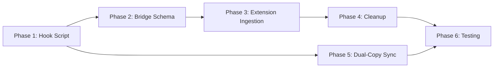

# Tasks: Observation Content Capture

## Overview

- **Total Tasks**: 21
- **Parallel Opportunities**: 6 tasks marked [P]
- **User Stories**: 6 (US1-US6)
- **Phases**: 6 (Hook Script, Bridge Schema, Extension Ingestion, Cleanup, Sync,
  Testing)

## Dependencies

## Phase 1: Hook Script — Extract and Write Observation Content

**Goal**: Modify `post-tool-use.mjs` to extract `tool_input` and `tool_response`
from stdin, truncate to 10KB, write per-observation files.

**Covers**: US1, US2, US3 | FR-001, FR-002, FR-003, FR-007

- [x] T001 [US1] Add `crypto` import for `randomUUID()` and define
      `OBSERVATIONS_DIR` constant in
      `extension/resources/hook-scripts/post-tool-use.mjs`
- [x] T002 [US2] Add `serializeToolResponse(toolResponse, maxBytes)` function in
      `extension/resources/hook-scripts/post-tool-use.mjs` — JSON.stringifies
      tool_response, truncates to 10240 bytes, returns `{ content, truncated }`
- [x] T003 [US1] Add `writeObservation(id, toolName, toolInput, toolResponse)`
      function in `extension/resources/hook-scripts/post-tool-use.mjs` — creates
      observations dir, calls serializeToolResponse, writes JSON via atomic
      temp+rename
- [x] T004 [US1] [US3] Update main logic in
      `extension/resources/hook-scripts/post-tool-use.mjs` — extract
      `tool_input` and `tool_response` from stdin input; if tool_response is
      truthy, generate UUID, call writeObservation, include observationId in
      bridge; if absent, omit (backward compat)
- [x] T005 [US5] Update bridge object construction in
      `extension/resources/hook-scripts/post-tool-use.mjs` — extend lastToolUse
      with optional `observationId` and `toolInput` fields
- [x] T006 [P] Add debug logging for observation writes in
      `extension/resources/hook-scripts/post-tool-use.mjs`

**Verification**: Hook creates observation files with new stdin, falls back
gracefully with old stdin, truncates at 10KB

---

## Phase 2: Bridge Schema Extension

**Goal**: Update TypeScript `BridgeData` interface for new optional fields.

**Covers**: US5 | FR-004

- [x] T007 [US5] Extend `BridgeData.lastToolUse` type in
      `extension/src/autonomous/HookBridgeWatcher.ts` — add optional
      `observationId: string` and `toolInput: Record<string, unknown>` fields

**Verification**: TypeScript compiles, existing consumers unaffected

---

## Phase 3: Extension Content Ingestion

**Goal**: Read real observation content from per-observation files and pass to
`trackObservation()`.

**Covers**: US1 | FR-005

- [x] T008 [US1] Replace `tool-output.txt` reading with observation file reading
      in `extension/src/extension.ts:1396-1439` — when `observationId` present,
      read `.specify/hooks/observations/{id}.json`, parse JSON, extract
      toolResponse as content
- [x] T009 [P] [US1] Enrich observation metadata with `toolInput` data in
      `extension/src/extension.ts` — include file paths for Read, commands for
      Bash in metadata passed to trackObservation
- [x] T010 [US3] Add backward-compatible fallback in
      `extension/src/extension.ts` — when no `observationId` present, use
      placeholder `[Tool output from ${toolName}]`
- [x] T011 [P] Add `fs` import cleanup in `extension/src/extension.ts` — use
      proper `fs.readFileSync` or `fs.promises.readFile` instead of
      require('fs')

**Verification**: ObservationMasker cache contains real content,
generateKeyPoints produces meaningful output

---

## Phase 4: Observation File Cleanup

**Goal**: Delete observation files after reading, clean up stale files.

**Covers**: US4 | FR-006

- [x] T012 [US4] Add post-read deletion in `extension/src/extension.ts`
      bridge-update handler — after tracking observation, delete file with
      `fs.promises.unlink(path).catch(() => {})`
- [x] T013 [US4] Add stale file cleanup on `session-start` event in
      `extension/src/extension.ts` — scan observations dir, delete files with
      mtime > 30 minutes
- [x] T014 [P] [US4] Add cleanup on extension deactivation in
      `extension/src/extension.ts` deactivate function — scan and clean
      observations directory

**Verification**: Observations dir empty after processing, stale files cleaned
on session start

---

## Phase 5: Dual-Copy Sync & Hook Installer

**Goal**: Keep both hook script copies identical, verify migrator handles
update.

**Covers**: US6

- [x] T015 [US6] Copy updated
      `extension/resources/hook-scripts/post-tool-use.mjs` to
      `.specify/scripts/hooks/post-tool-use.mjs`
- [x] T016 [US6] Verify `goferMigrator.ts:copyHookScripts()` in
      `extension/src/goferMigrator.ts` overwrites existing hooks — add
      force-overwrite if needed
- [x] T017 [P] [US6] Verify `.claude/settings.json` hook configuration remains
      valid after update

**Verification**: Both hook copies identical, migrator produces updated hooks

---

## Phase 6: Testing

**Goal**: Add unit tests for new functionality, verify no regressions.

**Covers**: All success criteria

- [x] T018 Write unit tests for hook observation extraction in
      `tests/unit/hooks/post-tool-use-observation.test.ts` — test new-format
      stdin, old-format stdin, truncation, JSON structure, bridge observationId
- [x] T019 [P] Update `tests/unit/autonomous/observation-tracking.test.ts` —
      test generateKeyPoints with real TypeScript content, command output,
      search results
- [x] T020 [P] Update `tests/unit/autonomous/HookBridgeWatcher.test.ts` — test
      parsing bridge data with and without observationId/toolInput fields
- [x] T021 Write integration test in
      `tests/unit/hooks/post-tool-use-observation.test.ts` — simulate full flow
      from hook stdin through bridge update to ObservationMasker

**Verification**: All new and existing tests pass, `npm test` succeeds

---

## Parallel Execution Guide

Tasks marked [P] can run concurrently if they modify different files:

| Parallel Group        | Tasks      | Condition                |
| --------------------- | ---------- | ------------------------ |
| Hook helpers          | T006       | After T001-T005 complete |
| Extension enrichment  | T009, T011 | After T008 complete      |
| Cleanup on deactivate | T014       | After T012-T013 complete |
| Sync verification     | T017       | After T015-T016 complete |
| Test updates          | T019, T020 | After Phase 1-4 complete |

## Implementation Strategy

1. **MVP First**: Phase 1-3 (Hook + Bridge + Extension) — delivers core value
2. **Production Ready**: Phase 4-5 (Cleanup + Sync) — prevents disk growth,
   ensures consistency
3. **Quality Gate**: Phase 6 (Testing) — validates all acceptance criteria
