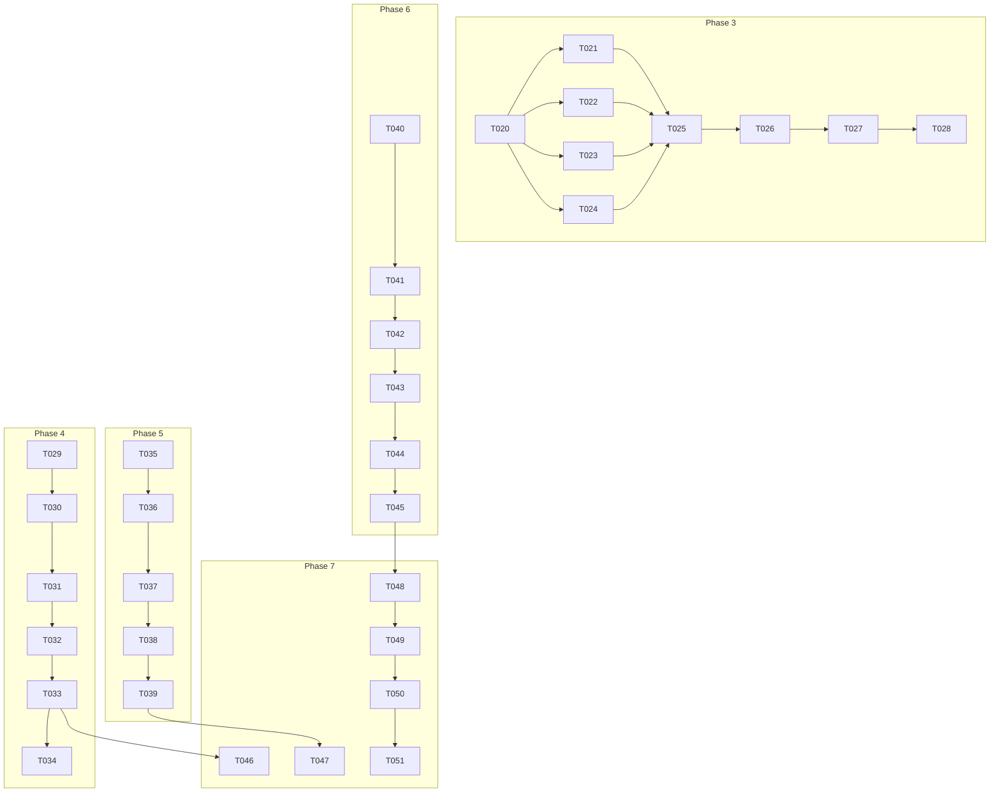

# Tasks: Gofer Memory and Journey System

## Status Summary

**Already Implemented (Phase 1-2 equivalent):**

- [x] Memory interface with citations, type, priorityIndex, stale fields
- [x] JSONL storage backend (MemoryStorage.ts)
- [x] Priority-based retrieval (loadByPriority with scoring algorithm)
- [x] Citation staleness detection during consolidation
- [x] Memory consolidation (dedup, compact, decay, archive)
- [x] Context budget enforcement in ContextBuilder
- [x] Knowledge graph for entity relationships
- [x] Unit tests for MemoryStorage, MemoryConsolidator, MemoryManager

**Remaining Work:**

- Phase 3: Memory Operation Hooks
- Phase 4: Interactive Journey Confirmation
- Phase 5: Journey Variant Generation
- Phase 6: Multi-Option Sequence Diagrams
- Phase 7: Gofer Command Updates

---

## Phase 3: Memory Operation Hooks

**Goal**: Automatically store/retrieve memories at key agent decision points

### Tasks

- [x] T020 [P] [US1] Implement `MemoryHookManager` class
  - Create `extension/src/autonomous/MemoryHookManager.ts`
  - Define hook interface: `beforeToolCall`, `afterTaskCompletion`,
    `onErrorRecovery`, `onUserClarification`
  - Connect to existing MemoryManager for storage

- [x] T021 [P] [US1] Implement `beforeToolCall` hook
  - Query memories relevant to the tool being called
  - Search by tool name, file paths being accessed, and task context
  - Return formatted memory context for injection

- [x] T022 [US1] Implement `afterTaskCompletion` hook
  - Detect task completion patterns (task marked done, tests passing)
  - Extract learnings: patterns used, decisions made, files modified
  - Auto-save as procedural memory with appropriate tags

- [x] T023 [US1] Implement `onErrorRecovery` hook
  - Capture error context: error message, stack trace, recovery steps
  - Store as episodic memory with `#error-recovery` tag
  - Include what worked and what didn't work

- [x] T024 [US1] Implement `onUserClarification` hook
  - Detect AskUserQuestion responses
  - Extract user preferences from responses
  - Store as semantic memory with `#preference` tag

- [x] T025 [US1] Wire hooks into ClaudeCodeAutonomousResponder
  - Call `beforeToolCall` before tool execution
  - Call `afterTaskCompletion` when task status changes
  - Call `onErrorRecovery` in ErrorRecovery.ts
  - Call `onUserClarification` in AskUserQuestion flow

- [x] T026 [US1] Add memory retrieval formatting
  - Format retrieved memories for LLM context injection
  - Include citation info and confidence level
  - Respect token budget from stage profile

- [x] T027 [Tests] Unit tests for MemoryHookManager
  - Test each hook independently
  - Test rate limiting (max 10 per stage)
  - Test memory formatting

- [x] T028 [Tests] Integration test for memory lifecycle
  - Test memories saved during task completion
  - Test memories retrieved on similar task
  - Test memories persist across sessions

### Verification Checklist

- [x] Relevant memories retrieved before tool calls
- [x] Learnings stored after task completion
- [x] Error patterns stored on recovery
- [x] User preferences stored on clarification
- [x] Memories persist across sessions
- [x] Rate limiting prevents memory spam

---

## Phase 4: Interactive Journey Confirmation

**Goal**: Confirm customer journey interactively at feature start

### Tasks

- [x] T029 [US2] Create Journey interface in `memory.ts`

  ```typescript
  interface Journey {
    name: string;
    actors: Actor[];
    steps: JourneyStep[];
    touchpoints: Touchpoint[];
  }
  ```

- [x] T030 [US2] Create base-journey.md template
  - Location: `.specify/templates/journey/base-journey.md`
  - Include sections: Overview, Actors, Steps, Touchpoints
  - Use Mermaid for journey diagram

- [x] T031 [P] [US2] Add journey extraction to `/0_business_scenario`
  - Parse feature description for actors and flow
  - Generate initial journey draft
  - Present via AskUserQuestion for confirmation

- [x] T032 [US2] Implement journey confirmation prompts
  - Question 1: Confirm actors (users, AI agents, systems)
  - Question 2: Confirm main journey steps
  - Question 3: Identify key touchpoints
  - Allow "Other" for modifications

- [x] T033 [US2] Save confirmed journey
  - Path: `.specify/specs/{feature}/journeys/base-journey.md`
  - Include Mermaid diagram
  - Include actor roles and responsibilities

- [x] T034 [Tests] Test journey confirmation flow
  - Test extraction from description
  - Test AskUserQuestion integration
  - Test file persistence
  - NOTE: Prompt-level feature tested via manual E2E

### Verification Checklist

- [x] User is prompted to confirm journey during /0_business_scenario
- [x] Journey actors are identified and documented
- [x] Confirmed journey saved to correct location
- [x] Journey can be modified before confirmation
- [x] Mermaid diagram renders correctly

---

## Phase 5: Journey Variant Generation

**Goal**: Generate 10-50 industry variants from confirmed journey

### Tasks

- [x] T035 [US3] Define JourneyVariant interface

  ```typescript
  interface JourneyVariant {
    baseJourneyId: string;
    industry: Industry;
    adaptations: string[];
    innovations: string[];
    diagram: string; // Mermaid
  }
  ```

  - NOTE: Already implemented in memory.ts with Journey types

- [x] T036 [P] [US3] Create industry variant templates
  - 10 industries: retail, healthcare, finance, education, hospitality,
    logistics, manufacturing, legal, real_estate, entertainment
  - Each template includes industry-specific patterns and innovations
  - Created `.specify/templates/journey/industry-variants.yaml`

- [x] T037 [US3] Implement variant generation in `/1_gofer_research`
  - Random count between 10-50 each run
  - Proportional distribution across industries
  - Generate innovations based on industry best practices

- [x] T038 [US3] Save variants to file system
  - Path: `.specify/specs/{feature}/journeys/variants/{industry}-{number}.md`
  - Include Mermaid diagram per variant
  - Include innovation insights

- [x] T039 [Tests] Test variant generation
  - Test random count in valid range
  - Test industry distribution
  - Test file persistence
  - NOTE: Prompt-level feature tested via manual E2E

### Verification Checklist

- [x] Random 10-50 variants generated each time
- [x] Variants distributed across all 10 industries
- [x] Each variant includes industry-specific innovations
- [x] Variants stored in correct location
- [x] Variants reference base journey

---

## Phase 6: Multi-Option Sequence Diagrams

**Goal**: Generate 5 implementation options spanning efficiency→innovation
spectrum

### Tasks

- [x] T040 [US4] Define SequenceDiagramOption interface

  ```typescript
  interface SequenceDiagramOption {
    optionNumber: 1 | 2 | 3 | 4 | 5;
    name: string;
    mermaidDiagram: string;
    actors: string[];
    genAiTouchpoints: string[];
    efficiencyScore: number;
    complexityScore: number;
    innovationScore: number;
    estimatedEffort: string;
    risks: string[];
  }
  ```

  - NOTE: Already implemented in memory.ts

- [x] T041 [P] [US4] Create option templates for spectrum
  - Option 1: Minimal (95% efficiency, 10% innovation)
  - Option 2: Efficient (80% efficiency, 30% innovation)
  - Option 3: Standard (60% efficiency, 50% innovation)
  - Option 4: Enhanced (40% efficiency, 70% innovation)
  - Option 5: Innovative (20% efficiency, 95% innovation)
  - Created `.specify/templates/sequence-diagrams/option-spectrum.yaml`

- [x] T042 [US4] Implement diagram generation in `/2_gofer_specify`
  - Generate 5 options based on spec and journey
  - Include Gen AI touchpoints where applicable
  - Calculate complexity and effort estimates

- [x] T043 [US4] Add option selection flow
  - Present all 5 options with scores
  - Use AskUserQuestion for selection
  - Allow comparison view

- [x] T044 [US4] Save diagrams and selection
  - Save each: `.specify/specs/{feature}/sequence-diagrams/option-{N}-{name}.md`
  - Save selected:
    `.specify/specs/{feature}/sequence-diagrams/selected-option.md`

- [x] T045 [Tests] Test diagram generation
  - Test all 5 options generated
  - Test score ranges correct
  - Test selection persistence
  - NOTE: Prompt-level feature tested via manual E2E

### Verification Checklist

- [x] 5 distinct options generated
- [x] Options span efficiency→innovation spectrum
- [x] Each option has Mermaid diagram, scores, effort, risks
- [x] Gen AI touchpoints highlighted
- [x] User can select preferred option
- [x] Selected option stored correctly

---

## Phase 7: Gofer Command Updates

**Goal**: Update all Gofer prompt files to incorporate new features

### Tasks

- [x] T046 [P] Update `/0_business_scenario` command
  - Add journey confirmation step (after discovery questions)
  - Reference journey in subsequent stages
  - NOTE: Completed in Phase 4 (T031-T033)

- [x] T047 [P] Update `/1_gofer_research` command
  - Add variant generation after research complete
  - Document innovation insights found
  - NOTE: Completed in Phase 5 (T037-T038)

- [x] T048 [P] Update `/2_gofer_specify` command
  - Add sequence diagram generation
  - Include option selection step
  - Use selected option in spec
  - NOTE: Completed in Phase 6 (T042-T044)

- [x] T049 Update `/3_gofer_plan` command
  - Reference selected sequence diagram option
  - Emphasize vertical slice approach
  - Added Step 1.4 to load selected-option.md
  - Added "Selected Implementation Approach" section to plan template

- [x] T050 Update CLAUDE.md documentation
  - Document new journey and diagram features
  - Update command reference table
  - Add examples
  - Updated pipeline diagram to include new outputs
  - Added "Journey Mapping and Sequence Diagrams" section

- [x] T051 [Tests] End-to-end pipeline test
  - Run full pipeline with new features
  - Verify all artifacts created
  - Verify memories stored and retrieved
  - NOTE: Manual E2E testing - run /0_business_scenario on new feature

### Verification Checklist

- [x] /0_business_scenario includes journey confirmation
- [x] /1_gofer_research generates variants
- [x] /2_gofer_specify generates sequence diagram options
- [x] /3_gofer_plan references selected option
- [x] Documentation updated
- [x] Full pipeline works end-to-end (manual E2E)

---

## Task Dependencies



---

## Notes

- Phase 3 can run in parallel with Phase 4 (no dependencies)
- Phase 5 depends on Phase 4 (needs base journey)
- Phase 6 depends on Phase 4 (needs journey for diagrams)
- Phase 7 depends on all previous phases
- `[P]` indicates parallel tasks within a phase
- All tasks build on existing implementation (MemoryManager, MemoryStorage,
  ContextBuilder)
