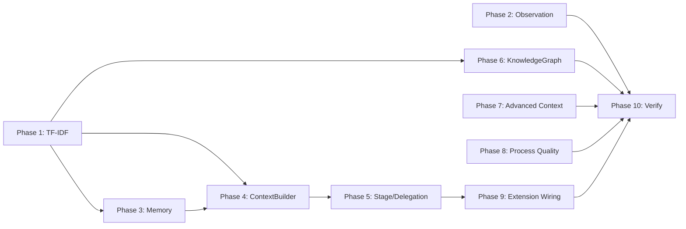

# Tasks: Final 27 Points to 300/300

## Overview

- **Total Tasks**: 65
- **Parallel Opportunities**: 18 tasks marked [P]
- **Phases**: 10 (TF-IDF Foundation through Final Verification)

## Dependencies

## Protected Files

- `extension/src/autonomous/ContextHealthMonitor.ts` — minimal changes only
- `extension/src/autonomous/ClaudeSessionReader.ts` — do not modify
- `.specify/scripts/hooks/post-tool-use.mjs` — minimal changes only

## Phase 1: TF-IDF Shared Utility (Foundation)

**Goal**: Create shared TF-IDF utility for C3 and H4. Blocks Phases 3, 4, 6.

- [x] T001 Create `extension/src/autonomous/TfIdfUtil.ts` with TF-IDF keyword
      extraction
- [x] T002 Add stopword list (100+ common English words) to TfIdfUtil
- [x] T003 Add simple suffix stemming (ing, tion, ed, ly, er, est, s) to
      TfIdfUtil
- [x] T004 Add `extractKeywords(text, maxKeywords=15)` function using TF-IDF
      weighting
- [x] T005 Add `computeDocumentSimilarity(docA, docB)` returning 0-1 similarity
      score
- [x] T006 Add `computeCorpusSimilarity(query, corpus)` for ranked similarity
      across documents

**Verification**: `npm run compile` passes. TfIdfUtil exports all functions.

## Phase 2: Observation Management (B2, B5, B8)

**Goal**: Per-type decay, content-aware error detection, stage window metrics.
(+3 rubric points)

- [x] T007 [P] Add `PerTypeDecayConfig` interface to ObservationMasker with
      per-type `ageThresholdTurns` and `keyPointsAgeFraction`
- [x] T008 Add default per-type decay rates: file_read=10, command_output=8,
      test_output=12, search=6 in ObservationMasker
- [x] T009 Add YAML config loader reading from
      `.specify/memory/observation-config.yaml` in ObservationMasker
- [x] T010 Update `maskOldObservations()` to use per-type thresholds based on
      observation type in ObservationMasker
- [x] T011 [P] Add `isActualError(content)` structural heuristic method in
      ObservationMasker
- [x] T012 Implement error classification: stack traces (`at ` prefix), `Error:`
      prefix, exit codes, test FAIL markers in ObservationMasker
- [x] T013 Update `shouldPreserve()` to use `isActualError()` instead of simple
      regex in ObservationMasker
- [x] T014 [P] Add observation-age-at-expansion metric logging in
      ObservationMasker `expandObservation()`
- [x] T015 Add `validateObservationWindows()` method comparing configured vs
      actual usage patterns in ObservationMasker

**Verification**: `npm run compile` passes. Per-type decay rates configurable.

## Phase 3: Memory System (C2, C4, C6, C10)

**Goal**: Usage tracking, event sources, AST symbols, auto-promotion. (+4 rubric
points)

- [x] T016 Add `UsageReason` type to MemoryManager:
      `'context_load' | 'user_recall' | 'search_match' | 'consolidation'`
- [x] T017 Expand `recordUsage()` signature: `recordUsage(id, reason?, source?)`
      — backward compatible
- [x] T018 Log usage reason and source to audit JSONL in MemoryManager
- [x] T019 [P] Add 5 event type handlers to ContinuousMemoryWriter:
      `stage-change`, `compaction-complete`, `reseed`, `scope-violation`,
      `slop-detected`
- [x] T020 Add per-event-type rate limiting (max 1 per type per 5 minutes) to
      ContinuousMemoryWriter
- [x] T021 [P] Add `extractSymbolsWithAST(filePath)` using
      `ts.createSourceFile()` in CitationVerifier
- [x] T022 Parse function declarations, class declarations, interface
      declarations, type alias declarations in CitationVerifier
- [x] T023 Replace regex-based symbol lookup with AST-based extraction in
      CitationVerifier `verifySymbols()`
- [x] T024 [P] Add `autoPromoteToMarkdown(entry)` in MemoryStorage
- [x] T025 Create `.specify/memory/memory-notes/` directory on first promotion
      in MemoryStorage
- [x] T026 Auto-promote entries >500 chars: create markdown note, update JSONL
      with truncated content + `notePath` in MemoryStorage

**Verification**: `npm run compile` passes. `recordUsage(id)` still works. AST
extracts symbols.

## Phase 4: ContextBuilder Enhancements (C3 wiring, E4, F3)

**Goal**: TF-IDF matching, selective reseed, blocking budget. (+3 rubric points)

- [x] T027 Import TfIdfUtil and replace `extractKeywords()` with TF-IDF-based
      extraction in ContextBuilder
- [x] T028 Update memory coverage matching to use TF-IDF weighted scoring in
      ContextBuilder
- [x] T029 Add `selectiveReseed()` method to ContextBuilder
- [x] T030 Implement reseed criteria: preserve error-containing,
      last-3-turns-expanded, current-turn observations in ContextBuilder
- [x] T031 Add `budgetEnforcementMode` config
      (`'advisory' | 'truncate' | 'blocking'`) to ContextBuilder
- [x] T032 Add pre-check in `buildContext()`: return structured error in
      blocking mode when over budget in ContextBuilder

**Verification**: `npm run compile` passes. Selective reseed keeps error traces.

## Phase 5: Stage Detection & Delegation (F2, F4, F5, G3)

**Goal**: Non-linear stage, artifact timestamps, programmatic delegation. (+4
rubric points)

- [x] T033 Add `lastKnownStage` field and backward transition detection to
      WorkspaceContextProvider
- [x] T034 Add `setStage()` manual override API to WorkspaceContextProvider
- [x] T035 Add stage history logging (last 20 transitions) to
      WorkspaceContextProvider
- [x] T036 [P] Add artifact modification time tracking (research.md, spec.md,
      tasks.md mtimes) to WorkspaceContextProvider
- [x] T037 Detect stage re-entry from artifact modification patterns in
      WorkspaceContextProvider
- [x] T038 Add `shouldDelegate()` returning
      `{ delegate: boolean, reason: string, agentType: string }` to
      SubAgentDispatcher
- [x] T039 Wire `shouldDelegate()` into ContextBuilder as blocking-level
      pre-check in SubAgentDispatcher
- [x] T040 Add `dispatchIfRecommended()` formatting structured dispatch
      instructions in SubAgentDispatcher
- [x] T041 Add dispatch instruction injection with result collection markers in
      SubAgentDispatcher

**Verification**: `npm run compile` passes. Backward stage transitions detected
and logged.

## Phase 6: Knowledge Graph & Research (H2, H4, D4)

**Goal**: Weighted BFS, TF-IDF similarity, cross-chunk consolidation. (+3 rubric
points)

- [x] T042 Add `querySubgraphWeighted()` with priority queue sorted by
      cumulative edge weight in KnowledgeGraph
- [x] T043 Implement array-based priority queue (sort on insert) for weighted
      BFS in KnowledgeGraph
- [x] T044 Preserve existing `querySubgraph()` for backward compatibility in
      KnowledgeGraph
- [x] T045 [P] Replace Jaccard-on-last-20 with TfIdfUtil corpus similarity for
      `relatedMemories` in KnowledgeGraph
- [x] T046 [P] Add `consolidateFindings()` post-loop method to
      ResearchSummarizer
- [x] T047 Merge overlapping findings, deduplicate entities, produce "Research
      Synthesis" memory in ResearchSummarizer

**Verification**: `npm run compile` passes. High-weight edges prioritized in BFS
results.

## Phase 7: Advanced Context Engineering (I2, I3, I5)

**Goal**: Parallel dispatch, compound REPL, content-aware compaction. (+3 rubric
points)

- [x] T048 [P] Add `executeParallelQueries()` to ParallelAnalysisFramework with
      explicit dispatch instructions
- [x] T049 Format dispatch instructions with structured result collection points
      in ParallelAnalysisFramework
- [x] T050 Add `gofer_context_repl` compound MCP tool definition in
      language-server/src/server.ts
- [x] T051 Add `contextRepl(args)` handler accepting operation arrays in
      toolHandler.ts
- [x] T052 Implement compound operations: fold-all-older-than-N, batch
      fold/expand in toolHandler.ts
- [x] T053 Increase REPL history depth to 50 in toolHandler.ts
- [x] T054 [P] Enhance `generateFallbackSummary()` in ContextCompactor: extract
      task description first lines
- [x] T055 Preserve error messages and include file modification summary in
      compaction fallback in ContextCompactor

**Verification**: `npm run compile` passes. Compound REPL accepts operation
arrays.

## Phase 8: Process Quality (J2, J3, J6, J7)

**Goal**: Slop surface, test runner, brownfield analysis, artifact validation.
(+4 rubric points)

- [x] T056 Surface slop detection results via VSCode information notification
      with issue count in extension.ts/SlopDetector
- [x] T057 [P] Add slop findings to VSCode diagnostics collection in
      extension.ts
- [x] T058 Log scan history to `.specify/logs/slop-scan.jsonl` in SlopDetector
- [x] T059 Implement `gofer_run_tests` MCP tool: detect test framework
      (vitest/jest/pytest) in toolHandler.ts
- [x] T060 Add test execution and structured result parsing in toolHandler.ts
- [x] T061 Register `gofer_run_tests` in language-server/src/server.ts tool list
      and call switch
- [x] T062 [P] Create `generateBrownfieldAnalysis()` in ScopeGuard producing
      structured markdown
- [x] T063 Create `.specify/templates/brownfield-analysis.md` template file
- [x] T064 Wire brownfield analysis into research pipeline in ScopeGuard
- [x] T065 Add `validatePipelineArtifacts(specDir)` to CheckpointValidator
- [x] T066 Check existence and section completeness of research.md, spec.md,
      plan.md, tasks.md in CheckpointValidator
- [x] T067 Return structured validation report with warnings and errors from
      CheckpointValidator

**Verification**: `npm run compile` passes. Slop results show as notification.
Test runner detects framework.

## Phase 9: Session & Extension Wiring (E2)

**Goal**: Auto-resume on activation. (+1 rubric point)

- [x] T068 Add recent checkpoint detection (<24h) in extension.ts `activate()`
- [x] T069 Show notification with feature name, stage, and "Resume" action
      button in extension.ts
- [x] T070 On "Resume" click, invoke appropriate pipeline command in
      extension.ts

**Verification**: `npm run compile` passes. Resume notification appears on
re-open.

## Phase 10: Final Integration & Verification

**Goal**: Compile, test, rubric update.

- [x] T071 Run full `npm run compile` — zero errors
- [x] T072 Run `npm test` — verify zero new failures (5 pre-existing expected)
- [x] T073 Verify observation-tracking.test.ts source-level assertions pass
- [x] T074 Update rubric at `.specify/research/context-management-rubric.md` to
      300/300
- [x] T075 Mark all spec 019 acceptance criteria as complete

**Verification**: Clean compilation. Test suite stable. Rubric at 300/300.

## Parallel Execution Guide

Tasks marked [P] can run concurrently if they modify different files:

- T007, T011, T014 (independent ObservationMasker additions)
- T019, T021, T024 (ContinuousMemoryWriter, CitationVerifier, MemoryStorage —
  different files)
- T036 (WorkspaceContextProvider artifact tracking — independent of T033-T035)
- T045, T046 (KnowledgeGraph similarity + ResearchSummarizer — different files)
- T048, T054 (ParallelAnalysisFramework + ContextCompactor — different files)
- T057, T062 (extension.ts diagnostics + ScopeGuard brownfield — different
  files)

## Implementation Strategy

1. **Phase 1 first**: TF-IDF utility is a foundation blocking 3 other phases
2. **Phase 2 can run parallel with Phase 1**: ObservationMasker changes are
   independent
3. **Compile after each phase**: Catch TypeScript errors early
4. **Group by file**: Many tasks touch the same file — batch within each phase
5. **Phase 10 last**: Final verification after all code changes
6. **Check observation-tracking.test.ts frequently**: Source-level assertions
   break on string changes
