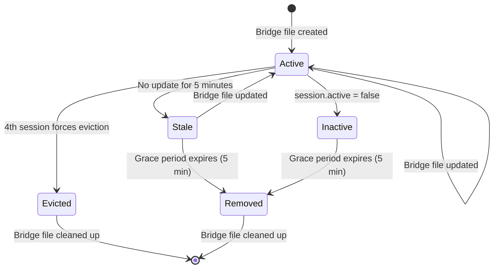
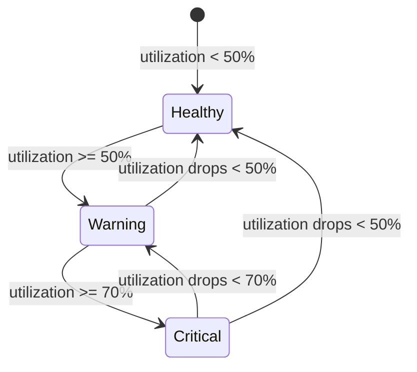

# Data Model: Multi-Session Context Panel

## Entities

### SessionRecord

Represents a single tracked Claude Code CLI session with its context health
data.

| Field              | Type           | Required | Description                                        |
| ------------------ | -------------- | -------- | -------------------------------------------------- |
| sessionId          | string         | Yes      | Unique session ID from Claude Code hook payload    |
| model              | string         | Yes      | Claude model ID (e.g., "claude-opus-4-5-20251101") |
| contextLimit       | number         | Yes      | Token limit for this model (e.g., 200000)          |
| totalContextTokens | number         | Yes      | Current total tokens used in context               |
| utilizationPercent | number         | Yes      | Context usage as percentage (0-100)                |
| healthStatus       | HealthStatus   | Yes      | Computed: healthy / warning / critical             |
| lastActivity       | number         | Yes      | Unix timestamp ms of last hook trigger             |
| isActive           | boolean        | Yes      | Whether session is actively running                |
| isStale            | boolean        | Yes      | Whether session has exceeded staleness threshold   |
| bridgeFilePath     | string         | Yes      | Absolute path to this session's bridge file        |
| breakdown          | TokenBreakdown | No       | Estimated token breakdown by category              |

**Validation Rules**:

- `sessionId` must be non-empty string
- `utilizationPercent` between 0 and 100
- `totalContextTokens` >= 0
- `lastActivity` must be valid Unix timestamp

**Relationships**:

- Derived from `BridgeData` (existing interface in HookBridgeWatcher.ts)
- 1:1 relationship with a bridge file on disk

### TokenBreakdown

Estimated breakdown of tokens by category within a session's context window.

| Field               | Type       | Required | Description                                    |
| ------------------- | ---------- | -------- | ---------------------------------------------- |
| specArtifacts       | number     | No       | Tokens from spec.md, plan.md, tasks.md         |
| memoriesHints       | number     | No       | Tokens from memory entries and hint files      |
| systemFiles         | number     | No       | Tokens from CLAUDE.md, AGENTS.md, constitution |
| conversationHistory | number     | No       | Tokens from user/assistant messages            |
| toolOutputs         | number     | No       | Tokens from recent tool call results           |
| maskedObservations  | MaskedInfo | No       | Count of masked observations and tokens saved  |

### MaskedInfo

| Field       | Type   | Required | Description                             |
| ----------- | ------ | -------- | --------------------------------------- |
| count       | number | Yes      | Number of observations currently masked |
| tokensSaved | number | Yes      | Estimated tokens saved by masking       |

### MemoryCategory

Represents a grouping of memories by their category field for the Memory tree
view.

| Field       | Type     | Required | Description                                            |
| ----------- | -------- | -------- | ------------------------------------------------------ |
| category    | string   | Yes      | Category name (e.g., "discovery", "pattern")           |
| displayName | string   | Yes      | Human-readable name (e.g., "Discovery", "Patterns")    |
| icon        | string   | Yes      | VSCode ThemeIcon ID (e.g., "search", "symbol-pattern") |
| count       | number   | Yes      | Number of memories in this category                    |
| memories    | Memory[] | Yes      | Array of Memory objects in this category               |

**Relationships**:

- Each `Memory` (existing entity) belongs to exactly one `MemoryCategory`
- Category names come from `Memory.category` field

### SessionRegistry

In-memory registry managing the tracked sessions, enforcing the 3-session cap.

| Field            | Type                       | Required | Description                                 |
| ---------------- | -------------------------- | -------- | ------------------------------------------- |
| sessions         | Map<string, SessionRecord> | Yes      | Tracked sessions keyed by sessionId         |
| maxSessions      | number                     | Yes      | Hard cap (3)                                |
| focusedSessionId | string                     | No       | Most recently active session for status bar |

**Validation Rules**:

- `sessions.size` never exceeds `maxSessions`
- When a new session would exceed the cap, oldest inactive session is evicted
- `focusedSessionId` always references an existing session or is null

## State Transitions

### Session Lifecycle

### Health Status

## File System Entities

### Per-Session Bridge File

**Path pattern**: `.specify/hooks/context-bridge-{sessionId}.json`

**Schema**: Same as existing `BridgeData` interface (no changes to schema, only
file naming).

### Legacy Bridge File

**Path**: `.specify/hooks/context-bridge.json`

**Handling**: Read as a single session if present. Once per-session hook script
deploys, this file stops being written.
