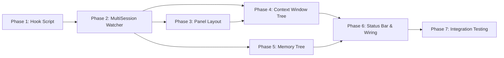

# Tasks: Multi-Session Context Panel

## Overview

- **Total Tasks**: 52
- **Parallel Opportunities**: 12 tasks marked [P]
- **User Stories**: 6 (US1-US6)
- **Phases**: 7 (Hook Foundation → MultiSession Watcher → Panel Layout → Context
  Window → Memory Tree → Status Bar & Wiring → Integration Testing)

## Dependencies

Note: Phase 4 and Phase 5 can run in parallel after Phase 2+3 complete.

---

## Phase 1: Hook Script & Bridge Foundation

**Goal**: Change hook script to write per-session bridge files — the foundation
for all other phases.

**Blocks**: Phase 2, 3, 4, 5, 6, 7

- [x] T001 Write unit tests for per-session bridge file naming in
      tests/unit/hooks/post-tool-use-multisession.test.ts
- [x] T002 [FR1] Modify `writeBridge()` in
      .specify/scripts/hooks/post-tool-use.mjs to write
      `context-bridge-{sessionId}.json`
- [x] T003 [FR7] Add dual-write in .specify/scripts/hooks/post-tool-use.mjs:
      also write legacy `context-bridge.json` for backward compat
- [x] T004 Copy updated hook script to
      extension/resources/hook-scripts/post-tool-use.mjs
- [x] T005 [FR1] Write integration test in
      tests/integration/multi-session-bridge-files.test.ts: two sessions produce
      two separate bridge files

**Verification**:

- [ ] Hook writes `context-bridge-{sessionId}.json` with correct BridgeData
- [ ] Legacy `context-bridge.json` also written
- [ ] Tests pass

---

## Phase 2: MultiSessionBridgeWatcher

**Goal**: New watcher class tracking up to 3 sessions from per-session bridge
files.

**Depends on**: Phase 1 **Blocks**: Phase 3, 4, 5, 6, 7

- [x] T006 Write unit test suite in
      tests/unit/autonomous/MultiSessionBridgeWatcher.test.ts covering: session
      add, update, remove, evict, stale, legacy compat
- [x] T007 [FR2] Implement MultiSessionBridgeWatcher class in
      extension/src/autonomous/MultiSessionBridgeWatcher.ts with
      FileSystemWatcher on `.specify/hooks/context-bridge-*.json` glob
- [x] T008 [FR2] Implement session registry as `Map<sessionId, BridgeData>` with
      `getSessions()`, `getFocusedSession()`, `getSessionCount()` in
      extension/src/autonomous/MultiSessionBridgeWatcher.ts
- [x] T009 [FR3] Implement 3-session cap: evict oldest inactive on 4th session,
      emit `session-limit-reached` event in
      extension/src/autonomous/MultiSessionBridgeWatcher.ts
- [x] T010 [FR8] Implement session cleanup: staleness detection (>5 min), emit
      `session-removed`, delete bridge file after grace period in
      extension/src/autonomous/MultiSessionBridgeWatcher.ts
- [x] T011 [FR7] Add legacy bridge file support: also watch
      `context-bridge.json` and treat as a session in
      extension/src/autonomous/MultiSessionBridgeWatcher.ts
- [x] T012 [FR2] Implement legacy event forwarding for focused session: emit
      `bridge-update`, `session-start`, `session-end`, `session-stale` in
      extension/src/autonomous/MultiSessionBridgeWatcher.ts
- [x] T013 Export MultiSessionBridgeWatcher from
      extension/src/autonomous/index.ts barrel file
- [x] T014 Run MultiSessionBridgeWatcher tests, verify all pass

**Verification**:

- [ ] All unit tests pass (lifecycle, cap, staleness, legacy compat)
- [ ] Event signatures match contracts/internal-api.md

---

## Phase 3: Panel Layout Redesign [US5]

**Goal**: Change Gofer sidebar from Specs|Constitution|Memory to Specs|Context
Window|Memory.

**Depends on**: Phase 2 (needs ContextWindowProvider type to exist) **Blocks**:
Phase 4

**Story**: As a Gofer user, I want to see the sidebar organized as
Specifications | Context Window | Memory so that the most important real-time
information is prominently visible.

- [x] T015 [US5] Replace `goferConstitution` view ID with `goferContextWindow`
      in extension/package.json views section (name: "Context Window", icon:
      "$(pulse)")
- [x] T016 [US5] Update view/title menus in extension/package.json: add
      `gofer.refreshContextWindow` command for `goferContextWindow`, remove
      `goferConstitution` menu entries
- [x] T017 [US5] Add `viewsWelcome` entry for `goferContextWindow` in
      extension/package.json: "No active Claude Code sessions.\n\nStart Claude
      Code in a terminal to see context health."
- [x] T018 [US5] Update `registerTreeViews()` in extension/src/extension.ts:
      replace ConstitutionProvider registration with ContextWindowProvider for
      view ID `goferContextWindow`
- [x] T019 [US5] Ensure `gofer.showConstitution` command remains registered in
      extension/src/extension.ts (keep ConstitutionProvider file, remove only
      tree view registration)
- [x] T020 [US5] Register `gofer.refreshContextWindow` command in
      extension/src/extension.ts

**Verification**:

- [ ] AC: Gofer sidebar contains exactly 3 sections: Specifications, Context
      Window, Memory
- [ ] AC: Constitution section removed as standalone panel section
- [ ] AC: Constitution accessible via Command Palette
- [ ] AC: Specifications section unchanged
- [ ] AC: Refresh command works for each section

---

## Phase 4: Context Window Tree View [US1, US2, US6]

**Goal**: Implement ContextWindowProvider showing sessions with categorized
breakdowns.

**Depends on**: Phase 2, Phase 3 **Blocks**: Phase 6

**Story US1**: As a developer running multiple Claude Code terminals, I want to
see the context health of each active session in the Gofer sidebar.

**Story US2**: As a developer monitoring context health, I want to expand a
session node to see what's consuming the context window.

**Story US6**: As a developer working across sessions, I want to see when
sessions become inactive or stale.

- [x] T021 Write unit tests for ContextWindowProvider in
      tests/unit/contextWindowProvider.test.ts covering: empty state, 1 session,
      3 sessions, categories, stale session display
- [x] T022 [US1] Implement `ContextWindowItem` TreeItem subclass with `kind`
      discriminator (session/category/info/empty) in
      extension/src/contextWindowProvider.ts
- [x] T023 [US1] Implement session-level tree items: label = "Session {shortId}
      ({model})", description = "{utilization}%", color-coded health icon in
      extension/src/contextWindowProvider.ts
- [x] T024 [US2] Implement category-level tree items for 6 categories (Spec
      Artifacts, Memories/Hints, System Files, Conversation History, Tool
      Outputs, Masked Observations) in extension/src/contextWindowProvider.ts
- [x] T025 [US1] Implement empty state: return empty array from `getChildren()`
      to trigger viewsWelcome in extension/src/contextWindowProvider.ts
- [x] T026 [US6] Implement session lifecycle icons: pulse (active), clock
      (stale), circle-slash (inactive) with color coding in
      extension/src/contextWindowProvider.ts
- [x] T027 [P] [US2] Implement token breakdown estimation using
      WorkspaceContextProvider filesystem estimation in
      extension/src/contextWindowProvider.ts
- [x] T028 [FR4] Wire ContextWindowProvider to MultiSessionBridgeWatcher:
      subscribe to `session-update`, `session-added`, `session-removed` events,
      call `refresh()` in extension/src/contextWindowProvider.ts
- [x] T029 Run ContextWindowProvider tests, verify all pass

**Verification**:

- [ ] AC: Gofer sidebar shows "Context Window" section listing up to 3 sessions
- [ ] AC: Each session displays session ID, model, utilization %, color-coded
      health
- [ ] AC: Session nodes update within 2 seconds of hook trigger
- [ ] AC: Empty state shows welcome message
- [ ] AC: Each session expandable to reveal 6 category breakdowns
- [ ] AC: Each category shows token count (labeled est. where applicable)
- [ ] AC: Token counts sum within 5% of total
- [ ] AC: Active sessions show pulse icon
- [ ] AC: Stale sessions show dimmed/grayed appearance
- [ ] AC: Inactive sessions removed after 5-minute grace period

---

## Phase 5: Memory Tree View Rewrite [US4]

**Goal**: Rewrite MemoryProvider to show categorized memories from JSONL instead
of markdown files.

**Depends on**: Phase 2 (for panel layout to be in place) **Can run in parallel
with**: Phase 4

**Story US4**: As a developer reviewing project knowledge, I want to see my
Gofer memories organized by category in the sidebar.

- [x] T030 Write unit tests for new MemoryProvider in
      tests/unit/memoryProvider.test.ts covering: empty state, categories,
      entries, constitution node, click to open
- [x] T031 [US4] Implement `MemoryTreeItem` subclass with `kind` discriminator
      (category/memory/constitution/info) in extension/src/memoryProvider.ts
- [x] T032 [US4] Implement category grouping: load from `MemoryManager.load()`,
      group by `memory.category`, sort alphabetically in
      extension/src/memoryProvider.ts
- [x] T033 [US4] Implement category display: displayName mapping
      (discovery→Discovery, pattern→Patterns, etc.), count badge,
      category-specific icons in extension/src/memoryProvider.ts
- [x] T034 [US4] Implement memory entry items: truncated content label (60
      chars), relative time description, click command to open note file in
      extension/src/memoryProvider.ts
- [x] T035 [US4] Add Constitution node at top of tree: opens
      `.specify/memory/constitution.md` on click in
      extension/src/memoryProvider.ts
- [x] T036 [US5] Add "Show Constitution" button in Memory view title bar via
      `view/title` menu entry in extension/package.json
- [x] T037 Implement `setMemoryManager()` method for deferred MemoryManager
      injection in extension/src/memoryProvider.ts
- [x] T038 Run MemoryProvider tests, verify all pass

**Verification**:

- [ ] AC: Memory section shows categories (Discovery, Patterns, Decisions,
      Learnings, Journeys, Architecture, Debug)
- [ ] AC: Each category node shows count of entries
- [ ] AC: Expanding category reveals individual memory entries with truncated
      content
- [ ] AC: Clicking entry opens detail view or navigates to note file
- [ ] AC: Constitution accessible from Memory section

---

## Phase 6: Status Bar & Wiring [US3, FR6]

**Goal**: Add session count to status bar and wire all new components together
in extension.ts.

**Depends on**: Phase 4, Phase 5

**Story US3**: As a developer who opens more than 3 terminals, I want to be
notified that only 3 are tracked.

- [x] T039 [FR6] Add session count display `[N/3]` to
      ContextHealthStatusBar.updateDisplay() in
      extension/src/ui/ContextHealthStatusBar.ts
- [x] T040 [FR6] Add `setSessionCount(count: number)` method to
      ContextHealthStatusBar in extension/src/ui/ContextHealthStatusBar.ts
- [x] T041 Modify `WorkspaceContextProvider.setHookBridgeWatcher()` to accept
      MultiSessionBridgeWatcher via legacy API in
      extension/src/autonomous/WorkspaceContextProvider.ts
- [x] T042 Update `initializeContextHealthMonitoring()` in
      extension/src/extension.ts: create MultiSessionBridgeWatcher instead of
      HookBridgeWatcher
- [x] T043 [US3] [FR3] Wire `session-limit-reached` event to
      `vscode.window.showInformationMessage()` in extension/src/extension.ts
- [x] T044 Connect ContextWindowProvider to MultiSessionBridgeWatcher in
      extension/src/extension.ts wiring
- [x] T045 Connect MemoryProvider to MemoryManager instance via
      `setMemoryManager()` in extension/src/extension.ts
- [x] T046 Wire `session-update` event from MultiSessionBridgeWatcher to update
      ContextHealthStatusBar session count in extension/src/extension.ts
- [x] T047 Run full test suite, verify all pass

**Verification**:

- [ ] AC: Status bar shows `[N/3]` suffix
- [ ] AC: 4th terminal triggers info notification
- [ ] AC: Notification is non-blocking and dismissible
- [ ] AC: Oldest inactive session removed on eviction
- [ ] AC: All existing functionality continues working

---

## Phase 7: Integration Testing & Polish

**Goal**: End-to-end integration testing, edge cases, and lint cleanup.

**Depends on**: Phase 6

- [x] T048 [P] Write integration test in
      tests/integration/multi-session-context.test.ts: create 3 per-session
      bridge files, verify all 3 appear in tree
- [x] T049 [P] [FR3] Write integration test: create 4th bridge file, verify
      eviction notification and correct 3-session tracking
- [x] T050 [P] [FR7] Write integration test: legacy `context-bridge.json`
      appears as session in context window tree
- [x] T051 [P] [FR8] Write integration test: stale session removed after grace
      period, bridge file cleaned up
- [x] T052 [P] [US2] Write integration test: token breakdown categories sum
      within 5% of session total
- [x] T053 Update existing ContextHealthStatusBar tests for `[N/3]` format in
      tests/unit/ui/ContextHealthStatusBar.test.ts
- [x] T054 Run full test suite including integration tests
- [x] T055 Run linter (`npm run lint`), fix any issues

**Verification**:

- [ ] All unit tests pass
- [ ] All integration tests pass
- [ ] Linting clean
- [ ] No regressions in existing functionality

---

## Parallel Execution Guide

Tasks marked [P] can run concurrently if they modify different files and have no
dependencies on incomplete tasks.

**Parallel groups**:

- Phase 4 (T021-T029) and Phase 5 (T030-T038) can run in parallel after Phase 3
  completes
- T027 (token estimation) is independent within Phase 4
- T048-T052 (integration tests) are all independent and parallelizable

## Implementation Strategy

1. **Foundation First**: Phase 1 (hook script) is the smallest, safest change —
   do it first
2. **Core Engine**: Phase 2 (MultiSessionBridgeWatcher) is the most complex new
   code — do it second
3. **UI in Parallel**: Phase 3+4 (panel + context tree) and Phase 5 (memory
   tree) can proceed in parallel
4. **Wire Last**: Phase 6 connects everything — must be last before testing
5. **Validate Thoroughly**: Phase 7 integration tests catch cross-component
   issues

## Protected Files

These files are modified but must maintain backward compatibility:

| File                                                   | Constraint                                            |
| ------------------------------------------------------ | ----------------------------------------------------- |
| `extension/src/extension.ts`                           | Must not break existing initialization flow           |
| `extension/package.json`                               | Must preserve all existing commands and contributions |
| `extension/src/ui/ContextHealthStatusBar.ts`           | Must continue working with single session             |
| `extension/src/autonomous/WorkspaceContextProvider.ts` | Must accept both old and new watcher                  |
| `.specify/scripts/hooks/post-tool-use.mjs`             | Must dual-write for backward compat                   |
