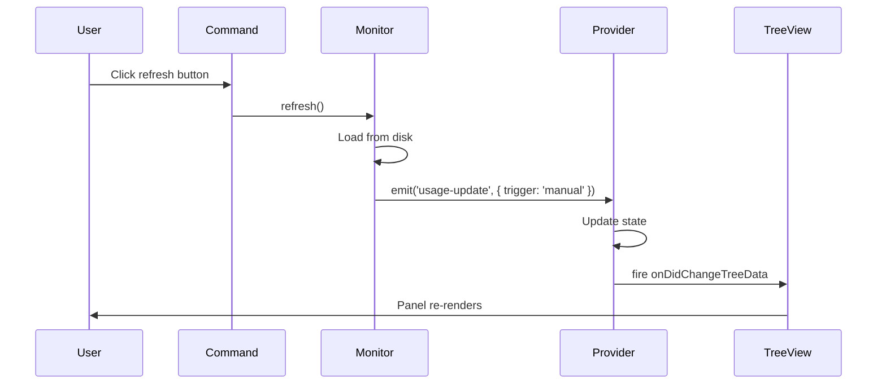

# Event Contracts - AI Usage Tracking Panel

## Overview

This document defines the event-based contracts for the AI Usage Tracking Panel feature. These are **internal EventEmitter events** used for communication between service layer (AIUsageMonitor) and UI layer (AIUsageProvider).

**Scope**: Event-driven architecture for real-time panel updates triggered by:
- FileSystemWatcher (file changes to council-usage.jsonl)
- Periodic polling (hourly background updates)
- Manual refresh (user-triggered command)

**Key Events**:
1. `usage-update` - Emitted when usage data changes (file watch, polling, or manual refresh)

---

## Event 1: usage-update

### Event Signature

```typescript
interface UsageUpdateEvents {
  'usage-update': (event: UsageUpdateEvent) => void;
}

class AIUsageMonitor extends EventEmitter<UsageUpdateEvents> {
  emit(event: 'usage-update', data: UsageUpdateEvent): boolean;
}
```

### Description

Emitted when AI usage data changes and panel should refresh. Notifies subscribers (AIUsageProvider) to reload data and re-render TreeView. Triggers VSCode panel update within <1 second.

### Event Payload

**Type**: `UsageUpdateEvent`

**Structure**:

```typescript
interface UsageUpdateEvent {
  summary: UsageSummary;
  budget: CostSnapshot;
  trigger: 'file-watch' | 'polling' | 'manual';
  timestamp: string; // ISO 8601
}
```

**Fields**:

| Field       | Type           | Description                                                                         | Example                        |
| ----------- | -------------- | ----------------------------------------------------------------------------------- | ------------------------------ |
| `summary`   | `UsageSummary` | Aggregated usage data by provider and time period                                   | See UsageSummary type below    |
| `budget`    | `CostSnapshot` | Current budget status with cost/limit/percent                                       | See CostSnapshot type below    |
| `trigger`   | `TriggerType`  | Source that triggered update: file watch, polling, manual refresh, or session change| `'manual'`                     |
| `timestamp` | `string`       | ISO 8601 timestamp when event was emitted                                           | `'2026-03-23T15:30:00.123Z'` |

### Trigger Types

**Type**: `TriggerType`

```typescript
type TriggerType = 'file-watch' | 'polling' | 'manual' | 'session-change';
```

**Values**:

- **`'file-watch'`**: Update triggered by FileSystemWatcher detecting changes to `council-usage.jsonl`
  - Latency: <500ms from file write to event emission
  - Frequency: On-demand (whenever log file changes)
  - Primary update mechanism

- **`'polling'`**: Update triggered by periodic polling timer (hourly background update)
  - Latency: Up to 1 hour (3600s interval)
  - Frequency: Every 3600 seconds
  - Fallback mechanism when file watch unavailable

- **`'manual'`**: Update triggered by user action (`gofer.refreshAIUsage` command)
  - Latency: <1 second from command invocation to event emission
  - Frequency: On-demand (user-initiated)
  - Always available regardless of automatic update settings

- **`'session-change'`**: Update triggered by Claude session file changes detected by multi-session watcher
  - Latency: <500ms from session file change to event emission
  - Frequency: On-demand (whenever active session changes)
  - Triggers refresh when switching between Claude sessions

### Related Types

#### UsageSummary Type

```typescript
interface UsageSummary {
  currentSession: SessionUsage;
  today: DailyUsage;
  thisWeek: WeeklyUsage;
}

interface SessionUsage {
  totalCost: number; // USD
  providers: Record<ProviderId, ProviderUsage>;
  startTime: string; // ISO 8601
  duration: number; // Seconds
}

interface ProviderUsage {
  inputTokens: number;
  outputTokens: number;
  totalTokens: number;
  cost: number; // USD
}

interface DailyUsage {
  totalCost: number; // USD
  providers: Record<ProviderId, ProviderUsage>;
  date: string; // YYYY-MM-DD
}

interface WeeklyUsage {
  totalCost: number; // USD
  providers: Record<ProviderId, ProviderUsage>;
  weekStart: string; // YYYY-MM-DD (Monday)
}
```

#### CostSnapshot Type

```typescript
interface CostSnapshot {
  totalCost: number; // Cumulative session cost in USD
  budgetLimit: number; // Configured budget limit in USD
  percentUsed: number; // Percentage of budget consumed (0-100)
  budgetStatus: 'OK' | 'WARNING' | 'EXCEEDED';
  tokensConsumed: {
    input: number; // Total input tokens this session
    output: number; // Total output tokens this session
  };
}
```

### Emission Sources

**1. File Watcher (Primary)**:

```typescript
class AIUsageMonitor {
  private setupFileWatcher(): void {
    const pattern = new vscode.RelativePattern(
      this.workspacePath,
      '.specify/logs/council-usage.jsonl'
    );
    this.watcher = vscode.workspace.createFileSystemWatcher(pattern);

    this.watcher.onDidChange(() => this.onUsageFileChange());
    this.watcher.onDidCreate(() => this.onUsageFileChange());
  }

  private async onUsageFileChange(): Promise<void> {
    const summary = await this.usageLogger.getUsageSummary();
    const budget = this.budgetEnforcer.getSnapshot();

    this.emit('usage-update', {
      summary,
      budget,
      trigger: 'file-watch', // <-- File watch trigger
      timestamp: new Date().toISOString(),
    });
  }
}
```

**2. Periodic Polling (Fallback)**:

```typescript
class AIUsageMonitor {
  private startPolling(): void {
    if (this.pollingInterval) {
      clearInterval(this.pollingInterval);
    }

    this.pollingInterval = setInterval(async () => {
      const summary = await this.usageLogger.getUsageSummary();
      const budget = this.budgetEnforcer.getSnapshot();

      this.emit('usage-update', {
        summary,
        budget,
        trigger: 'polling', // <-- Polling trigger
        timestamp: new Date().toISOString(),
      });
    }, 3600000); // 1 hour = 3600000ms
  }
}
```

**3. Manual Refresh (User-Triggered)**:

```typescript
class AIUsageMonitor {
  async refresh(): Promise<void> {
    const summary = await this.usageLogger.getUsageSummary();
    const budget = this.budgetEnforcer.getSnapshot();

    this.emit('usage-update', {
      summary,
      budget,
      trigger: 'manual', // <-- Manual refresh trigger
      timestamp: new Date().toISOString(),
    });
  }
}
```

### Subscribers

**AIUsageProvider** (TreeDataProvider):

```typescript
class AIUsageProvider implements vscode.TreeDataProvider<UsageItem> {
  private _onDidChangeTreeData = new vscode.EventEmitter<UsageItem | undefined | void>();
  readonly onDidChangeTreeData = this._onDidChangeTreeData.event;

  connect(monitor: AIUsageMonitor): void {
    monitor.on('usage-update', (event) => this.onUsageUpdate(event));
  }

  private onUsageUpdate(event: UsageUpdateEvent): void {
    // Log trigger type for debugging
    Logger.for('ai-usage').debug(
      `Usage update triggered by: ${event.trigger}`
    );

    // Store latest data for getChildren()
    this.latestSummary = event.summary;
    this.latestBudget = event.budget;

    // Fire TreeView refresh
    this._onDidChangeTreeData.fire();
  }
}
```

**AIUsageStatusBar** (Optional status bar item):

```typescript
class AIUsageStatusBar {
  connect(monitor: AIUsageMonitor): void {
    monitor.on('usage-update', (event) => this.updateDisplay(event));
  }

  private updateDisplay(event: UsageUpdateEvent): void {
    const cost = event.summary.currentSession.totalCost.toFixed(2);
    this.statusBarItem.text = `$(dollar) AI: $${cost}`;

    // Color-code by budget status
    const color = event.budget.budgetStatus === 'EXCEEDED'
      ? 'statusBarItem.errorForeground'
      : event.budget.budgetStatus === 'WARNING'
      ? 'statusBarItem.warningForeground'
      : 'statusBarItem.foreground';

    this.statusBarItem.color = new vscode.ThemeColor(color);
  }
}
```

### Behavior

**Event Guarantees**:
- Emitted after data successfully loaded from disk (never emits stale data)
- Always includes complete `summary` and `budget` objects (never partial)
- `trigger` field always set to one of three valid values
- `timestamp` always valid ISO 8601 format

**Performance**:
- Event emission: <10ms (synchronous operation)
- Subscriber processing: <100ms (TreeView refresh)
- Total latency (file write → panel update): <500ms (file-watch), <1s (manual)

**Error Handling**:
- If data load fails, event not emitted (no error events)
- Subscribers retain last valid state on failure
- Warnings logged but no exceptions thrown

### User Stories Served

- **US5**: Manual Panel Refresh (P1) - Emit event with `trigger: 'manual'` ✅
- **FR8**: Panel Refresh and Updates - Event-driven architecture ✅
- **FR9**: Manual Refresh Control - Manual trigger type ✅

### Example Event Payloads

**1. File Watch Trigger**:

```json
{
  "summary": {
    "currentSession": {
      "totalCost": 2.45,
      "providers": {
        "anthropic": {
          "inputTokens": 100000,
          "outputTokens": 50000,
          "totalTokens": 150000,
          "cost": 1.50
        },
        "openai": {
          "inputTokens": 50000,
          "outputTokens": 25000,
          "totalTokens": 75000,
          "cost": 0.75
        },
        "google": {
          "inputTokens": 80000,
          "outputTokens": 40000,
          "totalTokens": 120000,
          "cost": 0.20
        }
      },
      "startTime": "2026-03-23T14:00:00Z",
      "duration": 3600
    },
    "today": {
      "totalCost": 5.67,
      "providers": { "...": "..." },
      "date": "2026-03-23"
    },
    "thisWeek": {
      "totalCost": 18.42,
      "providers": { "...": "..." },
      "weekStart": "2026-03-17"
    }
  },
  "budget": {
    "totalCost": 2.45,
    "budgetLimit": 10.00,
    "percentUsed": 24.5,
    "budgetStatus": "OK",
    "tokensConsumed": {
      "input": 230000,
      "output": 115000
    }
  },
  "trigger": "file-watch",
  "timestamp": "2026-03-23T15:30:45.123Z"
}
```

**2. Manual Refresh Trigger**:

```json
{
  "summary": { "...": "..." },
  "budget": { "...": "..." },
  "trigger": "manual",
  "timestamp": "2026-03-23T15:31:12.456Z"
}
```

**3. Polling Trigger**:

```json
{
  "summary": { "...": "..." },
  "budget": { "...": "..." },
  "trigger": "polling",
  "timestamp": "2026-03-23T16:00:00.789Z"
}
```

**4. Session Change Trigger**:

```json
{
  "summary": { "...": "..." },
  "budget": { "...": "..." },
  "trigger": "session-change",
  "timestamp": "2026-03-23T15:32:18.234Z"
}
```

### Testing Requirements

**Unit Tests**:
- Verify event emitted with correct trigger type (file-watch, polling, manual, session-change)
- Verify event payload structure matches `UsageUpdateEvent` type
- Verify timestamp is valid ISO 8601 format
- Verify summary and budget objects populated correctly

**Integration Tests**:
- File watch: Write to council-usage.jsonl → verify event emitted with `trigger: 'file-watch'`
- Polling: Wait for interval → verify event emitted with `trigger: 'polling'`
- Manual: Invoke `gofer.refreshAIUsage` → verify event emitted with `trigger: 'manual'`
- Session change: Switch Claude session → verify event emitted with `trigger: 'session-change'`
- Verify subscribers (AIUsageProvider) receive events and update UI

**Performance Tests**:
- Verify file watch latency <500ms (file write → event emission)
- Verify manual refresh latency <1s (command invoke → event emission)
- Verify event emission overhead <10ms

---

## Event Lifecycle

### Initialization

```typescript
// extension.ts - Wire monitor to provider during initialization
const aiUsageMonitor = new AIUsageMonitor(usageLogger, budgetEnforcer);
const aiUsageProvider = new AIUsageProvider();

// Connect provider to monitor events
aiUsageProvider.connect(aiUsageMonitor);

// Optional: Connect status bar
if (config.get('aiUsage.statusBar.enabled')) {
  const statusBar = new AIUsageStatusBar();
  statusBar.connect(aiUsageMonitor);
}

// Start monitoring
aiUsageMonitor.start(); // Starts file watcher + polling
```

### Runtime Updates



### Cleanup

```typescript
// extension.ts - Dispose on deactivate
export function deactivate() {
  aiUsageMonitor.stop(); // Stops file watcher, clears polling interval
  aiUsageProvider.dispose(); // Unsubscribes from events
}
```

---

## Summary

**Event Count**: 1 event type (`usage-update`)

**Trigger Types**: 4 triggers (`file-watch`, `polling`, `manual`, `session-change`)

**Subscribers**: 2 components (AIUsageProvider, AIUsageStatusBar)

**User Stories Served**: US5 (Manual Panel Refresh), FR8 (Panel Refresh), FR9 (Manual Refresh Control)

**Performance**:
- File watch latency: <500ms
- Manual refresh latency: <1s
- Session change latency: <500ms
- Event emission overhead: <10ms

**Error Handling**: Fallback strategy (no error events, retain last valid state)

**Key Features**:
- ✅ Event emitted after manual refresh completes
- ✅ Event payload includes `UsageUpdateEvent` with `trigger='manual'`
- ✅ Supports four update mechanisms (file watch, polling, manual, session change)
- ✅ Real-time panel updates with <1s latency
- ✅ Covers US5 acceptance criteria 100%
