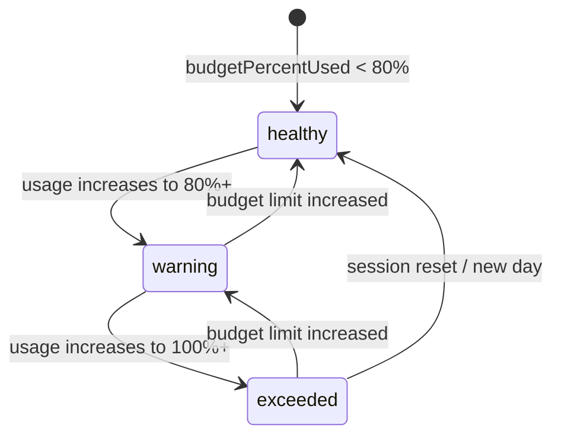

# Data Model: AI Token Usage Tracking Panel

## Overview

This feature uses simple data structures for aggregating AI usage across providers and time periods. No database or persistent storage is required - all data is derived from reading `.specify/logs/council-usage.jsonl` on demand.

## Entities

### AIUsageData

Aggregated usage data for a specific time period (Current Session, Today, This Week).

| Field | Type | Required | Description |
|-------|------|----------|-------------|
| period | `'current' \| 'today' \| 'week'` | Yes | Time period identifier |
| totalCostUsd | number | Yes | Total cost across all providers in USD |
| totalTokens | number | Yes | Total tokens (input + output) across all providers |
| providers | `ProviderUsage[]` | Yes | Per-provider usage breakdown |
| budgetLimitUsd | number | No | Budget limit (only for 'current' period) |
| budgetPercentUsed | number | No | Percentage of budget used (only for 'current' period) |
| budgetStatus | `'healthy' \| 'warning' \| 'exceeded'` | No | Budget status (only for 'current' period) |
| sessionId | string | No | Active session ID (only for 'current' period) |

**Validation Rules**:
- `totalCostUsd` must be >= 0
- `totalTokens` must be >= 0
- `providers` array must contain at least one provider
- If `budgetLimitUsd` is set, `budgetPercentUsed` and `budgetStatus` must also be set
- `budgetPercentUsed` = (totalCostUsd / budgetLimitUsd) * 100
- `budgetStatus`:
  - 'healthy': budgetPercentUsed < 80
  - 'warning': 80 <= budgetPercentUsed < 100
  - 'exceeded': budgetPercentUsed >= 100

**Relationships**:
- Contains array of `ProviderUsage` entities (one per provider with non-zero usage)

**Example**:
```typescript
{
  period: 'current',
  totalCostUsd: 2.45,
  totalTokens: 145000,
  providers: [
    { providerId: 'anthropic', inputTokens: 30000, outputTokens: 20000, costUsd: 1.50 },
    { providerId: 'openai', inputTokens: 10000, outputTokens: 5000, costUsd: 0.75 },
    { providerId: 'google', inputTokens: 60000, outputTokens: 20000, costUsd: 0.20 }
  ],
  budgetLimitUsd: 10.00,
  budgetPercentUsed: 24.5,
  budgetStatus: 'healthy',
  sessionId: 'session-2026-03-13-14-30'
}
```

### ProviderUsage

Usage and cost data for a single AI provider.

| Field | Type | Required | Description |
|-------|------|----------|-------------|
| providerId | `'anthropic' \| 'openai' \| 'google'` | Yes | Provider identifier |
| inputTokens | number | Yes | Number of input tokens consumed |
| outputTokens | number | Yes | Number of output tokens generated |
| costUsd | number | Yes | Total cost in USD (input + output) |

**Validation Rules**:
- `inputTokens` must be >= 0
- `outputTokens` must be >= 0
- `costUsd` must be >= 0
- `costUsd` = (inputTokens / 1_000_000) * inputRatePerM + (outputTokens / 1_000_000) * outputRatePerM
  - Where rates per 1M tokens come from `config/pricing.ts` (stored as per-1K rates: 0.003, 0.015, etc.)

**Example**:
```typescript
{
  providerId: 'anthropic',
  inputTokens: 30000,
  outputTokens: 20000,
  costUsd: 0.39
  // Formula: (inputTokens / 1_000_000) * inputRatePerM + (outputTokens / 1_000_000) * outputRatePerM
  // Anthropic rates: $3 per 1M input, $15 per 1M output
  // Calculation: (30000 / 1_000_000) * 3 + (20000 / 1_000_000) * 15
  //            = 0.03 * 3 + 0.02 * 15
  //            = 0.09 + 0.30
  //            = $0.39
  //
  // Note: config/pricing.ts stores rates per 1K tokens (0.003, 0.015)
  // So formula using stored rates: (inputTokens / 1000) * 0.003 + (outputTokens / 1000) * 0.015
}
```

**Realistic High-Volume Example** (for ~$1.50 cost):
```typescript
{
  providerId: 'anthropic',
  inputTokens: 300000,  // 300K tokens
  outputTokens: 200000,  // 200K tokens
  costUsd: 3.90
  // Calculation: (300000 / 1_000_000) * 3 + (200000 / 1_000_000) * 15
  //            = 0.30 * 3 + 0.20 * 15
  //            = 0.90 + 3.00
  //            = $3.90
}
```

### AIUsageItem

Tree view item for display in VSCode TreeDataProvider. This is a UI model, not a domain model.

| Field | Type | Required | Description |
|-------|------|----------|-------------|
| label | string | Yes | Display text for tree item |
| description | string | No | Secondary text (shown in gray) |
| tooltip | string | No | Hover tooltip text |
| iconPath | `vscode.ThemeIcon \| vscode.Uri` | No | Icon to display |
| contextValue | `'period' \| 'provider' \| 'tokens'` | Yes | Item type for context menu registration |
| collapsibleState | `vscode.TreeItemCollapsibleState` | Yes | Expandable/collapsed/none state |
| children | `AIUsageItem[]` | No | Child items (for internal tree building) |
| data | `AIUsageData \| ProviderUsage` | No | Underlying data for this item |

**Validation Rules**:
- `label` must not be empty
- If `collapsibleState` is `Collapsed` or `Expanded`, `children` must be defined
- If `collapsibleState` is `None`, `children` must be undefined

**Examples**:

Period item (root level):
```typescript
{
  label: 'Current Session',
  description: '$2.45',  // Note: Rounded for display clarity
  tooltip: 'AI usage for current session: $2.45 / $10.00 (24%)',
  iconPath: new vscode.ThemeIcon('pulse', new vscode.ThemeColor('charts.green')),
  contextValue: 'period',
  collapsibleState: vscode.TreeItemCollapsibleState.Collapsed,
  children: [/* provider items */],
  data: { period: 'current', totalCostUsd: 2.45, ... }
}
```

Provider item (child of period):
```typescript
{
  label: 'Anthropic',
  description: '$1.50 (50,000 tokens)',
  tooltip: 'Anthropic: $1.50 total\nInput: 30,000 tokens ($0.09)\nOutput: 20,000 tokens ($0.30)',
  iconPath: new vscode.ThemeIcon('symbol-class'),
  contextValue: 'provider',
  collapsibleState: vscode.TreeItemCollapsibleState.Collapsed,
  children: [/* token breakdown items */],
  data: { providerId: 'anthropic', inputTokens: 30000, outputTokens: 20000, costUsd: 1.50 }
}
```

Token breakdown item (child of provider):
```typescript
{
  label: 'Input Tokens',
  description: '30,000 ($0.09)',
  tooltip: '30,000 input tokens at $3.00 per 1M = $0.09',
  iconPath: new vscode.ThemeIcon('arrow-right'),
  contextValue: 'tokens',
  collapsibleState: vscode.TreeItemCollapsibleState.None,
  data: undefined
}
```

## State Transitions

### Budget Status State Machine



**Transition Rules**:
- `healthy → warning`: Triggered when `budgetPercentUsed >= 80`
- `warning → exceeded`: Triggered when `budgetPercentUsed >= 100`
- `exceeded → healthy`: Triggered when session resets (new session ID detected)
- Any state → `healthy`: Triggered when user increases budget limit

### Tree Item Collapsible State

No state machine needed - collapsible state is derived from item type:
- Period items: Always `Collapsed` (unless manually expanded by user)
- Provider items: Always `Collapsed` (unless manually expanded by user)
- Token items: Always `None` (leaf nodes, not expandable)

## Data Sources

All data is derived from existing Gofer infrastructure:

| Entity | Source | Method/Property |
|--------|--------|----------------|
| **AIUsageData** | UsageLogger, CostBudgetEnforcer, MultiSessionBridgeWatcher | Aggregated from multiple sources |
| **ProviderUsage** | UsageLogger | `getUsageSummary().byProvider[providerId]` |
| **Budget fields** | CostBudgetEnforcer | `getSnapshot()` returns budget status |
| **Session ID** | MultiSessionBridgeWatcher | `getBridgeData().sessionId` |
| **Pricing rates** | CostBudgetEnforcer.COST_PER_1K_TOKENS | Static constant (consolidated from UsageLogger) |

## Data Flow

```
UsageLogger.getUsageSummary(fromDate, toDate)
  ├─ Reads .specify/logs/council-usage.jsonl
  ├─ Filters by date range
  ├─ Aggregates by provider
  └─ Returns { byProvider: { anthropic: {...}, openai: {...}, google: {...} } }

CostBudgetEnforcer.getSnapshot()
  ├─ Returns current session budget status
  └─ { currentCostUsd, percentUsed, status: 'healthy'|'warning'|'exceeded' }

MultiSessionBridgeWatcher.getBridgeData()
  ├─ Reads .specify/hooks/context-bridge.json
  └─ Returns { sessionId, timestamp, ... }

AIUsageMonitor.getUsageData(period)
  ├─ Determines date range for period ('current', 'today', 'week')
  ├─ Calls UsageLogger.getUsageSummary(fromDate, toDate)
  ├─ Calls CostBudgetEnforcer.getSnapshot() (for 'current' period only)
  ├─ Calls MultiSessionBridgeWatcher.getBridgeData() (for 'current' period only)
  ├─ Maps data to AIUsageData format
  └─ Returns AIUsageData with providers array
```

## Persistence

**No database or persistent storage required.**

- All usage data is read from `.specify/logs/council-usage.jsonl` (written by UsageLogger)
- Budget data is read from CostBudgetEnforcer (tracks current session in memory)
- Session data is read from `.specify/hooks/context-bridge.json` (written by MultiSessionBridgeWatcher)

The panel is a **read-only view** of existing log data. No writes or mutations occur.

## Performance Considerations

### Caching Strategy

Since data is read from files on every tree request, caching is important:

```typescript
class AIUsageMonitor {
  private cachedData: Map<'current' | 'today' | 'week', AIUsageData> = new Map();
  private cacheTimestamp: number = 0;
  private CACHE_TTL_MS = 5000; // 5 seconds

  getUsageData(period: 'current' | 'today' | 'week'): AIUsageData {
    const now = Date.now();
    if (now - this.cacheTimestamp < this.CACHE_TTL_MS && this.cachedData.has(period)) {
      return this.cachedData.get(period)!; // Return cached data
    }

    // Cache expired or missing - fetch fresh data
    const data = this.fetchUsageData(period);
    this.cachedData.set(period, data);
    this.cacheTimestamp = now;
    return data;
  }
}
```

### Polling Configuration

**Polling Interval**: The automatic background update polling frequency has been optimized for resource efficiency (FR8, FR9):

- **Automatic polling**: 3600 seconds (1 hour) for background updates when FileSystemWatcher is unavailable or inactive
- **Primary mechanism**: FileSystemWatcher on `council-usage.jsonl` provides <500ms update latency when files change
- **Manual refresh**: Always available via command or toolbar button, triggers immediate data reload
- **Memory safety**: Guard against duplicate timers to prevent memory leaks

**Performance Impact**:
- Resource optimization: 99% reduction in polling overhead (from 720 polls/hour at 5s to 1 poll/hour)
- Reduced CPU and disk I/O from less frequent file reads
- FileSystemWatcher provides real-time updates when changes occur
- Manual refresh ensures users can get latest data on demand without waiting for hourly poll

This configuration change does not require any new data entities or modifications to existing entities. All entity structures (`AIUsageData`, `ProviderUsage`, `AIUsageItem`) remain unchanged.

### Indexing Strategy

Not applicable - no database. File reads are sequential from `.specify/logs/council-usage.jsonl`.

### Memory Footprint

Estimated memory usage per session:

- **AIUsageData** (3 periods): ~1 KB each × 3 = 3 KB
- **ProviderUsage** (3 providers per period): ~100 bytes each × 3 × 3 = ~1 KB
- **AIUsageItem** (tree items): ~500 bytes each × ~20 items = ~10 KB
- **Total per session**: ~15 KB

For 100 sessions in "Today" view: ~1.5 MB (acceptable for VSCode extension)

## Extensibility

### Adding New Providers

To add support for a new provider (e.g., Cohere, Replicate):

1. Add provider ID to `ProviderId` type:
   ```typescript
   type ProviderId = 'anthropic' | 'openai' | 'google' | 'cohere';
   ```

2. Add pricing data to `COST_PER_1K_TOKENS`:
   ```typescript
   export const COST_PER_1K_TOKENS = {
     // ...existing providers
     cohere: { input: 0.001, output: 0.002 },
   };
   ```

3. Update UsageLogger to track new provider in council-usage.jsonl

No changes needed to data model - the `ProviderUsage[]` array is already dynamic.

### Adding New Time Periods

To add a new time period (e.g., "This Month"):

1. Add period to `Period` type:
   ```typescript
   type Period = 'current' | 'today' | 'week' | 'month';
   ```

2. Add date range logic to `AIUsageMonitor.getUsageData()`:
   ```typescript
   case 'month': {
     fromDate = startOfMonth(now);
     toDate = now;
     break;
   }
   ```

3. Update `AIUsageProvider.getChildren()` to return new period item

## Notes

- **Currency**: All costs are in USD. No multi-currency support needed (providers bill in USD).
- **Precision**: Cost calculations use floating-point arithmetic. For display, always format to 2 decimal places (`toFixed(2)`).
- **Time zones**: All dates use local time zone (matches user's system). No UTC conversion needed.
- **Session correlation**: Sessions are identified by `sessionId` from MultiSessionBridgeWatcher, which reads context-bridge.json written by Claude Code CLI.
