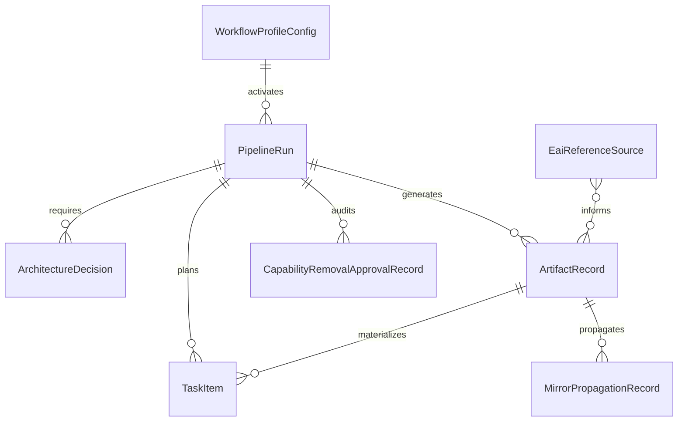
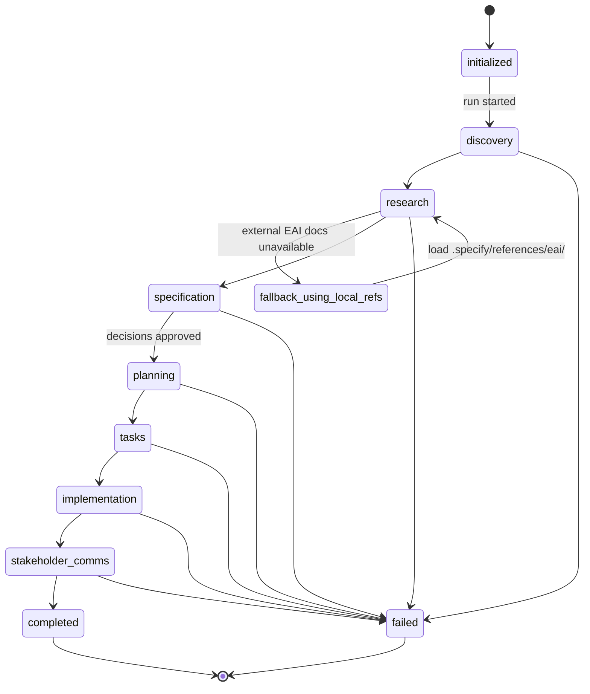
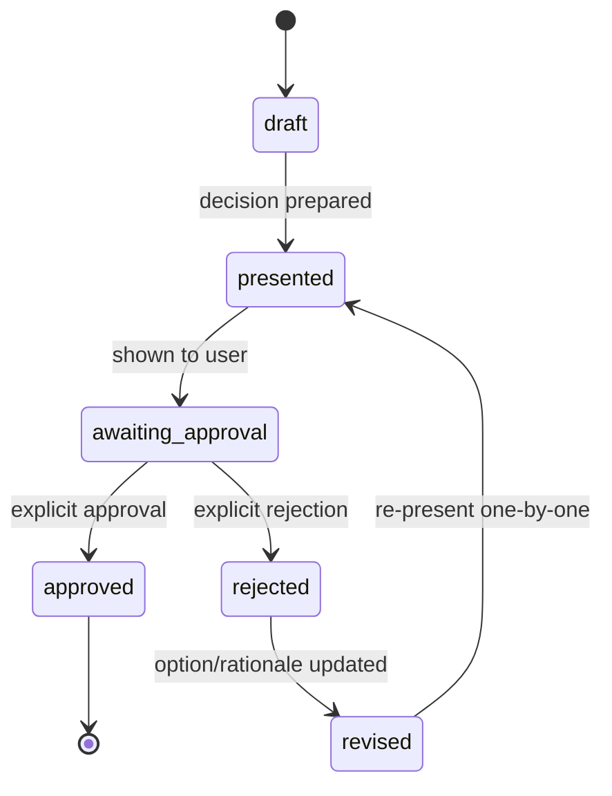
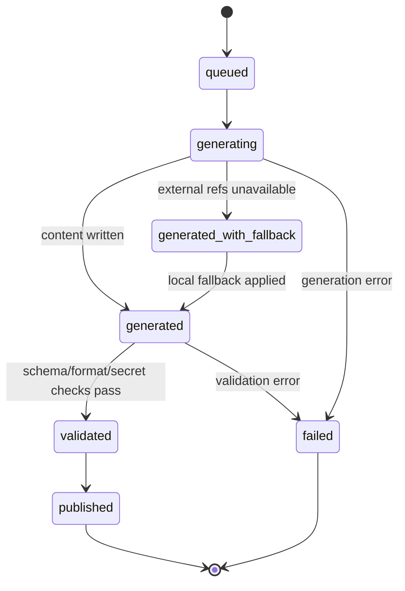
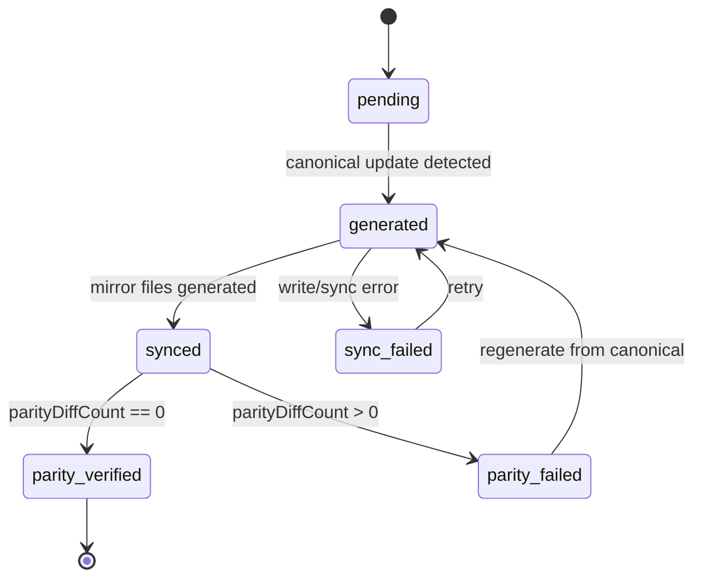

# Data Model: EnterpriseAI Student Vertical Builder

## Overview

This model defines the profile, run, artifact, reference, task, decision, and
mirror-propagation entities needed to support the EnterpriseAI workflow profile
as an additive overlay. It aligns with:

- `gofer.workflowProfile` activation values: `standard` and `enterpriseai`
- local fallback reference library path: `.specify/references/eai/`
- EAI CLI version contract: record installed `eai` **major.minor** in generated
  plan/task artifacts

## Entity Definitions

### Entity 1: WorkflowProfileConfig

Workspace-level profile and stage-option settings consumed at run start.

| Field                        | Type                              | Required | Description                                                            |
| ---------------------------- | --------------------------------- | -------- | ---------------------------------------------------------------------- |
| `configId`                   | string (UUID)                     | Yes      | Unique configuration record ID.                                        |
| `workflowProfile`            | enum (`standard`, `enterpriseai`) | Yes      | Primary workflow activation setting (`gofer.workflowProfile`).         |
| `competitiveAnalysisEnabled` | boolean                           | Yes      | Enables/disables optional market analysis artifact generation.         |
| `marpOutputEnabled`          | boolean                           | Yes      | Enables/disables Marp deck output in stakeholder communications.       |
| `updatedAt`                  | ISO8601 datetime                  | Yes      | Last settings update timestamp.                                        |
| `updatedBy`                  | string                            | No       | Actor/source that changed config (user, workspace default, migration). |

**Validation Rules**:

- `workflowProfile` MUST be exactly `standard` or `enterpriseai`.
- `competitiveAnalysisEnabled` and `marpOutputEnabled` are evaluated only for
  `enterpriseai` runs.
- `standard` profile behavior MUST remain baseline-compatible (no EAI-only
  requirements applied).

---

### Entity 2: PipelineRun

A single pipeline execution snapshot with profile, stage progression, and EAI
CLI pin metadata.

| Field                     | Type                                                                                                        | Required | Description                                                                     |
| ------------------------- | ----------------------------------------------------------------------------------------------------------- | -------- | ------------------------------------------------------------------------------- |
| `runId`                   | string (UUID)                                                                                               | Yes      | Unique pipeline run identifier.                                                 |
| `featureId`               | string                                                                                                      | Yes      | Feature/spec ID (e.g., `029-enterpriseai-student-vertical-builder`).            |
| `configId`                | string (FK → WorkflowProfileConfig)                                                                         | Yes      | Configuration used to start the run.                                            |
| `workflowProfileSnapshot` | enum (`standard`, `enterpriseai`)                                                                           | Yes      | Immutable profile value captured at run start.                                  |
| `status`                  | enum (`initialized`, `in_progress`, `completed`, `failed`, `cancelled`)                                     | Yes      | Current run lifecycle state.                                                    |
| `currentStage`            | enum (`discovery`, `research`, `specification`, `planning`, `tasks`, `implementation`, `stakeholder_comms`) | Yes      | Active stage pointer for progression and recovery.                              |
| `eaiCliVersionDetected`   | string (semver)                                                                                             | No       | Detected installed EAI CLI full version (e.g., `3.4.2`).                        |
| `eaiCliMajorMinorPin`     | string (`major.minor`)                                                                                      | No       | Version contract value to propagate to plan/task artifacts (e.g., `3.4`).       |
| `fallbackModeActive`      | boolean                                                                                                     | Yes      | True when external EAI references are unavailable and local fallback is in use. |
| `startedAt`               | ISO8601 datetime                                                                                            | Yes      | Run start timestamp.                                                            |
| `endedAt`                 | ISO8601 datetime                                                                                            | No       | Run completion/failure timestamp.                                               |

**Validation Rules**:

- `workflowProfileSnapshot` MUST match the selected `gofer.workflowProfile` at
  start.
- For `enterpriseai` runs, `eaiCliMajorMinorPin` MUST exist before generating
  `plan`/`tasks` outputs.
- `eaiCliMajorMinorPin` MUST match `^\d+\.\d+$`.
- `fallbackModeActive=true` requires at least one unavailable external reference
  and local fallback usage.
- `endedAt` is required when `status` is terminal (`completed`, `failed`,
  `cancelled`).

---

### Entity 3: EaiReferenceSource

Catalog of EnterpriseAI guidance sources used by research/plan/tasks stages.

| Field                | Type                                                                | Required | Description                                           |
| -------------------- | ------------------------------------------------------------------- | -------- | ----------------------------------------------------- |
| `referenceId`        | string (UUID)                                                       | Yes      | Unique reference source ID.                           |
| `referenceType`      | enum (`eai_docs`, `vertical_template_docs`, `deployment_repo_docs`) | Yes      | Reference category.                                   |
| `localFallbackPath`  | string (path)                                                       | Yes      | Local fallback path under `.specify/references/eai/`. |
| `externalSourceUrl`  | string (URL)                                                        | No       | Approved external source location if reachable.       |
| `availabilityStatus` | enum (`external_available`, `external_unavailable`, `local_only`)   | Yes      | Runtime availability outcome.                         |
| `lastCheckedAt`      | ISO8601 datetime                                                    | Yes      | Last availability check timestamp.                    |
| `versionTag`         | string                                                              | No       | Optional doc/version marker (commit/tag/date).        |

**Validation Rules**:

- `localFallbackPath` MUST start with `.specify/references/eai/`.
- `externalSourceUrl` is required when `availabilityStatus=external_available`.
- For `enterpriseai` runs, all three `referenceType` categories MUST be
  resolvable via external or local path.
- When `availabilityStatus` is `external_unavailable` or `local_only`, local
  fallback MUST be present.

---

### Entity 4: ArchitectureDecision

Decision records implementing the one-by-one explicit approval loop.

| Field            | Type                                                                                | Required | Description                                        |
| ---------------- | ----------------------------------------------------------------------------------- | -------- | -------------------------------------------------- |
| `decisionId`     | string (UUID)                                                                       | Yes      | Unique decision identifier.                        |
| `runId`          | string (FK → PipelineRun)                                                           | Yes      | Parent run.                                        |
| `sequenceNumber` | integer                                                                             | Yes      | Ordered decision number within a run.              |
| `decisionPrompt` | string                                                                              | Yes      | Decision question shown to the user.               |
| `optionsJson`    | JSON array                                                                          | Yes      | Candidate architecture options presented.          |
| `status`         | enum (`draft`, `presented`, `awaiting_approval`, `approved`, `rejected`, `revised`) | Yes      | Decision lifecycle state.                          |
| `selectedOption` | string                                                                              | No       | Chosen option when approved.                       |
| `rationale`      | string                                                                              | No       | User or system rationale for acceptance/rejection. |
| `presentedAt`    | ISO8601 datetime                                                                    | No       | Timestamp when presented for explicit approval.    |
| `respondedAt`    | ISO8601 datetime                                                                    | No       | Timestamp when approval/rejection was recorded.    |

**Validation Rules**:

- `sequenceNumber` MUST be unique per `runId`.
- Only one `ArchitectureDecision` may be `awaiting_approval` per run at any
  time.
- Transition to `approved` or `rejected` requires `respondedAt`.
- `specification` stage MUST NOT proceed while any required decision is not
  `approved`.

---

### Entity 5: ArtifactRecord

Metadata for each generated stage artifact in the spec directory.

| Field                    | Type                                                                                                                                                       | Required | Description                                                                     |
| ------------------------ | ---------------------------------------------------------------------------------------------------------------------------------------------------------- | -------- | ------------------------------------------------------------------------------- |
| `artifactId`             | string (UUID)                                                                                                                                              | Yes      | Unique artifact record ID.                                                      |
| `runId`                  | string (FK → PipelineRun)                                                                                                                                  | Yes      | Parent pipeline run.                                                            |
| `stage`                  | enum (`discovery`, `research`, `specification`, `planning`, `tasks`, `implementation`, `stakeholder_comms`)                                                | Yes      | Stage that generated the artifact.                                              |
| `artifactType`           | enum (`discovery`, `business-analysis`, `market-analysis`, `spec`, `plan`, `tasks`, `implementation-summary`, `release-notes`, `demo-script`, `marp-deck`) | Yes      | Artifact classification.                                                        |
| `filePath`               | string (path)                                                                                                                                              | Yes      | Artifact file path in feature spec directory.                                   |
| `profileContext`         | enum (`standard`, `enterpriseai`)                                                                                                                          | Yes      | Profile used for this artifact generation.                                      |
| `generationStatus`       | enum (`queued`, `generating`, `generated`, `validated`, `published`, `failed`)                                                                             | Yes      | Generation and validation lifecycle state.                                      |
| `eaiCliMajorMinorPin`    | string (`major.minor`)                                                                                                                                     | No       | Recorded EAI CLI pin for plan/task artifacts in enterpriseai profile.           |
| `includesFallbackNotice` | boolean                                                                                                                                                    | Yes      | Whether artifact includes degraded-mode notice for unavailable external docs.   |
| `alternativeCount`       | integer                                                                                                                                                    | No       | Count of alternatives compared in `market-analysis` artifacts.                  |
| `referencedInSpec`       | boolean                                                                                                                                                    | No       | Indicates `market-analysis.md` is explicitly referenced in generated `spec.md`. |
| `referencedInPlan`       | boolean                                                                                                                                                    | No       | Indicates `market-analysis.md` is explicitly referenced in generated `plan.md`. |
| `sourceReferenceIds`     | JSON array(FK → EaiReferenceSource)                                                                                                                        | Yes      | References used to generate this artifact.                                      |
| `contentHash`            | string                                                                                                                                                     | No       | Integrity hash for parity/version tracking.                                     |
| `createdAt`              | ISO8601 datetime                                                                                                                                           | Yes      | Artifact creation timestamp.                                                    |

**Validation Rules**:

- `filePath` MUST be under `.specify/specs/{feature}/`.
- For `profileContext=enterpriseai` and `artifactType in (plan, tasks)`,
  `eaiCliMajorMinorPin` is required and MUST match `^\d+\.\d+$`.
- `artifactType=market-analysis` requires `competitiveAnalysisEnabled=true`.
- `artifactType=market-analysis` requires `alternativeCount >= 3`.
- `artifactType=market-analysis` requires `referencedInSpec=true` and
  `referencedInPlan=true` before run status can transition to `completed`.
- `artifactType=marp-deck` requires `marpOutputEnabled=true` and valid Marp
  frontmatter.
- `includesFallbackNotice=true` whenever a required external reference was
  unavailable.
- Artifact content MUST pass secret-safety checks (no API keys, tokens,
  credentials).

---

### Entity 6: TaskItem

Structured task entries extracted from `tasks.md` for ordering and deployability
checks.

| Field               | Type                                                                                                | Required | Description                                           |
| ------------------- | --------------------------------------------------------------------------------------------------- | -------- | ----------------------------------------------------- |
| `taskId`            | string (UUID)                                                                                       | Yes      | Unique task item ID.                                  |
| `runId`             | string (FK → PipelineRun)                                                                           | Yes      | Parent run.                                           |
| `artifactId`        | string (FK → ArtifactRecord)                                                                        | Yes      | Parent tasks artifact record.                         |
| `taskType`          | enum (`vertical_template_scaffold`, `eai_deploy`, `deployment_convention`, `validation`, `generic`) | Yes      | Task classification for required-sequence validation. |
| `orderIndex`        | integer                                                                                             | Yes      | Ordered position in task list.                        |
| `title`             | string                                                                                              | Yes      | Task headline.                                        |
| `commandSnippet`    | string                                                                                              | No       | Optional command/guidance snippet.                    |
| `dependsOnTaskId`   | string (FK → TaskItem)                                                                              | No       | Upstream task dependency.                             |
| `requiredFilesJson` | JSON array                                                                                          | No       | Required deployment files (manifest/config/etc.).     |
| `validationStatus`  | enum (`not_checked`, `checked`, `failed`)                                                           | Yes      | Required-file validation outcome.                     |

**Validation Rules**:

- `artifactId` MUST reference an `ArtifactRecord` where `artifactType=tasks`.
- For `enterpriseai` runs, at least one `vertical_template_scaffold` and one
  `eai_deploy` task MUST exist.
- First `eai_deploy` task MUST occur after at least one scaffold task (by
  `orderIndex` or dependency).
- `eai_deploy` task command guidance MUST reference parent
  `eaiCliMajorMinorPin`.
- Deployment tasks cannot be marked complete unless required-file validation is
  `checked`.

---

### Entity 7: MirrorPropagationRecord

Tracks canonical-to-mirror propagation and parity outcomes for profile-related
command updates.

| Field                 | Type                                                                    | Required | Description                                        |
| --------------------- | ----------------------------------------------------------------------- | -------- | -------------------------------------------------- |
| `propagationId`       | string (UUID)                                                           | Yes      | Unique propagation event ID.                       |
| `artifactId`          | string (FK → ArtifactRecord)                                            | Yes      | Source artifact/content reference for propagation. |
| `canonicalSourcePath` | string (path)                                                           | Yes      | Canonical command source path used for generation. |
| `targetPlatform`      | enum (`claude`, `copilot`, `codex`, `gemini`)                           | Yes      | Mirror target platform.                            |
| `targetPath`          | string (path)                                                           | Yes      | Target mirrored file path.                         |
| `syncStatus`          | enum (`pending`, `generated`, `synced`, `parity_failed`, `sync_failed`) | Yes      | Sync/parity lifecycle state.                       |
| `parityDiffCount`     | integer                                                                 | Yes      | Number of parity diffs detected post-sync.         |
| `syncedAt`            | ISO8601 datetime                                                        | No       | Last successful sync timestamp.                    |

**Validation Rules**:

- Unique key: (`artifactId`, `targetPlatform`) to avoid duplicate mirror rows.
- `syncStatus=synced` requires `parityDiffCount=0`.
- `syncStatus=parity_failed` requires `parityDiffCount>0`.
- `canonicalSourcePath` MUST be the authored source of truth; mirror edits are
  generated-only.

---

### Entity 8: CapabilityRemovalApprovalRecord

Explicit approval audit record required before any capability-removal or
capability-disabling change is permitted.

| Field                | Type                          | Required | Description                                          |
| -------------------- | ----------------------------- | -------- | ---------------------------------------------------- |
| `approvalRecordId`   | string (UUID)                 | Yes      | Unique approval record ID.                           |
| `runId`              | string (FK → PipelineRun)     | Yes      | Parent pipeline run associated with the change.      |
| `changeSetId`        | string                        | Yes      | Change set identifier under review.                  |
| `capabilityAffected` | string                        | Yes      | Capability proposed for removal/disablement.         |
| `decision`           | enum (`approved`, `rejected`) | Yes      | Explicit decision outcome for the capability change. |
| `approver`           | string                        | Yes      | User identity that made the explicit decision.       |
| `decisionAt`         | ISO8601 datetime              | Yes      | Timestamp when the explicit decision was recorded.   |
| `changeSetSummary`   | string                        | Yes      | Human-readable summary of the proposed change scope. |
| `decisionRationale`  | string                        | No       | Optional rationale explaining approval/rejection.    |

**Validation Rules**:

- Unique key: (`changeSetId`, `capabilityAffected`) to enforce one explicit
  decision per capability change.
- `decisionAt` and `approver` are mandatory for both `approved` and `rejected`
  outcomes.
- Any detected capability-removal/deprecation change MUST remain blocked unless
  `decision=approved`.
- Approval records MUST be retained for release audit and regression
  verification.

## Relationships

### Relationship Diagram

### Relationship Descriptions

1. **WorkflowProfileConfig → PipelineRun** (1:N): each run snapshots one config
   profile.
2. **PipelineRun → ArchitectureDecision** (1:N): one-by-one approvals are
   tracked per run.
3. **PipelineRun → ArtifactRecord** (1:N): each run produces multiple stage
   artifacts.
4. **PipelineRun → TaskItem** (1:N): task rows belong to one run.
5. **ArtifactRecord → TaskItem** (1:N): structured tasks come from the `tasks`
   artifact record.
6. **EaiReferenceSource ↔ ArtifactRecord** (N:M): artifacts consume one or more
   reference sources.
7. **ArtifactRecord → MirrorPropagationRecord** (1:N): each source artifact can
   generate multiple platform propagation records.
8. **PipelineRun → CapabilityRemovalApprovalRecord** (1:N): explicit approval
   decisions are tracked per capability-affecting change set.

## State Transition Diagrams

### 1) PipelineRun Lifecycle

### 2) ArchitectureDecision Approval Loop

### 3) ArtifactRecord Generation and Validation

### 4) MirrorPropagationRecord Sync Lifecycle

## Storage/Database Considerations

### Storage Model

- **Settings storage**: `WorkflowProfileConfig` is sourced from VS Code settings
  (`gofer.workflowProfile` plus run flags).
- **Artifact storage**: `ArtifactRecord`/`TaskItem` reference files under
  `.specify/specs/{feature}/`.
- **Fallback reference storage**: `EaiReferenceSource.localFallbackPath` is
  rooted at `.specify/references/eai/` (official local fallback library).
- **Propagation metadata**: `MirrorPropagationRecord` can be persisted as
  generator/runtime metadata alongside parity validation outputs.

### Indexing Recommendations (if persisted in relational store)

| Table/Entity                      | Recommended Index                                                           | Purpose                                                       |
| --------------------------------- | --------------------------------------------------------------------------- | ------------------------------------------------------------- |
| `PipelineRun`                     | `(featureId, startedAt DESC)`                                               | Fast access to latest run for a feature.                      |
| `PipelineRun`                     | `(workflowProfileSnapshot, status)`                                         | Monitor profile-specific run health.                          |
| `ArtifactRecord`                  | Unique `(runId, stage, artifactType)`                                       | Prevent duplicate artifacts per stage/type.                   |
| `ArtifactRecord`                  | `(profileContext, artifactType)`                                            | Query EAI-only outputs quickly.                               |
| `TaskItem`                        | `(runId, orderIndex)`                                                       | Preserve and query execution ordering.                        |
| `TaskItem`                        | Partial index on `taskType IN ('vertical_template_scaffold', 'eai_deploy')` | Validate required EAI task presence/order efficiently.        |
| `EaiReferenceSource`              | `(referenceType, availabilityStatus)`                                       | Fallback availability checks.                                 |
| `MirrorPropagationRecord`         | Unique `(artifactId, targetPlatform)`                                       | Ensure exactly one mirror row per platform target.            |
| `MirrorPropagationRecord`         | `(syncStatus, targetPlatform)`                                              | Fast parity failure triage.                                   |
| `CapabilityRemovalApprovalRecord` | Unique `(changeSetId, capabilityAffected)`                                  | Enforce one explicit approval decision per capability change. |
| `CapabilityRemovalApprovalRecord` | `(runId, decisionAt DESC)`                                                  | Fast audit retrieval for release and regression gates.        |

### Migration Approach

1. **Additive-only migration**: introduce new fields/entities without deleting
   existing ones.
2. **Backfill old runs/artifacts**: set `workflowProfileSnapshot=standard` where
   profile is unknown.
3. **Conditional contract enforcement**: keep `eaiCliMajorMinorPin` nullable
   globally, but enforce required for `enterpriseai` `plan`/`tasks` artifacts.
4. **Reference bootstrap**: pre-populate `EaiReferenceSource` from
   `.specify/references/eai/`.
5. **Safety gates**: parity + regression checks must pass before shipping
   profile updates.
6. **Approval audit bootstrap**: initialize `CapabilityRemovalApprovalRecord`
   handling so capability-affecting change sets are blocked until explicit
   approval is recorded.

## Entity-to-User-Story Mapping

| User Story                                                 | Primary Entities                                                                                     | How the Entities Support the Story                                                                                                                   |
| ---------------------------------------------------------- | ---------------------------------------------------------------------------------------------------- | ---------------------------------------------------------------------------------------------------------------------------------------------------- |
| **US-001 — EnterpriseAI Vertical App Discovery**           | `WorkflowProfileConfig`, `PipelineRun`, `ArtifactRecord`, `ArchitectureDecision`                     | Activates EAI profile behavior, tracks discovery stage output, and enforces one-by-one decision approvals.                                           |
| **US-002 — EnterpriseAI Architecture and Plan Generation** | `PipelineRun`, `ArtifactRecord`, `TaskItem`, `EaiReferenceSource`                                    | Ensures plan/tasks artifacts include EAI references, scaffold/deploy sequencing, and EAI CLI pin capture.                                            |
| **US-003 — Marp Presentation Artifact Generation**         | `WorkflowProfileConfig`, `ArtifactRecord`                                                            | `marpOutputEnabled` controls generation of `marp-deck` artifact in stakeholder comms stage.                                                          |
| **US-004 — EnterpriseAI Deployment Guidance**              | `TaskItem`, `ArtifactRecord`, `EaiReferenceSource`, `PipelineRun`                                    | Captures explicit deployment tasks, validates scaffold-before-deploy order, and supports fallback reference usage.                                   |
| **US-005 — Competitive and Market Analysis**               | `WorkflowProfileConfig`, `ArtifactRecord`                                                            | Optional flag controls `market-analysis` artifact generation without breaking other stages.                                                          |
| **US-006 — All-Platform Artifact Parity**                  | `ArtifactRecord`, `MirrorPropagationRecord`                                                          | Tracks canonical generation and mirror sync/parity outcomes per platform.                                                                            |
| **US-007 — Existing Functionality Preserved**              | `WorkflowProfileConfig`, `PipelineRun`, `MirrorPropagationRecord`, `CapabilityRemovalApprovalRecord` | Preserves baseline `standard` behavior, validates additive EAI propagation, and enforces explicit approval records for capability-affecting changes. |

## Summary Statistics

- **Entity Count**: 8
- **Relationship Count**: 8
- **Entities with State Machines**: `PipelineRun`, `ArchitectureDecision`,
  `ArtifactRecord`, `MirrorPropagationRecord`
