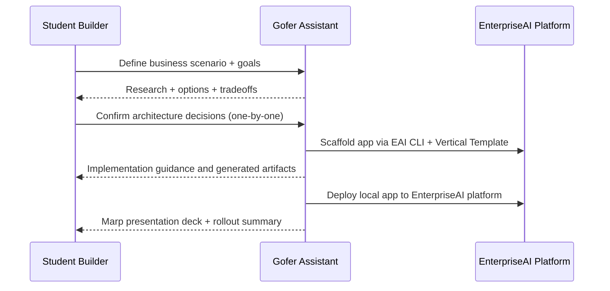

# Customer Journey: EnterpriseAI Student Vertical Builder

## Overview

Guide university and business students through an EnterpriseAI-only workflow to
design, build, deploy, and present vertical business-process-driven
applications.

## Actors

| ID           | Name                  | Type     | Role                                                                                                  |
| ------------ | --------------------- | -------- | ----------------------------------------------------------------------------------------------------- |
| student      | Student Builder       | user     | Defines business need, validates architecture decisions, and drives solution goals                    |
| gofer        | Gofer Assistant       | ai-agent | Orchestrates research, architecture, implementation guidance, and artifact generation                 |
| eai-platform | EnterpriseAI Platform | system   | Provides EAI CLI workflow, Vertical Template scaffolding, integration patterns, and deployment target |

## Journey Steps

### Step 1: Define business scenario

**Actor**: student

Capture business process goals, user outcomes, and constraints.

### Step 2: Run business + market + technology research

**Actor**: gofer

Generate targeted research with EnterpriseAI ecosystem grounding and competitive
context.

### Step 3: Finalize architecture decisions one-by-one

**Actor**: student + gofer

Discuss each architecture choice with clarification loop before decision
lock-in.

### Step 4: Scaffold using Vertical Template and EAI CLI

**Actor**: gofer + eai-platform

Prepare local project structure and platform-ready conventions through
EnterpriseAI tooling.

### Step 5: Build and integrate EnterpriseAI app

**Actor**: student + gofer

Implement business-process-driven vertical functionality with AI augmentation
and approved integrations.

### Step 6: Deploy to EnterpriseAI platform

**Actor**: gofer + eai-platform

Use local-to-platform deployment flow aligned with EnterpriseAI deployment
architecture.

### Step 7: Generate presentation artifacts

**Actor**: gofer

Create Marp-based presentation output summarizing business case, architecture,
implementation, and results.

## Journey Diagram

## Touchpoints

| ID                            | Type     | Description                                           | Actors                       | Steps |
| ----------------------------- | -------- | ----------------------------------------------------- | ---------------------------- | ----- |
| discovery-flow                | workflow | Business/problem discovery and requirement framing    | student, gofer               | 1     |
| research-artifacts            | docs     | Research, proposal, and architecture artifacts        | gofer, student               | 2-3   |
| eai-flow                      | cli      | EnterpriseAI scaffolding and deployment command flow  | gofer, eai-platform          | 4, 6  |
| vertical-template-integration | code     | Vertical Template based app structure and integration | gofer, student, eai-platform | 4-5   |
| marp-output                   | docs     | Presentation deck generation using Marp               | gofer, student               | 7     |

## Confirmation

- [x] Actors confirmed
- [x] Steps confirmed
- [x] Touchpoints identified
