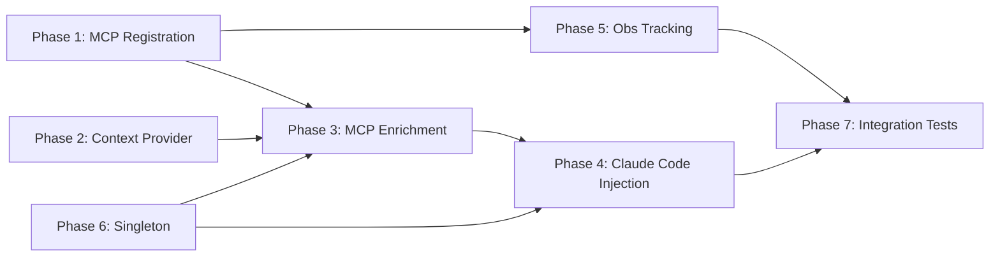

# Tasks: Memory System Full Integration Sweep

## Overview

- **Total Tasks**: 55
- **Parallel Opportunities**: 18 tasks marked [P]
- **User Stories**: 8 (US1-US8)
- **Phases**: 7

## Dependencies

---

## Phase 1: MCP Tool Registration & Persistence (US2, US7)

**Goal**: Register 5 orphaned MCP tools and verify persistence infrastructure

**Stories Covered**:

- US2: Orphaned MCP Tool Registration
- US7: Persistence Infrastructure

### MCP Tool Definitions

- [x] T001 [US2] Add `gofer_expand_observation` tool definition to onInitialize
      in language-server/src/server.ts
- [x] T002 [P] [US2] Add `gofer_get_context_health` tool definition to
      onInitialize in language-server/src/server.ts
- [x] T003 [P] [US2] Add `gofer_get_research_index` tool definition to
      onInitialize in language-server/src/server.ts
- [x] T004 [P] [US2] Add `gofer_load_research_chunk` tool definition to
      onInitialize in language-server/src/server.ts
- [x] T005 [P] [US2] Add `gofer_trigger_handoff` tool definition to onInitialize
      in language-server/src/server.ts

### MCP Tool Dispatch

- [x] T006 [US2] Add 5 switch cases to tools/call dispatcher in
      language-server/src/server.ts (gofer_expand_observation,
      gofer_get_context_health, gofer_get_research_index,
      gofer_load_research_chunk, gofer_trigger_handoff)

### Persistence Verification

- [x] T007 [P] [US7] Verify ObservationMasker creates
      `.specify/memory/observation-cache/` directory on first write via lazy
      mkdir in extension/src/autonomous/ObservationMasker.ts
- [x] T008 [P] [US7] Verify ContextUsageLogger creates
      `.specify/logs/context-usage.jsonl` on first log event in
      extension/src/autonomous/ContextUsageLogger.ts
- [x] T009 [P] [US7] Verify MemoryManager creates `.specify/memory/local.json`
      on first save in extension/src/autonomous/MemoryManager.ts

### Phase 1 Tests

- [x] T010 [US2] Write test verifying all 11 MCP tools appear in capabilities
      response in tests/unit/language-server/mcp-tool-registration.test.ts
- [x] T011 [US2] Write tests for each of the 5 new MCP tools returning valid
      responses in tests/unit/language-server/mcp-tool-registration.test.ts

**Verification**:

- [ ] All 11 MCP tools appear in capabilities response
- [ ] Each of the 5 new tools returns a valid response
- [ ] All 1333+ existing tests pass
- [ ] Persistence directories created on first use

---

## Phase 2: Context Provider (US3)

**Goal**: Make ContextHealthMonitor produce real token usage data

**Story Covered**: US3: Real Context Health Data

### Implementation

- [x] T012 [US3] Create `WorkspaceContextProvider` class with constructor
      accepting workspacePath and MemoryManager in
      extension/src/autonomous/WorkspaceContextProvider.ts
- [x] T013 [US3] Implement `estimateTokenBreakdown()` method that scans
      `.specify/specs/`, `.specify/hints/`, and system files (CLAUDE.md,
      AGENTS.md, constitution.md) to estimate token counts per category in
      extension/src/autonomous/WorkspaceContextProvider.ts
- [x] T014 [US3] Implement `detectCurrentStage()` method that determines the
      active Gofer pipeline stage from spec artifact state in
      extension/src/autonomous/WorkspaceContextProvider.ts
- [x] T015 [US3] Implement `getContextAnalysis()` method returning
      `ContextAnalysisInput` in
      extension/src/autonomous/WorkspaceContextProvider.ts
- [x] T016 [US3] Wire WorkspaceContextProvider to ContextHealthMonitor via
      `setContextProvider()` callback in `initializeContextHealthMonitoring()`
      in extension/src/extension.ts
- [x] T017 [US3] Export WorkspaceContextProvider from
      extension/src/autonomous/index.ts

### Phase 2 Tests

- [x] T018 [US3] Write unit tests for WorkspaceContextProvider covering
      estimateTokenBreakdown, detectCurrentStage, and getContextAnalysis in
      tests/unit/autonomous/WorkspaceContextProvider.test.ts
- [x] T019 [US3] Write test verifying ContextHealthMonitor returns non-null
      status when provider is set in
      tests/unit/autonomous/WorkspaceContextProvider.test.ts

**Verification**:

- [ ] `checkHealth()` returns non-null `ContextHealthStatus`
- [ ] Status bar shows green/yellow/red based on real data
- [ ] JSONL logs contain real token counts
- [ ] Auto-handoff triggers at 70% threshold

---

## Phase 3: MCP Tool Enrichment (US1)

**Goal**: Enrich gofer_execute_task with memories, hints, research via file
bridge

**Story Covered**: US1: MCP Tool Context Enrichment

**Depends on**: Phase 1 (MCP tools registered), Phase 6 (shared instances
available)

### Extension Side — Bridge Writer

- [x] T020 [US1] Create `ContextBridgeWriter` class with constructor accepting
      ContextBuilder and workspacePath in
      extension/src/autonomous/ContextBridgeWriter.ts
- [x] T021 [US1] Implement `writeEnrichedContext(task: TaskContext)` method with
      atomic JSON write (temp file + rename) in
      extension/src/autonomous/ContextBridgeWriter.ts
- [x] T022 [US1] Export ContextBridgeWriter from
      extension/src/autonomous/index.ts

### Language Server Side — Bridge Reader

- [x] T023 [US1] Add `readEnrichedContext(specId, taskId)` private method to
      MCPToolHandler that reads `.specify/memory/enriched-context.json` with
      60-second freshness check in language-server/src/mcp/toolHandler.ts
- [x] T024 [US1] Expand `ExecuteTaskResponse` interface with additive fields:
      `memories`, `hints`, `researchChunks`, `memoryCoverage` in
      language-server/src/mcp/toolHandler.ts
- [x] T025 [US1] Modify `executeTask()` method to call `readEnrichedContext()`
      and include results in response, replacing truncated constitution with
      full version from bridge in language-server/src/mcp/toolHandler.ts
- [x] T026 [US1] Add graceful fallback: if bridge read fails or is stale, return
      existing response shape (current behavior) in
      language-server/src/mcp/toolHandler.ts

### Phase 3 Tests

- [x] T027 [US1] Write unit tests for ContextBridgeWriter covering atomic write,
      content structure, and error handling in
      tests/unit/autonomous/ContextBridgeWriter.test.ts
- [x] T028 [US1] Write unit test for readEnrichedContext including freshness
      check and missing file fallback in
      tests/unit/language-server/enriched-context.test.ts
- [x] T029 [US1] Write backward compatibility test verifying existing
      executeTask response fields are unchanged in
      tests/unit/language-server/enriched-context.test.ts

**Verification**:

- [ ] `gofer_execute_task` response includes `memories`, `hints`,
      `researchChunks`
- [ ] Response includes full constitution (not 2000 char truncated)
- [ ] Enrichment completes within 1 second
- [ ] Missing/stale bridge file falls back to current behavior

---

## Phase 4: Claude Code Context Injection (US4)

**Goal**: Inject enriched context before launching Claude Code

**Story Covered**: US4: Claude Code Launch Context Injection

**Depends on**: Phase 3 (ContextBridgeWriter exists), Phase 6 (shared
ContextBuilder available)

### Implementation

- [x] T030 [US4] Add context building call to `launchClaudeCode()` before
      pty.spawn that creates ContextBridgeWriter and calls writeEnrichedContext
      in extension/src/autonomousCommands.ts
- [x] T031 [US4] Add 500ms timeout wrapper around context building so launch
      proceeds if enrichment is slow in extension/src/autonomousCommands.ts
- [x] T032 [US4] Add try/catch around context building with console.warn on
      failure so launch proceeds without enrichment in
      extension/src/autonomousCommands.ts

### Phase 4 Tests

- [x] T033 [US4] Write test verifying context build runs before spawn in
      tests/unit/extension/launchClaudeCode.test.ts
- [x] T034 [US4] Write test verifying launch proceeds if context build fails in
      tests/unit/extension/launchClaudeCode.test.ts
- [x] T035 [US4] Write test verifying launch proceeds if context build exceeds
      500ms timeout in tests/unit/extension/launchClaudeCode.test.ts

**Verification**:

- [ ] Claude Code launch triggers context build
- [ ] Bridge file updated before spawn
- [ ] Launch not delayed more than 500ms
- [ ] Failed context build does not prevent launch

---

## Phase 5: Observation Tracking & Research Indexing (US5, US6)

**Goal**: Wire ObservationMasker to terminal output and auto-generate research
indexes

**Stories Covered**:

- US5: Observation Tracking
- US6: Research Index Generation

**Depends on**: Phase 1 (MCP tools registered for gofer_expand_observation,
gofer_get_research_index, gofer_load_research_chunk)

### Observation Tracking

- [x] T036 [US5] Add output buffer and observation tracking hook to pty.onData
      in launchClaudeCode that buffers terminal output and tracks as observation
      every 2000+ chars via sharedContextBuilder.trackObservation in
      extension/src/autonomousCommands.ts
- [x] T037 [US5] Call `sharedContextBuilder.incrementTurn()` on each tracked
      observation in extension/src/autonomousCommands.ts
- [x] T038 [US5] Ensure observation-cache directory is created on first tracked
      observation (uses ObservationMasker's lazy mkdir) in
      extension/src/autonomous/ObservationMasker.ts

### Research Index Watcher

- [x] T039 [US6] Add FileSystemWatcher for `.specify/specs/**/research.md` in
      extension/src/extension.ts
- [x] T040 [US6] Create shared ResearchChunker instance in extension.ts and wire
      to watcher in extension/src/extension.ts
- [x] T041 [US6] On research.md create/change, call
      `researchChunker.indexResearchFile(specId)` to generate
      research.index.json in extension/src/extension.ts
- [x] T042 [US6] Implement `extractSpecId(uri)` helper to parse spec directory
      name from file URI in extension/src/extension.ts
- [x] T043 [US6] Add watcher disposable to deactivate cleanup in
      extension/src/extension.ts

### Phase 5 Tests

- [x] T044 [P] [US5] Write test for observation tracking from simulated terminal
      output in tests/unit/autonomous/observation-tracking.test.ts
- [x] T045 [P] [US6] Write test for research index generation on file change in
      tests/unit/autonomous/research-watcher.test.ts

**Verification**:

- [ ] Terminal output appears in ObservationMasker cache
- [ ] Turn counter advances during Claude Code sessions
- [ ] `research.index.json` generated when research.md changes
- [ ] `gofer_get_research_index` returns valid index data
- [ ] `gofer_load_research_chunk` loads chunks by ID

---

## Phase 6: MemoryManager Consolidation (US8)

**Goal**: Single MemoryManager and ContextBuilder instance shared across the
extension

**Story Covered**: US8: MemoryManager Consolidation

**NOTE**: Phase 6 should be implemented BEFORE Phases 3 and 4, since those
phases depend on shared instances being available. The phase numbering reflects
logical grouping, not implementation order.

### Shared Instance Setters

- [x] T046 [US8] Add `setSharedMemoryManager(mm: MemoryManager)` exported
      function to extension/src/autonomousCommands.ts
- [x] T047 [US8] Add `setSharedContextBuilder(cb: ContextBuilder)` exported
      function to extension/src/autonomousCommands.ts
- [x] T048 [US8] Add `getSharedMemoryManager()` and `getSharedContextBuilder()`
      exported getters for testing in extension/src/autonomousCommands.ts

### Extension Wiring

- [x] T049 [US8] Create shared ContextBuilder instance in extension.ts
      registerCommands() using the shared MemoryManager in
      extension/src/extension.ts
- [x] T050 [US8] Call `setSharedMemoryManager()` and `setSharedContextBuilder()`
      from extension.ts registerCommands() in extension/src/extension.ts
- [x] T051 [US8] Remove duplicate `new MemoryManager()` from
      `startAutonomousExecution()` in extension/src/autonomousCommands.ts, use
      sharedMemoryManager instead

### Phase 6 Tests

- [x] T052 [US8] Write test verifying single MemoryManager instance is used
      across components in tests/unit/extension/memory-singleton.test.ts

**Verification**:

- [ ] Only one MemoryManager instantiation at runtime
- [ ] All memory operations logged to JSONL via shared logger
- [ ] AutonomousDriver uses shared instance
- [ ] launchClaudeCode uses shared ContextBuilder

---

## Phase 7: Integration Testing & Validation

**Goal**: End-to-end validation of complete integration

**Depends on**: All previous phases

- [x] T053 Write integration test: full MCP enrichment flow (write bridge → read
      in toolHandler → verify enriched response fields) in
      tests/integration/memory-integration-sweep.test.ts
- [x] T054 Run full test suite (`npm test`) and linting (`npm run lint`) to
      verify no regressions
- [x] T055 Manual smoke test: launch extension in dev host, verify status bar
      shows data, launch Claude Code, call gofer_execute_task and verify
      enriched response (PASSED — status bar shows Context: 225%, monitoring
      initialized)

**Verification**:

- [x] All new tests pass
- [x] All 1333+ existing tests pass (1410 passed, 158 skipped, 0 failures)
- [x] Lint clean (0 errors, 10 pre-existing warnings)
- [ ] Manual smoke test passes

---

## Parallel Execution Guide

Tasks marked [P] can run concurrently:

| Group                | Tasks                        | Description                      |
| -------------------- | ---------------------------- | -------------------------------- |
| MCP tool definitions | T001, T002, T003, T004, T005 | Independent tool definitions     |
| Persistence checks   | T007, T008, T009             | Independent module verifications |
| Phase 5 tests        | T044, T045                   | Independent test files           |

---

## Implementation Order

Due to dependency constraints, the recommended implementation order is:

1. **Phase 1** (T001-T011) — MCP registration + persistence
2. **Phase 6** (T046-T052) — Singleton setup (needed by Phases 3, 4, 5)
3. **Phase 2** (T012-T019) — Context provider
4. **Phase 3** (T020-T029) — MCP enrichment bridge
5. **Phase 4** (T030-T035) — Claude Code injection
6. **Phase 5** (T036-T045) — Observation tracking + research indexing
7. **Phase 7** (T053-T055) — Integration testing

---

## Acceptance Criteria Traceability

| User Story | Acceptance Criteria                   | Task(s)                        |
| ---------- | ------------------------------------- | ------------------------------ |
| US1        | gofer_execute_task includes memories  | T020, T021, T025               |
| US1        | Response includes hints               | T025                           |
| US1        | Response includes research chunks     | T025                           |
| US1        | Full constitution (not truncated)     | T025                           |
| US1        | New fields additive                   | T024, T029                     |
| US1        | Budget-aware allocation               | T021 (uses ContextBuilder)     |
| US2        | gofer_expand_observation callable     | T001, T006, T010, T011         |
| US2        | gofer_get_context_health callable     | T002, T006, T010, T011         |
| US2        | gofer_get_research_index callable     | T003, T006, T010, T011         |
| US2        | gofer_load_research_chunk callable    | T004, T006, T010, T011         |
| US2        | gofer_trigger_handoff callable        | T005, T006, T010, T011         |
| US2        | Tools in MCP capabilities             | T001-T005, T010                |
| US2        | Valid responses (not errors)          | T011                           |
| US3        | Monitor receives provider             | T016                           |
| US3        | Status bar real data                  | T012-T016                      |
| US3        | Warning at 50%                        | T018 (tested)                  |
| US3        | Critical at 70%                       | T018 (tested)                  |
| US3        | JSONL real data                       | T016 (wired to logger)         |
| US4        | launchClaudeCode calls ContextBuilder | T030                           |
| US4        | Enriched context injected             | T030, T031                     |
| US4        | Memories for spec/task                | T030                           |
| US4        | Hints for directories                 | T030                           |
| US4        | Launch < 500ms overhead               | T031, T035                     |
| US5        | Terminal output tracked               | T036                           |
| US5        | Turn counter increments               | T037                           |
| US5        | Old observations maskable             | T036, T037 (built into masker) |
| US5        | Expand via MCP tool                   | T001, T006                     |
| US5        | Cache persists                        | T007, T038                     |
| US6        | research.index.json generated         | T039-T041                      |
| US6        | Available to gofer_get_research_index | T003, T006                     |
| US6        | gofer_load_research_chunk works       | T004, T006                     |
| US6        | Non-blocking generation               | T041 (async)                   |
| US7        | local.json on first save              | T009                           |
| US7        | observation-cache/ created            | T007, T038                     |
| US7        | context-usage.jsonl created           | T008                           |
| US7        | research.index.json per-spec          | T039-T041                      |
| US7        | Lazy mkdir                            | T007, T008, T009               |
| US8        | Single MemoryManager                  | T046, T049, T050, T051         |
| US8        | Shared with AutonomousDriver          | T051                           |
| US8        | Logger wired                          | T050                           |
| US8        | No duplicate instantiation            | T051, T052                     |
