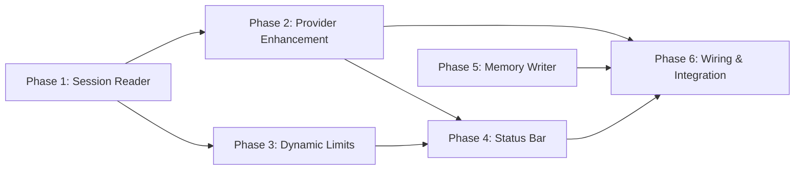

# Tasks: Real Context Window Monitoring & Continuous Memory Updates

## Overview

- **Total Tasks**: 38
- **Parallel Opportunities**: 12 tasks marked [P]
- **Phases**: 6 (matching plan phases)

## Dependencies

## Protected Files

The following interfaces and event contracts must NOT be changed:

- `ContextHealthMonitor` event names (`healthy`, `warning`, `critical`,
  `handoff-recommended`)
- `ContextHealthStatus` interface shape (additive fields only)
- `Memory` interface in `extension/src/autonomous/memory.ts`
- `.specify/memory/context-health-state.json` format (additive fields only)

---

## Phase 1: ClaudeSessionReader (Foundation)

**Goal**: Create the core JSONL reader with session discovery and tail-reading

**Depends on**: Nothing (foundation)

- [x] T001 Create `ClaudeSessionReader` class skeleton with constructor
      accepting workspacePath in extension/src/autonomous/ClaudeSessionReader.ts
- [x] T002 Implement `encodeWorkspacePath(workspacePath: string): string` that
      converts `/Users/x/Code/eai-gofer` to `-Users-x-Code-eai-gofer` in
      extension/src/autonomous/ClaudeSessionReader.ts
- [x] T003 Implement `getProjectDir(): string` that resolves
      `os.homedir()/.claude/projects/{encoded}` in
      extension/src/autonomous/ClaudeSessionReader.ts
- [x] T004 Implement `findActiveSession(): SessionInfo | null` that reads
      sessions-index.json and returns most recent non-sidechain session in
      extension/src/autonomous/ClaudeSessionReader.ts
- [x] T005 Implement `tailReadFile(filePath: string, bytes: number): string`
      that reads last N bytes of a file using fs.createReadStream with start
      offset in extension/src/autonomous/ClaudeSessionReader.ts
- [x] T006 Implement `getLatestUsage(): SessionUsage | null` that tail-reads
      JSONL, parses last assistant message, extracts usage fields in
      extension/src/autonomous/ClaudeSessionReader.ts
- [x] T007 Implement `getModelContextLimit(modelId: string): number` lookup
      table mapping known model IDs to context window sizes in
      extension/src/autonomous/ClaudeSessionReader.ts
- [x] T008 Add privacy guard — structural validation that only approved fields
      (type, timestamp, sessionId, message.usage, message.model) are accessed in
      extension/src/autonomous/ClaudeSessionReader.ts
- [x] T009 [P] Export `SessionInfo`, `SessionUsage`, and `ClaudeSessionReader`
      from extension/src/autonomous/index.ts
- [x] T010 [P] Write unit tests for path encoding (macOS, Linux, Windows paths)
      in tests/unit/autonomous/ClaudeSessionReader.test.ts
- [x] T011 [P] Write unit tests for sessions-index.json parsing (valid, empty,
      missing, sidechain filtering) in
      tests/unit/autonomous/ClaudeSessionReader.test.ts
- [x] T012 [P] Write unit tests for tail-read (normal file, empty file, small
      file, malformed last line) in
      tests/unit/autonomous/ClaudeSessionReader.test.ts
- [x] T013 [P] Write unit tests for usage extraction (valid assistant message,
      no assistant messages, missing usage field) in
      tests/unit/autonomous/ClaudeSessionReader.test.ts
- [x] T014 [P] Write unit tests for model lookup (known models, unknown model
      defaults to 200k) in tests/unit/autonomous/ClaudeSessionReader.test.ts

**Verification**:

- [x] All reader methods return correct data from test fixtures
- [x] Path encoding works for macOS, Linux, and Windows paths
- [x] Tail-read handles edge cases without errors
- [x] Privacy: structural test confirms no content field access

---

## Phase 2: WorkspaceContextProvider Enhancement

**Goal**: Use real session data with graceful fallback to filesystem estimation

**Depends on**: Phase 1

- [x] T015 Add `setSessionReader(reader: ClaudeSessionReader)` method to
      WorkspaceContextProvider in
      extension/src/autonomous/WorkspaceContextProvider.ts
- [x] T016 Add `dataSource` field (`'real' | 'estimated' | 'none'`) to the
      return value of `getContextAnalysis()` in
      extension/src/autonomous/WorkspaceContextProvider.ts
- [x] T017 Modify `getContextAnalysis()` to call session reader first; if real
      data available, populate `conversation` with actual token count and set
      `dataSource: 'real'` in
      extension/src/autonomous/WorkspaceContextProvider.ts
- [x] T018 Implement fallback: if session reader returns null or throws, fall
      back to filesystem estimation with `dataSource: 'estimated'` in
      extension/src/autonomous/WorkspaceContextProvider.ts
- [x] T019 Add session metadata (model, sessionId, sessionAge, apiCallCount) to
      analysis result in extension/src/autonomous/WorkspaceContextProvider.ts
- [x] T020 Update existing WorkspaceContextProvider tests to cover both
      real-data and fallback paths in
      tests/unit/autonomous/WorkspaceContextProvider.test.ts

**Verification**:

- [x] With active session: returns real tokens, `dataSource: 'real'`
- [x] Without session: returns `dataSource: 'none'`, no errors
- [x] With reader error: falls back to filesystem, `dataSource: 'estimated'`

---

## Phase 3: Dynamic Context Limits

**Goal**: ContextHealthMonitor uses model-appropriate context window sizes

**Depends on**: Phase 1 (for model lookup)

- [x] T021 Add `setEffectiveContextLimit(limit: number)` public method to
      ContextHealthMonitor in extension/src/autonomous/ContextHealthMonitor.ts
- [x] T022 Modify WorkspaceContextProvider to return `modelContextLimit`
      alongside analysis when real session data is available in
      extension/src/autonomous/WorkspaceContextProvider.ts
- [x] T023 Add logic in `checkHealth()` flow: if analysis includes a model-based
      limit, call `setEffectiveContextLimit()` before calculating utilization in
      extension/src/autonomous/ContextHealthMonitor.ts
- [x] T024 Add `dataSource`, `model`, `sessionId`, `sessionAge` fields to
      persisted state in `.specify/memory/context-health-state.json` (additive,
      backward compatible) in extension/src/autonomous/ContextHealthMonitor.ts
- [x] T025 [P] Write unit tests for dynamic limit changes and their effect on
      utilization percentage in
      tests/unit/autonomous/ContextHealthMonitor.test.ts

**Verification**:

- [x] Opus sessions produce utilization against 200k limit
- [x] Unknown models default to 200k
- [x] Persisted state includes new fields
- [x] Existing event interface unchanged

---

## Phase 4: Status Bar & Display Updates

**Goal**: Status bar clearly shows real data vs no-session state

**Depends on**: Phase 2, Phase 3

- [x] T026 Add `dataSource` handling to `updateDisplay()`: show "Context: N%
      (Model)" for real data in extension/src/ui/ContextHealthStatusBar.ts
- [x] T027 Add no-session display mode: show "Context: No session" in
      neutral/dim color when `dataSource` is `'none'` in
      extension/src/ui/ContextHealthStatusBar.ts
- [x] T028 Add model name, session age, API call count, and peak token usage to
      click-through detail panel in extension/src/ui/ContextHealthStatusBar.ts
- [x] T029 [P] Update status bar tests for new display modes (real, no-session,
      estimated fallback) in tests/unit/ui/ContextHealthStatusBar.test.ts

**Verification**:

- [x] Status bar shows "Context: 54% (Opus)" with real data
- [x] Status bar shows "Context: No session" when inactive
- [x] Click-through shows session details

---

## Phase 5: ContinuousMemoryWriter

**Goal**: Auto-persist pipeline decisions to memory system

**Depends on**: Nothing (independent of phases 1-4)

- [x] T030 Create `ContinuousMemoryWriter` class with constructor accepting
      MemoryManager in extension/src/autonomous/ContinuousMemoryWriter.ts
- [x] T031 Implement `connectToContextBuilder(builder: ContextBuilder)` that
      listens to `budget-warning` and `loading-decision` events in
      extension/src/autonomous/ContinuousMemoryWriter.ts
- [x] T032 Implement
      `recordStageTransition(fromStage: string, toStage: string, specId: string)`
      that saves a memory with category `pipeline_stage` in
      extension/src/autonomous/ContinuousMemoryWriter.ts
- [x] T033 Implement
      `recordTaskCompletion(taskId: string, specId: string, description: string)`
      that saves a memory with category `task_completion` in
      extension/src/autonomous/ContinuousMemoryWriter.ts
- [x] T034 Implement rate limiting: max 10 auto-saves per stage, tracked via
      stage counter map in extension/src/autonomous/ContinuousMemoryWriter.ts
- [x] T035 Tag all auto-saved memories with `#auto`, `#stage-{name}`,
      `#spec-{id}` in extension/src/autonomous/ContinuousMemoryWriter.ts
- [x] T036 [P] Export `ContinuousMemoryWriter` from
      extension/src/autonomous/index.ts
- [x] T037 [P] Write unit tests for event listening, memory creation, rate
      limiting, and tagging in
      tests/unit/autonomous/ContinuousMemoryWriter.test.ts

**Verification**:

- [x] Stage transitions create properly tagged memories
- [x] Task completions create memories with context
- [x] Rate limit caps at 10 per stage
- [x] Memories retrievable via MemoryManager.search()

---

## Phase 6: Extension Wiring & Integration

**Goal**: Connect all components, update MCP, run full test suite

**Depends on**: All previous phases

- [x] T038 Create ClaudeSessionReader instance in
      `initializeContextHealthMonitoring()` and pass to WorkspaceContextProvider
      via `setSessionReader()` in extension/src/extension.ts
- [x] T039 Create ContinuousMemoryWriter instance in `registerCommands()` and
      wire to shared ContextBuilder in extension/src/extension.ts
- [x] T040 Update polling: use 10s interval when session reader finds active
      session, 30s otherwise in extension/src/extension.ts
- [x] T041 Remove the duplicate `startMonitoring()` call (existing bug — line
      358 overrides line 316) in extension/src/extension.ts
- [x] T042 Update MCP tool `gofer_get_context_health` in toolHandler to return
      `dataSource`, `model`, `sessionId` from persisted state in
      language-server/src/mcp/toolHandler.ts
- [x] T043 Ensure all new components are disposed on extension deactivation (add
      to context.subscriptions or deactivate()) in extension/src/extension.ts
- [x] T044 Write integration test: mock JSONL file → reader → provider → monitor
      → verify status bar gets real percentage in
      tests/integration/real-context-monitoring.test.ts
- [x] T045 Run full test suite (`npm test`) and linting (`npm run lint`) to
      verify no regressions

**Verification**:

- [x] Full pipeline: JSONL → reader → provider → monitor → status bar with real
      data
- [x] MCP tool returns enriched data
- [x] All components disposed cleanly
- [x] Full test suite passes

---

## Parallel Execution Guide

Tasks marked [P] can run concurrently:

| Group                   | Tasks                        | Description            |
| ----------------------- | ---------------------------- | ---------------------- |
| Phase 1 tests           | T010, T011, T012, T013, T014 | Independent test files |
| Phase 1 exports         | T009                         | Can run with tests     |
| Phase 3 tests           | T025                         | Independent of Phase 2 |
| Phase 4 tests           | T029                         | After T026-T028        |
| Phase 5 exports + tests | T036, T037                   | Independent test file  |

---

## Implementation Order

Recommended execution order due to dependencies:

1. **Phase 1** (T001-T014) — Foundation, no dependencies
2. **Phase 5** (T030-T037) — Independent, can run in parallel with Phase 2-3
3. **Phase 2** (T015-T020) — Depends on Phase 1
4. **Phase 3** (T021-T025) — Depends on Phase 1
5. **Phase 4** (T026-T029) — Depends on Phase 2+3
6. **Phase 6** (T038-T045) — Depends on all
