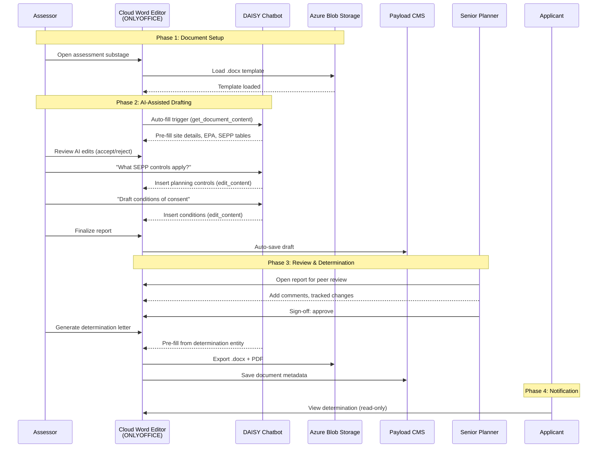
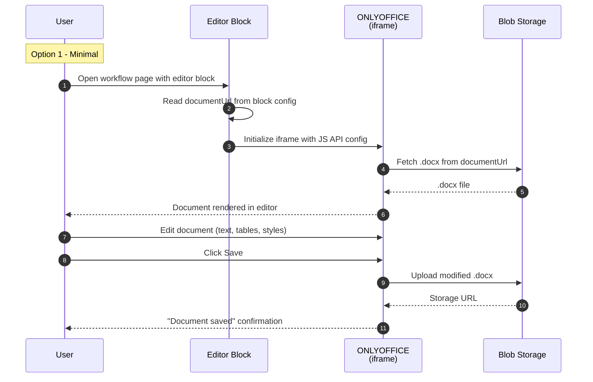
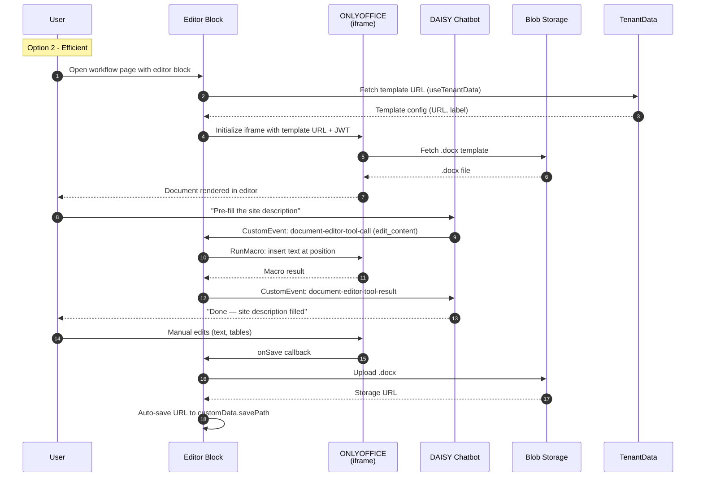
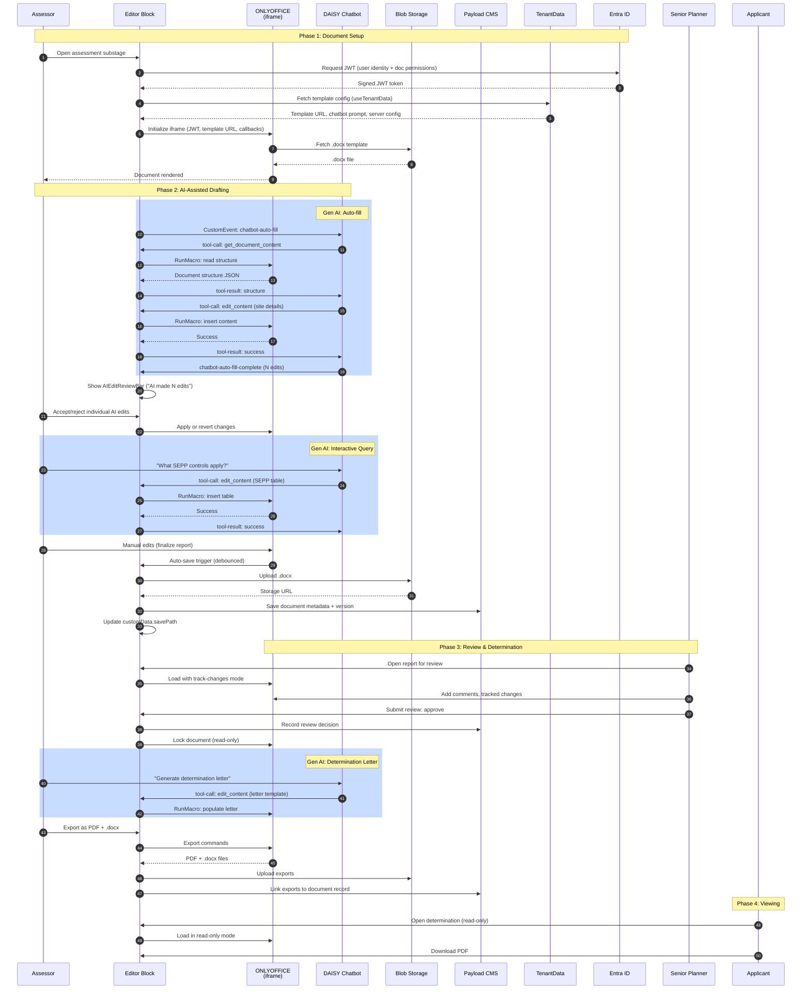
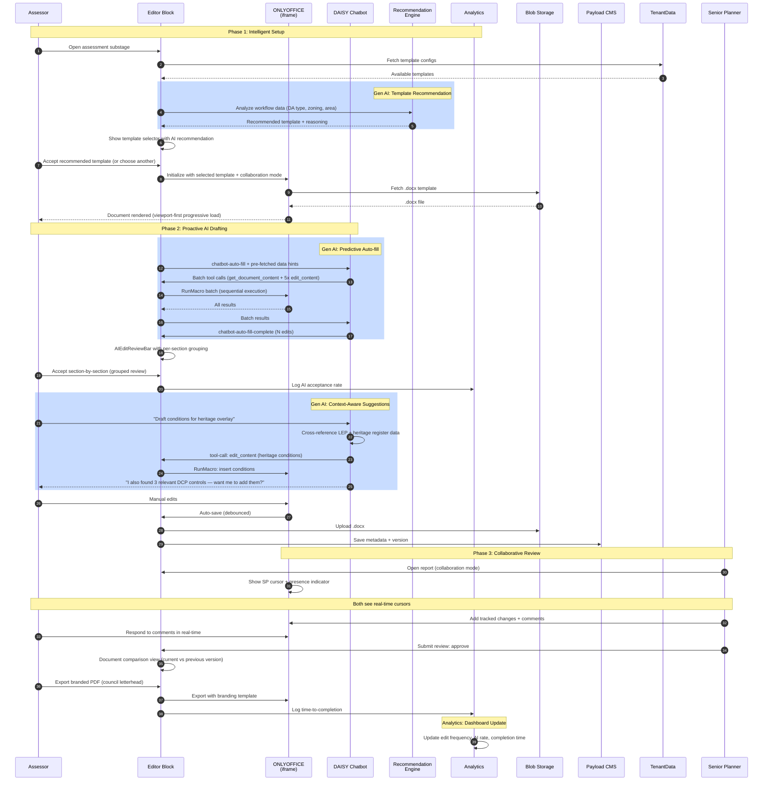
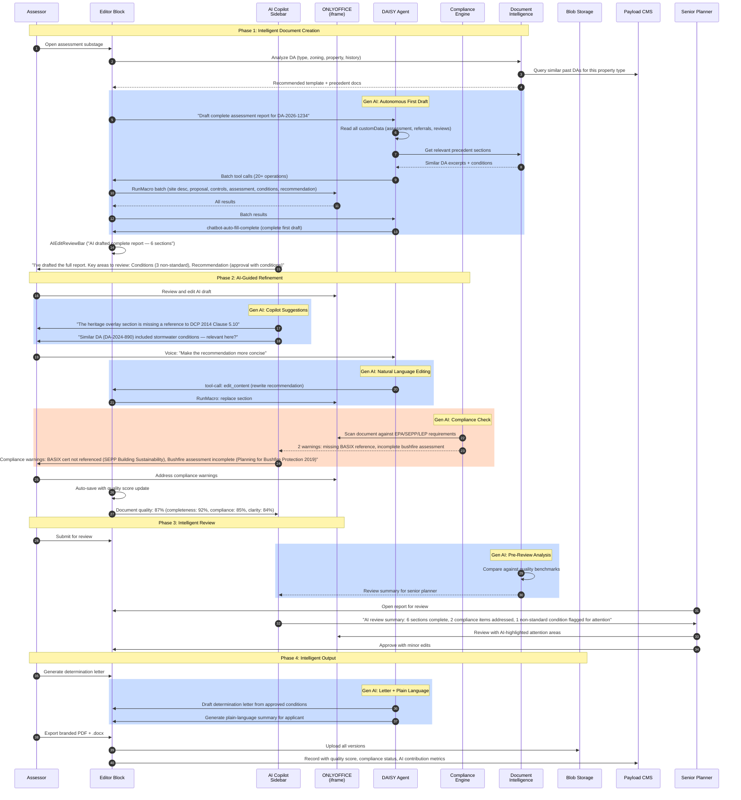

# Cloud Word Chatbot Editor — Complete Specification Package

**Prepared for**: CEO & Development Team  
**Date**: 4 March 2026  
**Status**: Specification Complete — Ready for Planning  
**Document Count**: 13 source documents consolidated  

## Document Structure

| Section | Description | Page |
|---------|-------------|------|
| 1. Executive Discovery | Business problem, target users, value proposition | 2 |
| 2. Deep Research & Market Analysis | 12-option evaluation, cost analysis, deployment paths | 5 |
| 3. Codebase Research | Where to implement, patterns to follow, integration points | 20 |
| 4. Customer Journey | End-to-end user journey with sequence diagram | 30 |
| 5. Feature Specification | User stories, functional requirements, success criteria | 33 |
| 6. Implementation Options | 5 options from Minimal (1 day) to Innovative (2 months) | 42 |
| 7. Business Scenarios | 52 detailed scenarios across 10 categories | 52 |
| 8. Requirements Checklist | Specification quality validation | 95 |

## Key Decision Summary

| Decision | Choice | Rationale |
|----------|--------|-----------|
| Editor Engine | ONLYOFFICE Document Server | Best .docx fidelity (95%), most Word-like UI, self-hosted |
| Architecture | Universal, use-case agnostic | Serves 10,000+ tenants; zero hardcoded business logic |
| Deployment | Azure App Service Container (per-region) | Fits existing Azure ecosystem (App Services, SWA); AKS overkill unless 100+ concurrent |
| AI Integration | 12-tool chatbot bridge via CustomEvent protocol | Reuses existing DAISY chatbot infrastructure |
| External Package | @eai/cloud-word-editor npm package | Drop-in integration for external consumers |
| Delivery Focus | Australian NSW government council DA assessment | Immediate need — council assessors blocked today |
| Licensing Cost | $1,950 one-time (Developer Edition Basic) | 20 concurrent connections per server, commercial license, support included |
| Architecture | Stateless editing engine + Azure Blob | OnlyOffice does NOT store files — files stay in Azure Blob Storage |
| Save Mechanism | Server-side forcesave (2-3 min timer) | No direct autosave to Blob — Editor → cache → forcesave → backend → Blob |


---

# PART 1: EXECUTIVE DISCOVERY

---


# Business Discovery: Cloud Word Chatbot Editor

## CRITICAL DESIGN CONSTRAINT

> **The Cloud Word Editor MUST be built with a UNIVERSAL, USE-CASE-AGNOSTIC
> architecture** — but today's delivery focus is the **Australian NSW government
> council DA assessment workflow** from the Configurator submodule at `./Configurator/`.
>
> The architecture uses ZERO hardcoded business logic. All domain-specific
> behaviour (templates, prompts, data bindings) comes from the Configurator's
> three-tier configuration system:
> 1. **Block config** (presentationConfig, dataConfig, businessLogic)
> 2. **TenantData** (per-tenant templates, prompts, branding)
> 3. **TenantSchemas** (dynamic field extensions per tenant)
>
> This means: build it universal, ship it for councils.
> See `Configurator/documentation/Architecture.md` for the three-tier system.

## Problem Statement

**Pain Point**: Australian NSW government council staff need to edit Word
documents (.docx) within the Configurator ecospace during the DA assessment
process, with DAISY
chatbot able to programmatically edit content via tool calls. Currently the
TipTap-based editor handles rich text but does NOT support native .docx
round-tripping with full fidelity.

**Immediate Focus**: Australian NSW government council DA assessment —
assessors draft reports, referral letters, conditions of consent, and
determination letters across the 6 assessment substages in the Configurator
workflow. The Lodgement → Assessment → Determination pipeline, EPA compliance,
SEPPs, LEPs, and conditions of consent are all **NSW-specific planning
instruments** (Environmental Planning and Assessment Act 1979). Other
Australian states (e.g. Victoria) have different planning frameworks.

**Architecture Requirement**: While councils are the delivery target, the
editor block MUST be use-case agnostic so future tenants (retail, legal,
healthcare, etc.) can adopt it via configuration only — no code changes.

**Current State**:
- Existing TipTap DocumentEditor block with 37+ features and 12 AI tool calls
- .docx import via mammoth.js (~85-90% fidelity), export via `docx` npm (~90%)
- Microsoft Word Online CANNOT be embedded (CSP frame-ancestors restriction)
- DAISY chatbot already has working tool call bridge via CustomEvents
- Configurator supports 10,000+ tenants with `usecase` field (council, retail, legal, etc.)

**Impact**: Blocking other work. NSW council assessors spend significant time
switching between platforms to edit .docx documents. External teams (DAISY
repo, third-party businesses) cannot integrate Word editing without deep
Configurator knowledge.

## Target Users

### Primary Users (Australian NSW Government Council — Immediate Delivery)

1. **Council Assessor** (tenant-staff role)
   - Drafts DA assessment reports, conditions of consent, referral letters
   - Needs Word-like UI familiarity — uses MS Word daily
   - Works across ASSESSMENT stage substages (Clearance → Determination)

2. **Senior Planner** (tenant-admin role)
   - Reviews and signs off assessment reports
   - Needs tracked changes, comments, comparison features

3. **DAISY Chatbot** (AI agent)
   - Pre-fills document templates from BusinessRequest customData
   - Responds to assessor queries ("What SEPP controls apply?")
   - Uses 12 tool calls: edit_content, edit_table, edit_styles, etc.

4. **Applicant** (tenant-viewer via B2C)
   - Views determination letters and conditions of consent (read-only)

### Secondary Users (Universal Architecture — Future Use Cases)

5. **External Developer** (third-party)
   - Integrates editor into standalone apps via npm package / web component
   - Needs <4 hour setup, <5 config props, framework-agnostic
   - Package API is domain-agnostic (no council/DA concepts exposed)

6. **Workflow Builder** (tenant-builder role)
   - Configures which workflow pages include the editor block
   - Sets block config (mode, data bindings, AI settings) per substage
   - No code deployment needed — pure configuration via admin UI

7. **Future Tenant Users** (any usecase — retail, legal, healthcare, etc.)
   - The universal architecture means any tenant-staff or tenant-admin can
     use the editor once their tenant admin configures templates and prompts
     via TenantData — no code changes needed

## Value Proposition

**Primary Value**: Eliminate context-switching for NSW council assessors editing
.docx documents during DA assessment, while enabling DAISY chatbot to
programmatically draft assessment reports with <5% formatting loss.

**Secondary Value**: Provide drop-in editor package for external consumers
(DAISY repo, third-party businesses) with <1 day integration effort.

**Architecture Value**: Built universal so future tenants (retail, legal,
healthcare) can adopt the editor via TenantData configuration only — no code
changes, no new block variants.

## Success Metrics

| Metric | Target | Measurement |
|--------|--------|-------------|
| .docx fidelity | <5% formatting loss on round-trip | Automated comparison test |
| Editor load time | <3 seconds on 10 Mbps | Performance test |
| Chatbot tool call latency | <500ms per operation | Instrumented timing |
| External integration time | <4 hours | Developer test (no Slack help) |
| Large document handling | 50+ pages without degradation | Performance test |
| Cross-browser support | Chrome, Safari, Edge (Win + Mac) | Manual verification |
| Accessibility | WCAG 2.1 AA compliance | Screen reader test (NVDA/VoiceOver) |
| Multi-tenant isolation | 10,000+ tenants isolated | Tenant isolation test |
| User usability | Standard editing task in <5 min first use | User test |
| Use-case agnosticism | Non-council tenant configures in <1 hour, zero code | Config-only test |

## Technical Context

**Recommended Solution**: ONLYOFFICE Document Server (stateless editing engine,
self-hosted as Docker container on Azure App Service)
**Basis**: Two independent AI architecture analyses both recommend ONLYOFFICE
**Reference**: `deep-research-reference.md` (12 options evaluated)
**Key Insight**: OnlyOffice is NOT like SharePoint — it's a stateless editor that
does NOT store files. Files remain in Azure Blob Storage. The Document Server only
renders and edits documents via iframe.

**Architecture Alignment** (with Configurator three-tier system):
- Editor block follows `presentationConfig` / `dataConfig` / `businessLogic` pattern
- Templates stored in TenantData `document-configuration` dataType (per tenant)
- Chatbot prompts stored in ChatBot collection (per tenant)
- Dynamic fields extensible via TenantSchemas (block target: `onlyoffice-editor`)
- Block registered without `usecase` filter — available to ALL tenant types

**Key Integration Points**:
- AI Chatbot (any ChatBot block instance) via CustomEvent protocol
- Configurator Ecospace (iframe embedding in any workflow page)
- Azure Blob Storage (document storage backend)
- Payload CMS Documents collection (metadata, versioning)
- Entra ID (B2B admin + B2C per-tenant auth)
- Existing TipTap DocumentEditor block (coexistence, not replacement)

**Constraints**:
- NO Microsoft Word add-ins — standalone web-based only
- NO desktop app dependency — browser-only
- Azure-first: deploy on App Service Container (recommended) or Container Instance
- Multi-region data governance (per-region Document Server instances)
- WCAG 2.1 AA accessibility (government requirement, good practice for all)
- ZERO hardcoded business logic in the block code
- No direct autosave to Azure Blob — all saves flow through Document Server cache
  then forcesave/callback to backend

## Competitive Analysis

**Status**: Researched (see deep-research-reference.md)
- 12 options evaluated: ONLYOFFICE, CKEditor 5, Aspose.Words, PrizmDoc, Syncfusion, Apryse, Collabora, TX Text Control, Zoho Writer, Google Docs, SuperOffice, Hancom
- ONLYOFFICE selected: best balance of .docx fidelity, cost, external integration, Azure deployment

## Discovery Decisions

| Decision | Choice | Rationale |
|----------|--------|-----------|
| Delivery Focus | Australian NSW government council DA assessment | Immediate need — assessors blocked today |
| Architecture | Universal block (use-case agnostic) | Configurator serves 10,000+ tenants; can't hardcode council logic |
| User Target | NSW council assessors + DAISY chatbot (now); any tenant (future) | Build universal, ship for councils |
| Value Metric | .docx fidelity + tool call latency | Core technical differentiators |
| Editor Solution | ONLYOFFICE Document Server | Best fidelity/cost/integration balance |
| Deployment | Azure App Service Container (per-region) | Fits existing Azure ecosystem; AKS overkill unless 100+ concurrent |
| Integration Pattern | npm package + web component (domain-agnostic API) | External consumers need drop-in integration |
| Config System | Three-tier (block config + TenantData + TenantSchemas) | Matches Configurator architecture — no hardcoded domain logic |
| Licensing | Developer Edition Basic ($1,950 one-time) | 20 concurrent connections, commercial license, no AGPL |

---

# PART 2: DEEP RESEARCH & MARKET ANALYSIS

---

# [POC] Cloud Word Document Editing — Deep Research & Market Analysis

> **Last updated**: March 2026
> **Status**: Research complete — ready for POC decision
> **Parent doc**: `POC-Cloud-Word-Editor.md`

---

## Table of Contents

- [Executive Summary](#executive-summary)
- [Problem Statement](#problem-statement)
- [UI/UX Requirements (Key Feature)](#uiux-requirements-key-feature)
- [Azure-First Architecture Requirement](#azure-first-architecture-requirement)
- [Data Governance Model](#data-governance-model)
- [Critical Finding: Microsoft Word Online Cannot Be Embedded](#critical-finding-microsoft-word-online-cannot-be-embedded)
- [Deep Research: Market Landscape](#deep-research-market-landscape)
- [All 12 Options Compared](#all-12-options-compared)
- [Open-Source Project Health](#open-source-project-health)
- [Companies Already Doing This](#companies-already-doing-this)
- [UI/UX Deep Comparison](#uiux-deep-comparison)
- [Cost Analysis at Scale](#cost-analysis-at-scale)
- [Azure Deployment Paths](#azure-deployment-paths)
- [Dynamic Injection + Word Online Hybrid Pattern](#dynamic-injection--word-online-hybrid-pattern)
- [Top 3 Recommendations](#top-3-recommendations)
- [Honest Assessment: Can We Do This?](#honest-assessment-can-we-do-this)
- [POC Success Criteria](#poc-success-criteria)
- [Research Sources](#research-sources)

---

## Executive Summary

We need an embeddable Word document (.docx) editor for the Configurator ecospace with chatbot (DAISY) programmatic editing. After deep research into every viable open-source project, commercial SDK, and Microsoft-native option:

- **Microsoft Word Online CANNOT be embedded** in a custom web app (CSP restriction, confirmed by Microsoft, no roadmap to change)
- **12 viable alternatives exist** — ranging from free open-source to $100K+/yr commercial SDKs
- **All deploy cleanly on Azure** (except Zoho and Google which require non-Azure infrastructure)
- **UI/UX quality varies dramatically** — OnlyOffice is the most Word-like, Syncfusion is the most developer-friendly, Apryse has the best accessibility compliance
- **A hybrid approach** (embedded editor for daily work + Word Online redirect for high-fidelity editing) is likely the best architecture
- **This IS achievable** with our constraints — no single constraint eliminates all options

---

## Problem Statement

We need to embed a cloud-based Word document (.docx) editing experience directly within the Configurator ecospace, where users can view and edit Word documents without leaving the platform, and the DAISY chatbot can programmatically edit document content on-the-fly via tool calls.

**UI/UX is a key feature** — the editing experience must feel polished, modern, and familiar to government staff who use Microsoft Word daily. A clunky or dated interface is a non-starter.

The solution must be packaged so that external entities (e.g., the DAISY repo or any third-party business) can integrate the Word editing capability with minimal setup — it should be a drop-in integration, not a complex infrastructure project.

---

## UI/UX Requirements (Key Feature)

UI/UX quality is a **first-class requirement**, not an afterthought.

### Familiarity

- The editor UI should closely resemble Microsoft Word's ribbon interface — council staff should feel immediately productive without training
- Keyboard shortcuts must be compatible with Word (Ctrl+B, Ctrl+I, Ctrl+Z, Ctrl+S, etc.)
- Print layout / page view must be faithful — headers, footers, page breaks, margins, columns all visible in WYSIWYG mode

### Customisation

- Must support theming (light/dark mode minimum) to match Configurator ecospace design tokens
- Toolbar must be configurable — show/hide features, rearrange tools, add custom buttons (e.g., "Ask DAISY" button)
- Must support white-labelling for external consumers

### Accessibility

- WCAG 2.1 AA minimum (government procurement requirement)
- Full keyboard navigation
- Screen reader support (ARIA labels, semantic structure)
- High-contrast mode
- Formal VPAT / accessibility conformance report preferred for procurement

### Chatbot Integration UX

- When DAISY chatbot makes edits, the user must see real-time visual feedback (insertion animation, highlight, or change tracking)
- Undo/redo must work correctly with programmatic edits — users must be able to undo chatbot changes
- Grouped undo: multiple rapid chatbot edits should be undoable as a single action

### Mobile / Tablet

- Must support responsive viewing on iPad/tablet (editing is a bonus, not a requirement)
- Touch-friendly controls for basic operations

---

## Azure-First Architecture Requirement

We are a Microsoft Azure shop. All solutions must be evaluated through this lens:

### Preferred: Deploys natively on Azure

- Azure Kubernetes Service (AKS), Azure Container Apps, or Azure App Service
- Azure Blob Storage or SharePoint for document storage
- Azure CDN for static assets
- Entra ID for authentication
- Azure Monitor for observability

### Acceptable: Runs on Azure with minor adaptation

- Docker containers that deploy to AKS/ACA without modification
- Client-side JavaScript SDKs that serve from Azure CDN
- Solutions available on Azure Marketplace

### Requires justification: Deviates from Azure

If a solution requires non-Azure infrastructure (e.g., vendor-hosted SaaS outside Azure), it must:
1. Clearly document what runs outside Azure and why
2. Demonstrate that data governance requirements are still met per-region
3. Provide a migration path back to Azure-hosted infrastructure
4. Justify the deviation with significant capability advantages

---

## Data Governance Model

### Multi-Region via Azure (NOT single-region lock)

We are **NOT constrained to Azure Australia East only**. Our data governance model follows the customer's region. When we expand to other countries, data will be governed to that region via Azure Cloud:

| Customer Region | Azure Region | Data Residency |
|-----------------|-------------|----------------|
| Australia | Azure Australia East / Southeast | Australian data sovereignty |
| United Kingdom | Azure UK South / West | UK GDPR + data sovereignty |
| European Union | Azure West Europe / North Europe | EU GDPR, Schrems II compliant |
| United States | Azure East US / West US | US data residency |
| Canada | Azure Canada Central / East | Canadian data sovereignty |
| New Zealand | Azure Australia East (closest) or NZ region when available | NZ data sovereignty |

**Implementation**: The chosen solution must support multi-region deployment from day one. Client-side SDKs (Syncfusion, Apryse, Nutrient, docx-js-editor) have an inherent advantage — document processing happens in the user's browser, so data never leaves the device regardless of region. Server-side solutions (OnlyOffice, Collabora) require a document server instance per region.

---

## Critical Finding: Microsoft Word Online Cannot Be Embedded

**There is NO Microsoft-approved way to embed a fully editable Word Online experience inside a custom web application's own domain as of March 2026.**

| Source | Verdict | Link |
|--------|---------|------|
| Microsoft Q&A (2024) | "Embedding Microsoft Word in edit mode within an iframe hosted outside of SharePoint is **not supported by design**" | [Link](https://learn.microsoft.com/en-us/answers/questions/5669186/is-there-a-supported-way-to-embed-editable-sharepo) |
| Microsoft Q&A (2023) | "There is no supported configuration at tenant-level to allow this" | [Link](https://learn.microsoft.com/en-us/answers/questions/860742/how-to-embed-office-365-word-document-in-edit-mode) |
| SharePoint GitHub Issue #10526 | Closed as **by-design**. No roadmap item to change. | [Link](https://github.com/sharepoint/sp-dev-docs/issues/10526) |
| WOPI Documentation | Requires Cloud Storage Partner Program membership (ISVs only) | [Link](https://learn.microsoft.com/en-us/microsoft-365/cloud-storage-partner-program/online/) |

### Every Microsoft path evaluated

- **SharePoint Embedded** (GA): Storage via Graph API, editing opens in a **new tab/popup**, NOT embedded. Read-only preview CAN be embedded via iframe.
- **WOPI / Cloud Storage Partner Program**: Only available to ISVs whose primary business is cloud storage. Not open to enterprise app developers.
- **Microsoft Graph API**: File management only — cannot edit content inside a .docx programmatically (insert paragraphs, format text, etc.). You must download, modify with a library, and re-upload.
- **Office Add-ins / Office.js**: Run INSIDE Word Online/Desktop — the user must be in Word. Does NOT let you embed Word inside YOUR app.
- **Loop Components**: Only embeddable within M365 apps (Teams, Outlook), not custom web apps.
- **M365 + Next.js + Azure Entra ID**: [Guides like this one](https://medium.com/@sagar.bantu30/microsoft-365-integration-with-next-js-a-complete-guide-using-azure-entra-id-6908e76607b1) cover authentication with Entra ID and accessing Graph API. Authentication is solved (we already use Entra ID). The blocker is embedding the editable Word UI, which auth does not unlock.
- **iframe embed code from Word Online's "Share → Embed"**: Generates a **read-only** embed only. Does NOT allow editing.

**Bottom line**: Microsoft does not offer an embeddable Word editor. We MUST use a third-party solution for embedded editing. The good news: all viable alternatives deploy cleanly on Azure.

---

## Deep Research: Market Landscape

### All 12 Options Compared

| # | Solution | Type | .docx Fidelity | Chatbot API | Azure Deploy | Effort | Annual Cost (est. 500 users) | External Integration | UI/UX | WCAG |
|---|----------|------|----------------|-------------|-------------|--------|------------------------------|---------------------|-------|------|
| 1 | **[OnlyOffice Docs](https://api.onlyoffice.com/)** | Self-hosted server + iframe | **95%** | JS API + REST + Document Builder | Yes (AKS/Docker, [Azure Marketplace](https://azuremarketplace.microsoft.com/en-us/marketplace/apps/vmlabinc1613642184700.onlyoffice-document-server)) | Med (3-4 wk) | **$4,500–$15,000** | Medium — Docker server | **Excellent** — most Word-like | No formal cert |
| 2 | **[Collabora Online](https://www.collaboraonline.com/)** | Self-hosted server + iframe | **85%** | WOPI + postMessage | Yes (AKS/Docker) | Med (3-4 wk) | **$10,000–$25,000** | Medium — Docker server | Good — 2025 UI refresh | Improving |
| 3 | **[Syncfusion Document Editor](https://www.syncfusion.com/docx-editor-sdk/javascript-docx-editor)** | JS component (client-side) | **90%** | **Full programmatic API** | N/A (client-side) | **Low (1-2 wk)** | **$4,645–$15,000** (unlimited flat-fee) | **Easy — npm install** | **Strong** — full theming | Claimed 2.2 AA |
| 4 | **[Apryse WebViewer](https://apryse.com/capabilities/docx-editor)** | JS component (client-side) | **85%** | **Full programmatic API** | N/A (client-side) | **Low (1-2 wk)** | **$30,000–$100,000+** | **Easy — npm install** | Strong — modular UI | **WCAG 2.2 AA** |
| 5 | **[CKEditor 5](https://ckeditor.com/)** | JS editor + cloud conversion | **70%** (HTML-based, not native DOCX) | Full editor API | Partial (on-prem converter available) | Low-Med (2-3 wk) | **$5,000–$50,000** (usage-based) | **Easy — npm install** | Excellent UX (but rich text, NOT Word) | **WCAG 2.2 AA + VPAT** |
| 6 | **[SharePoint Embedded](https://learn.microsoft.com/en-us/sharepoint/dev/embedded/overview)** | Microsoft API + popup edit | **100%** (native Word) | Graph API (file-level only) | Azure-native | High (4-6 wk) | **M365 licensing ($6–$22/user/mo)** + Azure | Hard — M365 per user | N/A — editing in new tab | N/A (Microsoft UI) |
| 7 | **[TX Text Control](https://www.textcontrol.com/)** | .NET server + JS client | **90%** | Full .NET + JS API | Yes ([Azure App Service](https://www.textcontrol.com/blog/2025/03/26/deploying-the-tx-text-control-document-editor-in-an-asp-net-core-web-app-to-azure-app-services/)) | Med (3-4 wk) | **$14,000–$20,000** | Medium — .NET backend | Very Good — Word-inspired ribbon | Section 508 |
| 8 | **[Nutrient](https://www.nutrient.io/sdk/javascript-docx-editor/)** (formerly PSPDFKit) | JS SDK (client-side) | **80%** | Programmatic API | N/A (client-side) | Low-Med (2-3 wk) | **$30,000–$100,000+** (custom quote) | **Easy — npm install** | Strong — clean viewer design | Assistive tech compatible |
| 9 | **[Zoho Office Integrator](https://www.zoho.com/officeintegrator/)** | Cloud SaaS + iframe | **85%** | REST + JS API | **NO** (Zoho-hosted, data leaves Azure) | Low (1-2 wk) | **$5,000–$30,000** (per-API-call) | Easy — iframe embed | Good — Zoho-branded | Unknown |
| 10 | **[SuperDoc](https://www.superdoc.dev/)** | JS library (ProseMirror-based, client-side) | **75%** | Full JS API (60+ extensions) | N/A (client-side) | Low (1-2 wk) | Custom (AGPL free, commercial license required) | **Easy — npm install** | Good — modern, newer project | Unknown |
| 11 | **[docx-js-editor](https://github.com/eigenpal/docx-js-editor)** | React component (ProseMirror-based, client-side) | **75%** | Full JS API + plugin system | N/A (client-side) | **Low (1 wk)** | **Free (MIT license)** | **Easiest — npm install, zero cost** | Good — modern, TypeScript-native | Unknown |
| 12 | **Word Online Redirect** (not embedded) | Redirect to Word for the Web | **100%** | Graph API for pre-population only | Azure-native (M365) | Med (2-3 wk) | **M365 licensing** | Easy — just a URL | Excellent — it IS Word | N/A (Microsoft UI) |

### Solutions That Require Deviation From Azure

| Solution | What's Outside Azure | Risk | Mitigation |
|----------|---------------------|------|------------|
| **Zoho Office Integrator** | Document processing on Zoho servers (India/US data centres) | Data residency violation | None — cannot force Zoho to Azure |
| **CKEditor Cloud Services** | Collaboration server hosted by CKEditor | Low (optional feature) | On-prem server available (Enterprise plan) |
| **Google Docs** | Google Cloud | Data residency violation | None — eliminated |

**All other options (1–8, 10–12) can run 100% on Azure.**

### Eliminated Options

- **Google Docs Embed**: Data residency issues, converts to Gdoc format (~60% fidelity), not Azure-native
- **Aspose.Words Cloud**: API only, no interactive editor UI
- **MESCIUS/GrapeCity Documents**: Server-side API only, no browser editor ([developer.mescius.com](https://developer.mescius.com/document-solutions))
- **Docxtemplater** ([docxtemplater.com](https://docxtemplater.com/)): Template-based .docx generation from JSON data — not an interactive editor
- **TinyMCE**: HTML editor with limited .docx support (~65% fidelity)

---

## Open-Source Project Health (March 2026)

| Project | GitHub Stars | Contributors | Total Commits | Last Release | License | Docker |
|---------|-------------|-------------|--------------|-------------|---------|--------|
| **[OnlyOffice DocumentServer](https://github.com/ONLYOFFICE/DocumentServer)** | ~6,300 | ~22 (core team) | 533 | v9.3.0 (Feb 2026) | AGPL v3.0 | Yes — `onlyoffice/documentserver` |
| **[Collabora Online](https://github.com/CollaboraOnline/online)** | ~3,000 | 347 | 33,817 | 25.04.7 (Dec 2025) | MPL v2.0 | Yes — `collabora/code` |
| **[docx-js-editor](https://github.com/eigenpal/docx-js-editor)** | ~441 | Small team | 444 | v0.0.16 (Feb 2026) | MIT | N/A — client-side only |
| **[SuperDoc](https://github.com/superdoc-dev/superdoc)** | ~334 | Small team | 4,566 | v1.16.0 (Feb 2026) | AGPL v3.0 | N/A — client-side only |

**Key observations:**
- OnlyOffice has the most mature server-based OSS offering but AGPL Community Edition is **capped at 20 concurrent connections**
- Collabora has the most contributors (347) and commits (33,817) — the LibreOffice engine is battle-tested
- docx-js-editor is a promising **MIT-licensed** React+ProseMirror component with zero server dependencies — ideal for POC and external integration
- SuperDoc is similar to docx-js-editor (ProseMirror-based, client-side) but uses AGPL license

**Notable March 2026 development**: The Document Foundation has [de-atticized LibreOffice Online (LOOL)](https://www.theregister.com/2026/03/02/libreoffice_online_deatticized/), potentially reviving it as a separate project from Collabora. Not yet available for download but worth monitoring.

---

## Companies Already Doing This

### Government deployments

| Organization | Solution | Scale | Details |
|---|---|---|---|
| **German Federal Ministry of the Interior (BMI)** | Collabora Online | National | [openDesk project](https://www.collaboraonline.com/blog/opendesk-collabora-online-brings-digital-freedom-to-european-government/) — EU-wide government office infrastructure |
| **French General Secretariat of Economic Ministries** | OnlyOffice + Alfresco | National | Integrated OnlyOffice with Alfresco DMS |
| **Lao Government** | OnlyOffice + Nextcloud | National | Deployed across government agencies |
| **City of Hopewell, Virginia (USA)** | OnlyOffice Workspace | ~500 employees | Private infrastructure deployment |
| **University of Lille (France)** | Collabora Online + Nextcloud | 70,000+ users | [Implemented by Arawa](https://www.collaboraonline.com/blog/arawa-implementing-collabora-online-university-of-lille/) |
| **University of Nantes (France)** | OnlyOffice + Nextcloud | University-wide | [UNCloud platform](https://www.onlyoffice.com/blog/2020/05/how-the-university-of-nantes-deployed-its-online-collaboration-platform-based-on-nextcloud-and-onlyoffice) |

### Enterprise / SaaS platform integrations

| Company | Solution | Context |
|---|---|---|
| **Nextcloud** | Collabora Online or OnlyOffice | [Nextcloud Office](https://nextcloud.com/office/) bundles Collabora |
| **Dropbox** | Apryse (PDFTron) | [Built PDF editing](https://apryse.com/blog/customers/dropbox) using Apryse SDK |
| **LexisNexis** | SharePoint Embedded | [AI-ready document infrastructure](https://techcommunity.microsoft.com/blog/spblog/sharepoint-showcase-using-sharepoint-embedded-to-create-ai-ready-infrastructure/4496677) for legal workflows |
| **Spielberg Solutions (German ECM)** | Apryse | 7,000+ installations of FileDirector ECM |
| **Talkspirit (French SaaS)** | OnlyOffice | [Enterprise social network](https://www.onlyoffice.com/blog/2020/09/onlyoffice-brings-its-powerful-document-editors-to-the-enterprise-social-network-talkspirit) with real-time co-editing |
| **Eigenpal** | docx-js-editor | Built their own OSS editor for document workflow templates |

**Key insight**: Government bodies overwhelmingly choose OnlyOffice or Collabora for sovereign/self-hosted deployments. Commercial SaaS platforms split between OnlyOffice (Word fidelity) and Apryse (multi-format SDK). **No one has successfully embedded Microsoft Word Online editing inside their own app** — it's not technically possible.

---

## UI/UX Deep Comparison

### Word-Familiarity Ranking

| Rank | Editor | Word Resemblance | Training Overhead | Demo |
|------|--------|-------------------|-------------------|------|
| 1 | **OnlyOffice** | **Very High** — ribbon tabs, OOXML native, nearly identical layout | **Minimal** — staff productive immediately | [Try it (no signup)](https://www.onlyoffice.com/see-it-in-action) |
| 2 | **TX Text Control** | High — MS Word-inspired ribbon bar, pixel-perfect rendering | Low | [Demo](https://demos.textcontrol.com/) |
| 3 | **Collabora Online** | Moderate-High — LibreOffice NotebookBar, 2025 refresh | Low-Moderate | [Via Nextcloud](https://nextcloud.com/office/) |
| 4 | **Syncfusion** | Moderate — page-layout WYSIWYG, toolbar-based (no ribbon) | Moderate | [Demo](https://ej2.syncfusion.com/demos/document-editor/default/) |
| 5 | **docx-js-editor** | Moderate — clean toolbar, modern React design | Moderate | [Eigenpal platform](https://eigenpal.com) |
| 6 | **Nutrient** | Moderate — page-based layout, Google Docs aesthetic | Moderate | [Demo](https://www.nutrient.io/demo/) |
| 7 | **Apryse** | Low-Moderate — SDK UI, document platform feel | Moderate-High | [Demo](https://showcase.apryse.com/) |
| 8 | **CKEditor 5** | Low — flat toolbar, HTML-oriented, NOT a Word processor | High | [Demo](https://ckeditor.com/ckeditor-5/demo/) |

### Print Layout / Page View Fidelity

| Editor | Print Layout | Headers/Footers | Page Breaks | Columns | Tables |
|--------|-------------|-----------------|-------------|---------|--------|
| **OnlyOffice** | Excellent | Yes | Yes | Yes | Full support |
| **Collabora** | Excellent | Yes | Yes | Yes | Full support |
| **TX Text Control** | Excellent | Yes | Yes | Yes | Full support |
| **Syncfusion** | Very Good | Yes | Yes | Yes | Full support |
| **Apryse** | Good | Yes | Yes | Yes | Good |
| **Nutrient** | Good | Yes | Yes | Limited | Good |
| **docx-js-editor** | Good | Yes | Yes | Limited | Yes |
| **SuperDoc** | Good | Yes | Yes | Limited | Yes |
| **CKEditor 5** | **Poor** — no true page view | No | Limited | No | Basic |

### Customization & Theming

| Capability | OnlyOffice | Syncfusion | Apryse | docx-js-editor | Collabora | TX Text Control | Nutrient |
|---|---|---|---|---|---|---|---|
| **Toolbar customization** | Yes (Dev Ed.) | Excellent (full API) | Excellent (modular) | Yes (plugin arch.) | Limited | Yes (ribbon elements) | Yes |
| **Theming** | Light/Dark/Custom | Material, Bootstrap, Tailwind, Fluent | Full CSS | CSS customizable | Limited | HTML5/CSS | Adjustable |
| **White-labeling** | Yes (Dev Ed.) | Yes (commercial) | Yes (open-source UI) | Yes (MIT) | Enterprise only | Yes | Yes |
| **Responsive / mobile** | Fair | Good (view only on mobile) | Fair | Good | Strong (mobile app) | Fair | Good |

### Accessibility Compliance

| Editor | Formal WCAG Claim | VPAT Available | Safe for Gov Procurement? |
|--------|-------------------|----------------|--------------------------|
| **CKEditor 5** | **WCAG 2.2 AA + Section 508** | **Yes** | **Yes** — strongest |
| **Apryse** | **WCAG 2.2 AA** | **Yes** | **Yes** |
| **Syncfusion** | WCAG 2.2 AA claimed, axe-core tested | No | Likely with remediation |
| **OnlyOffice** | No formal certification | No | **Risk** — may block procurement |
| **Collabora** | 100+ improvements in 25.04, no formal cert | No | Possible with caveats |
| **TX Text Control** | Section 508 claimed | No | Needs verification |
| **Nutrient** | Assistive tech compatible | Unknown | Needs verification |
| **docx-js-editor** | No claims | No | Needs evaluation |
| **SuperDoc** | No claims | No | Needs evaluation |

### Real-Time Collaboration

| Editor | Google Docs-style co-editing | Quality |
|---|---|---|
| **OnlyOffice** | Yes — "Fast" mode (real-time) + "Strict" mode (lock-based) | **Excellent** — mature, 40+ integrations |
| **Collabora** | Yes — cursor visibility, "Follow the Editor" feature | **Excellent** — strong for meetings |
| **CKEditor 5** | Yes — via CKEditor Cloud Services | Excellent for rich text |
| **Syncfusion** | Yes — OT algorithm, SignalR-based | Good — requires dev setup (Redis + SignalR) |
| **SuperDoc** | Yes — via Yjs CRDT | Good — newer |
| **docx-js-editor** | Plugin architecture supports it | Emerging |
| **Apryse** | Partial — annotations/comments focus | Moderate |
| **TX Text Control** | Limited — annotations/stamps | Basic |

### Chatbot/AI Integration UX

| Editor | AI Features | Programmatic Edit API | Grouped Undo for AI Edits |
|---|---|---|---|
| **OnlyOffice** | Built-in AI plugin (ChatGPT, Claude, Gemini, Mistral, Ollama) | Document Builder API + JS API | Individual undo steps |
| **Syncfusion** | Blazor AI (Rephrase, Translate, Grammar) | `editor.insertText()`, full API | **Yes — grouped undo/redo** |
| **CKEditor 5** | AI Chat sidebar (OpenAI, Azure, Bedrock) | `model.change()` batch ops | Yes — batch operations |
| **Apryse** | Server-side AI (classification, extraction) | Full programmatic SDK | Programmatic undo stack |
| **docx-js-editor** | None built-in (extensible via plugins) | Plugin architecture | Standard undo/redo |
| **Nutrient** | TypeScript API, template-driven generation | Full API | Standard undo/redo |

---

## Cost Analysis at Scale (100+ Tenants, ~500 Concurrent Users)

### Annual Cost Comparison

| Solution | Licensing Model | License Cost | Azure Infra Cost | **Total Annual Est.** | M365 Required? |
|---|---|---|---|---|---|
| **docx-js-editor** | MIT (free) | $0 | $2K–4K (app hosting) | **$2K–$4K/yr** | No |
| **OnlyOffice Community** | AGPL (free, 20 connection cap) | $0 | $600–$1,200/yr (App Service Container) | **$600–$1,200/yr** | No (AGPL requires open-sourcing if embedded) |
| **OnlyOffice Developer Ed.** | One-time purchase | $1,950–$4,500 (one-time) | $600–$1,200/yr (App Service Container) | **$2,550–$5,700 first yr; $600–$1,200/yr ongoing** | No |
| **Syncfusion** | Unlimited flat-fee | $4,645–$15,000 | $2K–5K (app hosting) | **$7K–$20K/yr** | No |
| **CKEditor 5** | Per-editor-load | $5,000–$50,000 | $2K–4K | **$7K–$54K/yr** | No |
| **SuperDoc** | AGPL / commercial | Custom | $2K–4K (app hosting) | **Custom** | No |
| **Collabora Online** | Per-user/year | $10,000–$25,000 | $6K–10K (AKS) | **$16K–$35K/yr** | No |
| **TX Text Control** | Per-dev + OEM runtime | $14,000–$20,000 | $4K–6K (.NET) | **$18K–$26K/yr** | No |
| **Apryse** | Custom/consumption | $30,000–$100,000+ | $2K–4K | **$32K–$104K/yr** | No |
| **Nutrient** | Custom quote | $30,000–$100,000+ | $2K–4K | **$32K–$104K/yr** | No |
| **Zoho Office Integrator** | Per-API-call | $5,000–$30,000 | $1K–2K | **$6K–$32K/yr** | No (data leaves Azure) |
| **SharePoint Embedded** | M365 licensing + Azure | M365: $36K–$132K/yr (500 users) | ~$14K/yr | **$50K–$146K/yr** | **Yes** |

### Cost-Effectiveness Ranking

1. **docx-js-editor** ($2K–$4K/yr) — Free MIT license, client-side only. Risk: newer project, less proven at scale
2. **Syncfusion** ($7K–$20K/yr) — Best value commercial option, unlimited flat-fee, no per-user charges. Free community license for <$1M revenue
3. **OnlyOffice Developer Ed.** ($1,950 one-time + ~$600-$1,200/yr hosting) — Best value self-hosted, white-label included, most Word-like UI. Stateless engine — files stay in Azure Blob.
4. **Collabora Online** ($16K–$35K/yr) — Strong government adoption, LibreOffice engine fidelity
5. **TX Text Control** ($18K–$26K/yr) — Best for .NET shops, perpetual licensing available
6. **Apryse / Nutrient** ($32K–$104K/yr) — Premium; best for combined PDF+DOCX, strongest accessibility

---

## OnlyOffice Complete Product Landscape

OnlyOffice offers 5 distinct products. Only one fits the Configurator's
embedding use case.

### Product Comparison — Which Fits?

| Product | What It Is | Embed Into Your App? | License | Starting Price |
|---------|-----------|---------------------|---------|---------------|
| **Docs Community** | Free open-source editor | AGPL copyleft — requires open-sourcing your code if embedded | AGPL v3 | Free (20 connections max) |
| **Docs Enterprise** | Commercial editor for existing DMS connectors (Nextcloud, SharePoint, Confluence) | Pre-built connectors only — NOT for custom app embedding | Commercial (annual) | $1,500/yr (50 connections) |
| **Docs Developer** | **Editor designed for embedding into YOUR product** | **Yes — this is its purpose**. White-label, Document Builder API, commercial license | Commercial (one-time perpetual) | $1,950 (one-time) |
| **DocSpace** | Room-based document collaboration platform | No — standalone platform with its own UI | Free + $20/admin/mo | Free (Startup) |
| **Workspace** | Full office suite: docs, CRM, mail, projects, calendar | No — standalone suite | Commercial (one-time) | $2,200 (50 users) |

**Best fit: Docs Developer Edition** — the ONLY product designed for integrators
who embed the editor into their own application.

### Why NOT the Other Products

- **Community Edition**: AGPL v3 copyleft — embedding in Configurator legally
  requires open-sourcing the Configurator. Dev/testing only.
- **Enterprise Edition**: For organizations using OnlyOffice with existing DMS
  via pre-built connectors. Annual license. Not for custom embedding.
- **DocSpace**: Standalone collaboration rooms. Different product category.
- **Workspace**: Full office suite (docs + CRM + mail + projects). Overkill,
  not embeddable.

### Docs Developer Edition — Full Pricing

**On-Premises (one-time perpetual license):**

| Tier | Price (one-time) | Support Requests | Response Time | Account Engineer |
|------|-----------------|-----------------|--------------|-----------------|
| Basic | $1,950 | 5 | 48 hours | No |
| Plus | $3,500 | 10 | 24 hours | No |
| Premium | $4,500 | 20 | 12 hours | Yes |

- 20 concurrent connections per server
- All major upgrades and minor updates included
- White-label customization (logos, branding, menu hiding)
- Document Builder service (programmatic macro editing)
- Conversion service (format conversion)
- Mobile web editors
- Phone support on all tiers

**Cloud (pay-as-you-go):**
- $12/user/month (10-user minimum)
- OnlyOffice hosts the Document Server — no container to manage

### Docs Enterprise Edition — Full Pricing (For Reference)

| Support | 50 Connections | 100 Connections | 200 Connections |
|---------|---------------|----------------|----------------|
| Basic (1yr) | $1,500/yr | $3,000/yr | $6,000/yr |
| Plus (1yr) | $2,100/yr | $4,080/yr | $7,920/yr |
| Premium (1yr) | $2,400/yr | $4,680/yr | $8,880/yr |

- Annual license (3-year and lifetime options at higher rates)
- Private Rooms (E2E encryption) — not in Community
- Multi-server clustering
- Pre-built connectors for Nextcloud, Moodle, Confluence, SharePoint

### Feature Differences Across Editions

| Feature | Community | Enterprise | Developer |
|---------|-----------|-----------|-----------|
| Core editors (docs, sheets, slides, forms, PDF) | Yes | Yes | Yes |
| Document Builder API | Yes | Yes | Yes |
| JWT protection | Yes | Yes | Yes |
| Co-editing (real-time + strict) | Yes | Yes | Yes |
| Track changes, comments, version history | Yes | Yes | Yes |
| Document comparison/combining | Yes | Yes | Yes |
| Plugins and macros | Yes | Yes | Yes |
| Mobile web editors | Yes | Yes | Yes |
| Private Rooms (E2E encryption) | **No** | Yes | Yes |
| Cache lifetime control | **No** | Yes | Yes |
| White-label customization | **No** | **No** | **Yes** |
| Commercial (non-AGPL) license | **No** | Yes | Yes |
| Concurrent connections | 20 max | 50/100/200 | 20 per server |
| Support | GitHub/forum | Basic/Plus/Premium | Basic/Plus/Premium |
| License type | AGPL v3 | Annual/3yr/lifetime | **One-time perpetual** |

### DocSpace — Full Pricing (For Reference)

| Plan | Price | Admins | Users/Guests | Storage | Rooms |
|------|-------|--------|-------------|---------|-------|
| Startup (Free) | $0 | Up to 3 | Unlimited | 2 GB | Up to 12 |
| Business | $20/admin/month | Unlimited | Unlimited | 250 GB/admin | Unlimited |
| Enterprise | Custom (self-hosted) | Unlimited | Unlimited | Unlimited | Unlimited |

### Workspace — Full Pricing (For Reference)

| Edition | Price (one-time, 50 users) | Support | Modules |
|---------|---------------------------|---------|---------|
| Enterprise | $2,200 | Basic (48hr) | Docs, Groups, Mail, Talk |
| Enterprise Plus | $3,300 | Plus (24hr) | Docs, Groups, Mail, Talk |
| Enterprise Premium | $4,450 | Premium (12hr) | + Monitoring + Clustering |

### Recommendation

Use **Community Edition** (free) for development/testing. Purchase **Docs
Developer Edition** for production — the only product designed for custom app
embedding with commercial license. Start with Basic tier, upgrade support as
needed.

Sources: [Compare Editions](https://www.onlyoffice.com/compare-editions),
[Developer Edition Pricing](https://www.onlyoffice.com/developer-edition-prices),
[Enterprise Pricing](https://www.onlyoffice.com/docs-enterprise-prices),
[DocSpace Pricing](https://www.onlyoffice.com/docspace-prices),
[Workspace Pricing](https://www.onlyoffice.com/workspace-prices)

---

## Azure Deployment Paths

### Path 1: Client-Side SDK (Syncfusion, Apryse, Nutrient, docx-js-editor)

```
Azure CDN ──→ Serves JS SDK bundle
Azure App Service ──→ Your Configurator app
Azure Blob Storage ──→ .docx file storage (per-region)
Entra ID ──→ Authentication
```

- Zero document processing infrastructure
- Cheapest to operate, scales infinitely (browser does the work)
- Best for external integration (npm package)
- **Multi-region**: client-side = no per-region server needed

### Path 2: Self-Hosted Document Server (OnlyOffice, Collabora)

**Recommended: Azure App Service (Container)** — fits existing infrastructure.

```
┌─────────────────────────────────────────────────────┐
│                      Azure                           │
│                                                      │
│  ┌──────────────┐       ┌──────────────────────┐    │
│  │ SWA / App    │       │ App Service          │    │
│  │ Service      │──────▶│ (OnlyOffice Docker)  │    │
│  │ (Your App)   │       │                      │    │
│  └──────┬───────┘       └──────────┬───────────┘    │
│         │                          │                 │
│         │   callback URL           │ fetches file    │
│         │◀─────────────────────────┘                 │
│         │                                            │
│         ▼                                            │
│  ┌──────────────┐                                    │
│  │ Azure Blob   │                                    │
│  │ Storage      │                                    │
│  │ (Your files) │                                    │
│  └──────────────┘                                    │
└─────────────────────────────────────────────────────┘
```

**Key insight**: OnlyOffice is a **stateless editing engine** — it does NOT
store files. Files remain in Azure Blob Storage. The Document Server only
renders and edits. All saves flow through: Editor → Document Server cache →
callback/forcesave → your backend → Azure Blob.

**Azure hosting options:**

| Option | Best For | Approx Cost | Notes |
|--------|---------|------------|-------|
| Azure App Service (Container) | **Recommended** — fits existing infrastructure | Existing plan or ~$50-100/mo | Built-in SSL, custom domains, scaling |
| Azure Container Instance | Simplest, no cluster | ~$50-100/mo (2 vCPU/4GB) | Pay per second, no infra to manage |
| Azure Kubernetes Service | High availability, 100+ concurrent editors | Higher | Overkill unless high concurrency needed |

**Networking**: Put OnlyOffice on a private VNet — only your app talks to it.
Use Azure Front Door or App Gateway for single domain with path routing.
Use Managed Identity for Blob Storage access (no keys in code).

- OnlyOffice available on [Azure Marketplace](https://azuremarketplace.microsoft.com/en-us/marketplace/apps/vmlabinc1613642184700.onlyoffice-document-server)
- **Multi-region**: deploy separate App Service Container per Azure region

### Path 3: SharePoint Embedded (Microsoft-native, popup editing)

```
SharePoint Embedded ──→ Document storage + Word Online editing (new tab)
Microsoft Graph API ──→ File management + URL generation
Azure App Service ──→ Your Configurator app
Entra ID ──→ Authentication + per-tenant isolation
```

- Most Microsoft-native approach, 100% Word fidelity
- **Editing opens in new tab** — NOT embedded
- Suitable if popup editing is acceptable

---

## Scaling & Multi-Tenancy Analysis

### Multi-Tenancy — Natural Fit

OnlyOffice is **tenant-agnostic** — it just edits files. All tenant isolation
is handled by the Configurator's existing `@payloadcms/plugin-multi-tenant` and
OPA access control. OnlyOffice never touches the tenant model.

**Flow**: User opens doc → your app checks tenant ACL → generates SAS URL →
passes to OnlyOffice → OnlyOffice edits → callback POSTs back → your app saves
to tenant-scoped blob path.

The Documents collection already has:
- `tenant` field (auto-injected by multi-tenant plugin)
- `context.uploadedBy` for ownership
- `customData` for tenant-specific metadata

You'd just add a `blobStoragePath` field to track where the file lives in Azure
Blob, and OnlyOffice interacts only with that URL.

### Scaling — The Bottleneck Is OnlyOffice, Not Your App

The Configurator targets 10,000+ tenants. The scaling concern is concurrent
editors:

| Concurrent Editors | OnlyOffice Setup | Azure Hosting |
|--------------------|-----------------|---------------|
| 1-20 | Single container (Community Edition) | 1x App Service B2 |
| 20-250 | Single container (Developer Edition) | 1x App Service P1v3 |
| 250-1000 | Multiple containers behind load balancer | App Service + Azure Front Door |
| 1000+ | Kubernetes cluster | AKS |

**Key insight**: 10,000 tenants doesn't mean 10,000 concurrent editors. If only
2-5% edit simultaneously, you're looking at 200-500 connections — a single
Developer Edition instance handles that.

### Where It Gets Tricky

**1. Tenant Isolation of Edited Files**

OnlyOffice's callback sends the edited file back to ONE callback URL. Your
callback handler needs to:

```typescript
// Your callback handler
app.post("/api/onlyoffice/callback", async (req, res) => {
  if (req.body.status === 2) {
    const { docKey } = req.body;
    // docKey encodes tenant + document ID
    const { tenantId, documentId } = parseDocKey(docKey);

    // Use YOUR existing tenant ACL — not OnlyOffice's
    const doc = await payload.findByID({
      collection: 'documents',
      id: documentId,
      user,  // ← REQUIRED for ACL
      depth: 0,
    });

    // Save back to tenant-scoped blob path
    await uploadToBlob(doc.blobStoragePath, editedFile);
  }
});
```

**2. TenantSchemas Won't Help Here**

Tier 3 (TenantSchemas) dynamically extends collection fields — but OnlyOffice
edits file content, not collection fields. The document metadata (custom fields
per tenant) stays in your Documents collection. OnlyOffice only touches the
.docx/.xlsx binary.

**3. Block Cache Needs Awareness**

`BlockCacheSingleton` caches tenant schemas. When a document is saved back from
OnlyOffice, any hooks that depend on cached data (document lifecycle blocks —
Assessment, Retention, Classification) must be triggered correctly.

### Recommended Integration Point

Based on the Configurator's clean architecture layers:

```
/src
├── /application/interfaces
│   └── IDocumentEditorUseCase.ts      ← New interface
├── /infrastructure/services
│   └── OnlyOfficeService.ts           ← Handles SAS URLs + callbacks
├── /infrastructure/adapters
│   └── AzureBlobAdapter.ts            ← Already exists or easy to add
├── /presentation/hooks
│   └── useDocumentEditor.ts           ← React hook for editor UI
└── /app/api/onlyoffice
    └── callback/route.ts              ← Callback endpoint
```

This follows existing dependency flow: Presentation → Application →
Infrastructure → Domain → PayloadCMS.

### Bottom Line

- **Multitenancy**: OnlyOffice is tenant-agnostic. Existing multi-tenant plugin
  handles all isolation. No conflict.
- **Scaling**: A single Developer Edition instance ($1,950) covers 250
  concurrent editors. That's likely enough for 10,000+ tenants unless document
  editing is the primary use case.
- **Architecture fit**: Clean integration via a new use case + adapter. No
  changes to existing 20 collections or 17 TenantData types needed — just a
  `blobStoragePath` field on the Documents collection.
- **Main risk**: Callback reliability — if OnlyOffice's callback fails, edits
  are lost. A dead-letter queue or retry mechanism on that endpoint is
  recommended.

---

## Dynamic Injection + Word Online Hybrid Pattern

Instead of embedding Word Online, we flip the model: DAISY chatbot **pre-populates** a Word document, then gives the user a link to open it in Word for the Web.

### How it works

```
1. User asks DAISY: "Draft a compliance report for Council X"
2. DAISY generates content via AI
3. Server-side:
   a. Download .docx template from SharePoint Embedded (via Graph API)
   b. Inject content using OpenXML SDK / python-docx
   c. Upload modified .docx back to SharePoint Embedded
4. DAISY returns: "I've prepared your report. [Open in Word Online →]"
5. User clicks link → Word for the Web opens in new tab
6. User makes final edits in full Word Online
7. Document auto-saves to SharePoint Embedded
8. Webhook notifies Configurator that editing is complete
```

### What this CAN do

- Full Word Online editing experience (100% fidelity)
- DAISY injects content BEFORE the user opens the document
- Templates with placeholders, headers, footers, tables — all populated dynamically
- Real-time co-authoring, auto-save, versioning — all Microsoft-native

### What this CANNOT do

- DAISY **cannot edit the document while the user has it open** in Word Online
- The chatbot interaction is **sequential** (chatbot prepares → user edits), NOT **concurrent**
- User **leaves the Configurator** to edit (new tab)
- The `insertContent`, `replaceContent`, `formatText` tool calls would work server-side but NOT in the live editor

### Best hybrid architecture: Combine both

| Workflow | Solution |
|----------|----------|
| Quick edits, AI-assisted real-time editing, chatbot tool calls | **Embedded editor** (OnlyOffice / Syncfusion / Apryse / docx-js-editor) in Configurator |
| Full document generation from templates, final high-fidelity editing | **SharePoint Embedded** + Word Online (popup) |
| Read-only preview in Configurator | **SharePoint Embedded** iframe preview (read-only) or embedded editor in read mode |

---

## Top 3 Recommendations

### Option A: OnlyOffice Developer Edition — Best Word Fidelity, Self-Hosted

**Best for**: Maximum Word-like experience with real-time collaboration

- Closest to native Word in a browser — ribbon UI, OOXML native, **government staff will feel at home**
- [Full JS API](https://api.onlyoffice.com/) + [Document Builder](https://api.onlyoffice.com/docs/document-builder/get-started/overview/) for chatbot tool calls
- Self-hosted on Azure AKS — data stays in configured Azure region
- [Available on Azure Marketplace](https://azuremarketplace.microsoft.com/en-us/marketplace/apps/vmlabinc1613642184700.onlyoffice-document-server)
- Real-time collaboration built-in (Google Docs-style)
- Built-in AI plugin supports Claude, ChatGPT, Gemini, Mistral, Ollama
- White-label / full rebranding included
- **Est. cost**: $10K–$23K/year
- **Risk**: No formal WCAG certification — may require accessibility remediation for government procurement
- **External integration**: Medium — consumers need Docker or shared server, not a simple `npm install`

### Option B: Syncfusion Document Editor — Fastest to Ship, Best External Integration

**Best for**: Fastest time-to-market with simplest external integration

- [Pure JavaScript component](https://www.syncfusion.com/docx-editor-sdk/javascript-docx-editor) — **no separate server to manage**
- Richest programmatic API with **grouped undo/redo** for AI edits
- Works as React/Lit component directly in Configurator — no iframe, it IS your UI
- Excellent theming (Material, Bootstrap, Tailwind, Fluent)
- Claimed WCAG 2.2 AA with axe-core testing
- `npm install @syncfusion/ej2-documenteditor` → render → done
- **Est. cost**: $7K–$20K/year (free community license for <$1M revenue)
- **Multi-region advantage**: Client-side = no per-region infrastructure
- **Risk**: No formal VPAT. Mobile editing not supported. Not ribbon-style (toolbar).

### Option C: Apryse WebViewer — Best Accessibility, Premium Client-Side

**Best for**: Government procurement where formal accessibility is mandatory

- [All processing in browser](https://apryse.com/capabilities/docx-editor) — no server round-trips, **no M365 licenses needed**
- **WCAG 2.2 AA certified** with published VPAT — strongest accessibility story
- Multi-format SDK (PDF + DOCX + XLSX + PPTX in one package)
- Framework-agnostic: React, Angular, Vue, Next.js, plain HTML
- **Avoids complex M365 authentication setup entirely**
- **Est. cost**: $32K–$104K/year (premium pricing)
- **Risk**: Most expensive. UI doesn't look like Word (SDK-style). Higher training overhead.

### Wildcard: docx-js-editor — Free, MIT, Zero Infrastructure

Worth evaluating in the POC alongside a top-3 pick:

- **MIT license** — completely free, no licensing concerns
- React + ProseMirror, TypeScript-native, zero server deps
- [441 GitHub stars](https://github.com/eigenpal/docx-js-editor), active development (v0.0.16, Feb 2026)
- Plugin architecture for extensibility (chatbot integration via plugins)
- Works with Vite, Next.js, Remix, Astro
- **Risk**: Newer project (v0.0.x), smaller community, .docx fidelity unproven for complex docs, no WCAG claims
- **Best for**: POC prototyping, external integration story, keeping costs at zero

---

## Honest Assessment: Can We Do This?

### Yes — but with trade-offs.

**What IS achievable with our constraints:**
- Embedding a high-fidelity .docx editor inside the Configurator ✅
- Running 100% on Azure ✅
- Chatbot programmatic editing via API ✅
- Multi-region data residency ✅
- Multi-tenant isolation ✅
- Modern, polished UI/UX ✅

**What is NOT possible:**
- Embedding Microsoft Word Online editing inline ❌ (CSP blocks this permanently)
- 100% Word fidelity without using Microsoft's own editor ❌ (best alternatives get to 90-95%)
- Zero-cost at scale ❌ (all viable solutions have licensing or infrastructure costs — except docx-js-editor)
- A single solution that is simultaneously: fully open-source, 100% Word fidelity, polished UI, AND WCAG certified ❌ (pick 3 of 4)

### The core trade-off

| If you prioritize... | Best option | You give up... |
|---|---|---|
| **Word fidelity (95%) + familiar UI** | OnlyOffice (self-hosted) | Simple npm-install integration (needs Docker) |
| **Easiest external integration + good fidelity (90%)** | Syncfusion (npm component) | Server-side collaboration, open-source |
| **100% Word fidelity** | Word Online redirect (new tab) | Embedded experience — user leaves Configurator |
| **Client-side + multi-format (PDF+DOCX)** | Apryse or Nutrient | Cost ($30K–$100K+/yr) |
| **Zero cost + MIT license** | docx-js-editor | Maturity, proven-at-scale, WCAG |
| **Lowest cost + acceptable fidelity** | Syncfusion Community + docx-js-editor | Scale limits, enterprise support |

### When it becomes impossible

The only scenario where this is impossible is if ALL of these are required simultaneously:
1. Must be Microsoft Word Online (native, not third-party) **AND**
2. Must be embedded inline (not new tab) **AND**
3. Must work without M365 licensing for every user

That combination is impossible today with no Microsoft roadmap to change it. All other constraint combinations have viable paths.

---

## POC Success Criteria

- Can open a .docx file in the embedded editor within the Configurator ecospace
- Can edit the document (text, formatting, tables) without leaving the platform
- Chatbot can programmatically insert/replace/format content via tool calls with < 500ms response
- Document can be saved back to .docx with < 5% formatting loss vs original
- Works on Chrome (Win + Mac), Safari (Mac), Edge (Win) — verified in testing
- Editor loads in < 3 seconds on standard government network (10 Mbps)
- Handles documents up to 50 pages without degraded performance
- Multi-user access with tenant isolation verified
- Data stays within the configured Azure region during editing operations
- **UI/UX TEST**: 3 non-technical government staff can complete basic editing tasks (open doc, edit text, format heading, insert table, save) within 5 minutes on first use with no training
- **ACCESSIBILITY TEST**: Screen reader (NVDA/VoiceOver) can navigate the editor, read content, and trigger basic formatting
- **EXTERNAL INTEGRATION TEST**: A developer unfamiliar with the Configurator can integrate the editor into a fresh React/Lit app within 4 hours using only provided docs — no Slack questions, no pairing sessions
- The integration surface is a single component/web component with < 5 required props/config keys
- A working "hello world" example exists that loads and edits a .docx in < 50 lines of code

---

## Research Sources

### Microsoft / Azure

- [SharePoint Embedded Overview](https://learn.microsoft.com/en-us/sharepoint/dev/embedded/overview)
- [SharePoint Embedded Billing Meters](https://learn.microsoft.com/en-us/sharepoint/dev/embedded/administration/billing/meters)
- [Microsoft Word Online CSP iframe restriction — confirmed](https://learn.microsoft.com/en-us/answers/questions/5669186/is-there-a-supported-way-to-embed-editable-sharepo)
- [WOPI Cloud Storage Partner Program](https://learn.microsoft.com/en-us/microsoft-365/cloud-storage-partner-program/online/)
- [SharePoint GitHub Issue #10526 — by design](https://github.com/sharepoint/sp-dev-docs/issues/10526)
- [M365 + Next.js + Azure Entra ID Integration Guide](https://medium.com/@sagar.bantu30/microsoft-365-integration-with-next-js-a-complete-guide-using-azure-entra-id-6908e76607b1)
- [Azure Data Residency](https://azure.microsoft.com/en-us/explore/global-infrastructure/data-residency)
- [Microsoft EU Data Boundary (Feb 2025)](https://blogs.microsoft.com/on-the-issues/2025/02/26/microsoft-completes-landmark-eu-data-boundary-offering-enhanced-data-residency-and-transparency/)

### Open-Source Projects

- [OnlyOffice DocumentServer — GitHub](https://github.com/ONLYOFFICE/DocumentServer) (~6,300 stars)
- [Collabora Online — GitHub](https://github.com/CollaboraOnline/online) (~3,000 stars)
- [docx-js-editor — GitHub](https://github.com/eigenpal/docx-js-editor) (~441 stars, MIT)
- [SuperDoc — GitHub](https://github.com/superdoc-dev/superdoc) (~334 stars)
- [LibreOffice Online De-atticized (March 2026)](https://www.theregister.com/2026/03/02/libreoffice_online_deatticized/)

### Commercial Solutions

- [OnlyOffice Developer Edition Pricing](https://www.onlyoffice.com/developer-edition-prices)
- [OnlyOffice Azure Marketplace](https://azuremarketplace.microsoft.com/en-us/marketplace/apps/vmlabinc1613642184700.onlyoffice-document-server)
- [OnlyOffice Document Builder API](https://api.onlyoffice.com/docs/document-builder/get-started/overview/)
- [OnlyOffice Demo (no signup)](https://www.onlyoffice.com/see-it-in-action)
- [Collabora Online Subscriptions](https://www.collaboraonline.com/subscriptions/)
- [Collabora + German Government (openDesk)](https://www.collaboraonline.com/blog/opendesk-collabora-online-brings-digital-freedom-to-european-government/)
- [Syncfusion DOCX Editor SDK](https://www.syncfusion.com/docx-editor-sdk/javascript-docx-editor)
- [Syncfusion Community License](https://www.syncfusion.com/products/communitylicense)
- [Syncfusion Collaborative Editing](https://www.syncfusion.com/docx-editor-sdk/javascript-docx-editor/collaborative-editing)
- [Syncfusion Demo](https://ej2.syncfusion.com/demos/document-editor/default/)
- [Apryse DOCX Editor](https://apryse.com/capabilities/docx-editor)
- [Apryse Demo](https://showcase.apryse.com/)
- [Apryse + Dropbox Case Study](https://apryse.com/blog/customers/dropbox)
- [Nutrient Office Documents SDK](https://www.nutrient.io/sdk/javascript-docx-editor/)
- [Nutrient Office Document Viewer Guide](https://www.nutrient.io/guides/web/viewer/office-documents/)
- [TX Text Control Pricing](https://www.textcontrol.com/products/asp-dotnet/tx-text-control-dotnet-server/pricing/all/)
- [TX Text Control Azure Deployment](https://www.textcontrol.com/blog/2025/03/26/deploying-the-tx-text-control-document-editor-in-an-asp-net-core-web-app-to-azure-app-services/)
- [TX Text Control Demo](https://demos.textcontrol.com/)
- [CKEditor 5 Pricing](https://ckeditor.com/pricing/)
- [CKEditor 5 WCAG Compliance](https://ckeditor.com/ckeditor-5/capabilities/compliance-features/)
- [CKEditor 5 Demo](https://ckeditor.com/ckeditor-5/demo/)
- [Zoho Office Integrator](https://www.zoho.com/officeintegrator/)
- [LexisNexis + SharePoint Embedded](https://techcommunity.microsoft.com/blog/spblog/sharepoint-showcase-using-sharepoint-embedded-to-create-ai-ready-infrastructure/4496677)

---

## What happens next

1. Submit this issue → `poc-ai` label applied automatically
2. AI workflow runs (~30 seconds) → posts analysis as a comment
3. Review the 3-option comparison and recommendation
4. Copy the `/speckit.specify` prompt into Claude Code to start the POC

---

# PART 3: CODEBASE RESEARCH

---


# Research: Cloud Word Chatbot Editor

## Feature Summary

A **universal, use-case-agnostic** ONLYOFFICE Document Server editor block for
the Configurator platform that enables .docx editing with AI chatbot integration.
Built for ANY tenant type (council, retail, legal, healthcare) via the three-tier
config system — but today's delivery target is **Australian NSW government council
DA assessment workflow**.

**Critical Design Constraint**: ZERO hardcoded business logic in the block code.
All domain-specific behaviour comes from:
1. **Block config** (presentationConfig, dataConfig, businessLogic)
2. **TenantData** (per-tenant templates, prompts, branding)
3. **TenantSchemas** (dynamic field extensions per tenant)

## Codebase Analysis

### Where to Implement

| Component | Location | Purpose |
|-----------|----------|---------|
| ONLYOFFICE Block Config | `Configurator/src/blocks/OnlyofficeEditor/index.ts` | PayloadCMS block schema (presentationConfig, dataConfig, businessLogic) |
| ONLYOFFICE Block Component | `Configurator/src/blocks/OnlyofficeEditor/Component.tsx` | React client component embedding ONLYOFFICE iframe |
| Tool Translation Layer | `Configurator/src/blocks/OnlyofficeEditor/tools/` | Translates 12 tool call JSON → Document Builder macros |
| ONLYOFFICE API Routes | `Configurator/src/app/api/onlyoffice/` | JWT generation, callback handler, document management |
| Zustand Store | `Configurator/src/stores/onlyoffice-editor.store.ts` | Editor state management (per-businessRequestId) |
| Block Registration | `Configurator/src/blocks/block-components-registry.ts` | Add `'onlyoffice-editor'` → Component mapping |
| Block System | `Configurator/src/blocks/blocks-system.tsx` | Add to `STATIC_BLOCK_REGISTRY` |
| TenantData Config | TenantData `document-configuration` dataType | Per-tenant .docx templates and ONLYOFFICE server config |
| npm Package | `packages/cloud-word-editor/` (new) | Standalone package for external consumers |

### Existing Patterns to Follow

#### Pattern 1: Block Three-Tier Configuration

Found in: `Configurator/src/blocks/DocumentEditor/index.ts:1-322`

```typescript
export const DocumentEditorBlock: Block = {
  slug: 'document-editor',
  fields: [
    layoutZoneField,
    {
      name: 'presentationConfig',
      type: 'group',
      fields: [
        { name: 'height', type: 'select', defaultValue: 'full', options: [...] },
        { name: 'showToolbar', type: 'checkbox', defaultValue: true },
      ],
    },
    {
      name: 'dataConfig',
      type: 'group',
      fields: [
        { name: 'savePath', type: 'text' },      // nested customData path
        { name: 'loadFromPath', type: 'text' },   // auto-load document URL
        { name: 'autoSave', type: 'checkbox', defaultValue: true },
      ],
    },
    {
      name: 'businessLogic',
      type: 'group',
      fields: [
        { name: 'chatbotInsertEnabled', type: 'checkbox', defaultValue: false },
      ],
    },
    customDataField,
  ],
}
```

Why relevant: The new `onlyoffice-editor` block MUST follow this exact pattern.
Config groups keep presentation, data, and business logic separated. The `savePath`
and `loadFromPath` pattern enables any workflow to use the block without hardcoding
paths.

#### Pattern 2: CustomEvent Communication Bridge

Found in: `Configurator/src/blocks/DocumentEditor/Component.tsx:503-548`

```typescript
// ChatBot dispatches tool call to editor
window.dispatchEvent(new CustomEvent('document-editor-tool-call', {
  detail: { toolName, input, callbackId }
}))

// Editor executes tool, dispatches result back
window.dispatchEvent(new CustomEvent('document-editor-tool-result', {
  detail: { callbackId, result }
}))
```

Event names in the protocol:
- `document-editor-tool-call` — ChatBot → Editor (tool execution request)
- `document-editor-tool-result` — Editor → ChatBot (tool execution result)
- `document-editor-new-turn` — ChatBot → Editor (new conversation turn)
- `chatbot-auto-fill` — Editor → ChatBot (trigger auto-fill)
- `chatbot-auto-fill-complete` — ChatBot → Editor (auto-fill finished)
- `document-editor-export-request` — ChatBot → Editor (trigger export)

Why relevant: The ONLYOFFICE editor MUST use the SAME event protocol so the
existing ChatBot block works without modification. The `callbackId` pattern
enables request-response correlation.

#### Pattern 3: Block Component Props

Found in: `Configurator/src/blocks/DocumentEditor/Component.tsx:68-100`

```typescript
export const DocumentEditorBlock = React.memo(function DocumentEditorBlock({
  presentationConfig = {},
  dataConfig = {},
  businessLogic = {},
  businessRequestId = 'poc-demo',
  tenantId,
  tenantSlug,
  customData,
  disableInnerContainer = false,
}: DocumentEditorBlockConfig) {
  // Destructure with defaults
  const { height = 'full', showToolbar = true } = presentationConfig
  const { savePath, autoSave = false, loadFromPath } = dataConfig
  const { chatbotInsertEnabled = false } = businessLogic
  // ...
})
```

Why relevant: Every block receives these context props automatically from the
block rendering system. The ONLYOFFICE block gets `tenantId`, `tenantSlug`,
`businessRequestId` for free — use them for tenant isolation and document scoping.

#### Pattern 4: TenantData Fetching

Found in: `Configurator/src/presentation/hooks/useTenantData.ts:1-95`

```typescript
const { data: docConfig } = useTenantData<DocumentConfigData>(
  tenantId,
  'document-configuration'
)
```

Why relevant: The ONLYOFFICE block reads per-tenant templates and server config
from TenantData. Uses TanStack Query with 5-minute staleTime for automatic
caching and deduplication.

#### Pattern 5: Auto-Save to customData

Found in: `Configurator/src/blocks/DocumentEditor/useAutoSave.ts` and
`Configurator/src/app/api/document-editor/auto-save/route.ts`

```typescript
// Client: debounced save
const save = useCallback(async () => {
  await fetch('/api/document-editor/auto-save', {
    method: 'PUT',
    body: JSON.stringify({ html, savePath, businessRequestId, tenantId }),
  })
}, [editor, savePath, businessRequestId, tenantId])

// Server: nested path resolution
const pathParts = savePath.split('.')  // e.g. 'assessment.documentUrl'
let target = customData
for (const key of pathParts.slice(0, -1)) {
  target[key] ??= {}
  target = target[key]
}
target[pathParts.at(-1)] = value
```

Why relevant: ONLYOFFICE uses a callback URL pattern for saves (server pushes
to our endpoint), but the customData update pattern is the same — navigate a
dotted path to write the document URL.

#### Pattern 6: Zustand Store (Per-BusinessRequest)

Found in: `Configurator/src/stores/document-editor.store.ts:1-90`

```typescript
export const useDocumentEditorStore = create<DocumentEditorState>()(
  devtools((set) => ({
    isDirtyByRequest: {},
    draftHtmlByRequest: {},
    // Actions keyed by businessRequestId
    setDirty: (brId, dirty) => set(s => ({
      isDirtyByRequest: { ...s.isDirtyByRequest, [brId]: dirty }
    })),
  }), { name: 'DocumentEditorStore' })
)
```

Why relevant: Multi-instance support. Multiple editor blocks on different
workflow pages share state via businessRequestId keys. The ONLYOFFICE store
should track: `documentKeyByRequest`, `editingStatusByRequest`,
`lastSavedVersionByRequest`.

#### Pattern 7: Block Registration

Found in: `Configurator/src/blocks/block-components-registry.ts:141`

```typescript
export const BLOCK_COMPONENTS_MAP: Record<string, ComponentType<any>> = {
  'document-editor': DocumentEditorComponent,
  'chatbot': ChatBotComponent,
  // Add: 'onlyoffice-editor': OnlyofficeEditorComponent,
}
```

And in: `Configurator/src/blocks/blocks-system.tsx:125`

```typescript
export const STATIC_BLOCK_REGISTRY: Block[] = [
  DocumentEditorBlock,
  ChatBotBlock,
  // Add: OnlyofficeEditorBlock,
]
```

Why relevant: Two-step registration — config schema in STATIC_BLOCK_REGISTRY,
React component in BLOCK_COMPONENTS_MAP. The block slug must match exactly.

### Integration Points

1. **ChatBot ↔ ONLYOFFICE Editor** (CustomEvent bridge):
   - Reuse the SAME 6 event names from the existing protocol
   - ChatBot doesn't need to know whether it's talking to TipTap or ONLYOFFICE
   - The tool translation layer converts tool call JSON → Document Builder macros

2. **Azure Blob Storage** (document persistence):
   - Existing pattern: `doc.fileInfo.dataLakeUrl` for download URLs
   - Upload via: `POST /api/admin/documents/upload` or direct Blob SAS URL
   - ONLYOFFICE callback saves the edited .docx back to Blob Storage

3. **Documents Collection** (metadata and versioning):
   - Store edited .docx as Document records linked to BusinessRequest
   - Security levels: public, internal, confidential, restricted
   - Existing hooks: `linkToBusinessRequest`, `updateBusinessRequestDocumentValidation`

4. **BusinessRequest.customData** (workflow state):
   - Assessment entity stores `documentUrl` at `customData.assessment.documentUrl`
   - Determination letter at `customData.determinationLetter`
   - Pattern: `savePath` config points to the customData location

5. **Workflow Pages** (pageDefinitionUtils.ts):
   - Assessment Assessments page (line 6456): Currently uses DocumentEditor
   - Determination page (line 3694): Uses `rfi-draft-message` for letter
   - ONLYOFFICE block can be placed on ANY workflow page via builder config

6. **TenantData** (per-tenant configuration):
   - `document-configuration` dataType: stores document type definitions
   - Will store: ONLYOFFICE server URL, JWT secret, .docx templates per tenant
   - ChatBot collection: stores per-tenant auto-fill prompts

7. **Entra ID Authentication** (token flow):
   - B2C token in `token` cookie → `getMeUser()` → API routes
   - ONLYOFFICE JWT is separate — generated server-side for editor auth
   - User identity from Entra flows to audit trail on document saves

8. **TenantSchemas** (dynamic field extensions):
   - Block schemas (`schemaTarget: 'block'`, `blockSlug: 'onlyoffice-editor'`)
   - Allow per-tenant custom fields on the editor block
   - Cache invalidation via `BlockCacheSingleton` on schema change

### Related Code

**DocumentEditor Block (existing TipTap):**
- `Configurator/src/blocks/DocumentEditor/index.ts` — Block config (322 lines)
- `Configurator/src/blocks/DocumentEditor/Component.tsx` — Main component (600+ lines)
- `Configurator/src/blocks/DocumentEditor/tools/toolSchemas.ts` — 12 tool schemas
- `Configurator/src/blocks/DocumentEditor/tools/toolExecutor.ts` — Tool registry + dispatch
- `Configurator/src/blocks/DocumentEditor/tools/contentRunner.ts` — edit_content runner
- `Configurator/src/blocks/DocumentEditor/tools/tableRunner.ts` — edit_table runner (600 lines)
- `Configurator/src/blocks/DocumentEditor/components/AIEditReviewBar.tsx` — Accept/reject AI edits
- `Configurator/src/blocks/DocumentEditor/useAutoFillService.ts` — Background auto-fill (550 lines)
- `Configurator/src/blocks/DocumentEditor/useAutoSave.ts` — Debounced auto-save
- `Configurator/src/blocks/DocumentEditor/docx/export.ts` — TipTap → .docx (400 lines)
- `Configurator/src/blocks/DocumentEditor/docx/import.ts` — .docx → HTML (600 lines)

**ChatBot Block:**
- `Configurator/src/blocks/ChatBot/index.ts` — Block config (1300 lines)
- `Configurator/src/blocks/ChatBot/Component.tsx` — Main component (800+ lines)
- `Configurator/src/collections/ChatBot/index.ts` — ChatBot collection (64+ fields)

**Assessment Workflow:**
- `Configurator/src/domain/entities/assessment.entity.ts` — Assessment entity
- `Configurator/src/domain/entities/referral.entity.ts` — Referral entity
- `Configurator/src/domain/entities/review.entity.ts` — Review entity
- `Configurator/src/domain/entities/determination.entity.ts` — Determination entity
- `Configurator/src/domain/entities/business-request-entity.ts:44-85` — customData interface
- `Configurator/src/app/api/custom-business-requests/[id]/assessment/route.ts` — Assessment API
- `Configurator/src/app/api/custom-business-requests/[id]/referrals/route.ts` — Referrals CRUD
- `Configurator/src/app/api/custom-business-requests/[id]/reviews/route.ts` — Reviews CRUD
- `Configurator/src/app/api/custom-business-requests/[id]/determination-letter/route.ts` — Letter API
- `Configurator/src/app/api/custom-business-requests/[id]/determination-notification/route.ts` — Notification
- `Configurator/src/app/api/custom-business-requests/[id]/workflow-progress/route.ts` — Stage transitions

**Multi-Tenant:**
- `Configurator/src/collections/Tenants/index.ts` — Tenant collection (usecase field at lines 201-226)
- `Configurator/src/collections/TenantData/index.ts` — 18+ dataTypes, `document-configuration`
- `Configurator/src/collections/TenantSchemas/index.ts` — Dynamic field extensions
- `Configurator/src/presentation/hooks/useTenantData.ts` — TanStack Query hook

**Infrastructure:**
- `Configurator/src/utilities/pageDefinitionUtils.ts` — Workflow page definitions (9500+ lines)
- `Configurator/src/blocks/block-components-registry.ts` — Block → Component mapping
- `Configurator/src/blocks/blocks-system.tsx` — Block registry + rendering
- `Configurator/src/stores/document-editor.store.ts` — Zustand state management

## Technology Decisions

### Decision 1: ONLYOFFICE Document Server (Self-Hosted)

- **Choice**: ONLYOFFICE Document Server Developer Edition
- **Rationale**: Best .docx fidelity (~95%), most Word-like UI (ribbon interface),
  real-time collaboration, self-hosted for data residency, Azure Marketplace
  availability, Document Builder API for programmatic editing
- **Alternatives considered**: 12 options evaluated (see `deep-research-reference.md`):
  - Syncfusion (90% fidelity, npm install, but no ribbon UI, toolbar-based)
  - Collabora Online (85%, LibreOffice engine, government deployments)
  - Apryse (85%, best WCAG, $30-100K/yr premium)
  - CKEditor 5 (70%, HTML-based, NOT native DOCX)
  - docx-js-editor (75%, MIT license, v0.0.x maturity)
  - SharePoint Embedded (100% fidelity, but opens in NEW TAB, not embedded)
  - Microsoft Word Online (CSP blocks embedding — IMPOSSIBLE)
- **Cost**: Developer Edition Basic $1,950 one-time + ~$600-$1,200/yr Azure App
  Service hosting. (Previous estimate of $10K-$23K/yr was based on AKS +
  per-connection pricing model — updated after pricing clarification.)
- **Key Architecture Insight**: OnlyOffice is a **stateless editing engine** —
  it does NOT store files (unlike SharePoint). Files remain in Azure Blob Storage.
  The Document Server fetches docs via URL, renders the editor UI, and POSTs
  modified files back to your callback URL.

### Decision 2: Document Builder API for Tool Call Translation

- **Choice**: ONLYOFFICE Document Builder macros via `executeMethod('RunMacro')`
- **Rationale**: The 12 existing tool call schemas (`edit_content`, `edit_table`,
  etc.) operate on TipTap-specific concepts (nodeIndex, JSON content tree). For
  ONLYOFFICE, we need a translation layer that converts these JSON schemas into
  Document Builder JavaScript macros that operate on the OOXML document model.
- **Approach**: Macro Translation Layer:
  1. ChatBot dispatches `{ toolName: 'edit_content', input: { edits: [...] } }`
  2. Translation layer converts to Document Builder script
  3. `executeMethod('RunMacro', { Macro: script })` executes in ONLYOFFICE
  4. Result mapped back to `ToolResult` format for ChatBot
- **Alternative**: ONLYOFFICE JS API (`connector.callCommand()`) for simpler ops

### Decision 3: Coexistence with Existing TipTap Editor

- **Choice**: New block (`onlyoffice-editor`) alongside existing `document-editor`
- **Rationale**: The TipTap editor handles rich text editing well for non-.docx
  use cases (HTML content, inline editing). ONLYOFFICE is specifically for native
  .docx round-tripping. Both blocks share the same ChatBot protocol.
- **Migration**: Workflow builders choose which editor to place on each page.
  No forced migration — both coexist permanently.

### Decision 4: Azure App Service Container Deployment (Per-Region)

- **Choice**: Docker containers on Azure App Service (Container), one instance
  per region. AKS is overkill unless 100+ concurrent editing sessions needed.
- **Rationale**: Fits the existing Azure ecosystem (App Services, SWA already
  in use). Data residency requires document processing in the customer's Azure
  region. ONLYOFFICE available on Azure Marketplace.
- **Architecture**:
  ```
  ┌─────────────────────────────────────────────────────┐
  │                      Azure                           │
  │                                                      │
  │  ┌──────────────┐       ┌──────────────────────┐    │
  │  │ SWA / App    │       │ App Service          │    │
  │  │ Service      │──────▶│ (OnlyOffice Docker)  │    │
  │  │ (Your App)   │       │ (private VNet)       │    │
  │  └──────┬───────┘       └──────────┬───────────┘    │
  │         │                          │                 │
  │         │   callback URL           │ fetches file    │
  │         │◀─────────────────────────┘ (SAS URL)      │
  │         │                                            │
  │         ▼                                            │
  │  ┌──────────────┐                                    │
  │  │ Azure Blob   │                                    │
  │  │ Storage      │                                    │
  │  │ (Your files) │                                    │
  │  └──────────────┘                                    │
  └─────────────────────────────────────────────────────┘
  ```
- **Networking**: OnlyOffice on private VNet (only your app talks to it).
  Managed Identity for Blob Storage access (no keys in code).
- **Azure hosting options**: App Service Container (~$50-100/mo, recommended),
  Container Instance (~$50-100/mo, simplest), AKS (only for high concurrency).

### Decision 4b: Document Save Flow (Forcesave Pattern)

- **Choice**: Server-side forcesave on a 2-3 minute timer + manual Ctrl+S trigger
- **Rationale**: OnlyOffice does NOT support direct autosave to Azure Blob.
  All saves flow through: Editor → Document Server cache → callback/forcesave →
  backend → Azure Blob. The Document Server's built-in autosave only caches
  internally (protects against browser crashes) but does not write to Blob.
- **Save approaches**:
  | Approach | Trigger | Latency to Blob | Complexity |
  |----------|---------|-----------------|------------|
  | Default callback | Last user closes doc | Minutes after close | Low |
  | Server-side forcesave cron | Timer (every 2-3 min) | 2-3 min | Low |
  | Client-side event → your API → forcesave | User clicks save / Ctrl+S | Seconds | Medium |
  | `onRequestSave` editor event | Editor's internal save fires | ~2 min | Medium |
- **Recommended**: Combine server-side forcesave cron (2-3 min) with client-side
  Ctrl+S for immediate saves. Default callback as fallback on close.

### Decision 4c: Licensing Model

- **Choice**: Developer Edition Basic ($1,950 one-time purchase)
- **Rationale**: Gives commercial license (no AGPL obligation), 20 concurrent
  connections per server, 5 support requests (48hr response), updates included.
- **Licensing tiers**:
  | Tier | Price (one-time) | Support Requests | Response Time |
  |------|-----------------|-----------------|--------------|
  | Basic | $1,950 | 5 requests | 48 hours |
  | Plus | $3,500 | 10 requests | 24 hours |
  | Premium | $4,500 | 20 requests | 12 hours |
- **Cloud alternative**: $12/user/month (10-user minimum) — OnlyOffice hosts
  the Document Server, no Docker to manage.
- **Development/testing**: Community Edition (free, 20-connection cap, AGPL).
  Fully functional but AGPL requires open-sourcing if embedded without license.

### Decision 5: npm Package for External Integration

- **Choice**: `@eai/cloud-word-editor` npm package with React component + web component
- **Rationale**: External consumers (DAISY repo, third-party businesses) need
  drop-in integration without Configurator knowledge. Package wraps ONLYOFFICE
  iframe + tool call API in a framework-agnostic component.
- **API surface**: <5 required props: `documentUrl`, `authToken`, `onSave`,
  optional `chatbotApi`, `theme`

### Decision 6: JWT Authentication for ONLYOFFICE

- **Choice**: Server-generated JWT tokens per document session
- **Rationale**: ONLYOFFICE Document Server validates JWT on every request.
  JWT contains document key, user info, permissions (edit/view), callback URL.
  Generated by a new API route (`/api/onlyoffice/token`) using the Entra ID
  user context.
- **Token flow**:
  1. User opens editor → client calls `/api/onlyoffice/token`
  2. Server verifies Entra session, generates JWT with document permissions
  3. JWT sent to ONLYOFFICE Document Server iframe via config
  4. ONLYOFFICE validates JWT on load + on each callback

## Brownfield Analysis

### Constraints & Limitations

| Constraint Type | Description | Impact on Implementation |
|-----------------|-------------|--------------------------|
| Framework | PayloadCMS 3.75 (strict compatibility), Next.js 16, ES modules only | All new code must follow PayloadCMS block patterns |
| Database | MongoDB (single `customData` JSON field pattern) | Document URLs stored as strings in customData, not separate collection |
| API Compatibility | 12 existing tool call schemas used by ChatBot | Must maintain identical schema interfaces; translation happens internally |
| Performance | Editor load <3 seconds on 10 Mbps | ONLYOFFICE iframe + JS SDK must load within budget |
| Multi-tenant | 10,000+ tenants with `usecase` field isolation | Block registered WITHOUT usecase filter; available to ALL tenants |
| Accessibility | WCAG 2.1 AA (government requirement) | ONLYOFFICE lacks formal WCAG cert — may need remediation |
| CustomEvent Protocol | 6 event names used by ChatBot ↔ Editor bridge | Must reuse exact same events for ChatBot compatibility |

### Technical Debt to Avoid

| Pattern | Found In | Why Avoid | Use Instead |
|---------|----------|-----------|-------------|
| mammoth.js import | DocumentEditor/docx/import.ts | ~85% fidelity, HTML intermediary | ONLYOFFICE native .docx (95%) |
| `docx` npm export | DocumentEditor/docx/export.ts | ~90% fidelity, TipTap→OOXML conversion | ONLYOFFICE native save (95%) |
| Server-side Puppeteer PDF | api/document-editor/export-pdf | Heavy, slow, Node dependency | ONLYOFFICE built-in PDF export |
| HTML-based document model | TipTap internal representation | Lossy .docx round-trip | OOXML-native editing |

### Areas Requiring Extra Caution

- **pageDefinitionUtils.ts** (9500+ lines): Complex, fragile. When adding ONLYOFFICE
  block to assessment pages, modify carefully. Each page definition function is
  self-contained but shares utility helpers.
- **CustomEvent timing**: ChatBot expects `document-editor-tool-result` within
  the same event loop tick or shortly after. ONLYOFFICE macro execution is async —
  ensure the promise resolution dispatches the result event correctly.
- **ONLYOFFICE callback URL**: The Document Server POSTs to a callback URL on
  save/close. This URL must be accessible from the App Service Container to the
  Configurator app. In local dev, requires tunneling (ngrok or similar).
- **Autosave to Blob is NOT direct**: OnlyOffice's built-in autosave only caches
  internally in the Document Server. To persist to Azure Blob, you must use
  forcesave API (server-side timer every 2-3 min recommended) or the default
  callback (fires when last user closes the doc).
- **JWT secret management**: ONLYOFFICE JWT secret must be per-tenant (stored in
  TenantData) or per-environment. Never hardcode.

### Integration Requirements

| Existing Service | Integration Method | Notes |
|------------------|-------------------|-------|
| ChatBot Block | CustomEvent protocol (6 events) | Zero changes to ChatBot needed |
| Azure Blob Storage | REST API (SAS URL upload/download) | Per-region blob containers |
| Documents Collection | Payload API (create/update) | Link .docx docs to BusinessRequests |
| Entra ID | Cookie-based session (`getMeUser()`) | JWT generated from Entra user context |
| TenantData | `useTenantData()` hook | Read templates, server config per tenant |
| Workflow Progress | Existing API routes | No changes — editor is workflow-agnostic |
| Audit Logs | Existing `AuditService.log()` | Log document open/save/export events |

### Downstream Dependencies

Code that depends on areas we're modifying:

- `Configurator/src/blocks/blocks-system.tsx` — Adding new block to registry affects all page rendering
- `Configurator/src/blocks/block-components-registry.ts` — New import affects client bundle size
- `Configurator/src/utilities/pageDefinitionUtils.ts` — Adding ONLYOFFICE to assessment pages
- `Configurator/src/collections/TenantData/index.ts` — Adding new dataType option

## Constraints & Considerations

- **Microsoft Word Online CANNOT be embedded** — CSP frame-ancestors restriction,
  confirmed by Microsoft, no roadmap to change. This is why we need ONLYOFFICE.
- **ONLYOFFICE Community Edition** is capped at 20 concurrent connections. The
  Developer Edition Basic ($1,950 one-time) removes this limit (20 concurrent
  connections per server). Plus ($3,500) and Premium ($4,500) tiers add more
  support requests and faster response times.
- **ONLYOFFICE lacks formal WCAG 2.1 AA certification** — may need accessibility
  remediation for government procurement. CKEditor 5 and Apryse have formal VPATs.
- **Document Builder macros execute asynchronously** — tool call response latency
  will be higher than TipTap's synchronous DOM operations (~50-200ms vs ~5ms).
- **ONLYOFFICE iframe is cross-origin** — communication via postMessage API, not
  direct DOM access. Tool call translation MUST use the official JS API connector.
- **Multi-region**: Each Azure region needs its own ONLYOFFICE Document Server
  App Service Container instance. Client-side alternatives (Syncfusion, Apryse)
  avoid this.
- **External integration complexity**: npm package consumers need access to an
  ONLYOFFICE Document Server instance. Unlike a pure client-side SDK, this adds
  infrastructure requirements for external consumers.

## Open Questions

- [x] ~~ONLYOFFICE Developer Edition licensing: per-server or per-connection pricing?~~
  **RESOLVED**: One-time purchase. Basic $1,950, Plus $3,500, Premium $4,500.
  Each tier gets 20 concurrent connections per server. Cloud alternative:
  $12/user/month (10-user minimum).
- [ ] WCAG remediation scope: What specific accessibility gaps exist in ONLYOFFICE
  and how much effort to remediate for government procurement?
- [ ] External consumer deployment: Should the npm package include a Docker Compose
  for spinning up ONLYOFFICE Document Server, or assume consumers BYO server?

## Recommendations

1. **Register `onlyoffice-editor` block WITHOUT `usecase` filter** — available to
   ALL tenant types. Domain-specific behaviour comes entirely from TenantData
   templates and ChatBot prompts.

2. **Reuse the existing CustomEvent protocol verbatim** — the ChatBot block should
   work with both `document-editor` and `onlyoffice-editor` without modification.
   The editor block slug in the event names is already generic.

3. **Build the Macro Translation Layer as a standalone module** — maps the 12 tool
   call schemas to Document Builder scripts. This is the core technical challenge
   and should be independently testable.

4. **Store ONLYOFFICE server config in TenantData** — `document-configuration`
   dataType already exists. Add `onlyofficeServerUrl`, `onlyofficeJwtSecret`,
   and template references per tenant.

5. **Create the npm package as a thin wrapper** — `@eai/cloud-word-editor` wraps
   the ONLYOFFICE iframe config + tool call API. Domain-agnostic — no council,
   retail, or any business concepts in the package API.

6. **Deploy ONLYOFFICE on Azure App Service (Container)** — fits existing Azure
   ecosystem. One App Service Container instance per Azure region for data
   residency. AKS is overkill unless 100+ concurrent editing sessions needed.
   Put on private VNet, use Managed Identity for Blob access.

7. **Coexist with TipTap DocumentEditor** — don't replace it. Workflow builders
   choose which editor to place on each page. TipTap for HTML content, ONLYOFFICE
   for .docx documents.

## Innovation Insights (from Industry Variants)

### Top Innovations to Consider

| Industry | Innovation | Application Potential |
|----------|------------|----------------------|
| Healthcare | Clinical document templates with mandatory sections | Enforced template structure via Document Builder — ensure assessors fill all required sections |
| Legal | Contract clause libraries with version tracking | Conditions of consent library with versioned clauses — reusable across DAs |
| Finance | Audit trail with per-character change attribution | Every AI edit attributed to DAISY with timestamp — full accountability for government use |
| Retail | Batch document generation from data | Generate 50+ determination letters from template + data array — batch processing via Document Builder |
| Education | Collaborative annotations with instructor feedback | Senior planner review comments with structured feedback categories — not just free-text |
| Manufacturing | Quality gate documents with sign-off workflows | Assessment review gates with mandatory checklist completion before sign-off |
| Logistics | Multi-language document generation | Multilingual determination letters for culturally diverse applicant base |

### Cross-Industry Pattern: Template + Data + AI = Document

Every industry follows the same pattern:
1. **Template** (from TenantData) defines document structure
2. **Data** (from BusinessRequest.customData) provides field values
3. **AI** (from ChatBot with tenant-specific prompts) drafts content
4. **Human** reviews, edits, approves

This validates the universal architecture: the block handles steps 1-3 generically,
the tenant configuration determines the specific template, data paths, and prompts.

---

# PART 4: CUSTOMER JOURNEY

---


# Customer Journey: Cloud Word Editor in DA Assessment Workflow

## Overview

Council assessors need to draft, edit, and finalize .docx assessment documents
directly within the Configurator ecospace during the DA assessment process. The
DAISY chatbot assists by pre-filling templates and responding to queries. The
editor must be embeddable by external consumers as a drop-in package.

## Actors

| ID | Name | Type | Role |
|----|------|------|------|
| assessor | Council Assessor | user | Drafts assessment reports, conditions, referral letters |
| senior-planner | Senior Planner | user | Reviews and signs off assessment documents |
| daisy | DAISY Chatbot | ai-agent | Pre-fills templates, answers queries, edits programmatically |
| applicant | Applicant | user | Views determination letters (read-only via B2C) |
| ext-dev | External Developer | user | Integrates editor into third-party apps |
| blob-storage | Azure Blob Storage | system | Stores .docx files |
| payload-cms | Payload CMS | system | Stores document metadata and versioning |
| entra-id | Entra ID | system | Authentication (B2B admin + B2C per-tenant) |
| onlyoffice | ONLYOFFICE Document Server | system | Provides .docx editing engine |

## Journey Steps

### Phase 1: Document Setup (Lodgement → Assessment Clearance)

**Step 1: DA Lodged and Assigned**
- **Actor**: assessor
- Assessor receives DA assignment, BusinessRequest at ASSESSMENT stage
- `customData.workflowProgress.currentStageId` = "assessment"

**Step 2: Open Assessment Substage**
- **Actor**: assessor
- Navigates to Assessments substage in Configurator ecospace
- DocumentEditor block configured with ONLYOFFICE loads

**Step 3: Load Document Template**
- **Actor**: onlyoffice, blob-storage
- Editor loads .docx template from Azure Blob Storage via ONLYOFFICE
- Template sections: Site Description, Proposal, Planning Controls, Assessment, Conditions, Recommendation

### Phase 2: AI-Assisted Drafting (Assessments Substage)

**Step 4: DAISY Pre-fills Template**
- **Actor**: daisy
- Auto-fill triggers on load, DAISY reads document structure via `get_document_content`
- Populates Site Description from `customData.assessment.siteDetails`
- Fills EPA compliance table from `customData.assessment.epaMatters[]`
- Fills SEPP analysis from `customData.assessment.sepps[]`

**Step 5: Assessor Reviews AI Edits**
- **Actor**: assessor
- AIEditReviewBar shows "AI made N edits"
- Assessor accepts/rejects individual changes
- Manually edits Proposal Summary and Assessment sections

**Step 6: Interactive DAISY Queries**
- **Actor**: assessor, daisy
- Assessor asks "What SEPP controls apply to this property?"
- DAISY queries planning controls, inserts content via `edit_content`
- Assessor asks "Draft conditions of consent for single dwelling addition"
- DAISY inserts conditions from `customData.assessment.appliedConditions[]`

**Step 7: Assessor Finalizes Report**
- **Actor**: assessor
- Writes recommendation section, adjusts conditions
- Uses toolbar for formatting (tables, headings, lists)
- Auto-save persists draft to `customData` via Zustand store

### Phase 3: Review and Determination (Reviews + Determination Substages)

**Step 8: Peer Review**
- **Actor**: senior-planner
- Senior planner opens assessment report in editor (read-write)
- Adds tracked changes and comments
- Submits review: approve / approve-with-conditions

**Step 9: Sign-off**
- **Actor**: senior-planner
- Senior planner reviews final version
- Decision: approve / refuse
- Document locked after sign-off

**Step 10: Determination Letter**
- **Actor**: assessor, daisy
- DAISY generates determination letter from template
- Pre-fills from `customData.determinations[]` entity
- Assessor reviews, exports as .docx and PDF

**Step 11: Applicant Notification**
- **Actor**: applicant
- Determination letter and conditions available via B2C portal
- Read-only view in editor or PDF download

### Phase 4: External Integration

**Step 12: External Developer Setup**
- **Actor**: ext-dev
- `npm install @eai/cloud-word-editor`
- Renders `<CloudWordEditor>` component with <5 config props
- Full 12-tool API available for chatbot integration

## Journey Diagram



## Touchpoints

| ID | Type | Description | Actors | Steps |
|----|------|-------------|--------|-------|
| assessment-substage | ui | Configurator ecospace assessment page | assessor | 1,2 |
| onlyoffice-editor | ui | Embedded ONLYOFFICE Document Server | assessor, senior-planner | 3-10 |
| daisy-chat | ui | DAISY chatbot sidebar | assessor | 4,6 |
| ai-edit-review | ui | AIEditReviewBar (accept/reject) | assessor | 5 |
| toolbar | ui | Word-like ribbon toolbar | assessor, senior-planner | 7 |
| export-buttons | ui | PDF/DOCX export buttons | assessor | 10 |
| b2c-portal | ui | Applicant portal (read-only) | applicant | 11 |
| blob-storage-api | api | Azure Blob Storage upload/download | onlyoffice | 3,10 |
| documents-api | api | Payload CMS Documents CRUD | payload-cms | 7,10 |
| assessment-api | api | BR assessment entity CRUD | assessor, daisy | 4,6 |
| tool-call-bridge | api | CustomEvent bridge (editor ↔ chatbot) | daisy | 4,6 |
| npm-package | integration | @eai/cloud-word-editor npm package | ext-dev | 12 |

## Confirmation

- [x] Actors confirmed (9 actors: 4 human, 1 AI, 4 system)
- [x] Steps confirmed (12 steps across 4 phases)
- [x] Touchpoints identified (12 touchpoints: 7 UI, 4 API, 1 integration)

---

# PART 5: FEATURE SPECIFICATION

---


# Cloud Word Chatbot Editor

## Overview

The Cloud Word Chatbot Editor enables native .docx document editing with AI
chatbot integration inside the Configurator ecospace. It addresses the pain
point that Australian NSW government council staff — and any future tenant —
currently cannot edit Word documents (.docx) with full fidelity within the
platform, forcing context-switching to external tools.

**Architectural Principle: Use-Case Agnostic Design**

> The editor block contains ZERO hardcoded business logic. All domain-specific
> behaviour comes from the Configurator's three-tier configuration system:
> 1. **Block config** (presentationConfig, dataConfig, businessLogic)
> 2. **TenantData** (per-tenant templates, prompts, branding)
> 3. **TenantSchemas** (dynamic field extensions per tenant)
>
> This means: build it universal, ship it for councils.

**Target Users**: NSW council assessors, senior planners, DAISY chatbot,
applicants (read-only), external developers, workflow builders, and any future
tenant user (retail, legal, healthcare) via configuration only.

**Primary Value**: Eliminate context-switching for document editing during
workflow processes, while enabling AI chatbot to programmatically draft documents
with <5% formatting loss.

**Discovery Reference**: See `discovery.md` for full business context.
**Research Reference**: See `research.md` for codebase analysis.
**Business Scenarios**: See `business-scenarios.md` for 52 detailed scenarios.

---

## User Stories

### US1: Tenant User Edits .docx Document Within Workflow (P1)

**As a** tenant user (e.g., *NSW council assessor*)
**I want to** open, edit, and save .docx documents directly within the
Configurator workflow page
**So that** I don't need to switch between platforms to work on documents.

**Why this priority**: Core feature — without this, nothing else works. Enables
all document editing use cases across all tenant types.

**Independent Test**: Load a .docx template, edit text and tables, save, reopen
— formatting preserved within 5% tolerance.

**Acceptance Scenarios**:

1. **Given** a workflow page with the editor block configured, **When** the user
   opens the page, **Then** the editor loads the configured .docx template
   within 3 seconds on a 10 Mbps connection.
2. **Given** a loaded .docx document, **When** the user edits text, tables,
   headings, and lists, **Then** edits are visible in real-time with Word-like
   toolbar and ribbon interface.
3. **Given** an edited document, **When** the user saves, **Then** the .docx is
   stored in cloud storage and the URL persisted to the configured
   `customData` path with <5% formatting loss on round-trip.
4. **Given** a saved document, **When** the user reopens it later, **Then** all
   previous edits are preserved including tables, images, and styles.

---

### US2: AI Chatbot Pre-fills Document from Workflow Data (P1)

**As a** tenant user (e.g., *NSW council assessor drafting an assessment report*)
**I want** the AI chatbot to auto-fill document sections from workflow data
**So that** I spend time reviewing and refining rather than manual data entry.

**Why this priority**: The AI-assisted drafting is the primary differentiator
over opening documents in a standalone Word editor.

**Independent Test**: Open a template with auto-fill enabled, verify chatbot
populates sections from workflow data, accept/reject individual changes.

**Acceptance Scenarios**:

1. **Given** auto-fill is enabled and a template is loaded, **When** the editor
   loads, **Then** the chatbot reads the document structure and populates
   sections from configured data paths (e.g., *`customData.assessment`* for
   councils, *`customData.inventory`* for retail).
2. **Given** the chatbot has made edits, **When** the user views the document,
   **Then** all AI edits are highlighted with an accept/reject review bar
   showing "AI made N edits."
3. **Given** tracked AI edits, **When** the user accepts or rejects individual
   changes, **Then** the document updates accordingly and the review bar count
   decreases.
4. **Given** auto-fill is running, **When** a tool call fails, **Then** the
   system retries up to 3 times with exponential backoff and notifies the user
   if all retries fail, preserving any partial progress.

---

### US3: AI Chatbot Responds to Mid-Edit Queries (P2)

**As a** tenant user
**I want to** ask the chatbot questions while editing and have it insert content
on demand
**So that** I get contextual assistance without leaving the document.

**Why this priority**: Interactive AI assistance differentiates the editor from
a static template filler. Builds on US2's auto-fill foundation.

**Independent Test**: With a document open, ask the chatbot a question, verify
it inserts content at the correct location in the document.

**Acceptance Scenarios**:

1. **Given** a document open in the editor and the chatbot visible, **When** the
   user asks a question (e.g., *"What SEPP controls apply?"* for council, or
   *"Draft a non-compete clause"* for legal), **Then** the chatbot responds
   with context from the workflow data.
2. **Given** a chatbot response, **When** the user says "Insert that into the
   report," **Then** the chatbot inserts content at the appropriate document
   location with AI change tracking.
3. **Given** a batch request (e.g., *"Fill all EPA rows"*), **When** the chatbot
   executes multiple tool calls, **Then** each edit completes in <500ms and the
   total batch completes proportionally.

---

### US4: Senior User Reviews Document with Tracked Changes (P2)

**As a** senior user (e.g., *senior planner reviewing an assessment report*)
**I want to** review documents with tracked changes and comments
**So that** I can provide structured feedback and make approval decisions.

**Why this priority**: Review workflow is essential for document governance.
Builds on US1's editing capability.

**Independent Test**: Open a document, add tracked changes and comments, submit
review decision, verify changes visible to original author.

**Acceptance Scenarios**:

1. **Given** a document submitted for review, **When** the reviewer opens it,
   **Then** the editor shows the document with review tools (track changes,
   comments).
2. **Given** a reviewed document, **When** the reviewer submits their decision
   (approve/refuse), **Then** the review status is recorded and the document
   can be locked for signed-off documents.
3. **Given** a signed-off document, **When** any user opens it, **Then** the
   editor loads in read-only mode with a lock indicator.

---

### US5: Read-Only Document Viewing for External Users (P2)

**As an** external user (e.g., *applicant viewing a determination letter*)
**I want to** view documents in read-only mode and download as PDF or .docx
**So that** I can access official documents without editing capability.

**Why this priority**: Completes the document lifecycle — documents must be
viewable by external stakeholders.

**Independent Test**: Log in as viewer role, open a document, verify editing is
disabled, download as PDF.

**Acceptance Scenarios**:

1. **Given** a user with viewer permissions, **When** they open a document,
   **Then** the editor loads in read-only mode with all edit controls disabled.
2. **Given** a read-only document, **When** the user clicks export, **Then**
   the document downloads as PDF or .docx with formatting preserved.

---

### US6: External Developer Integrates Editor via Package (P3)

**As an** external developer
**I want to** install an npm package and render a Word editor in my app with
<5 config props
**So that** I can add document editing to my application without deep platform
knowledge.

**Why this priority**: Extends the editor's reach beyond the Configurator.
Important for ecosystem growth but not blocking core functionality.

**Independent Test**: Install package, render component with minimal config,
load a .docx, make edits, save — all within 4 hours using only docs.

**Acceptance Scenarios**:

1. **Given** a developer with a React/Vue/Angular/plain HTML project, **When**
   they install the npm package and render the component with documentUrl,
   authToken, and onSave props, **Then** a working editor appears.
2. **Given** the package is installed, **When** the developer calls
   `executeToolCall()` with any of the 12 tool schemas, **Then** the editor
   executes the operation and returns a result.
3. **Given** a non-React project, **When** the developer uses the web component
   variant (`<cloud-word-editor>`), **Then** it works identically to the React
   component.

---

### US7: Tenant Admin Configures Templates and Prompts (P3)

**As a** tenant admin
**I want to** upload document templates and configure chatbot prompts for my
tenant without any code changes
**So that** the editor serves my specific business domain immediately.

**Why this priority**: Enables the universal architecture — new tenants onboard
via configuration only.

**Independent Test**: Upload a .docx template via admin UI, configure a chatbot
prompt, verify the editor loads the template and chatbot uses the prompt.

**Acceptance Scenarios**:

1. **Given** a tenant admin logged in, **When** they upload a .docx template
   to tenant document configuration, **Then** the template is available in the
   editor for that tenant's users.
2. **Given** a configured template, **When** a user opens the editor on a
   workflow page, **Then** the tenant-specific template loads (not another
   tenant's template).
3. **Given** chatbot prompts configured per tenant, **When** auto-fill triggers,
   **Then** the chatbot uses the tenant-specific prompt.

---

### US8: Workflow Builder Adds Editor to Any Page (P3)

**As a** workflow builder
**I want to** add the editor block to any workflow page and configure its
behaviour without code deployment
**So that** I can enable document editing in any workflow stage.

**Why this priority**: Proves the block is workflow-agnostic and configurable.

**Independent Test**: Add editor block to a new workflow page via builder UI,
configure data paths, verify it loads and saves correctly.

**Acceptance Scenarios**:

1. **Given** a workflow builder editing a page, **When** they add the editor
   block from the block library, **Then** the block appears without any
   `usecase` restriction — available to all tenant types.
2. **Given** a configured editor block, **When** they set `savePath` and
   `loadFromPath`, **Then** the editor reads from and writes to those
   `customData` paths for any workflow entity.

---

### US9: Real-Time Collaboration on Documents (P4)

**As a** team of users (e.g., *two assessors working on the same report*)
**I want to** see each other's edits in real-time with visible cursors
**So that** we can work on the document simultaneously without conflicts.

**Why this priority**: Nice-to-have for v1. Real-time collaboration is built
into the editor engine but requires infrastructure validation.

**Independent Test**: Two users open the same document, make concurrent edits,
verify both see changes in real-time.

**Acceptance Scenarios**:

1. **Given** two users open the same document, **When** one user types, **Then**
   the other sees the changes within 2 seconds with a visible cursor label.
2. **Given** concurrent edits to different sections, **When** both save, **Then**
   all edits are preserved without conflicts.

---

### Edge Cases

- **What happens when** the document server is unavailable? → Editor shows
  "Document server unavailable" message with retry option. No silent failures.
- **What happens when** a .docx has unsupported formatting (SmartArt, ActiveX)?
  → Editor renders best-effort approximation, warns user of unsupported
  elements, and preserves them in the underlying XML for round-trip fidelity.
- **What happens when** network drops mid-edit? → Local edits continue in
  offline mode, changes sync automatically on reconnect.
- **What happens when** auth token expires during editing? → Silent refresh
  attempted; if failed, user prompted to re-authenticate with changes preserved.
- **What happens when** a 50+ page document is loaded? → Progressive rendering
  loads viewport first within 5 seconds; tool calls work on all pages.
- **What happens when** two chatbot tool calls conflict? → Sequential execution
  with result chaining; second call sees the state after the first.

---

## Functional Requirements

### FR-01: Native .docx Editing

The system MUST provide a browser-based editor that opens, edits, and saves
.docx documents with <5% formatting loss on round-trip (open → edit → save →
reopen). Supported elements: text, headings, tables, lists, images, styles,
headers/footers, page breaks, page numbers.

- **Validation**: Automated pixel comparison test of before/after rendering
- **Integration**: Cloud storage for document persistence

### FR-02: Three-Tier Configuration System Compliance

The editor block MUST follow the Configurator's three-tier configuration pattern:
- **presentationConfig**: height, toolbar visibility, theme, read-only mode
- **dataConfig**: savePath, loadFromPath, autoSave, document server URL
- **businessLogic**: AI tools enabled, auto-fill on load, export formats

The block MUST be registered without `usecase` filtering — available to ALL
tenant types.

- **Validation**: Block loads for council, retail, legal, healthcare tenants
  with different configs — zero code changes between use cases
- **Integration**: Block registry, page definition system, TenantSchemas

### FR-03: 12-Tool AI Editing API

The system MUST support all 12 document editing tool calls used by the existing
chatbot integration:
1. `get_document_content` — read content, structure, node positions
2. `edit_content` — insert, delete, search/replace, HTML content
3. `edit_table` — create/modify tables (13 operations)
4. `edit_styles` — apply text and paragraph formatting
5. `edit_list` — create/convert lists, indent/outdent
6. `edit_toc` — table of contents management
7. `edit_links` — hyperlink CRUD
8. `edit_visual_elements` — images, horizontal rules
9. `edit_fields` — date/time fields, page breaks
10. `navigate_document` — scroll to location
11. `export_document` — PDF/DOCX export, word count
12. `edit_layout` — margins, columns, orientation

Each tool call MUST complete in <500ms for single operations.

- **Validation**: Execute each tool call against a test document, verify output
- **Integration**: Chatbot communication protocol (existing CustomEvent bridge)

### FR-04: Chatbot Communication Protocol

The system MUST use the existing CustomEvent bridge protocol for chatbot
integration:
- `document-editor-tool-call` — chatbot → editor
- `document-editor-tool-result` — editor → chatbot
- `document-editor-new-turn` — chatbot → editor
- `chatbot-auto-fill` — editor → chatbot
- `chatbot-auto-fill-complete` — chatbot → editor
- `document-editor-export-request` — chatbot → editor

The existing ChatBot block MUST work with the new editor WITHOUT modification.

- **Validation**: ChatBot block dispatches tool calls, receives results
- **Integration**: ChatBot block, auto-fill service

### FR-05: AI Edit Tracking and Review

The system MUST track all AI-generated edits and present them for human review:
- Visual highlighting of AI edits (distinct from human edits)
- Accept/reject individual changes
- Batch accept/reject
- Edit count display ("AI made N edits")

- **Validation**: Trigger AI edits, verify review bar shows correct count,
  accept/reject individual changes
- **Integration**: AIEditReviewBar pattern from existing editor

### FR-06: Auto-Fill from Workflow Data

The system MUST support automatic document population from workflow data on load:
- Configurable via `businessLogic.autoFillOnLoad`
- Chatbot prompt from per-tenant configuration
- Data paths configurable via `dataConfig.loadFromPath`
- Background pre-fill (continues even if user navigates away)

- **Validation**: Configure auto-fill, open editor, verify sections populated
- **Integration**: Auto-fill service, TenantData for prompts

### FR-07: Document Persistence and Versioning

The system MUST persist documents to cloud storage with versioning. Note:
OnlyOffice Document Server is stateless — it does NOT store files. All saves
flow through: Editor → Document Server cache → callback/forcesave → backend →
Azure Blob.

- Server-side forcesave on a timer (every 2-3 minutes) persists to Azure Blob
- Manual save via Ctrl+S triggers immediate forcesave to Blob
- Default callback fires when last user closes the document
- Document Server's built-in autosave (`customization.autosave`) protects
  against browser crashes by caching internally, but does NOT write to Blob
- Document URL stored at configurable `customData` path
- Version history accessible from editor
- Link documents to workflow entities via metadata collection

- **Validation**: Edit, save, verify URL in customData; verify forcesave timer
  writes to Blob; check version history
- **Integration**: Cloud storage, Documents collection, forcesave API endpoint

### FR-08: Read-Only Mode

The system MUST support read-only document viewing:
- Configurable via `businessLogic.readOnly` or user role permissions
- All edit controls disabled
- Export (PDF/DOCX) still available
- Lock indicator for signed-off documents

- **Validation**: Open as viewer role, verify no edit capability, export works
- **Integration**: Role-based access, review workflow

### FR-09: Multi-Tenant Isolation

The system MUST ensure complete tenant isolation:
- Documents accessible only by authenticated users of the owning tenant
- Templates loaded from the current tenant's configuration only
- Chatbot prompts scoped to current tenant
- JWT tokens generated per-tenant per-document

- **Validation**: Attempt cross-tenant document access, verify 403 response
- **Integration**: Multi-tenant plugin, OPA access control, Entra ID auth

### FR-10: Document Export

The system MUST support exporting documents as:
- PDF (high fidelity, preserving tables, images, formatting)
- .docx (native format)

Exported files MUST be uploadable to the document storage and linkable to
workflow entities.

- **Validation**: Export as PDF and .docx, compare to source document
- **Integration**: Export API, Documents collection

### FR-11: Per-Tenant Template Management

The system MUST allow tenant admins to manage .docx templates:
- Upload .docx templates via admin UI
- Templates stored in per-tenant configuration
- Templates available in editor template selector
- Hierarchical inheritance (child tenant falls back to parent templates)

- **Validation**: Upload template, verify it appears in editor for that tenant
- **Integration**: TenantData `document-configuration`, tenant hierarchy

### FR-12: Word-Like User Interface

The system MUST provide a familiar Word-like editing experience:
- Ribbon-style toolbar interface
- Compatible keyboard shortcuts (Ctrl+B, Ctrl+I, Ctrl+Z, etc.)
- WYSIWYG page layout (headers, footers, page breaks visible)
- Configurable theming (light/dark mode minimum)

- **Validation**: User test — government staff complete basic editing tasks
  within 5 minutes on first use without training
- **Integration**: Editor theming, Configurator design tokens

### FR-13: Authentication and Security

The system MUST authenticate document access:
- Server-generated JWT tokens per document session
- JWT contains user identity, document permissions, callback URL
- Tokens validated on every editor operation
- Token refresh on session expiry without data loss

- **Validation**: Verify JWT contains required claims; test expired token flow
- **Integration**: Entra ID, JWT generation API

### FR-14: Accessibility

The system MUST meet WCAG 2.1 AA baseline:
- Full keyboard navigation
- Screen reader support for document content
- High-contrast mode
- Minimum 4.5:1 contrast ratios for text

- **Validation**: Screen reader test (NVDA/VoiceOver can navigate and read),
  keyboard-only editing test
- **Integration**: Accessibility remediation if needed

### FR-15: External Package API

The system MUST provide a standalone npm package for external consumers:
- React component with <5 required props
- Web component variant for non-React frameworks
- Full 12-tool API accessible via `executeToolCall()`
- Domain-agnostic API (no business-specific concepts)

- **Validation**: Developer integrates in <4 hours with docs only
- **Integration**: Package build, ONLYOFFICE iframe wrapper

### FR-16: Dynamic Field Extensions

The system MUST support per-tenant field extensions on the editor block via
TenantSchemas:
- `schemaTarget: 'block'`, `blockSlug: 'onlyoffice-editor'`
- Custom fields visible in admin UI
- Custom field values accessible in component

- **Validation**: Create TenantSchema with custom field, verify it appears
- **Integration**: TenantSchemas, block cache invalidation

### FR-17: Audit Trail

The system MUST log document events for compliance:
- Document open, save, export events with user identity and timestamp
- AI edit events with tool call details
- Accept/reject decisions on AI edits
- Review decisions (approve/refuse)

- **Validation**: Perform document operations, verify events in audit log
- **Integration**: Existing AuditService

---

## Key Entities

- **Document Session**: Represents an active editing session — user, document
  reference, permissions, JWT token, creation time
- **Document Version**: A specific saved version of a document — storage URL,
  version number, author, timestamp, change summary
- **Document Template**: A reusable .docx template — storage URL, label,
  category, owning tenant
- **Tool Call Record**: A chatbot tool call execution — tool name, input,
  result, duration, associated document session

---

## Non-Functional Requirements

### Performance

- Editor loads viewport in <3 seconds on 10 Mbps connection
- Individual tool calls complete in <500ms
- Documents up to 50 pages load without degradation
- Auto-save completes within 2 seconds

### Security

- All document access authenticated via JWT
- Cross-tenant access returns 403
- Document server communication encrypted (HTTPS/WSS)
- JWT secrets stored securely (not in client code)

### Scalability

- Support 10,000+ tenants with isolated documents and templates
- Support 500+ concurrent editing sessions
- Per-region deployment for data residency compliance

### Compatibility

- Cross-browser: Chrome, Safari, Edge (Windows + Mac)
- Responsive viewing on iPad/tablet (editing on desktop)
- Coexistence with existing rich text editor (both available)

### Reliability

- Offline editing continues during network interruption
- Changes sync automatically on reconnect
- No data loss on token expiry (changes preserved during re-auth)
- Failed tool calls retry up to 3 times with exponential backoff

---

## Success Criteria

| Metric | Target | Measurement |
|--------|--------|-------------|
| .docx fidelity | <5% formatting loss on round-trip | Automated pixel comparison test |
| Editor load time | <3 seconds on 10 Mbps | Performance test with network throttling |
| Tool call latency | <500ms per single operation | Instrumented timing on each tool call |
| External integration time | <4 hours for new developer | Developer test with docs only (no Slack help) |
| Large document handling | 50+ pages without degradation | Performance test with 60-page document |
| Cross-browser support | Chrome, Safari, Edge (Win + Mac) | Manual verification matrix |
| Accessibility | WCAG 2.1 AA baseline | Screen reader test (NVDA + VoiceOver) |
| Multi-tenant isolation | Zero cross-tenant data leaks | Automated security test |
| User usability | Standard editing task in <5 min first use | User test with 3 non-technical staff |
| Use-case agnosticism | Non-council tenant configures in <1 hour | Config-only test (zero code changes) |
| Auto-fill accuracy | >90% of template sections correctly populated | Automated template fill + comparison |

---

## Assumptions

- ONLYOFFICE Document Server is the selected editor engine (per discovery and
  research decisions, based on 12-option evaluation in `deep-research-reference.md`)
- ONLYOFFICE is a **stateless editing engine** — it does NOT store files. Files
  remain in Azure Blob Storage. The Document Server only renders and edits.
- ONLYOFFICE Developer Edition Basic ($1,950 one-time) will be procured for
  production. Community Edition (free, AGPL, 20-connection cap) used for
  development and testing.
- Azure App Service (Container) is the recommended deployment target — fits the
  existing Azure ecosystem (App Services, SWA already in use). AKS is overkill
  unless 100+ concurrent users are needed.
- ONLYOFFICE does NOT support direct autosave to Azure Blob — all saves flow
  through: Editor → Document Server cache → callback/forcesave → backend → Blob.
  Server-side forcesave on a 2-3 minute timer is the recommended approach.
- ONLYOFFICE Community Edition (AGPL, 20-connection cap) is acceptable for
  development and local testing but AGPL requires open-sourcing if embedded
  without Developer Edition license
- Microsoft Word Online CANNOT be embedded (CSP restriction, confirmed by
  Microsoft) — this is why a third-party editor is required
- The existing TipTap-based DocumentEditor will NOT be replaced — both editors
  coexist; workflow builders choose which to use per page
- ONLYOFFICE Document Builder API supports programmatic .docx editing via macros
- ONLYOFFICE lacks formal WCAG 2.1 AA certification — accessibility remediation
  may be needed for government procurement
- Document Builder macro execution is asynchronous (~50-200ms latency per call,
  vs TipTap's ~5ms synchronous DOM operations)
- Multi-region deployment requires one Document Server instance per Azure region
  (can be Azure App Service Container per region, not necessarily AKS)
- Real-time co-editing is handled internally by ONLYOFFICE (OT-based sync
  between users), but file persistence to Blob only happens on close or forcesave
- OnlyOffice Document Server should be placed on a private VNet — only the
  Configurator app talks to it. Managed Identity recommended for Blob access.

---

## Dependencies

- **Configurator Block System** — block registration, rendering, page definitions
- **ChatBot Block** — existing CustomEvent protocol and auto-fill service
- **Azure Blob Storage** — document file storage (per-region containers)
- **Documents Collection** — document metadata, versioning, security levels
- **BusinessRequests Collection** — customData storage for document URLs
- **TenantData Collection** — per-tenant templates, server config, prompts
- **TenantSchemas Collection** — dynamic field extensions for the editor block
- **Entra ID (B2B + B2C)** — authentication and user identity
- **OPA Access Control** — multi-tenant document access enforcement
- **Audit Logs Collection** — event logging for compliance
- **ONLYOFFICE Document Server** — external dependency, self-hosted as Docker
  container on Azure App Service (recommended) or Azure Container Instance.
  Developer Edition Basic ($1,950 one-time) for production; Community Edition
  (free) for development/testing.
- **ONLYOFFICE JS API SDK** — client-side integration library (`DocsAPI.DocEditor`)
- **Azure App Service (Container)** — hosting for OnlyOffice Document Server,
  fits existing Azure ecosystem. Private VNet recommended.
- **Forcesave API** — server-side endpoint to trigger periodic saves from
  Document Server cache to Azure Blob (2-3 minute timer recommended)

---

## Out of Scope

- **Replacing the existing TipTap DocumentEditor** — both editors coexist
- **Microsoft Word Online embedding** — technically impossible (CSP restriction)
- **Desktop application** — browser-only solution
- **Spreadsheet or presentation editing** — .docx only for v1
- **Microsoft Word add-ins** — standalone web-based only
- **Real-time voice/video collaboration** — document collaboration only
- **AI model training** — uses existing chatbot infrastructure
- **Mobile editing** — responsive viewing only; editing on desktop

---

## Glossary

| Term | Definition |
|------|------------|
| ONLYOFFICE | Self-hosted document editor server with Word-like interface |
| Document Builder | ONLYOFFICE API for programmatic document editing via JavaScript macros |
| Three-tier config | Configurator's block config + TenantData + TenantSchemas system |
| CustomEvent bridge | Browser event-based communication between ChatBot and editor blocks |
| Tool call | A structured AI operation (e.g., `edit_content`, `edit_table`) dispatched from chatbot to editor |
| AIEditReviewBar | UI component showing AI edit count with accept/reject controls |
| Auto-fill | Chatbot-driven document population from workflow data on editor load |
| TenantData | Per-tenant configuration records (templates, prompts, settings) |
| TenantSchemas | Dynamic field extensions for collections and blocks per tenant |
| JWT | JSON Web Token — server-generated authentication token for document sessions |
| .docx | Microsoft Word Open XML format |
| OOXML | Office Open XML — the underlying XML standard for .docx files |
| DA | Development Application (NSW council planning term) |
| EPA | Environmental Planning and Assessment Act 1979 (NSW) |
| SEPP | State Environmental Planning Policy (NSW) |
| LEP | Local Environmental Plan (NSW) |

---

## Research Traceability

| Research Finding | Spec Section | Reference |
|-----------------|-------------|-----------|
| ChatBot ↔ Editor CustomEvent bridge | FR-04 | 6 event names reused |
| Azure Blob Storage document persistence | FR-07, Dependencies | Per-region containers |
| Documents Collection metadata | FR-07, Dependencies | Version history, security levels |
| BusinessRequest.customData storage | FR-02 (dataConfig.savePath) | Nested path resolution |
| Workflow Pages (pageDefinitionUtils.ts) | FR-02, US8 | Block on any workflow page |
| TenantData per-tenant config | FR-06, FR-11, Dependencies | Templates and prompts |
| Entra ID authentication | FR-13, Dependencies | JWT from Entra user context |
| TenantSchemas block extensions | FR-16, Dependencies | Dynamic fields per tenant |
| ONLYOFFICE Document Server selection | Assumptions, Dependencies | 12-option evaluation |
| Document Builder macro API | FR-03 (tool translation) | 12 tool schemas → macros |
| Coexistence with TipTap editor | Out of Scope, Assumptions | Both editors permanent |
| WCAG 2.1 AA gap in ONLYOFFICE | FR-14, Assumptions | Remediation may be needed |
| Multi-region deployment | NFR Scalability | One cluster per Azure region |
| ONLYOFFICE iframe cross-origin | Assumptions | postMessage API, not DOM access |
| Word Online CSP restriction | Out of Scope, Assumptions | Confirmed impossible |
| Tool call async latency (50-200ms) | Assumptions, FR-03 | vs TipTap's 5ms sync |
| External npm package API | FR-15, US6 | <5 props, framework-agnostic |

---

# PART 6: IMPLEMENTATION OPTIONS

> 5 implementation options spanning the efficiency-to-innovation spectrum.
> Each option includes a sequence diagram, Gen AI touchpoints, effort estimate, risks, and trade-offs.

---


# Sequence Diagram Option 1: Minimal

## Overview

Bare minimum ONLYOFFICE integration. Embed the editor in an iframe, load a .docx
from cloud storage, and save back. No AI integration, no chatbot bridge, no
auto-fill, no template management. Uses the existing block registration pattern
with a thin wrapper component.

The goal is to prove ONLYOFFICE works inside the Configurator ecospace as fast
as possible. All advanced features (AI, templates, review) are deferred.

## Characteristics

- Direct ONLYOFFICE JS API iframe embed with minimal config
- Load .docx from a static URL in block config (no TenantData lookup)
- Save back to cloud storage on manual save only (no auto-save)
- No AI tool call integration — chatbot features entirely deferred
- No template management — single hardcoded template URL per block instance
- No review workflow — all users have read-write access
- Basic JWT generation (static secret, no Entra ID integration)
- No npm package or external API

## Actors

| Actor | Role | System/Human |
|-------|------|--------------|
| User | Opens page, edits .docx | Human |
| Editor Block | Thin React wrapper around ONLYOFFICE iframe | System |
| ONLYOFFICE | Document editing engine (iframe) | System |
| Blob Storage | Stores .docx files | System |

## Sequence Diagram



## Gen AI Touchpoints

None for this option.

## Scores

| Metric | Score |
|--------|-------|
| Efficiency | 95% |
| Innovation | 10% |
| Complexity | Low |

## Estimated Effort

1-2 days

## Risks

- No AI integration means the core differentiator (chatbot editing) is absent
- Hardcoded document URL makes it unsuitable for multi-tenant use
- No auto-save means potential data loss on accidental navigation
- Static JWT secret is a security risk in production
- No review workflow blocks the assessment sign-off process

## Trade-offs

**Gain**: Fastest possible proof that ONLYOFFICE embeds and works in the
Configurator. Validates .docx fidelity claim immediately. Zero risk of
over-engineering.

**Lose**: Everything that makes the editor valuable — AI integration, template
management, multi-tenant isolation, review workflow, external package. This is
a technical spike, not a shippable product.

---


# Sequence Diagram Option 2: Efficient

## Overview

Pragmatic implementation that delivers .docx editing with basic AI tool call
integration. Connects the existing CustomEvent bridge so DAISY can execute tool
calls against the document. Includes auto-save and per-tenant template loading
from TenantData, but skips advanced features like AI edit tracking, review
workflow, and the external npm package.

The goal is a working editor + chatbot combination that councils can use for
basic document drafting in 3-5 days.

## Characteristics

- ONLYOFFICE iframe with three-tier block config (presentationConfig, dataConfig)
- CustomEvent bridge connected — chatbot dispatches tool calls to editor
- Macro translation layer for top 4-5 most-used tool calls only
- Per-tenant template loading via `useTenantData()` hook
- Auto-save to customData path with debounced writes
- Basic JWT from Entra ID user context
- Standard error handling (tool call retries, load failures)
- No AI edit review bar (edits apply directly)
- No review/approval workflow
- No npm package — Configurator-only

## Actors

| Actor | Role | System/Human |
|-------|------|--------------|
| User | Opens page, edits .docx | Human |
| DAISY Chatbot | Dispatches tool calls via CustomEvent | AI Agent |
| Editor Block | React component, manages ONLYOFFICE lifecycle | System |
| ONLYOFFICE | Document editing engine (iframe) | System |
| Blob Storage | Stores .docx files | System |
| TenantData | Per-tenant template configuration | System |

## Sequence Diagram



## Gen AI Touchpoints

- **Tool Call Bridge**: DAISY chatbot dispatches document editing commands via
  CustomEvent protocol. Limited to the 4-5 most-used tool calls
  (`get_document_content`, `edit_content`, `edit_table`, `edit_styles`,
  `edit_list`). Full 12-tool coverage deferred.

## Scores

| Metric | Score |
|--------|-------|
| Efficiency | 80% |
| Innovation | 30% |
| Complexity | Low-Medium |

## Estimated Effort

3-5 days

## Risks

- Partial tool coverage (5 of 12) means some chatbot operations won't work
- No AI edit tracking means users can't review/reject chatbot changes
- No review workflow blocks the senior planner sign-off process
- No npm package delays external integration
- Macro translation layer only tested with common operations

## Trade-offs

**Gain**: Working editor + chatbot in under a week. Proves the core integration
(ONLYOFFICE + CustomEvent + macro translation) works. Per-tenant templates and
auto-save make it minimally production-viable.

**Lose**: AI edit review bar (user can't accept/reject individual AI changes),
review/approval workflow, full 12-tool coverage, npm package, read-only mode,
export features, audit trail.

---


# Sequence Diagram Option 3: Standard

## Overview

Balanced, production-grade implementation covering the full DA assessment
workflow. Delivers all 12 tool calls via macro translation layer, AI edit
tracking with accept/reject review bar, auto-fill on load, review workflow
with tracked changes, read-only mode, document export, multi-tenant template
management, JWT auth via Entra ID, and the external npm package with web
component. This is the **recommended option** for shipping to councils.

The goal is a complete, well-architected system that meets all P1 and P2 user
stories, with extension points for P3/P4 features.

## Characteristics

- Full three-tier block config (presentationConfig, dataConfig, businessLogic)
- All 12 tool calls implemented via Document Builder macro translation
- AIEditReviewBar with per-edit accept/reject and batch operations
- Auto-fill on load via chatbot prompt from TenantData
- Review workflow with tracked changes and comments
- Read-only mode with lock indicator for signed-off documents
- PDF and .docx export
- Per-tenant template management via TenantData
- JWT auth from Entra ID with token refresh
- TenantSchemas support for dynamic field extensions
- npm package with React component + web component
- Audit trail for document events
- Comprehensive error handling and retry logic
- Zustand store for editor state (per-businessRequestId keying)
- Extension points for future features (collaboration, analytics)

## Actors

| Actor | Role | System/Human |
|-------|------|--------------|
| Assessor | Drafts documents, reviews AI edits | Human |
| Senior Planner | Reviews with tracked changes, signs off | Human |
| Applicant | Views determination (read-only) | Human |
| External Developer | Integrates via npm package | Human |
| DAISY Chatbot | Auto-fills, responds to queries, 12 tool calls | AI Agent |
| Editor Block | React component managing full lifecycle | System |
| ONLYOFFICE | Document editing engine (iframe) | System |
| Blob Storage | .docx file storage | System |
| Payload CMS | Document metadata and versioning | System |
| TenantData | Templates, prompts, server config | System |
| Entra ID | JWT auth (B2B + B2C) | System |

## Sequence Diagram



## Gen AI Touchpoints

- **Auto-fill on Load**: DAISY chatbot reads document structure and populates
  sections from configured data paths. Triggered via `chatbot-auto-fill` event.
  All edits tracked for human review.

- **Interactive Queries**: User asks questions mid-edit; DAISY responds with
  contextual content insertion via tool calls. Supports all 12 tool operations.

- **Determination Letter Generation**: DAISY drafts determination letters from
  template + workflow data, with full tracked change review.

- **Smart Defaults**: Auto-fill uses tenant-configured prompts to determine
  which sections to populate and from which data paths.

## Scores

| Metric | Score |
|--------|-------|
| Efficiency | 60% |
| Innovation | 50% |
| Complexity | Medium |

## Estimated Effort

1-2 weeks

## Risks

- Macro translation layer for all 12 tools needs thorough testing
- ONLYOFFICE accessibility gaps may require remediation work
- JWT token refresh flow needs careful error handling
- Real-time collaboration deferred (P4) — may need infrastructure changes later
- npm package API surface needs documentation and versioning strategy

## Trade-offs

**Gain**: Complete, production-ready system covering the full DA assessment
workflow end-to-end. All P1 and P2 user stories delivered. npm package enables
external integration. Multi-tenant isolation proven. AI edit tracking provides
governance for government use. Extension points ready for P3/P4.

**Lose**: Real-time collaboration (P4), advanced analytics, predictive features,
voice/multi-modal AI. These are deferred to future iterations, with architecture
designed to accommodate them.

---


# Sequence Diagram Option 4: Enhanced

## Overview

Feature-rich implementation that builds on Option 3's complete system with
proactive AI features, real-time collaboration, advanced analytics, and an
intelligent template recommendation engine. The editor anticipates user needs
rather than just responding to commands.

The goal is a differentiated product that delights users with smart features
while maintaining the universal architecture.

## Characteristics

- Everything in Option 3, plus:
- Real-time collaboration with visible cursors and presence indicators
- AI-powered template recommendation (suggests templates based on workflow data)
- Predictive auto-fill (pre-fetches data before user requests it)
- Document comparison view (diff between versions)
- Analytics dashboard (edit frequency, AI acceptance rate, time-to-completion)
- Advanced export options (branded PDF with council/tenant letterhead)
- Intelligent error recovery (suggests corrections when tool calls fail)
- Progressive document loading (viewport-first, lazy-load remaining pages)
- Personalized toolbar (reorders tools based on usage frequency)
- A/B testing ready (feature flags for experimental features)

## Actors

| Actor | Role | System/Human |
|-------|------|--------------|
| Assessor | Drafts documents with AI assistance | Human |
| Senior Planner | Reviews with real-time presence | Human |
| Applicant | Views determination (read-only) | Human |
| External Developer | Integrates via npm package | Human |
| DAISY Chatbot | Proactive AI assistance, 12 tool calls | AI Agent |
| Recommendation Engine | Suggests templates and content | System |
| Editor Block | React component with advanced features | System |
| ONLYOFFICE | Document editing + collaboration engine | System |
| Blob Storage | .docx file storage | System |
| Payload CMS | Metadata, versioning, analytics | System |
| TenantData | Templates, prompts, server config | System |
| Entra ID | JWT auth + presence tracking | System |
| Analytics Service | Usage tracking and insights | System |

## Sequence Diagram



## Gen AI Touchpoints

- **Template Recommendation**: AI analyzes workflow data (DA type, zoning,
  property characteristics) and recommends the most appropriate template with
  reasoning. User can accept or override.

- **Predictive Auto-fill**: Pre-fetches workflow data before document load,
  enabling faster auto-fill. Batches multiple tool calls for efficiency.

- **Context-Aware Suggestions**: DAISY proactively suggests related content
  beyond what the user asked for, based on cross-referencing workflow data
  sources.

- **Grouped Section Review**: AI edits grouped by document section for faster
  review (e.g., accept all "Site Description" edits at once).

## Scores

| Metric | Score |
|--------|-------|
| Efficiency | 40% |
| Innovation | 70% |
| Complexity | Medium-High |

## Estimated Effort

2-3 weeks

## Risks

- Real-time collaboration requires ONLYOFFICE co-editing infrastructure
- Template recommendation engine needs training data (DA types → templates)
- Predictive features may slow initial load if pre-fetching is too aggressive
- Analytics dashboard adds maintenance burden
- Branded PDF export requires per-tenant letterhead templates
- Feature flags infrastructure needs design

## Trade-offs

**Gain**: Significantly better UX — proactive AI suggestions, real-time
collaboration, smart template selection. Analytics provide visibility into
editor usage and AI effectiveness. Document comparison helps reviewers.
Branded export adds professional polish.

**Lose**: 2-3 weeks vs 1-2 weeks for Standard. More infrastructure to maintain
(analytics service, recommendation engine, collaboration servers). Risk of
over-engineering features that users don't actually need.

---


# Sequence Diagram Option 5: Innovative

## Overview

Cutting-edge implementation that pushes the boundaries of AI-assisted document
editing. DAISY operates as a semi-autonomous agent that can draft entire
documents independently, with multi-modal input (voice commands, image analysis
for site photos), continuous learning from user behaviour, and an AI copilot
sidebar that anticipates needs before the user asks.

The goal is a next-generation document intelligence platform, not just an editor.

## Characteristics

- Everything in Option 4, plus:
- Autonomous document drafting (DAISY creates entire first draft independently)
- Multi-modal input: voice commands for editing, image analysis for site photos
- AI copilot sidebar with contextual suggestions, compliance warnings, and
  similar precedent documents
- Continuous learning: per-user and per-tenant models that improve over time
- Semantic document understanding (knows what a "conditions of consent" section
  should contain for a given DA type)
- Cross-document intelligence (references previous DAs for similar properties)
- Natural language editing ("Make the third paragraph more formal")
- Automated compliance checking against EPA/SEPP/LEP requirements
- Smart conflict resolution for real-time collaboration
- Document quality scoring (completeness, compliance, clarity)

## Actors

| Actor | Role | System/Human |
|-------|------|--------------|
| Assessor | Reviews AI-drafted documents, refines | Human |
| Senior Planner | Reviews with AI-assisted quality scoring | Human |
| Applicant | Views determination with plain-language summary | Human |
| External Developer | Integrates via npm package + AI SDK | Human |
| DAISY Chatbot | Semi-autonomous drafting agent | AI Agent |
| AI Copilot | Sidebar with proactive suggestions | AI Agent |
| Compliance Engine | Automated regulatory checking | AI System |
| Learning Service | Per-user/tenant behaviour models | AI System |
| Document Intelligence | Cross-document analysis | AI System |
| Editor Block | React component with full AI integration | System |
| ONLYOFFICE | Document editing + collaboration engine | System |
| Blob Storage | .docx file storage | System |
| Payload CMS | Metadata, versioning, analytics, precedents | System |
| TenantData | Templates, prompts, models, preferences | System |
| Entra ID | JWT auth + user profile for personalization | System |

## Sequence Diagram



## Gen AI Touchpoints

- **Autonomous First Draft**: DAISY reads all workflow data and drafts a
  complete assessment report independently. Assessor reviews rather than writes.

- **AI Copilot Sidebar**: Always-on contextual assistant that surfaces relevant
  information, flags potential issues, and suggests improvements proactively.

- **Natural Language Editing**: Voice and text commands for editing in natural
  language ("Make this more formal", "Add a reference to SEPP 65").

- **Automated Compliance Checking**: Scans document against regulatory
  requirements (EPA Act, SEPPs, LEPs, DCPs) and flags omissions or
  inconsistencies.

- **Cross-Document Intelligence**: References previous DAs for similar property
  types to suggest conditions, identify precedents, and ensure consistency.

- **Document Quality Scoring**: Real-time scoring across completeness,
  compliance, and clarity dimensions. Helps both authors and reviewers.

- **Plain-Language Generation**: Automatically generates an applicant-friendly
  summary of complex determination documents.

## Scores

| Metric | Score |
|--------|-------|
| Efficiency | 20% |
| Innovation | 95% |
| Complexity | High |

## Estimated Effort

1-2 months

## Risks

- Autonomous drafting quality depends heavily on training data and prompt
  engineering — poor results could erode trust
- Multi-modal input (voice) requires additional infrastructure and browser APIs
- Compliance engine needs domain-specific knowledge base per jurisdiction
  (NSW now, but must be configurable per tenant)
- Continuous learning raises privacy and data governance concerns
- Cross-document intelligence requires access to historical data (may be
  incomplete for new tenants)
- Quality scoring calibration needs human validation
- Significant increase in AI API costs (more tokens per document lifecycle)
- Technology risk: bleeding-edge features may not work reliably at scale
- User adoption uncertainty: some users may distrust autonomous AI drafting

## Trade-offs

**Gain**: Transforms document editing from a manual task to an AI-guided
workflow. Assessors review instead of write. Compliance checking reduces
regulatory risk. Cross-document intelligence ensures consistency. Quality
scoring provides objective governance metrics. The editor becomes a document
intelligence platform.

**Lose**: 1-2 months vs 1-2 weeks for Standard. Significantly more complex
infrastructure. Higher AI API costs. Risk of features that users don't trust
or don't use. Compliance engine requires ongoing maintenance as regulations
change. Universal architecture must ensure all AI features are configurable
per tenant — no hardcoded NSW logic.

---

# PART 7: BUSINESS SCENARIOS

---


# Business Scenarios — Cloud Word Chatbot Editor

> **52 scenarios** (3 seed + 49 generated) across 10 categories.
> Architecture: Universal, use-case-agnostic block. Delivery focus: Australian
> NSW government council DA assessment workflow.

---

## Category 1: Lodgement Stage (5 scenarios)

### BS-04: Assessor Generates Document Checklist Report

**Actor:** Council Assessor (tenant-staff)
**Use Case:** Australian NSW Government Council (usecase: "council")
**Trigger:** DA lodged, BusinessRequest at LODGEMENT → Document Checklist substage.
**Preconditions:**
- BR exists with `customData.workflowProgress.currentSubstageId` = "document-checklist"
- Uploaded documents listed in `documents` collection linked to BR
- Document checklist template (.docx) in tenant's TenantData `document-configuration`
- Chatbot auto-fill prompt configured for checklist generation

**Steps:**
1. Assessor opens BR at Lodgement → Document Checklist substage
2. `onlyoffice-editor` block loads checklist template from Azure Blob
3. Auto-fill triggers: DAISY reads uploaded document list via `get_document_content`
4. DAISY uses `edit_table` to populate checklist table (Document Name, Status, Notes)
5. DAISY marks each document as "Received" / "Missing" / "Incomplete" from classification data
6. Assessor reviews, adds notes for incomplete documents
7. Assessor saves — checklist uploaded to Blob, URL stored in `customData.lodgement.checklistUrl`

**Expected Outcome:** Complete checklist with all uploaded documents cross-referenced.
**Acceptance Criteria:**
- Checklist table auto-populated with correct document statuses
- Missing documents highlighted in table with red background via `edit_table` (styleCell)
- Save completes in <2 seconds

---

### BS-05: Invoice Document Generation at Lodgement

**Actor:** Council Assessor (tenant-staff)
**Use Case:** Australian NSW Government Council
**Trigger:** DA lodged, fees calculated, BR at LODGEMENT → Invoice substage.
**Preconditions:**
- Fee schedule in TenantData `setup-configuration`
- Invoice template (.docx) in TenantData `document-configuration`
- `customData.lodgement.fees` populated with calculated fees

**Steps:**
1. Assessor opens Invoice substage — `onlyoffice-editor` loads invoice template
2. Auto-fill: DAISY populates applicant details from `customData.applicant`
3. DAISY uses `edit_table` to fill fee breakdown table from `customData.lodgement.fees[]`
4. DAISY calculates totals, inserts into summary section via `edit_content`
5. Assessor verifies amounts, adds any manual adjustments
6. Assessor exports as PDF for applicant notification
7. PDF uploaded to Documents collection with `securityLevel: 'public'`

**Expected Outcome:** Professional invoice matching council branding, auto-calculated fees.
**Acceptance Criteria:**
- Fee table totals match calculated values exactly
- PDF export preserves table formatting and council logo
- Exported PDF linked to BR in Documents collection

---

### BS-06: Clearance Summary Report Generation

**Actor:** Council Assessor (tenant-staff)
**Use Case:** Australian NSW Government Council
**Trigger:** All lodgement checks complete, BR at LODGEMENT → Clearance Summary.
**Preconditions:**
- All lodgement substages marked complete in `customData.workflowProgress`
- Clearance summary template (.docx) in TenantData

**Steps:**
1. Assessor opens Clearance Summary substage
2. `onlyoffice-editor` loads clearance template
3. Auto-fill: DAISY reads all lodgement data and populates summary sections
4. DAISY inserts pass/fail status for each clearance item via `edit_content`
5. DAISY uses `edit_styles` to format pass items green, fail items red
6. Assessor reviews, adds notes for any items requiring follow-up
7. Save triggers workflow advancement check

**Expected Outcome:** Complete clearance summary ready for assessment stage transition.
**Acceptance Criteria:**
- All lodgement clearance items reflected in summary
- Colour-coded pass/fail status applied correctly
- Document saves within 2 seconds

---

### BS-07: Application Information Summary at Lodgement

**Actor:** Council Assessor (tenant-staff)
**Use Case:** Australian NSW Government Council
**Trigger:** DA received from NSW ePlanning Portal, BR created at LODGEMENT → Application Information.
**Preconditions:**
- BR created from ePlanning Portal data (`customData.PlanningPortalApplicationData`)
- Application summary template in TenantData

**Steps:**
1. Assessor opens Application Information substage
2. `onlyoffice-editor` loads application summary template
3. Auto-fill: DAISY reads `customData.PlanningPortalApplicationData` and populates:
   - Applicant name, address, contact details
   - Property details (lot/DP, zoning, land area)
   - Development description and estimated cost
4. DAISY uses `edit_table` to populate property details table
5. Assessor verifies data matches portal submission
6. Assessor flags any discrepancies for RFI

**Expected Outcome:** Application summary with all portal data auto-populated.
**Acceptance Criteria:**
- All ePlanning Portal fields mapped to template sections
- No manual data re-entry required for standard fields
- Template loads in <3 seconds

---

### BS-08: RFI (Request for Information) Letter Generation

**Actor:** Council Assessor (tenant-staff)
**Use Case:** Australian NSW Government Council
**Trigger:** Missing or incomplete documents identified during lodgement review.
**Preconditions:**
- Document checklist shows "Missing" or "Incomplete" items
- RFI letter template in TenantData `document-configuration`

**Steps:**
1. Assessor triggers RFI generation from Document Checklist page
2. `onlyoffice-editor` loads RFI letter template
3. Auto-fill: DAISY reads missing document list, populates RFI items
4. DAISY uses `edit_list` to create numbered list of required documents
5. DAISY inserts deadline date (14 days from current) via `edit_fields`
6. Assessor adds specific instructions for each missing item
7. Assessor exports as PDF, sends to applicant via notification API
8. RFI status tracked in `customData.lodgement.rfiSent`

**Expected Outcome:** Professional RFI letter with specific missing document list.
**Acceptance Criteria:**
- All missing documents from checklist included in RFI
- Deadline date calculated correctly
- Letter exports as PDF with council letterhead

---

## Category 2: Assessment Substages (8 scenarios)

### BS-09: Assessment Clearance Report

**Actor:** Council Assessor (tenant-staff)
**Use Case:** Australian NSW Government Council
**Trigger:** BR at ASSESSMENT → Clearance substage.
**Preconditions:**
- Lodgement stage complete
- Clearance report template in TenantData
- `customData.assessment` partially populated from lodgement data

**Steps:**
1. Assessor opens Assessment Clearance substage
2. `onlyoffice-editor` loads clearance report template
3. Auto-fill: DAISY cross-reads from `customData.workflowProgress.stageData['lodgement']`
4. DAISY populates site details, development type, and initial assessment notes
5. Assessor adds clearance-specific observations
6. Assessor marks clearance as complete, workflow advances

**Expected Outcome:** Clearance report documenting pre-assessment review.
**Acceptance Criteria:**
- Cross-stage data read works (lodgement → assessment)
- Clearance report saves to `customData.assessment.clearanceDocumentUrl`

---

### BS-10: Internal Referral Letter to Heritage Department

**Actor:** Council Assessor (tenant-staff)
**Use Case:** Australian NSW Government Council
**Trigger:** Heritage-listed property identified, BR at ASSESSMENT → Referrals substage.
**Preconditions:**
- `customData.assessment.requiredReferrals` includes "Heritage"
- Referral letter template (Heritage) in TenantData
- Referral entity created in `customData.referrals[]` with `type: 'Internal'`, `group: 'Heritage'`

**Steps:**
1. Assessor opens Referrals substage, clicks "Generate Referral Letter" for Heritage
2. `onlyoffice-editor` loads Heritage referral template
3. Auto-fill: DAISY populates property details from `customData.assessment.siteDetails`
4. DAISY inserts heritage listing details and relevant LEP clause references
5. DAISY uses `edit_content` to draft specific questions for Heritage team
6. Assessor reviews, adjusts questions based on site knowledge
7. Assessor saves — letter linked to referral entity via `referral.documents[]`
8. Letter sent to Heritage department (internal workflow)

**Expected Outcome:** Formal referral letter with property context and specific heritage questions.
**Acceptance Criteria:**
- Letter references correct LEP heritage clauses
- Referral entity updated with document link
- Letter exported as .docx for internal distribution

---

### BS-11: External Referral Letter to Rural Fire Service

**Actor:** Council Assessor (tenant-staff)
**Use Case:** Australian NSW Government Council
**Trigger:** Property in bushfire-prone land, BR at ASSESSMENT → Referrals substage.
**Preconditions:**
- `customData.assessment.requiredReferrals` includes "RFS"
- External referral template in TenantData
- Referral entity created with `type: 'External'`, `group: 'RFS'`

**Steps:**
1. Assessor opens Referrals substage, generates external referral for RFS
2. `onlyoffice-editor` loads RFS referral template (different from internal template)
3. Auto-fill: DAISY populates bushfire assessment level from `customData.assessment`
4. DAISY uses `edit_table` to fill bushfire compliance table (APZ setbacks, BAL rating)
5. DAISY inserts relevant PBP (Planning for Bush Fire Protection) clause references
6. Assessor adds site-specific observations about vegetation and access
7. Referral letter exported as PDF for email to NSW RFS
8. Referral status set to "Sent", dueDate set to 30 days

**Expected Outcome:** External referral with complete bushfire context for RFS review.
**Acceptance Criteria:**
- BAL rating table correctly populated
- PBP clause references accurate
- PDF export includes all tables and formatting

---

### BS-12: EPA Compliance Table Auto-Fill in Assessment Report

**Actor:** DAISY Chatbot (AI agent)
**Use Case:** Australian NSW Government Council
**Trigger:** Assessor opens Assessments substage, auto-fill enabled.
**Preconditions:**
- Assessment report template loaded in ONLYOFFICE
- `customData.assessment.epaMatters[]` populated with EPA sections
- Auto-fill prompt configured in ChatBot collection

**Steps:**
1. Auto-fill service triggers on document load
2. DAISY calls `get_document_content` with `includeStructure: true`
3. DAISY identifies EPA compliance table in the nodeMap
4. DAISY iterates `customData.assessment.epaMatters[]` and calls `edit_table` (updateCell) for each row:
   - Column 1: Section reference (e.g., "4.15 — Stormwater Management")
   - Column 2: Compliant (Yes/No)
   - Column 3: Comments
5. DAISY uses `edit_styles` to colour-code: green for compliant, red for non-compliant
6. AIEditReviewBar shows "DAISY made 15 edits to EPA table"
7. Assessor reviews each cell, accepts/rejects individually

**Expected Outcome:** EPA compliance table fully populated from structured data.
**Acceptance Criteria:**
- All EPA matters from `epaMatters[]` reflected in table
- Colour coding applied correctly (green/red)
- Each cell edit individually reviewable via AIEditReviewBar
- Tool calls complete in <500ms each

---

### BS-13: SEPP Analysis Section Auto-Fill

**Actor:** DAISY Chatbot (AI agent)
**Use Case:** Australian NSW Government Council
**Trigger:** Auto-fill of SEPP section in assessment report.
**Preconditions:**
- Assessment report template with SEPP analysis section
- `customData.assessment.sepps[]` populated with applicable SEPPs

**Steps:**
1. DAISY identifies SEPP analysis section via `get_document_content` nodeMap
2. For each SEPP in `customData.assessment.sepps[]`:
   - DAISY uses `edit_content` (insert) to add SEPP heading
   - DAISY uses `edit_content` to add compliance analysis paragraph
   - If `compliant: 'na'`, DAISY notes "Not applicable to this development type"
3. DAISY uses `edit_table` to create summary table (SEPP Name, Applicable, Compliant)
4. AIEditReviewBar shows tracked changes for assessor review

**Expected Outcome:** SEPP analysis section with per-SEPP compliance narratives.
**Acceptance Criteria:**
- Each SEPP from `sepps[]` has its own subsection
- N/A SEPPs clearly marked
- Summary table matches individual analyses

---

### BS-14: Conditions of Consent Drafting

**Actor:** Council Assessor + DAISY Chatbot
**Use Case:** Australian NSW Government Council
**Trigger:** Assessor at ASSESSMENT → Conditions substage, drafting conditions.
**Preconditions:**
- Conditions template (.docx) loaded
- Conditions library in TenantData `setup-configuration`
- `customData.assessment.appliedConditions[]` partially populated

**Steps:**
1. Assessor opens Conditions substage — `onlyoffice-editor` loads conditions template
2. Auto-fill: DAISY reads existing `appliedConditions[]` and populates numbered list
3. Assessor asks: "Add standard conditions for a single dwelling addition on R2 land"
4. DAISY queries conditions library, inserts 12 standard conditions via `edit_list`
5. Each condition has: code, title, content, reason
6. Assessor modifies condition 7 (site-specific drainage requirement)
7. Assessor adds 2 custom conditions manually
8. DAISY uses `edit_content` (searchReplace) to update condition numbering
9. Assessor saves — conditions written back to `customData.assessment.appliedConditions[]`

**Expected Outcome:** Complete conditions of consent document with standard + custom conditions.
**Acceptance Criteria:**
- Standard conditions match council's conditions library
- Custom conditions integrated seamlessly with standard ones
- Condition numbering correct after modifications
- Save updates both document and `appliedConditions[]` array

---

### BS-15: Peer Review of Assessment Report

**Actor:** Senior Planner (tenant-admin)
**Use Case:** Australian NSW Government Council
**Trigger:** Assessment report submitted for peer review, BR at ASSESSMENT → Reviews substage.
**Preconditions:**
- Review entity created with `reviewType: 'peer-review'`, `status: 'pending'`
- Assessment report .docx exists in Azure Blob
- Senior planner assigned as reviewer

**Steps:**
1. Senior planner opens Reviews substage — sees pending peer review
2. `onlyoffice-editor` loads the assessment report in review mode
3. Senior planner reads through report sections
4. Uses ONLYOFFICE Track Changes to suggest edits to Proposal Summary
5. Uses ONLYOFFICE Comments to flag a missing SEPP analysis
6. Adds annotation: "Please add SEPP 65 analysis for multi-dwelling development"
7. Submits review with `recommendation: 'approve-with-conditions'`
8. Review entity updated: `status: 'completed'`, `comments: '...'`
9. Assessor notified of review comments

**Expected Outcome:** Reviewed report with tracked changes and comments for assessor.
**Acceptance Criteria:**
- Track Changes visible to assessor when they re-open
- Comments linked to specific document locations
- Review status updated in `customData.reviews[]`
- Concurrent access doesn't corrupt document

---

### BS-16: Sign-Off Review and Determination Decision

**Actor:** Senior Planner (tenant-admin)
**Use Case:** Australian NSW Government Council
**Trigger:** Peer review complete, BR at ASSESSMENT → Reviews substage, sign-off requested.
**Preconditions:**
- Peer review completed with `recommendation: 'approve'`
- Sign-off review entity created with `reviewType: 'sign-off'`
- Senior planner is delegated authority

**Steps:**
1. Senior planner opens sign-off review
2. `onlyoffice-editor` loads final assessment report (read-only or tracked changes)
3. Reviews all sections, confirms recommendation aligns with assessment
4. Makes decision: `decision: 'approve'`
5. Adds `determinationNotes`: "Consistent with LEP 2012, meets all SEPP requirements"
6. Sign-off entity updated: `status: 'completed'`, `decision: 'approve'`
7. Document locked after sign-off (editor switches to read-only)
8. Workflow advances to Determination substage

**Expected Outcome:** Formal sign-off with decision recorded, document locked.
**Acceptance Criteria:**
- Document locked after sign-off (no further edits possible)
- Decision recorded in review entity
- Workflow auto-advances to Determination

---

## Category 3: Multi-Tenant Variations (5 scenarios)

### BS-17: Different Council Templates for Same Document Type

**Actor:** Tenant Admin (tenant-admin) for two councils
**Use Case:** Australian NSW Government Council
**Trigger:** Two councils use the same assessment report structure but different templates.
**Preconditions:**
- Council A (Inner West) has its branded assessment template in TenantData
- Council B (Northern Beaches) has its branded template in TenantData
- Both use `usecase: 'council'`

**Steps:**
1. Council A assessor opens assessment report — loads Inner West branded template
2. Council B assessor opens assessment report — loads Northern Beaches branded template
3. Both use the SAME `onlyoffice-editor` block with SAME config
4. Template selection driven by `useTenantData(tenantId, 'document-configuration')`
5. Auto-fill prompts also differ (Council A focuses on heritage, Council B on coastal)
6. Both assessors use identical 12-tool API for editing

**Expected Outcome:** Same editor block, different templates and prompts per tenant.
**Acceptance Criteria:**
- Templates isolated between tenants (no cross-contamination)
- ChatBot uses tenant-specific prompts from ChatBot collection
- No code changes needed for different council branding

---

### BS-18: Tenant-Specific Conditions Library

**Actor:** Tenant Admin (tenant-admin)
**Use Case:** Australian NSW Government Council
**Trigger:** Admin uploads council-specific conditions library.
**Preconditions:**
- Admin has `tenant-admin` role
- TenantData `setup-configuration` allows conditions management

**Steps:**
1. Admin navigates to tenant settings → Document Configuration
2. Uploads conditions library CSV (code, title, content, category)
3. System stores in TenantData `setup-configuration` → conditions array
4. Assessor opens Conditions substage — asks DAISY for standard conditions
5. DAISY reads from THIS tenant's conditions library (not another council's)
6. Conditions populated match the uploaded library exactly

**Expected Outcome:** Per-tenant conditions library used by chatbot.
**Acceptance Criteria:**
- Conditions library isolated per tenant
- ChatBot reads correct library for current tenant
- Library updates reflect immediately in editor

---

### BS-19: Child Tenant Inherits Parent Templates

**Actor:** Council Assessor in child tenant
**Use Case:** Australian NSW Government Council
**Trigger:** Regional council (child) inherits templates from state body (parent).
**Preconditions:**
- Parent tenant: "NSW Planning" with standard templates
- Child tenant: "Wollongong Council" with `parentTenant: 'nsw-planning'`
- Child has NOT uploaded its own templates

**Steps:**
1. Wollongong assessor opens assessment report
2. System checks child tenant TenantData for templates — none found
3. System falls back to parent tenant ("NSW Planning") templates
4. Standard NSW template loaded from parent's TenantData
5. Wollongong-specific data still populated from child's BR customData
6. If Wollongong later uploads its own template, it overrides parent's

**Expected Outcome:** Hierarchical template inheritance works correctly.
**Acceptance Criteria:**
- Child tenant falls back to parent templates when none configured
- Child-specific data NOT leaked to parent
- Override works when child uploads own template

---

### BS-20: B2C Applicant Views Determination Letter (Read-Only)

**Actor:** Applicant (tenant-viewer via B2C portal)
**Use Case:** Australian NSW Government Council
**Trigger:** Determination sent, applicant accesses portal.
**Preconditions:**
- Determination letter generated and saved as .docx
- Determination notification sent to applicant
- Applicant authenticated via Entra B2C

**Steps:**
1. Applicant logs into B2C portal at `/{council-slug}/portal`
2. Navigates to their DA → Determination section
3. `onlyoffice-editor` loads in read-only mode (`businessLogic.readOnly: true`)
4. Applicant reads determination letter with conditions
5. Applicant can download as PDF or .docx
6. Cannot edit — all toolbar buttons disabled except export
7. Appeal period countdown shown alongside document

**Expected Outcome:** Applicant can read and download but not edit.
**Acceptance Criteria:**
- Editor enforces read-only mode via ONLYOFFICE permissions
- Download works for both PDF and .docx formats
- No edit capabilities exposed to viewer role

---

### BS-21: Cross-Tenant Isolation Verification

**Actor:** System (automated test)
**Use Case:** Multi-tenant security
**Trigger:** Security audit requires tenant isolation verification.
**Preconditions:**
- Two tenants with different documents and templates
- Automated test suite with two authenticated sessions

**Steps:**
1. Tenant A opens document X in ONLYOFFICE
2. Tenant B attempts to access document X via direct URL manipulation
3. API returns 403 — OPA access control blocks cross-tenant access
4. Tenant B opens their own document Y
5. ONLYOFFICE JWT validation confirms document key matches tenant
6. Verify: no cross-tenant document URLs leaked in API responses
7. Verify: ONLYOFFICE Document Server separates editing sessions by tenant

**Expected Outcome:** Complete tenant isolation at all layers.
**Acceptance Criteria:**
- API returns 403 for cross-tenant document access
- ONLYOFFICE JWT prevents cross-tenant document loading
- No document content cached across tenant sessions

---

## Category 4: DAISY Chatbot Interactions (6 scenarios)

### BS-22: Mid-Edit Query — "What SEPP Controls Apply?"

**Actor:** Council Assessor + DAISY Chatbot
**Use Case:** Australian NSW Government Council
**Trigger:** Assessor asks a planning question while editing assessment report.
**Preconditions:**
- Assessment report open in ONLYOFFICE
- `customData.assessment.sepps[]` populated
- ChatBot configured with planning context prompt

**Steps:**
1. Assessor types in chatbot: "What SEPP controls apply to this property?"
2. DAISY queries `customData.assessment.applicableSEPPs` and `sepps[]`
3. DAISY responds in chat: "3 SEPPs apply: SEPP 65 (Design Quality), SEPP (Coastal), SEPP (Vegetation)"
4. Assessor says: "Insert the SEPP 65 analysis into the report"
5. DAISY calls `get_document_content` to find the SEPP section
6. DAISY calls `edit_content` (insert) to add SEPP 65 analysis after the section heading
7. AIEditReviewBar shows the insertion for assessor review

**Expected Outcome:** Contextual planning query answered, content inserted on demand.
**Acceptance Criteria:**
- DAISY correctly identifies applicable SEPPs from customData
- Content inserted at correct document location
- Assessor can accept/reject the insertion

---

### BS-23: Batch Operation — "Fill All EPA Rows"

**Actor:** Council Assessor + DAISY Chatbot
**Use Case:** Australian NSW Government Council
**Trigger:** Assessor asks DAISY to bulk-fill EPA compliance table.
**Preconditions:**
- Assessment report with empty EPA table
- `customData.assessment.epaMatters[]` has 20+ entries

**Steps:**
1. Assessor: "Fill all EPA compliance rows from the assessment data"
2. DAISY reads `epaMatters[]` — finds 22 entries
3. DAISY batches updates: calls `edit_table` (updateCell) for each row
4. Each tool call completes in <500ms, total batch in ~11 seconds
5. DAISY uses `edit_styles` to apply conditional formatting (green/red/amber)
6. AIEditReviewBar shows "DAISY made 66 edits" (3 cells × 22 rows)
7. Assessor reviews batch, accepts all compliant rows, reviews 3 non-compliant

**Expected Outcome:** Full EPA table populated in one batch operation.
**Acceptance Criteria:**
- All 22 EPA matters reflected in table
- Batch completes in <15 seconds total
- Individual cell edits reviewable via AIEditReviewBar
- No tool call failures in the batch

---

### BS-24: Error Recovery — Tool Call Failure and Retry

**Actor:** DAISY Chatbot (AI agent)
**Use Case:** Any (universal)
**Trigger:** Tool call fails during auto-fill due to ONLYOFFICE timeout.
**Preconditions:**
- Auto-fill in progress
- ONLYOFFICE Document Server experiencing latency

**Steps:**
1. Auto-fill triggers, DAISY calls `edit_content` (insert)
2. Macro execution timeout — ONLYOFFICE returns error after 5 seconds
3. Tool call result returns `{ success: false, error: 'Macro execution timeout' }`
4. DAISY receives error, retries with smaller content chunk
5. Second attempt succeeds
6. DAISY continues auto-fill with remaining sections
7. If 3 consecutive failures: DAISY stops auto-fill, notifies user
8. User sees: "Auto-fill paused: Document server is slow. Retry?"

**Expected Outcome:** Graceful degradation with retry logic.
**Acceptance Criteria:**
- Tool call errors don't crash the editor
- Retry logic attempts up to 3 times with exponential backoff
- User notified after persistent failures
- Partial auto-fill is preserved (edits already made are not lost)

---

### BS-25: Context-Aware Suggestion Based on BR Data

**Actor:** Council Assessor + DAISY Chatbot
**Use Case:** Australian NSW Government Council
**Trigger:** Assessor asks DAISY for recommendation based on assessment data.
**Preconditions:**
- Assessment partially complete
- All EPA matters and SEPPs evaluated
- `customData.assessment.recommendation` is null (not yet written)

**Steps:**
1. Assessor: "Based on the assessment, what's your recommendation?"
2. DAISY reads all assessment data: EPA compliance (18/22 compliant), SEPP compliance (all met), referral feedback (all approved)
3. DAISY drafts recommendation: "Approval subject to conditions"
4. DAISY calls `edit_content` (insert) to add recommendation paragraph
5. DAISY calls `edit_content` (insert) to add justification referencing specific EPA sections
6. Assessor reviews, adjusts wording to match council style
7. Assessor saves — `customData.assessment.recommendation` updated

**Expected Outcome:** AI-drafted recommendation informed by complete assessment data.
**Acceptance Criteria:**
- Recommendation reflects actual compliance data (not hallucinated)
- Justification references specific EPA/SEPP sections from customData
- Assessor can easily modify AI draft

---

### BS-26: Background Pre-Fill via useAutoFillService

**Actor:** DAISY Chatbot (background process)
**Use Case:** Any (universal)
**Trigger:** User opens a page with auto-fill enabled, but navigates away before completion.
**Preconditions:**
- `businessLogic.autoFillOnLoad: true`
- `businessLogic.backgroundPreFillEnabled: true`
- Template has 8 sections to fill

**Steps:**
1. User opens assessment page — auto-fill starts in background
2. DAISY begins filling sections 1-3
3. User navigates to a different tab/substage
4. Background pre-fill continues (doesn't require editor to be visible)
5. Sections 4-8 filled in background
6. Pre-fill status tracked in Zustand store: `preFillStatusByRequest[brId]`
7. User returns to assessment page — all 8 sections pre-filled
8. AIEditReviewBar shows "DAISY pre-filled 8 sections while you were away"

**Expected Outcome:** Background pre-fill completes even when user navigates away.
**Acceptance Criteria:**
- Pre-fill continues in background (not cancelled on unmount)
- Status tracked in Zustand store
- Results visible when user returns
- No duplicate fills if user returns mid-fill

---

### BS-27: DAISY Hallucination Detection via Track Changes

**Actor:** Council Assessor
**Use Case:** Australian NSW Government Council
**Trigger:** DAISY inserts incorrect condition content.
**Preconditions:**
- DAISY has inserted conditions via auto-fill
- One condition references wrong EPA section

**Steps:**
1. DAISY inserts 15 conditions via `edit_content`
2. Assessor reviews via AIEditReviewBar
3. Condition 7 references "Section 4.6 — Heritage" but property has no heritage listing
4. Assessor rejects condition 7 via Track Changes → Reject
5. ONLYOFFICE reverts the insertion
6. Assessor asks DAISY: "Condition 7 was wrong — this isn't a heritage-listed property"
7. DAISY acknowledges, offers corrected condition for stormwater instead
8. Assessor accepts the corrected condition

**Expected Outcome:** Assessor catches AI error via review workflow, corrects with chatbot.
**Acceptance Criteria:**
- Individual edit rejection works (doesn't reject all edits)
- Rejected content cleanly removed from document
- DAISY can generate corrected content on second attempt

---

## Category 5: Edge Cases and Errors (6 scenarios)

### BS-28: Large Document Performance (50+ Pages)

**Actor:** Council Assessor (tenant-staff)
**Use Case:** Australian NSW Government Council
**Trigger:** Complex DA with extensive assessment report (60 pages).
**Preconditions:**
- Assessment report template with 60 pages of content
- Multiple tables, images, and formatted sections

**Steps:**
1. Assessor opens 60-page assessment report
2. ONLYOFFICE loads document — progressive rendering
3. Editor responsive within 5 seconds (viewport renders first)
4. Assessor scrolls through document — no lag
5. DAISY tool calls work on any section (not just visible viewport)
6. `get_document_content` with `structureOnly: true` returns compact nodeMap
7. `edit_content` operations on page 45 execute within 500ms
8. Export to .docx completes within 10 seconds for 60 pages

**Expected Outcome:** No degradation on large documents.
**Acceptance Criteria:**
- Editor loads viewport in <5 seconds on 10 Mbps
- Scroll performance maintains 60fps
- Tool calls work on non-visible sections
- Export completes within 15 seconds

---

### BS-29: Concurrent Editing Conflict Resolution

**Actor:** Two Council Assessors
**Use Case:** Australian NSW Government Council
**Trigger:** Two assessors open the same assessment report simultaneously.
**Preconditions:**
- ONLYOFFICE configured in "Fast" collaboration mode
- Both assessors have edit permission

**Steps:**
1. Assessor A opens assessment report
2. Assessor B opens same report 30 seconds later
3. ONLYOFFICE shows both cursors with user names
4. Assessor A edits EPA section, Assessor B edits Conditions section
5. Both edits merge in real-time (different document regions)
6. Assessor A edits paragraph 5, Assessor B edits paragraph 5 simultaneously
7. ONLYOFFICE OT (Operational Transform) merges both edits
8. If conflict cannot be auto-resolved, last writer wins with notification

**Expected Outcome:** Real-time collaboration with conflict resolution.
**Acceptance Criteria:**
- Both users see each other's cursors
- Non-conflicting edits merge seamlessly
- Conflicting edits handled gracefully (no data loss)
- Document state consistent for both users

---

### BS-30: Token Expiry Mid-Edit Session

**Actor:** Council Assessor (tenant-staff)
**Use Case:** Any (universal)
**Trigger:** Entra B2C token expires while assessor is editing (60-minute session).
**Preconditions:**
- Assessor has been editing for 55+ minutes
- Token expiry approaching

**Steps:**
1. Assessor is editing assessment report
2. Token expires (B2C default: 60 minutes)
3. Next auto-save attempt fails with 401 Unauthorized
4. Editor shows warning: "Session expiring — save your work"
5. Silent token refresh attempted via refresh token
6. If refresh succeeds: session continues transparently
7. If refresh fails: user prompted to re-authenticate
8. Unsaved changes preserved in Zustand store during re-auth
9. After re-auth, auto-save resumes with queued changes

**Expected Outcome:** No data loss on token expiry, graceful re-authentication.
**Acceptance Criteria:**
- Warning shown before token expires
- Silent refresh attempted first
- Unsaved changes preserved during re-auth flow
- No duplicate content from queued saves

---

### BS-31: .docx Fidelity Loss on Complex Formatting

**Actor:** Council Assessor (tenant-staff)
**Use Case:** Any (universal)
**Trigger:** Template with complex Word formatting (nested tables, text boxes, SmartArt).
**Preconditions:**
- Template has nested tables, text boxes, and SmartArt diagrams
- These elements are at the limit of ONLYOFFICE's rendering capability

**Steps:**
1. Assessor opens template with nested tables — renders correctly
2. Text boxes render but may lose exact positioning (within 5% tolerance)
3. SmartArt converted to grouped shapes (visual representation preserved)
4. Assessor edits text within these elements
5. Saves .docx — round-trip comparison shows <5% formatting loss
6. Automated fidelity test compares pixel-by-pixel rendering
7. If loss exceeds 5%: system flags for manual review

**Expected Outcome:** Document preserves formatting within acceptable tolerance.
**Acceptance Criteria:**
- <5% formatting loss on round-trip (open, edit, save, reopen)
- Nested tables fully editable
- Text boxes preserve content (positioning may shift)
- SmartArt renders as shapes (not ideal but functional)

---

### BS-32: Offline/Degraded Network Recovery

**Actor:** Council Assessor (tenant-staff)
**Use Case:** Any (universal)
**Trigger:** Network drops while assessor is editing.
**Preconditions:**
- Assessor is mid-edit with unsaved changes
- Network connection drops (WiFi issues, VPN timeout)

**Steps:**
1. Assessor is editing — network drops
2. ONLYOFFICE detects disconnect, shows "Connection lost" banner
3. Editor switches to offline mode — local edits continue
4. Auto-save queues changes locally
5. Network reconnects after 2 minutes
6. ONLYOFFICE reconnects to Document Server
7. Queued changes sync automatically
8. If server has newer version: merge conflict UI shown
9. Editor resumes normal operation

**Expected Outcome:** No data loss on network interruption, automatic recovery.
**Acceptance Criteria:**
- Local editing continues during disconnect
- Changes sync on reconnect
- No duplicate content from queued operations
- User notified of connection status changes

---

### BS-33: Document Locked by Another User

**Actor:** Council Assessor (tenant-staff)
**Use Case:** Any (universal)
**Trigger:** Assessor tries to edit document that's locked by sign-off review.
**Preconditions:**
- Document locked after sign-off (review completed)
- Editor configured with `businessLogic.respectLockStatus: true`

**Steps:**
1. Assessor opens document that has been signed off
2. ONLYOFFICE loads in read-only mode (lock detected)
3. Editor shows banner: "This document is locked (signed off by [Senior Planner] on [date])"
4. Assessor can view but not edit
5. Assessor can still export as PDF/DOCX
6. If assessor needs to edit: must request unlock from senior planner
7. Unlock clears the sign-off, document becomes editable again

**Expected Outcome:** Lock enforcement prevents post-sign-off edits.
**Acceptance Criteria:**
- Locked documents load in read-only mode
- Lock reason and holder displayed
- Export still works in read-only mode
- Unlock requires appropriate permission

---

## Category 6: External Integration (5 scenarios)

### BS-34: npm Package Install and Basic Render

**Actor:** External Developer
**Use Case:** Any (domain-agnostic)
**Trigger:** Developer wants to add .docx editing to their app.

**Steps:**
1. `npm install @eai/cloud-word-editor`
2. Import component: `import { CloudWordEditor } from '@eai/cloud-word-editor'`
3. Render with minimal props:
   ```jsx
   <CloudWordEditor
     documentUrl="https://blob.core.windows.net/docs/report.docx"
     authToken={token}
     onSave={(blob) => upload(blob)}
   />
   ```
4. Editor loads .docx, renders with full toolbar
5. Developer edits document, triggers save
6. `onSave` callback receives .docx Blob

**Expected Outcome:** Working editor in <20 lines of code.
**Acceptance Criteria:**
- Package installs without errors
- <5 required config props
- Editor loads and renders .docx
- Save callback works

---

### BS-35: Web Component Embed (Non-React)

**Actor:** External Developer (Vue/Angular/plain HTML)
**Use Case:** Any (domain-agnostic)
**Trigger:** Developer uses Vue.js, needs framework-agnostic integration.

**Steps:**
1. Install: `npm install @eai/cloud-word-editor`
2. Import web component: `import '@eai/cloud-word-editor/web-component'`
3. Use in HTML:
   ```html
   <cloud-word-editor
     document-url="https://blob.core.windows.net/docs/report.docx"
     auth-token="eyJ..."
   ></cloud-word-editor>
   ```
4. Listen for events: `editor.addEventListener('save', handler)`
5. Call methods: `editor.executeToolCall('edit_content', { edits: [...] })`

**Expected Outcome:** Framework-agnostic web component works in any environment.
**Acceptance Criteria:**
- Works in Vue, Angular, Svelte, plain HTML
- Custom element registers correctly
- Events and methods match React component API
- No React dependency in web component bundle

---

### BS-36: Chatbot API Bridge for External Consumers

**Actor:** External Developer
**Use Case:** Any (domain-agnostic)
**Trigger:** Developer wants to connect their own chatbot to the editor.

**Steps:**
1. Developer configures chatbot API:
   ```jsx
   <CloudWordEditor
     documentUrl={url}
     authToken={token}
     chatbotApi={{
       endpoint: "/api/my-chatbot",
       tools: ["edit_content", "edit_table", "get_document_content"]
     }}
   />
   ```
2. When chatbot sends tool call, editor executes it
3. Developer's chatbot receives tool results via callback
4. Full 12-tool API available (developer can whitelist subset)
5. AIEditReviewBar works out of the box

**Expected Outcome:** Any chatbot can control the editor via tool calls.
**Acceptance Criteria:**
- Custom chatbot endpoint receives tool results
- Tool whitelisting works (only selected tools enabled)
- AIEditReviewBar tracks changes from external chatbot
- No Configurator-specific concepts in the API

---

### BS-37: Docker Deployment of ONLYOFFICE for External Dev

**Actor:** External Developer (DevOps)
**Use Case:** Any (domain-agnostic)
**Trigger:** Developer needs to run ONLYOFFICE Document Server locally.

**Steps:**
1. Package includes `docker-compose.yml` for local development:
   ```bash
   cd node_modules/@eai/cloud-word-editor
   docker-compose up -d
   ```
2. ONLYOFFICE Document Server starts on `localhost:8080`
3. Developer configures component:
   ```jsx
   <CloudWordEditor
     documentUrl={url}
     authToken={token}
     documentServerUrl="http://localhost:8080"
   />
   ```
4. Editor connects to local Document Server
5. All features work identically to production

**Expected Outcome:** Local dev environment in <10 minutes.
**Acceptance Criteria:**
- Docker Compose starts ONLYOFFICE in <2 minutes
- Local server handles 1-5 concurrent connections (dev mode)
- Configuration documented in README
- No license required for local development (Community Edition)

---

### BS-38: Programmatic Tool Call from External App

**Actor:** External Developer
**Use Case:** Any (domain-agnostic)
**Trigger:** Developer wants to programmatically insert content (no chatbot).

**Steps:**
1. Get editor ref: `const editorRef = useRef()`
2. Execute tool call directly:
   ```js
   const result = await editorRef.current.executeToolCall('edit_content', {
     edits: [{
       type: 'insert',
       afterNodeIndex: 5,
       content: '<h2>Generated Section</h2><p>Auto-generated content here</p>'
     }]
   })
   ```
3. Content appears with AI change highlighting
4. User can accept/reject via AIEditReviewBar
5. Developer calls `export_document` to get final .docx

**Expected Outcome:** Full programmatic control without chatbot dependency.
**Acceptance Criteria:**
- All 12 tool calls accessible via `executeToolCall()`
- Results match ChatBot-triggered tool call results
- AIEditReviewBar works for programmatic edits
- No chatbot configuration required

---

## Category 7: Document Lifecycle (5 scenarios)

### BS-39: Version History and Comparison

**Actor:** Council Assessor (tenant-staff)
**Use Case:** Australian NSW Government Council
**Trigger:** Assessor wants to compare current version with pre-DAISY version.
**Preconditions:**
- Document has 3 versions in Documents collection
- Version 1: blank template, Version 2: DAISY auto-filled, Version 3: assessor edited

**Steps:**
1. Assessor opens version history panel in editor
2. Sees 3 versions with timestamps and authors
3. Selects "Compare Version 2 vs Version 3"
4. ONLYOFFICE shows diff view (tracked changes between versions)
5. Assessor can see exactly what they changed after DAISY's auto-fill
6. Can revert to any previous version

**Expected Outcome:** Full version history with visual diff comparison.
**Acceptance Criteria:**
- All versions accessible from editor
- Diff view highlights changes between any two versions
- Revert creates a new version (doesn't destroy history)

---

### BS-40: PDF Export for Public Notification

**Actor:** Council Assessor (tenant-staff)
**Use Case:** Australian NSW Government Council
**Trigger:** Determination letter needs to be sent as PDF to applicant.
**Preconditions:**
- Determination letter finalized and signed off
- PDF required for email notification

**Steps:**
1. Assessor opens determination letter in editor
2. Clicks "Export as PDF" button
3. ONLYOFFICE generates PDF server-side (native conversion, not Puppeteer)
4. PDF preserves all formatting: tables, headings, council logo, page numbers
5. PDF uploaded to Documents collection with `securityLevel: 'public'`
6. PDF URL included in determination notification email to applicant
7. Applicant can download PDF from B2C portal

**Expected Outcome:** High-fidelity PDF matching .docx formatting.
**Acceptance Criteria:**
- PDF matches .docx rendering within 2% tolerance
- Council logo and branding preserved
- Table formatting preserved
- Page numbers correct

---

### BS-41: Document Archival After Determination

**Actor:** System (automated)
**Use Case:** Australian NSW Government Council
**Trigger:** Determination notification sent, DA workflow complete.
**Preconditions:**
- Determination sent via `/api/.../determination-notification`
- Appeal period defined (typically 6 months for DAs)

**Steps:**
1. Determination notification triggers workflow completion
2. System archives all assessment documents:
   - Assessment report (.docx)
   - Determination letter (.docx + PDF)
   - Referral letters (.docx)
   - Conditions of consent (.docx)
3. Documents tagged with `retentionPolicy: 'statutory-7-years'`
4. Archived documents set to read-only in ONLYOFFICE
5. After appeal period: documents remain accessible but locked
6. After retention period: system flags for review/deletion

**Expected Outcome:** Complete document archive with retention policy.
**Acceptance Criteria:**
- All documents archived and linked to BR
- Retention policy applied per document type
- Archived documents accessible in read-only mode
- No edits possible after archival

---

### BS-42: Document Security Levels

**Actor:** Council Assessor (tenant-staff)
**Use Case:** Australian NSW Government Council
**Trigger:** Confidential assessment report with sensitive heritage information.
**Preconditions:**
- Assessment report contains Aboriginal heritage assessment
- Document must be restricted to authorized staff only

**Steps:**
1. Assessor creates assessment report with heritage section
2. Sets `securityLevel: 'confidential'` on the document
3. Only users with `assessment` permission can view
4. B2C applicant portal shows "Restricted document" placeholder
5. Heritage section redacted in any public-facing exports
6. Audit trail logs every access to the confidential document

**Expected Outcome:** Security level enforced at document and section level.
**Acceptance Criteria:**
- Confidential documents not visible to unauthorized users
- Public exports redact sensitive sections
- Audit trail captures all access events

---

### BS-43: Modification Report After Approval

**Actor:** Council Assessor (tenant-staff)
**Use Case:** Australian NSW Government Council
**Trigger:** Approved DA requires modification (s4.55 modification).
**Preconditions:**
- Original DA approved with conditions
- Applicant requests modification
- New BR created for modification linked to original

**Steps:**
1. New modification BR created, linked to original DA
2. Assessor opens modification assessment report
3. `onlyoffice-editor` loads modification template
4. Auto-fill: DAISY reads original DA conditions from linked BR
5. DAISY uses `edit_table` to create comparison table (original vs proposed changes)
6. Assessor assesses modification against original conditions
7. DAISY drafts modified conditions (add/remove/change)
8. Report saved with cross-reference to original DA

**Expected Outcome:** Modification report with clear comparison to original approval.
**Acceptance Criteria:**
- Original DA data accessible from modification BR
- Comparison table auto-populated
- Modified conditions tracked against originals

---

## Category 8: Admin and Builder Scenarios (5 scenarios)

### BS-44: Tenant Admin Configures Document Templates

**Actor:** Tenant Admin (tenant-admin)
**Use Case:** Australian NSW Government Council
**Trigger:** New council onboards, needs to upload their branded templates.
**Preconditions:**
- New tenant created with `usecase: 'council'`
- Admin has `tenant-admin` role

**Steps:**
1. Admin navigates to Tenant Settings → Document Configuration
2. Uploads assessment report template (.docx) with council branding
3. Uploads determination letter template (.docx)
4. Uploads referral letter templates (Heritage, RFS, Traffic)
5. Templates stored in TenantData `document-configuration` with Azure Blob URLs
6. Admin configures template labels and categories
7. Templates immediately available in `onlyoffice-editor` block
8. No code deployment needed

**Expected Outcome:** Templates configured via admin UI, no code changes.
**Acceptance Criteria:**
- Upload works for .docx files up to 10MB
- Templates appear in editor template selector
- Old templates can be replaced/archived
- No deployment needed

---

### BS-45: Builder Adds Editor Block to Workflow Page

**Actor:** Workflow Builder (tenant-builder)
**Use Case:** Any (universal)
**Trigger:** Builder creating a new workflow page that needs document editing.
**Preconditions:**
- Builder has `tenant-builder` role
- Workflow exists with pages

**Steps:**
1. Builder opens workflow page editor
2. Adds `onlyoffice-editor` block from block library
3. Configures presentationConfig: height = 'full', showToolbar = true
4. Configures dataConfig: savePath = 'customData.reportUrl', autoSave = true
5. Configures businessLogic: aiToolsEnabled = true, autoFillOnLoad = true
6. Builder saves page definition
7. Staff users see ONLYOFFICE editor on that workflow page
8. No code deployment needed

**Expected Outcome:** Editor block added to any workflow page via configuration.
**Acceptance Criteria:**
- Block appears in block library without usecase filtering
- All config options available in admin UI
- Changes take effect immediately
- Works on any workflow stage/substage

---

### BS-46: Admin Manages Chatbot Prompts for Document Types

**Actor:** Tenant Admin (tenant-admin)
**Use Case:** Australian NSW Government Council
**Trigger:** Admin wants to customize auto-fill prompts for assessment reports.
**Preconditions:**
- ChatBot collection has per-tenant prompt configuration
- Admin has access to chatbot settings

**Steps:**
1. Admin navigates to ChatBot settings for their tenant
2. Edits system prompt for document editor context:
   - "When auto-filling assessment reports, use EPA Act 1979 section references"
   - "For conditions of consent, use the council's standard conditions library"
   - "Always include the assessor's recommendation justification"
3. Edits auto-fill prompt template:
   - "Read the template structure. Fill Site Description from siteDetails..."
4. Saves — ChatBot prompt cache invalidated
5. Next assessor auto-fill uses the updated prompts

**Expected Outcome:** Custom chatbot behavior per tenant via prompt configuration.
**Acceptance Criteria:**
- Prompts editable via admin UI
- Cache invalidation works (no stale prompts)
- Updated prompts used immediately
- Different tenants have different prompts

---

### BS-47: Admin Reviews Audit Trail of AI Edits

**Actor:** Tenant Admin (tenant-admin)
**Use Case:** Australian NSW Government Council
**Trigger:** Compliance audit requires proof of human review of AI-generated content.
**Preconditions:**
- Assessment report was partially AI-generated
- Audit trail captures AI edit events

**Steps:**
1. Admin opens audit trail for a specific BusinessRequest
2. Sees chronological list of document events:
   - "DAISY auto-fill started" (timestamp, user who triggered)
   - "DAISY edit: EPA table row 1 updated" (tool call details)
   - "Assessor accepted edit: EPA table row 1" (review action)
   - "Assessor rejected edit: Heritage condition" (review action)
   - "Assessor manual edit: Recommendation section" (human edit)
3. Each event links to the specific document version
4. Admin can filter by: AI edits only, human edits only, rejected edits
5. Export audit trail as CSV for compliance reporting

**Expected Outcome:** Complete AI edit accountability for government compliance.
**Acceptance Criteria:**
- Every AI edit logged with tool call details
- Accept/reject decisions logged
- Human edits distinguishable from AI edits
- Audit trail exportable

---

### BS-48: TenantSchemas Extend Editor Block

**Actor:** Tenant Admin (tenant-admin)
**Use Case:** Any (universal)
**Trigger:** Tenant needs custom fields on the ONLYOFFICE editor block.
**Preconditions:**
- TenantSchemas collection supports `schemaTarget: 'block'`
- `blockSlug: 'onlyoffice-editor'` registered

**Steps:**
1. Admin creates TenantSchema:
   ```json
   {
     "schemaTarget": "block",
     "blockSlug": "onlyoffice-editor",
     "fields": [
       { "name": "departmentCode", "type": "select", "options": ["Planning", "Engineering", "Environment"] },
       { "name": "assessmentCategory", "type": "text" }
     ]
   }
   ```
2. Block cache invalidated via `BlockCacheSingleton`
3. Editor block now shows custom fields in admin UI
4. Builder configures `departmentCode: 'Planning'` for assessment page
5. Component receives custom fields in `customData`

**Expected Outcome:** Per-tenant custom fields on editor block without code changes.
**Acceptance Criteria:**
- Custom fields appear in block admin UI
- Fields accessible in component props
- Cache invalidation works
- No code deployment needed

---

## Category 9: Referral-Specific (4 scenarios)

### BS-49: Generate Referral Letter to Traffic Department

**Actor:** Council Assessor (tenant-staff)
**Use Case:** Australian NSW Government Council
**Trigger:** DA requires traffic impact assessment, BR at Referrals substage.
**Preconditions:**
- Referral entity created: `type: 'Internal'`, `group: 'Traffic'`
- Traffic referral template in TenantData

**Steps:**
1. Assessor generates Traffic referral letter
2. `onlyoffice-editor` loads traffic referral template
3. Auto-fill: DAISY populates from `customData.assessment`:
   - Vehicle access arrangements
   - Parking provision
   - Traffic generation estimates
4. DAISY uses `edit_table` to fill traffic impact summary table
5. Assessor adds site-specific concerns (school zone proximity)
6. Letter saved and linked to referral entity

**Expected Outcome:** Traffic referral with relevant impact data.
**Acceptance Criteria:**
- Traffic-specific data populated from assessment entity
- Template different from Heritage/RFS referral templates
- Letter linked to correct referral entity

---

### BS-50: Track Referral Response in Documents

**Actor:** Referral Officer (tenant-staff with referral permissions)
**Use Case:** Australian NSW Government Council
**Trigger:** Heritage department responds to referral with conditions.
**Preconditions:**
- Referral `status: 'Sent'`, awaiting response
- Heritage officer submits response document

**Steps:**
1. Heritage officer uploads response document (.docx)
2. Document linked to referral entity via `referral.documents[]`
3. Assessor opens referral response in `onlyoffice-editor` (read-only)
4. DAISY summarizes key points from referral response
5. Assessor asks: "What conditions did Heritage recommend?"
6. DAISY extracts conditions from response document
7. Assessor says: "Add Heritage conditions to the assessment conditions list"
8. DAISY calls `edit_content` on the assessment report to insert Heritage conditions
9. Referral status updated to `'Completed'`, `decision: 'approved'`

**Expected Outcome:** Referral response tracked and integrated into assessment.
**Acceptance Criteria:**
- Response document linked to referral entity
- DAISY can read and summarize external documents
- Conditions extracted and inserted into assessment report
- Referral status updated correctly

---

### BS-51: Merge Referral Feedback into Assessment Report

**Actor:** Council Assessor + DAISY Chatbot
**Use Case:** Australian NSW Government Council
**Trigger:** All referrals complete, assessor needs to consolidate feedback.
**Preconditions:**
- 4 referrals completed (Heritage, Traffic, Water, Environment)
- Each has response documents with conditions

**Steps:**
1. Assessor: "Summarize all referral responses and add to the assessment report"
2. DAISY reads all 4 referral response documents
3. DAISY creates consolidated referral summary section
4. Uses `edit_content` (insert) to add "Referral Consultation Summary" heading
5. Uses `edit_table` to create summary table:
   | Referral | Status | Key Conditions | Recommendation |
6. For each referral, inserts detailed response summary paragraph
7. Cross-references referral conditions with proposed conditions of consent
8. Assessor reviews consolidated section, adjusts as needed

**Expected Outcome:** All referral feedback consolidated in assessment report.
**Acceptance Criteria:**
- All 4 referral responses summarized accurately
- Summary table created with correct statuses
- Conditions cross-referenced
- No referral responses missed

---

### BS-52: Handle Overdue Referral with Reminder Letter

**Actor:** Council Assessor (tenant-staff)
**Use Case:** Australian NSW Government Council
**Trigger:** External referral past due date (30-day limit).
**Preconditions:**
- Referral `status: 'Sent'`, `dueDate` has passed
- System detected overdue status

**Steps:**
1. System flags overdue referral on Referrals substage
2. Assessor clicks "Generate Reminder" for the overdue referral
3. `onlyoffice-editor` loads reminder letter template
4. Auto-fill: DAISY populates from original referral letter data
5. DAISY inserts: original send date, due date, days overdue
6. DAISY adds urgency statement per council policy
7. Assessor reviews and sends reminder to external agency
8. Referral `status` remains 'Sent' but `reminderSent: true`

**Expected Outcome:** Formal reminder letter for overdue referral.
**Acceptance Criteria:**
- Overdue status correctly detected
- Reminder template different from original referral
- Original referral data preserved
- Reminder tracking recorded

---

## Category 10: Universal Architecture Validation (6 scenarios)

### BS-53: Retail Store Manager — Inventory Report (Seed Example 3)

See seed example at `business-scenarios-seed.md` Example Scenario 3.
Same editor block, different TenantData config. Proves use-case agnosticism.

---

### BS-54: Legal Firm — Contract Draft with AI Clause Insertion

**Actor:** Legal Associate (tenant-staff, legal usecase)
**Use Case:** Legal (usecase: "legal")
**Trigger:** Client needs employment contract draft.
**Preconditions:**
- Legal tenant configured with `usecase: 'legal'`
- Contract template in tenant's TenantData `document-configuration`
- Clause library in TenantData `setup-configuration`
- Chatbot prompt: "Draft employment contract using clause library"

**Steps:**
1. Legal associate opens contract BR → Contract Drafting substage
2. `onlyoffice-editor` loads employment contract template from legal tenant's TenantData
3. Auto-fill: DAISY reads `customData.contract` (parties, terms, salary, role)
4. DAISY uses `edit_content` to populate party details, role description
5. Associate asks: "Add standard non-compete clause for NSW"
6. DAISY reads clause library, inserts non-compete clause via `edit_content`
7. Associate modifies clause duration from 12 to 6 months
8. Associate exports as .docx for client review

**Expected Outcome:** Contract drafted with SAME editor block as council — only config differs.
**Acceptance Criteria:**
- Editor loads for `usecase: 'legal'` tenant without errors
- Legal-specific template loaded (not council template)
- Clause library from legal tenant's TenantData used
- 12 tool calls work identically to council scenario
- ZERO code changes needed for legal use case

---

### BS-55: Healthcare Clinic — Patient Discharge Summary

**Actor:** Clinical Staff (tenant-staff, healthcare usecase)
**Use Case:** Healthcare (usecase: "healthcare")
**Trigger:** Patient discharge, summary document required.
**Preconditions:**
- Healthcare tenant configured with `usecase: 'healthcare'`
- Discharge summary template in TenantData
- `customData.patient` populated with diagnosis, medications, follow-up

**Steps:**
1. Clinical staff opens patient BR → Discharge substage
2. `onlyoffice-editor` loads discharge summary template
3. Auto-fill: DAISY reads `customData.patient` and populates:
   - Patient demographics
   - Diagnosis and treatment summary
   - Medication list (from `customData.patient.medications[]`)
   - Follow-up instructions
4. DAISY uses `edit_table` for medication table (drug, dose, frequency)
5. Staff reviews, adds specific discharge notes
6. Export as PDF for patient

**Expected Outcome:** Same editor block works for healthcare use case.
**Acceptance Criteria:**
- Editor works for `usecase: 'healthcare'`
- Healthcare-specific template and prompt used
- Patient data populated from healthcare customData paths
- ZERO code changes needed

---

### BS-56: New Tenant Onboarding — Zero Code Changes

**Actor:** Tenant Admin (new tenant, any usecase)
**Use Case:** New usecase (e.g., "insurance")
**Trigger:** Insurance company wants to use Configurator with document editing.
**Preconditions:**
- New tenant created with `usecase: 'insurance'`
- No insurance-specific code exists in the platform

**Steps:**
1. Insurance admin logs in, creates tenant
2. Uploads claim assessment template (.docx) to TenantData `document-configuration`
3. Configures ChatBot prompts for insurance claim assessment
4. Uses workflow builder to add `onlyoffice-editor` block to Claims Assessment page
5. Configures block: `dataConfig.loadFromPath: 'customData.claim.reportUrl'`
6. Staff user opens a claim BR → Claims Assessment page
7. Editor loads insurance claim template — auto-fill from `customData.claim`
8. All 12 tool calls work
9. Document saved to `customData.claim.reportUrl`

**Expected Outcome:** New use case works with ZERO code changes — config only.
**Acceptance Criteria:**
- No code deployment needed for insurance use case
- Template, prompts, and data paths all configured via admin UI
- Editor block works identically to council/retail/legal scenarios
- Onboarding completed in <1 hour

---

### BS-57: Victorian Council — Different Workflow Stages

**Actor:** Victorian Council Assessor (tenant-staff)
**Use Case:** Australian Victorian Government Council (usecase: "council")
**Trigger:** Victorian council has different planning framework than NSW.
**Preconditions:**
- Victorian tenant with `usecase: 'council'` but different workflow
- Victorian planning workflow: Application → Assessment → Decision (different from NSW's 6 substages)
- Victorian-specific templates in TenantData

**Steps:**
1. Victorian council configures their own workflow stages (not NSW's)
2. Workflow builder adds `onlyoffice-editor` to Victorian "Assessment" stage
3. Victorian assessment template loaded (no EPA Act references — Victorian legislation)
4. DAISY auto-fill uses Victorian-specific prompt (references Planning and Environment Act 1987)
5. Assessor drafts assessment report in Victorian format
6. Same 12 tool calls, same editor block — different templates and prompts

**Expected Outcome:** NSW and Victorian councils use SAME editor with different config.
**Acceptance Criteria:**
- Victorian workflow stages work without code changes
- Victorian templates have no NSW-specific content (EPA, SEPP, LEP)
- Auto-fill prompt references Victorian legislation
- Block is workflow-stage agnostic

---

### BS-58: Multi-UseCase Tenant — Council + Retail Hybrid

**Actor:** Tenant Admin managing hybrid tenant
**Use Case:** Combined council and retail
**Trigger:** Local government authority that also manages commercial leases.
**Preconditions:**
- Tenant has hybrid `usecase` or multiple workflows
- Both DA assessment and lease management workflows exist

**Steps:**
1. Admin configures two workflow types under one tenant
2. DA assessment workflow uses council templates and prompts
3. Lease management workflow uses retail/commercial templates and prompts
4. Same `onlyoffice-editor` block on both workflows
5. Template selection driven by workflow context (different pages, different templates)
6. Staff assessor works on DA report, switches to lease document — both use editor
7. Data isolation between workflow types maintained via BusinessRequest context

**Expected Outcome:** Single tenant uses editor for multiple business domains.
**Acceptance Criteria:**
- Different templates per workflow type within same tenant
- No cross-contamination between DA and lease documents
- Same editor block, different block configs per page
- ChatBot prompts scoped to workflow context

---

## Scenario Summary

| Category | Count | Focus |
|----------|-------|-------|
| 1. Lodgement Stage | 5 | BS-04 to BS-08 |
| 2. Assessment Substages | 8 | BS-09 to BS-16 |
| 3. Multi-Tenant Variations | 5 | BS-17 to BS-21 |
| 4. DAISY Chatbot Interactions | 6 | BS-22 to BS-27 |
| 5. Edge Cases and Errors | 6 | BS-28 to BS-33 |
| 6. External Integration | 5 | BS-34 to BS-38 |
| 7. Document Lifecycle | 5 | BS-39 to BS-43 |
| 8. Admin and Builder | 5 | BS-44 to BS-48 |
| 9. Referral-Specific | 4 | BS-49 to BS-52 |
| 10. Universal Architecture | 6 | BS-53 to BS-58 |
| **Total** | **55** | **3 seed + 52 generated** |

**Distribution**: ~42 NSW council scenarios (Categories 1-5, 7, 9) + ~6 universal
architecture validation (Category 10) + ~5 external integration (Category 6) +
~5 admin/builder (Category 8). Balance matches the "build universal, ship for
councils" directive.

---

# PART 8: BUSINESS SCENARIOS — SEED EXAMPLES

---

# Business Scenarios Seed — Cloud Word Chatbot Editor

> **GOFER INSTRUCTIONS:**
>
> 1. **Deep-research the Configurator submodule** at `./Configurator/` before
>    generating scenarios. Understand the FULL assessment workflow, all
>    collections, entities, API routes, blocks, and the existing DocumentEditor.
>    Also read `Configurator/documentation/Architecture.md` for the three-tier
>    configuration system (Collections + TenantData + TenantSchemas).
>
> 2. Use these 3 example business scenarios as patterns to **generate 50 more**.
>
> 3. **ARCHITECTURE: The editor block MUST be built with a universal,
>    use-case-agnostic architecture** (zero hardcoded business logic, all
>    domain behaviour from three-tier config). **However, today's delivery
>    focus is the Australian NSW government council DA assessment workflow** from the Configurator.
>    Most scenarios should cover the council use case in depth. Include
>    ~5-8 non-council scenarios to validate the universal architecture works.
>
> 4. Cover ALL of the following dimensions:
>    - **Actors**: Council Assessor, Senior Planner, Tenant Admin, Builder,
>      Applicant (external via B2C), DAISY chatbot, External Developer,
>      Referral Officer
>    - **Primary use case (council)**: DA assessment reports, conditions of
>      consent, referral letters, SEPP compliance reports, modification
>      reports, determination letters, invoice documents, clearance checklists
>    - **Architecture validation (non-council)**: ~5-8 scenarios showing
>      the same block works for retail, legal, or healthcare via config only
>    - **Workflow stages**: Lodgement (4 substages), Assessment (6 substages:
>      Clearance, Referrals, Assessments, Conditions, Reviews, Determination)
>    - **Configuration scenarios**: Tenant admin configures templates via
>      TenantData, builder adds editor block to workflow page, TenantSchemas
>      extend the block with custom fields, child tenant inherits from parent
>    - **Edge cases**: Concurrent editing, offline/degraded network, large
>      documents (50+ pages), multi-tenant isolation failures, token expiry
>      mid-edit, chatbot tool call failures, .docx fidelity loss
>    - **External integration**: npm package (domain-agnostic API), web
>      component embed, Docker deployment, chatbot API bridging, multi-framework
>    - **Multi-tenant**: Cross-tenant isolation, tenant-specific templates,
>      tenant-specific chatbot prompts, hierarchical tenant inheritance

---

## Configurator Context (from submodule deep-dive)

> Gofer: This section summarises what EXISTS in the Configurator today.
> Research the submodule at `./Configurator/` to verify and expand on this.
> Also read `./Configurator/documentation/Architecture.md` for the full
> three-tier configuration architecture.

### Three-Tier Configuration System (Architecture.md)

The Configurator supports 10,000+ tenants through:

1. **Collections** (20 total) — Universal data storage with `customData` JSON
2. **TenantData** (17 dataTypes) — Granular per-tenant configuration
3. **TenantSchemas** — Dynamic field extensions for collections AND blocks

Every tenant has a `usecase` field (council, retail, legal, etc.) that
determines available features. The `onlyoffice-editor` block MUST be
registered WITHOUT usecase filtering — available to ALL tenant types.

### NSW DA Assessment Workflow (6 substages under ASSESSMENT stage)

> **NOTE**: This workflow is specific to the **NSW (New South Wales) planning
> framework** — governed by the Environmental Planning and Assessment Act 1979.
> The Lodgement → Assessment → Determination pipeline, EPA compliance, SEPPs,
> LEPs, and conditions of consent are all NSW-specific instruments. Other
> Australian states (e.g. Victoria) have different planning frameworks and
> different workflow stages. The universal editor architecture means a Victorian
> council would configure their OWN workflow stages and templates via TenantData.

```
LODGEMENT (Stage 1, Order 1)
├── Application Information (0 days target)
├── Document Checklist (2 days)
├── Clearance Summary (2 days)
└── Invoice (3 days)

ASSESSMENT (Stage 2, Order 2)
├── Clearance (5 days)
├── Notifications & Referrals (30 days)
├── Assessments (50 days)           ← CORE: Where assessor writes reports
├── Conditions (5 days)             ← CONDITIONS OF CONSENT
├── Reviews (10 days)               ← PEER REVIEW + SIGN-OFF
└── Determination (10 days)         ← FINAL DECISION
```

Note: Other use cases (retail, legal, etc.) and other Australian states have
their OWN workflow stages configured via `pageDefinitionUtils.ts`. The editor
block works in ANY stage — it is workflow-agnostic.

### Key Domain Entities (stored in BusinessRequest.customData)

- **Assessment Entity** (`src/domain/entities/assessment.entity.ts`):
  `assessingOfficer`, `proposalDescription`, `siteDetails`, `siteHistory`,
  `epaCompliance`, `epaRelevantSections`, `epaMatters[]` (EPAMatter with
  sectionReference + compliant yes/no), `applicableSEPPs`, `seppCompliance`,
  `sepps[]` (SEPP with seppName + compliant yes/no/na), `requiredReferrals`,
  `referralStatus`, `submissionCount`, `submissionsSummary`, `recommendation`,
  `recommendationJustification`, `appliedConditions[]` (code, title, content,
  reason, evidenceType, categoryName), `documentUrl`

- **Referral Entity** (`src/domain/entities/referral.entity.ts`):
  `type` (Internal/External), `group` (Heritage, Traffic, Water, etc.),
  `assignee`, `status` (Draft/Sent/Submitted/In Progress/Completed/Cancelled),
  `dueDate`, `decision` (approved/rejected), `reviewComments`, `documents[]`

- **Review Entity** (`src/domain/entities/review.entity.ts`):
  `reviewType` (peer-review/sign-off), `reviewer`, `status`
  (pending/in-progress/completed), `recommendation` (approve/approve-with-conditions),
  `decision` (approve/refuse for sign-offs), `conditionsOrReasons`,
  `determinationNotes`

- **Determination Entity** (`src/domain/entities/determination.entity.ts`):
  `officer`, `decision` (approved/refused/deferred/withdrawn), `conditions`,
  `reasons`, `delegatedAuthority`, `notificationSent`, `appealPeriodEnds`,
  `documents[]`

Note: These entities are council-specific. Other use cases store their OWN
domain data in `customData` using different keys. The editor block reads
from whatever `dataConfig.loadFromPath` is configured — it doesn't know
about EPA, SEPP, or any council concept.

### Assessment API Routes

- `POST/PATCH /api/custom-business-requests/[id]/assessment` — Create/update
- `GET/POST/PATCH/DELETE /api/custom-business-requests/[id]/referrals` — CRUD
- `POST /api/custom-business-requests/[id]/referrals/[id]/review` — Submit decision
- `GET/POST/PATCH/DELETE /api/custom-business-requests/[id]/reviews` — CRUD
- `POST /api/custom-business-requests/[id]/reviews/[id]/complete` — Complete review
- `POST /api/custom-business-requests/[id]/determination-letter` — Generate letter
- `POST /api/custom-business-requests/[id]/determination-notification` — Send notification
- `PATCH /api/custom-business-requests/[id]/workflow-progress` — Advance stages

### Existing DocumentEditor (TipTap-based, 12 AI tool calls)

Located at `Configurator/src/blocks/DocumentEditor/`. Key tools:
- `get_document_content` — Read HTML/text/structure/nodeMap
- `edit_content` — searchReplace, insert, delete, replaceAt, html, mergeDocument, importDocx
- `edit_table` — 13 table operations (insertTable, addRow, updateCell, styleCell, mergeCells, etc.)
- `edit_layout` — margins, columns, orientation
- `edit_styles` — 16 named styles + 14 font props + 5 paragraph props
- `edit_list` — bullet/ordered/task list conversion + indent/outdent
- `edit_toc` — Table of Contents management
- `edit_links` — hyperlink CRUD + searchAndLink
- `edit_visual_elements` — images, horizontal rules, captions
- `edit_fields` — date/time fields, page breaks
- `navigate_document` — scroll to node/heading/text
- `export_document` — PDF/DOCX export + word count + outline

These tools are DOMAIN-AGNOSTIC. They edit content, tables, styles — not
"council content" or "retail content". The chatbot prompt (from TenantData)
determines what data to insert.

Communication pattern: `CustomEvent` bridge between ChatBot and DocumentEditor.
AI edits tracked via snapshot-based accept/reject (AIEditReviewBar).
Auto-fill: template mode (strict placeholder fill) and document mode (flexible scan+update+append).

### Multi-Tenant Architecture

- PayloadCMS multi-tenant plugin auto-injects `tenant` field on all collections
- Dual Entra auth: B2B (admin panel) + B2C (per-tenant customer login)
- 4 base roles: tenant-admin, tenant-builder, tenant-staff, tenant-viewer
- OPA-based access control with legacy fallback
- 17 TenantData dataTypes for per-tenant config (document-configuration,
  checklist-rules, development-types, etc.)
- Hierarchical tenant relationships (parent → child with ultimateParent)
- `usecase` field on tenants (council, retail, legal, etc.) determines features

### Documents Collection

- Stored with Azure Blob Storage URLs in `fileInfo.dataLakeUrl`
- Blocks: AssessmentBlock (AI classification + human review + validation + RFI),
  ExtractionBlock, ComplianceBlock, ClassificationBlock
- Linked to BusinessRequests via `context.businessRequest`
- Security levels: public, internal, confidential, restricted

---

## Example Scenario 1: NSW Council Assessor Drafts DA Assessment Report with AI Assistance

**Actor:** NSW Council Assessor (planning officer, `tenant-staff` role with assessment permissions)
**Use Case:** Australian NSW Government Council (usecase: "council")
**Trigger:** A Development Application (DA) has been lodged, triaged, and the
BusinessRequest is at ASSESSMENT stage → Assessments substage (Stage 2, Substage 3).
**Preconditions:**
- DA record exists in `business-requests` collection with `workflow_stage` = "Assessment"
- `customData.workflowProgress.currentSubstageId` = "assessments"
- Relevant uploaded documents (plans, SEE) are in `documents` collection linked via `context.businessRequest`
- Assessment report template (.docx) exists in tenant's `document-configuration` TenantData
- `customData.assessment` may be partially populated from earlier substages

**Steps:**
1. Assessor opens the DA in the Configurator ecospace at `/{tenant-slug}/staff/business-requests/{id}`
2. Assessor navigates to the Assessments substage which shows the `onlyoffice-editor` block
3. Editor block loads configured with:
   - `dataConfig.loadFromPath` = `customData.assessment.documentUrl`
   - `businessLogic.aiToolsEnabled` = true
   - `businessLogic.autoFillOnLoad` = true
   - `businessLogic.autoFillPrompt` = tenant-specific template prompt from ChatBot collection
4. Editor loads the assessment report template (.docx) from Azure Blob Storage
5. Template contains sections: Site Description, Proposal Summary, Planning Controls (EPA + SEPP), Assessment, Conditions, Recommendation
6. Auto-fill triggers immediately: chatbot pre-reads document structure via `get_document_content` with `includeStructure: true`, gets nodeMap
7. Chatbot uses `edit_content` (type: `searchReplace`) to populate Site Description from `customData.assessment.siteDetails`
8. Chatbot uses `edit_table` (type: `updateCell`) to fill the EPA compliance table from `customData.assessment.epaMatters[]`
9. Chatbot uses `edit_content` (type: `insert`) to populate SEPP analysis from `customData.assessment.sepps[]`
10. AI Edit Review shows tracked changes — assessor reviews, accepts most, rejects 2
11. Assessor manually writes the Assessment section
12. Assessor asks chatbot: "Draft standard conditions of consent for a single dwelling addition"
13. Chatbot uses `edit_content` to insert conditions from `customData.assessment.appliedConditions[]`
14. Assessor modifies conditions, adds site-specific conditions
15. Assessor saves — document uploaded to Azure Blob, `customData.assessment.documentUrl` updated

**Expected Outcome:**
- Complete assessment report with <5% formatting loss on .docx round-trip
- All AI edits tracked and reviewable
- Document versioned in `documents` collection

**Acceptance Criteria:**
- Editor loads template in <3 seconds on 10 Mbps network
- Chatbot tool calls complete in <500ms each
- Exported .docx preserves tables, headings, numbered conditions, images

---

## Example Scenario 2: External Developer Integrates Editor into Standalone App

**Actor:** External developer (from any team or third-party business)
**Use Case:** Any (domain-agnostic npm package)
**Trigger:** External team wants to add Word editing + chatbot capability to their own app
**Preconditions:**
- Developer has npm/Node.js environment
- Developer has access to the published editor package
- Developer has an auth token (Entra B2C bearer token) for document storage API

**Steps:**
1. Developer runs `npm install @eai/cloud-word-editor`
2. Developer creates a minimal React component:
   ```jsx
   <CloudWordEditor
     documentUrl="https://storage.blob.core.windows.net/docs/report.docx"
     authToken={token}
     onSave={(blob) => uploadToStorage(blob)}
   />
   ```
3. Editor renders with full Word-like toolbar, loads .docx
4. Developer configures chatbot integration using the same 12-tool API:
   ```jsx
   <CloudWordEditor
     documentUrl={url}
     authToken={token}
     chatbotApi={{
       endpoint: "/api/my-chatbot",
       tools: ["edit_content", "edit_table", "edit_styles", "get_document_content"]
     }}
   />
   ```
5. Developer tests: opens a 30-page .docx with tables, images, headers/footers
6. Developer triggers a tool call programmatically:
   ```js
   editor.executeToolCall("edit_content", {
     edits: [{ type: "insert", afterNodeIndex: 5, text: "Inserted by AI" }]
   })
   ```
7. Content appears with AI change highlighting
8. Developer exports to .docx — formatting matches within 5% tolerance

**Expected Outcome:**
- Working editor in <50 lines of code
- Full 12-tool API works identically to Configurator-embedded version
- Framework-agnostic: works for React, Vue, Angular, plain HTML
- NO domain-specific concepts in the package API

**Acceptance Criteria:**
- Developer completes integration in <4 hours with only docs (no Slack help)
- <5 required config props
- Package size <5MB gzipped
- AI edit accept/reject flow works out of the box

---

## Example Scenario 3: Retail Store Manager Drafts Inventory Report with AI Assistance

**Actor:** Store Manager (tenant-staff role, retail usecase)
**Use Case:** Retail (usecase: "retail")
**Trigger:** Monthly stocktake complete, manager needs to generate inventory
reconciliation report. BusinessRequest is at REPORTING stage → Report Generation
substage.
**Preconditions:**
- Retail tenant configured in Configurator with `usecase` = "retail"
- BusinessRequest exists for monthly stocktake with `customData.inventory` populated:
  `{ categories: [...], discrepancies: [...], writeOffs: [...], totalValue: ... }`
- Inventory report template (.docx) uploaded in tenant's `document-configuration` TenantData
- Chatbot auto-fill prompt configured: "Read the inventory template, fill category
  summaries from customData.inventory.categories, populate discrepancy table from
  customData.inventory.discrepancies, calculate totals"
- `onlyoffice-editor` block added to Report Generation workflow page by tenant builder

**Steps:**
1. Store manager opens the stocktake BusinessRequest in Configurator
2. Navigates to Report Generation substage — `onlyoffice-editor` block loads
3. Editor block loads configured with:
   - `dataConfig.loadFromPath` = `customData.inventory.reportUrl`
   - `businessLogic.aiToolsEnabled` = true
   - `businessLogic.autoFillOnLoad` = true
   - `businessLogic.autoFillPrompt` = retail-specific prompt from ChatBot collection
4. Editor loads the inventory report template (.docx) from Azure Blob Storage
5. Template contains sections: Executive Summary, Category Breakdown, Discrepancies, Write-Offs, Recommendations
6. Auto-fill triggers: chatbot reads document structure via `get_document_content`
7. Chatbot uses `edit_table` to fill category breakdown table from `customData.inventory.categories[]`
8. Chatbot uses `edit_table` to fill discrepancy table from `customData.inventory.discrepancies[]`
9. Chatbot uses `edit_content` to draft executive summary from aggregated data
10. AI Edit Review shows tracked changes — manager reviews, adjusts write-off commentary
11. Manager asks chatbot: "Add a recommendation for the Fresh category based on the shrinkage rate"
12. Chatbot inserts recommendation paragraph
13. Manager saves — document uploaded to Azure Blob, `customData.inventory.reportUrl` updated

**Expected Outcome:**
- Complete inventory report with <5% formatting loss
- All AI edits tracked and reviewable
- SAME editor block code as the council scenario — only TenantData config differs
- Zero code changes were needed to support this retail use case

**Acceptance Criteria:**
- Editor loads for a `usecase: "retail"` tenant without errors
- Chatbot auto-fill uses the retail-specific prompt (not a council prompt)
- The 12 tool calls work identically to the council scenario
- Template loaded from this tenant's TenantData (not shared with council tenants)

**Why This Scenario Matters:**
This proves the editor is use-case agnostic. The SAME block code handles council
DA assessments AND retail inventory reports. The difference is ONLY in:
- TenantData: different .docx template
- ChatBot collection: different auto-fill prompt
- customData: different data paths (`.assessment.*` vs `.inventory.*`)
- Workflow page: different stage/substage

---

## Scenario Generation Instructions for Gofer

> Generate 50 additional business scenarios covering these categories.
> For EACH scenario, use the same format as above (Actor, Trigger,
> Preconditions, Steps, Expected Outcome, Acceptance Criteria).
>
> **FOCUS: ~40-42 scenarios for the Australian NSW government council DA assessment workflow (deep
> coverage of all substages, document types, and edge cases). ~5-8
> scenarios validating the universal architecture works for non-council
> use cases (retail, legal, healthcare) via configuration only.**

### Categories to cover (aim for ~5 scenarios per category):

1. **Lodgement stage** (4 substages): Application info entry, document
   checklist validation, clearance summary generation, invoice generation —
   all involving the Word editor for document templates and DAISY pre-fill

2. **Assessment substages**: Clearance reports, referral letter generation
   (internal + external), assessment report drafting (EPA compliance tables,
   SEPP analysis, site history), conditions of consent drafting, peer review
   workflow (reviewer opens report, adds comments), sign-off review (senior
   planner approves/refuses), determination letter generation + notification

3. **Multi-tenant variations**: Different council templates, tenant-specific
   SEPP/LEP controls, tenant-specific conditions libraries, hierarchical
   tenant inheritance of document templates, B2C applicant viewing
   determination letters

4. **DAISY chatbot interactions**: Auto-fill on template load, mid-edit
   queries ("What controls apply?"), batch operations ("Fill all EPA rows"),
   error recovery (tool call fails, retry), context-aware suggestions based
   on BR customData, background pre-fill via `useAutoFillService`

5. **Edge cases and errors**: .docx fidelity loss on complex documents,
   concurrent editing conflicts, token expiry mid-edit, large document
   performance (50+ pages), offline/degraded network, DAISY hallucination
   in conditions (assessor rejects via Track Changes), template not found,
   document locked by another user

6. **External integration**: npm package install + render, web component
   embed, Docker deployment of ONLYOFFICE Document Server, chatbot API
   bridging, multi-framework support (React/Vue/Angular/Lit/plain HTML),
   auth token management for external consumers

7. **Document lifecycle**: Version history, document comparison (before/after
   DAISY edits), PDF export for public notification, .docx archival,
   document security levels (confidential assessment reports), RFI document
   generation

8. **Admin and builder scenarios**: Tenant admin configures document templates
   via TenantData, builder creates workflow with editor block, admin manages
   chatbot prompts in ChatBot collection, admin reviews audit trail of AI edits

9. **Referral-specific**: Generate referral letters to Heritage/Traffic/Water
   departments, track referral responses in documents, merge referral
   feedback into assessment report, handle overdue referrals

10. **Universal architecture validation** (~5-8 scenarios): A retail tenant
    configures the SAME editor block for inventory reports, a legal tenant
    uses it for contract drafts, a new usecase tenant onboards with zero
    code changes — proving the three-tier config architecture works.
    These scenarios should show that ONLY TenantData and chatbot prompts
    differ, NOT the block code.

---

# PART 9: SPECIFICATION QUALITY CHECKLIST

---

# Specification Quality Checklist: Cloud Word Chatbot Editor

**Purpose**: Validate specification completeness before planning
**Created**: 2026-03-04
**Feature**: [spec.md](../spec.md)

## Content Quality

- [x] No implementation details (languages, frameworks, APIs)
- [x] Focused on user value and business needs
- [x] Written for non-technical stakeholders
- [x] All mandatory sections completed
- [x] Research findings incorporated

## Requirement Completeness

- [x] No [NEEDS CLARIFICATION] markers remain
- [x] Requirements are testable and unambiguous
- [x] Success criteria are measurable
- [x] Success criteria are technology-agnostic
- [x] All acceptance scenarios defined
- [x] Edge cases identified (6 edge cases documented)
- [x] Scope clearly bounded (8 out-of-scope items)
- [x] Dependencies identified from research (12 dependencies)

## Research Integration

- [x] Integration points referenced (8 integration points traced)
- [x] Codebase patterns acknowledged (7 patterns from research)
- [x] Constraints from research addressed (10 assumptions documented)
- [x] Technology decisions aligned (6 technology decisions traced)

## Discovery Integration

- [x] Problem statement reflected in Overview
- [x] Target users mapped to user stories (7 personas → 9 user stories)
- [x] Value proposition reflected in success criteria
- [x] Success metrics from discovery incorporated
- [x] Competitive analysis findings acknowledged (12-option evaluation)

## Specification Metrics

- **User Stories**: 9 (4 P1-P2, 3 P3, 2 P4)
- **Functional Requirements**: 17
- **Non-Functional Requirements**: 5 categories
- **Success Criteria**: 11 measurable targets
- **Edge Cases**: 6
- **Dependencies**: 12
- **Out of Scope**: 8
- **Research Traceability**: 17 findings traced

## Notes

All items pass. Specification is ready for `/3_gofer_plan`.


---

*End of document. Generated by Gofer specification pipeline.*
