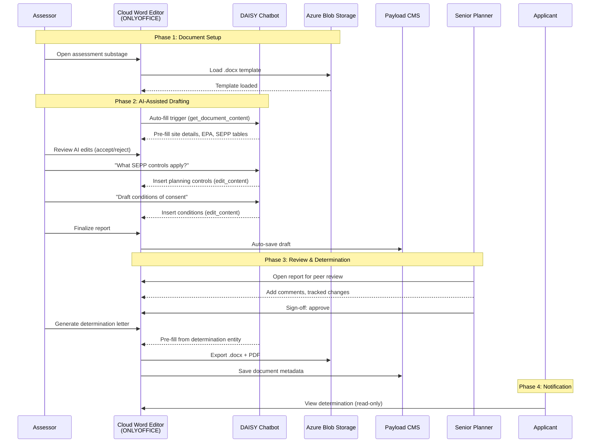

# Customer Journey: Cloud Word Editor in DA Assessment Workflow

## Overview

Council assessors need to draft, edit, and finalize .docx assessment documents
directly within the Configurator ecospace during the DA assessment process. The
DAISY chatbot assists by pre-filling templates and responding to queries. The
editor must be embeddable by external consumers as a drop-in package.

## Actors

| ID | Name | Type | Role |
|----|------|------|------|
| assessor | Council Assessor | user | Drafts assessment reports, conditions, referral letters |
| senior-planner | Senior Planner | user | Reviews and signs off assessment documents |
| daisy | DAISY Chatbot | ai-agent | Pre-fills templates, answers queries, edits programmatically |
| applicant | Applicant | user | Views determination letters (read-only via B2C) |
| ext-dev | External Developer | user | Integrates editor into third-party apps |
| blob-storage | Azure Blob Storage | system | Stores .docx files |
| payload-cms | Payload CMS | system | Stores document metadata and versioning |
| entra-id | Entra ID | system | Authentication (B2B admin + B2C per-tenant) |
| onlyoffice | ONLYOFFICE Document Server | system | Provides .docx editing engine |

## Journey Steps

### Phase 1: Document Setup (Lodgement → Assessment Clearance)

**Step 1: DA Lodged and Assigned**
- **Actor**: assessor
- Assessor receives DA assignment, BusinessRequest at ASSESSMENT stage
- `customData.workflowProgress.currentStageId` = "assessment"

**Step 2: Open Assessment Substage**
- **Actor**: assessor
- Navigates to Assessments substage in Configurator ecospace
- DocumentEditor block configured with ONLYOFFICE loads

**Step 3: Load Document Template**
- **Actor**: onlyoffice, blob-storage
- Editor loads .docx template from Azure Blob Storage via ONLYOFFICE
- Template sections: Site Description, Proposal, Planning Controls, Assessment, Conditions, Recommendation

### Phase 2: AI-Assisted Drafting (Assessments Substage)

**Step 4: DAISY Pre-fills Template**
- **Actor**: daisy
- Auto-fill triggers on load, DAISY reads document structure via `get_document_content`
- Populates Site Description from `customData.assessment.siteDetails`
- Fills EPA compliance table from `customData.assessment.epaMatters[]`
- Fills SEPP analysis from `customData.assessment.sepps[]`

**Step 5: Assessor Reviews AI Edits**
- **Actor**: assessor
- AIEditReviewBar shows "AI made N edits"
- Assessor accepts/rejects individual changes
- Manually edits Proposal Summary and Assessment sections

**Step 6: Interactive DAISY Queries**
- **Actor**: assessor, daisy
- Assessor asks "What SEPP controls apply to this property?"
- DAISY queries planning controls, inserts content via `edit_content`
- Assessor asks "Draft conditions of consent for single dwelling addition"
- DAISY inserts conditions from `customData.assessment.appliedConditions[]`

**Step 7: Assessor Finalizes Report**
- **Actor**: assessor
- Writes recommendation section, adjusts conditions
- Uses toolbar for formatting (tables, headings, lists)
- Auto-save persists draft to `customData` via Zustand store

### Phase 3: Review and Determination (Reviews + Determination Substages)

**Step 8: Peer Review**
- **Actor**: senior-planner
- Senior planner opens assessment report in editor (read-write)
- Adds tracked changes and comments
- Submits review: approve / approve-with-conditions

**Step 9: Sign-off**
- **Actor**: senior-planner
- Senior planner reviews final version
- Decision: approve / refuse
- Document locked after sign-off

**Step 10: Determination Letter**
- **Actor**: assessor, daisy
- DAISY generates determination letter from template
- Pre-fills from `customData.determinations[]` entity
- Assessor reviews, exports as .docx and PDF

**Step 11: Applicant Notification**
- **Actor**: applicant
- Determination letter and conditions available via B2C portal
- Read-only view in editor or PDF download

### Phase 4: External Integration

**Step 12: External Developer Setup**
- **Actor**: ext-dev
- `npm install @eai/cloud-word-editor`
- Renders `<CloudWordEditor>` component with <5 config props
- Full 12-tool API available for chatbot integration

## Journey Diagram

## Touchpoints

| ID | Type | Description | Actors | Steps |
|----|------|-------------|--------|-------|
| assessment-substage | ui | Configurator ecospace assessment page | assessor | 1,2 |
| onlyoffice-editor | ui | Embedded ONLYOFFICE Document Server | assessor, senior-planner | 3-10 |
| daisy-chat | ui | DAISY chatbot sidebar | assessor | 4,6 |
| ai-edit-review | ui | AIEditReviewBar (accept/reject) | assessor | 5 |
| toolbar | ui | Word-like ribbon toolbar | assessor, senior-planner | 7 |
| export-buttons | ui | PDF/DOCX export buttons | assessor | 10 |
| b2c-portal | ui | Applicant portal (read-only) | applicant | 11 |
| blob-storage-api | api | Azure Blob Storage upload/download | onlyoffice | 3,10 |
| documents-api | api | Payload CMS Documents CRUD | payload-cms | 7,10 |
| assessment-api | api | BR assessment entity CRUD | assessor, daisy | 4,6 |
| tool-call-bridge | api | CustomEvent bridge (editor ↔ chatbot) | daisy | 4,6 |
| npm-package | integration | @eai/cloud-word-editor npm package | ext-dev | 12 |

## Confirmation

- [x] Actors confirmed (9 actors: 4 human, 1 AI, 4 system)
- [x] Steps confirmed (12 steps across 4 phases)
- [x] Touchpoints identified (12 touchpoints: 7 UI, 4 API, 1 integration)
