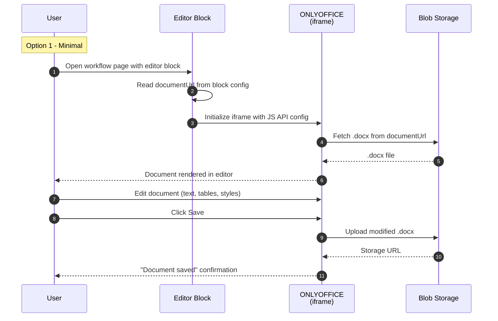

# Sequence Diagram Option 1: Minimal

## Overview

Bare minimum ONLYOFFICE integration. Embed the editor in an iframe, load a .docx
from cloud storage, and save back. No AI integration, no chatbot bridge, no
auto-fill, no template management. Uses the existing block registration pattern
with a thin wrapper component.

The goal is to prove ONLYOFFICE works inside the Configurator ecospace as fast
as possible. All advanced features (AI, templates, review) are deferred.

## Characteristics

- Direct ONLYOFFICE JS API iframe embed with minimal config
- Load .docx from a static URL in block config (no TenantData lookup)
- Save back to cloud storage on manual save only (no auto-save)
- No AI tool call integration — chatbot features entirely deferred
- No template management — single hardcoded template URL per block instance
- No review workflow — all users have read-write access
- Basic JWT generation (static secret, no Entra ID integration)
- No npm package or external API

## Actors

| Actor | Role | System/Human |
|-------|------|--------------|
| User | Opens page, edits .docx | Human |
| Editor Block | Thin React wrapper around ONLYOFFICE iframe | System |
| ONLYOFFICE | Document editing engine (iframe) | System |
| Blob Storage | Stores .docx files | System |

## Sequence Diagram

## Gen AI Touchpoints

None for this option.

## Scores

| Metric | Score |
|--------|-------|
| Efficiency | 95% |
| Innovation | 10% |
| Complexity | Low |

## Estimated Effort

1-2 days

## Risks

- No AI integration means the core differentiator (chatbot editing) is absent
- Hardcoded document URL makes it unsuitable for multi-tenant use
- No auto-save means potential data loss on accidental navigation
- Static JWT secret is a security risk in production
- No review workflow blocks the assessment sign-off process

## Trade-offs

**Gain**: Fastest possible proof that ONLYOFFICE embeds and works in the
Configurator. Validates .docx fidelity claim immediately. Zero risk of
over-engineering.

**Lose**: Everything that makes the editor valuable — AI integration, template
management, multi-tenant isolation, review workflow, external package. This is
a technical spike, not a shippable product.
