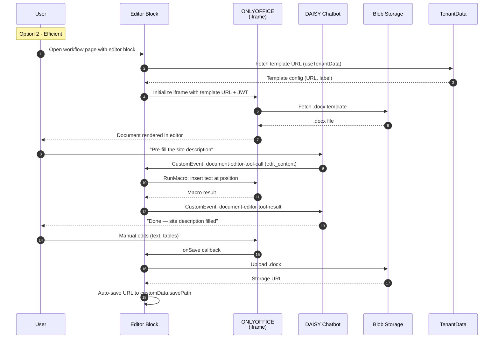

# Sequence Diagram Option 2: Efficient

## Overview

Pragmatic implementation that delivers .docx editing with basic AI tool call
integration. Connects the existing CustomEvent bridge so DAISY can execute tool
calls against the document. Includes auto-save and per-tenant template loading
from TenantData, but skips advanced features like AI edit tracking, review
workflow, and the external npm package.

The goal is a working editor + chatbot combination that councils can use for
basic document drafting in 3-5 days.

## Characteristics

- ONLYOFFICE iframe with three-tier block config (presentationConfig, dataConfig)
- CustomEvent bridge connected — chatbot dispatches tool calls to editor
- Macro translation layer for top 4-5 most-used tool calls only
- Per-tenant template loading via `useTenantData()` hook
- Auto-save to customData path with debounced writes
- Basic JWT from Entra ID user context
- Standard error handling (tool call retries, load failures)
- No AI edit review bar (edits apply directly)
- No review/approval workflow
- No npm package — Configurator-only

## Actors

| Actor | Role | System/Human |
|-------|------|--------------|
| User | Opens page, edits .docx | Human |
| DAISY Chatbot | Dispatches tool calls via CustomEvent | AI Agent |
| Editor Block | React component, manages ONLYOFFICE lifecycle | System |
| ONLYOFFICE | Document editing engine (iframe) | System |
| Blob Storage | Stores .docx files | System |
| TenantData | Per-tenant template configuration | System |

## Sequence Diagram

## Gen AI Touchpoints

- **Tool Call Bridge**: DAISY chatbot dispatches document editing commands via
  CustomEvent protocol. Limited to the 4-5 most-used tool calls
  (`get_document_content`, `edit_content`, `edit_table`, `edit_styles`,
  `edit_list`). Full 12-tool coverage deferred.

## Scores

| Metric | Score |
|--------|-------|
| Efficiency | 80% |
| Innovation | 30% |
| Complexity | Low-Medium |

## Estimated Effort

3-5 days

## Risks

- Partial tool coverage (5 of 12) means some chatbot operations won't work
- No AI edit tracking means users can't review/reject chatbot changes
- No review workflow blocks the senior planner sign-off process
- No npm package delays external integration
- Macro translation layer only tested with common operations

## Trade-offs

**Gain**: Working editor + chatbot in under a week. Proves the core integration
(ONLYOFFICE + CustomEvent + macro translation) works. Per-tenant templates and
auto-save make it minimally production-viable.

**Lose**: AI edit review bar (user can't accept/reject individual AI changes),
review/approval workflow, full 12-tool coverage, npm package, read-only mode,
export features, audit trail.
