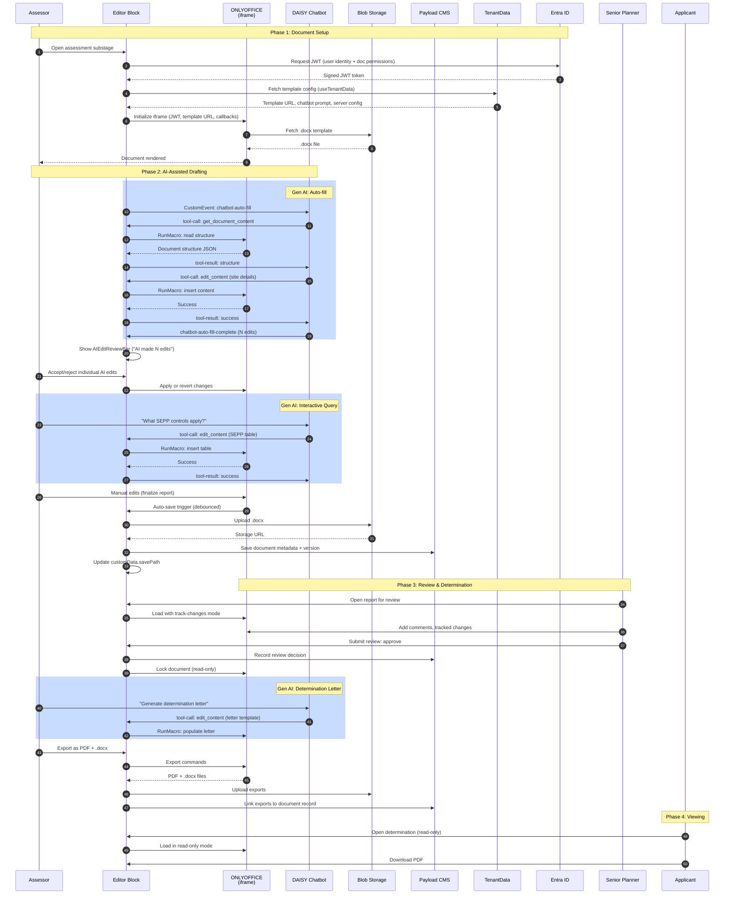

# Sequence Diagram Option 3: Standard

## Overview

Balanced, production-grade implementation covering the full DA assessment
workflow. Delivers all 12 tool calls via macro translation layer, AI edit
tracking with accept/reject review bar, auto-fill on load, review workflow
with tracked changes, read-only mode, document export, multi-tenant template
management, JWT auth via Entra ID, and the external npm package with web
component. This is the **recommended option** for shipping to councils.

The goal is a complete, well-architected system that meets all P1 and P2 user
stories, with extension points for P3/P4 features.

## Characteristics

- Full three-tier block config (presentationConfig, dataConfig, businessLogic)
- All 12 tool calls implemented via Document Builder macro translation
- AIEditReviewBar with per-edit accept/reject and batch operations
- Auto-fill on load via chatbot prompt from TenantData
- Review workflow with tracked changes and comments
- Read-only mode with lock indicator for signed-off documents
- PDF and .docx export
- Per-tenant template management via TenantData
- JWT auth from Entra ID with token refresh
- TenantSchemas support for dynamic field extensions
- npm package with React component + web component
- Audit trail for document events
- Comprehensive error handling and retry logic
- Zustand store for editor state (per-businessRequestId keying)
- Extension points for future features (collaboration, analytics)

## Actors

| Actor | Role | System/Human |
|-------|------|--------------|
| Assessor | Drafts documents, reviews AI edits | Human |
| Senior Planner | Reviews with tracked changes, signs off | Human |
| Applicant | Views determination (read-only) | Human |
| External Developer | Integrates via npm package | Human |
| DAISY Chatbot | Auto-fills, responds to queries, 12 tool calls | AI Agent |
| Editor Block | React component managing full lifecycle | System |
| ONLYOFFICE | Document editing engine (iframe) | System |
| Blob Storage | .docx file storage | System |
| Payload CMS | Document metadata and versioning | System |
| TenantData | Templates, prompts, server config | System |
| Entra ID | JWT auth (B2B + B2C) | System |

## Sequence Diagram

## Gen AI Touchpoints

- **Auto-fill on Load**: DAISY chatbot reads document structure and populates
  sections from configured data paths. Triggered via `chatbot-auto-fill` event.
  All edits tracked for human review.

- **Interactive Queries**: User asks questions mid-edit; DAISY responds with
  contextual content insertion via tool calls. Supports all 12 tool operations.

- **Determination Letter Generation**: DAISY drafts determination letters from
  template + workflow data, with full tracked change review.

- **Smart Defaults**: Auto-fill uses tenant-configured prompts to determine
  which sections to populate and from which data paths.

## Scores

| Metric | Score |
|--------|-------|
| Efficiency | 60% |
| Innovation | 50% |
| Complexity | Medium |

## Estimated Effort

1-2 weeks

## Risks

- Macro translation layer for all 12 tools needs thorough testing
- ONLYOFFICE accessibility gaps may require remediation work
- JWT token refresh flow needs careful error handling
- Real-time collaboration deferred (P4) — may need infrastructure changes later
- npm package API surface needs documentation and versioning strategy

## Trade-offs

**Gain**: Complete, production-ready system covering the full DA assessment
workflow end-to-end. All P1 and P2 user stories delivered. npm package enables
external integration. Multi-tenant isolation proven. AI edit tracking provides
governance for government use. Extension points ready for P3/P4.

**Lose**: Real-time collaboration (P4), advanced analytics, predictive features,
voice/multi-modal AI. These are deferred to future iterations, with architecture
designed to accommodate them.
