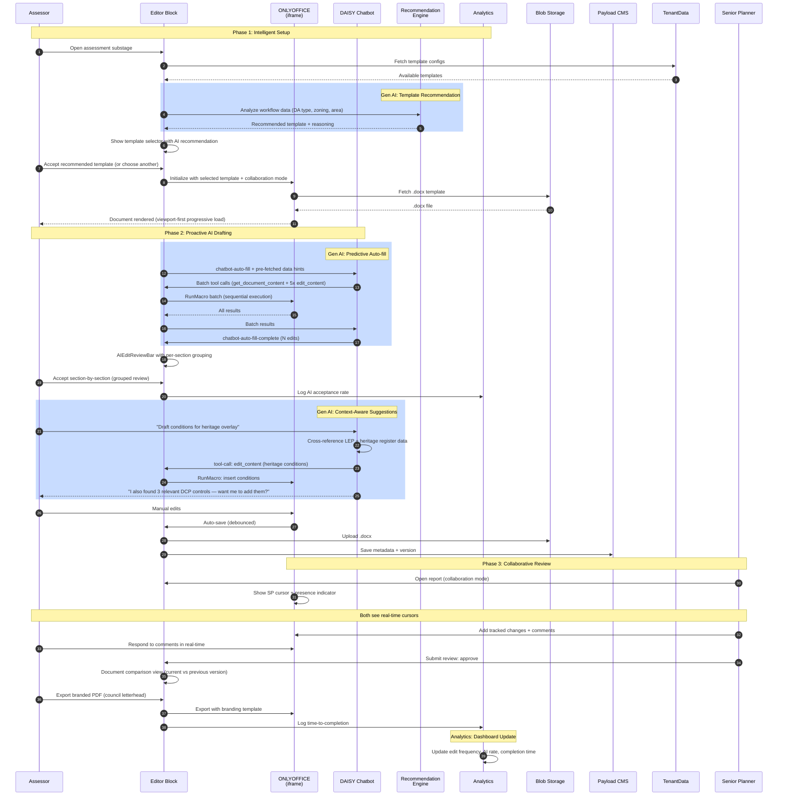

# Sequence Diagram Option 4: Enhanced

## Overview

Feature-rich implementation that builds on Option 3's complete system with
proactive AI features, real-time collaboration, advanced analytics, and an
intelligent template recommendation engine. The editor anticipates user needs
rather than just responding to commands.

The goal is a differentiated product that delights users with smart features
while maintaining the universal architecture.

## Characteristics

- Everything in Option 3, plus:
- Real-time collaboration with visible cursors and presence indicators
- AI-powered template recommendation (suggests templates based on workflow data)
- Predictive auto-fill (pre-fetches data before user requests it)
- Document comparison view (diff between versions)
- Analytics dashboard (edit frequency, AI acceptance rate, time-to-completion)
- Advanced export options (branded PDF with council/tenant letterhead)
- Intelligent error recovery (suggests corrections when tool calls fail)
- Progressive document loading (viewport-first, lazy-load remaining pages)
- Personalized toolbar (reorders tools based on usage frequency)
- A/B testing ready (feature flags for experimental features)

## Actors

| Actor | Role | System/Human |
|-------|------|--------------|
| Assessor | Drafts documents with AI assistance | Human |
| Senior Planner | Reviews with real-time presence | Human |
| Applicant | Views determination (read-only) | Human |
| External Developer | Integrates via npm package | Human |
| DAISY Chatbot | Proactive AI assistance, 12 tool calls | AI Agent |
| Recommendation Engine | Suggests templates and content | System |
| Editor Block | React component with advanced features | System |
| ONLYOFFICE | Document editing + collaboration engine | System |
| Blob Storage | .docx file storage | System |
| Payload CMS | Metadata, versioning, analytics | System |
| TenantData | Templates, prompts, server config | System |
| Entra ID | JWT auth + presence tracking | System |
| Analytics Service | Usage tracking and insights | System |

## Sequence Diagram

## Gen AI Touchpoints

- **Template Recommendation**: AI analyzes workflow data (DA type, zoning,
  property characteristics) and recommends the most appropriate template with
  reasoning. User can accept or override.

- **Predictive Auto-fill**: Pre-fetches workflow data before document load,
  enabling faster auto-fill. Batches multiple tool calls for efficiency.

- **Context-Aware Suggestions**: DAISY proactively suggests related content
  beyond what the user asked for, based on cross-referencing workflow data
  sources.

- **Grouped Section Review**: AI edits grouped by document section for faster
  review (e.g., accept all "Site Description" edits at once).

## Scores

| Metric | Score |
|--------|-------|
| Efficiency | 40% |
| Innovation | 70% |
| Complexity | Medium-High |

## Estimated Effort

2-3 weeks

## Risks

- Real-time collaboration requires ONLYOFFICE co-editing infrastructure
- Template recommendation engine needs training data (DA types → templates)
- Predictive features may slow initial load if pre-fetching is too aggressive
- Analytics dashboard adds maintenance burden
- Branded PDF export requires per-tenant letterhead templates
- Feature flags infrastructure needs design

## Trade-offs

**Gain**: Significantly better UX — proactive AI suggestions, real-time
collaboration, smart template selection. Analytics provide visibility into
editor usage and AI effectiveness. Document comparison helps reviewers.
Branded export adds professional polish.

**Lose**: 2-3 weeks vs 1-2 weeks for Standard. More infrastructure to maintain
(analytics service, recommendation engine, collaboration servers). Risk of
over-engineering features that users don't actually need.
