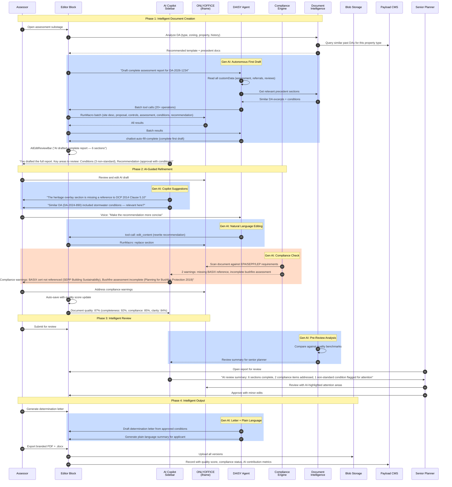

# Sequence Diagram Option 5: Innovative

## Overview

Cutting-edge implementation that pushes the boundaries of AI-assisted document
editing. DAISY operates as a semi-autonomous agent that can draft entire
documents independently, with multi-modal input (voice commands, image analysis
for site photos), continuous learning from user behaviour, and an AI copilot
sidebar that anticipates needs before the user asks.

The goal is a next-generation document intelligence platform, not just an editor.

## Characteristics

- Everything in Option 4, plus:
- Autonomous document drafting (DAISY creates entire first draft independently)
- Multi-modal input: voice commands for editing, image analysis for site photos
- AI copilot sidebar with contextual suggestions, compliance warnings, and
  similar precedent documents
- Continuous learning: per-user and per-tenant models that improve over time
- Semantic document understanding (knows what a "conditions of consent" section
  should contain for a given DA type)
- Cross-document intelligence (references previous DAs for similar properties)
- Natural language editing ("Make the third paragraph more formal")
- Automated compliance checking against EPA/SEPP/LEP requirements
- Smart conflict resolution for real-time collaboration
- Document quality scoring (completeness, compliance, clarity)

## Actors

| Actor | Role | System/Human |
|-------|------|--------------|
| Assessor | Reviews AI-drafted documents, refines | Human |
| Senior Planner | Reviews with AI-assisted quality scoring | Human |
| Applicant | Views determination with plain-language summary | Human |
| External Developer | Integrates via npm package + AI SDK | Human |
| DAISY Chatbot | Semi-autonomous drafting agent | AI Agent |
| AI Copilot | Sidebar with proactive suggestions | AI Agent |
| Compliance Engine | Automated regulatory checking | AI System |
| Learning Service | Per-user/tenant behaviour models | AI System |
| Document Intelligence | Cross-document analysis | AI System |
| Editor Block | React component with full AI integration | System |
| ONLYOFFICE | Document editing + collaboration engine | System |
| Blob Storage | .docx file storage | System |
| Payload CMS | Metadata, versioning, analytics, precedents | System |
| TenantData | Templates, prompts, models, preferences | System |
| Entra ID | JWT auth + user profile for personalization | System |

## Sequence Diagram

## Gen AI Touchpoints

- **Autonomous First Draft**: DAISY reads all workflow data and drafts a
  complete assessment report independently. Assessor reviews rather than writes.

- **AI Copilot Sidebar**: Always-on contextual assistant that surfaces relevant
  information, flags potential issues, and suggests improvements proactively.

- **Natural Language Editing**: Voice and text commands for editing in natural
  language ("Make this more formal", "Add a reference to SEPP 65").

- **Automated Compliance Checking**: Scans document against regulatory
  requirements (EPA Act, SEPPs, LEPs, DCPs) and flags omissions or
  inconsistencies.

- **Cross-Document Intelligence**: References previous DAs for similar property
  types to suggest conditions, identify precedents, and ensure consistency.

- **Document Quality Scoring**: Real-time scoring across completeness,
  compliance, and clarity dimensions. Helps both authors and reviewers.

- **Plain-Language Generation**: Automatically generates an applicant-friendly
  summary of complex determination documents.

## Scores

| Metric | Score |
|--------|-------|
| Efficiency | 20% |
| Innovation | 95% |
| Complexity | High |

## Estimated Effort

1-2 months

## Risks

- Autonomous drafting quality depends heavily on training data and prompt
  engineering — poor results could erode trust
- Multi-modal input (voice) requires additional infrastructure and browser APIs
- Compliance engine needs domain-specific knowledge base per jurisdiction
  (NSW now, but must be configurable per tenant)
- Continuous learning raises privacy and data governance concerns
- Cross-document intelligence requires access to historical data (may be
  incomplete for new tenants)
- Quality scoring calibration needs human validation
- Significant increase in AI API costs (more tokens per document lifecycle)
- Technology risk: bleeding-edge features may not work reliably at scale
- User adoption uncertainty: some users may distrust autonomous AI drafting

## Trade-offs

**Gain**: Transforms document editing from a manual task to an AI-guided
workflow. Assessors review instead of write. Compliance checking reduces
regulatory risk. Cross-document intelligence ensures consistency. Quality
scoring provides objective governance metrics. The editor becomes a document
intelligence platform.

**Lose**: 1-2 months vs 1-2 weeks for Standard. Significantly more complex
infrastructure. Higher AI API costs. Risk of features that users don't trust
or don't use. Compliance engine requires ongoing maintenance as regulations
change. Universal architecture must ensure all AI features are configurable
per tenant — no hardcoded NSW logic.
