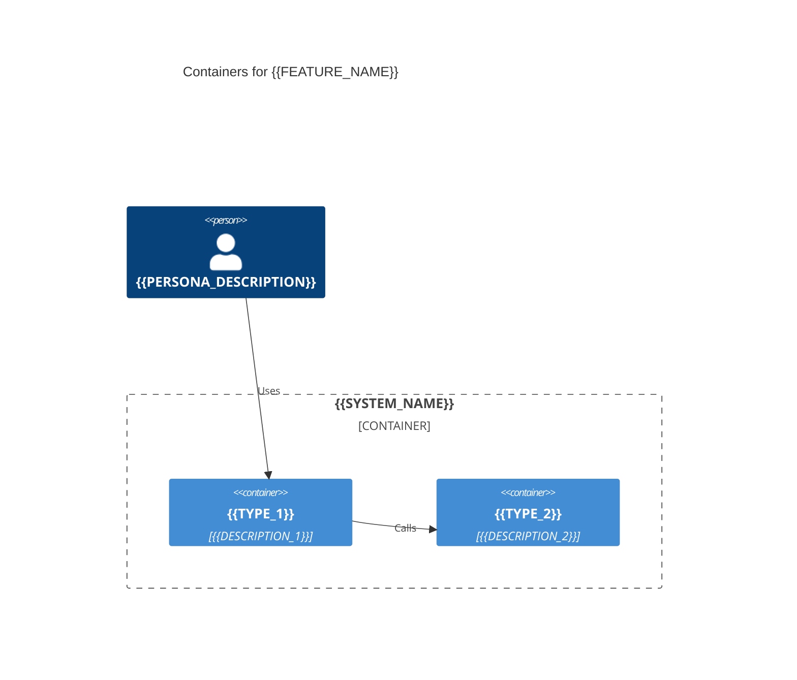

# C4 Container: {{FEATURE_NAME}}

<!-- preamble: ≥30 ≤200 words plain-language explanation of containers and their interactions -->

This C4 Container diagram shows the runnable units that make up the system
implementing this feature. Each container is a separately deployable or
independently runnable process, application, data store, or service. The arrows
describe how containers communicate at runtime and which protocol or message
style they use. Reading this diagram tells a developer where to put new code,
which container owns which responsibility, and which integrations cross a
process boundary. Use this view together with the C4 Context diagram (one level
higher) and the data-model ERD (one level deeper) to keep the architectural
intent consistent across documents and reviews.

## Notes

{{NOTES}}
