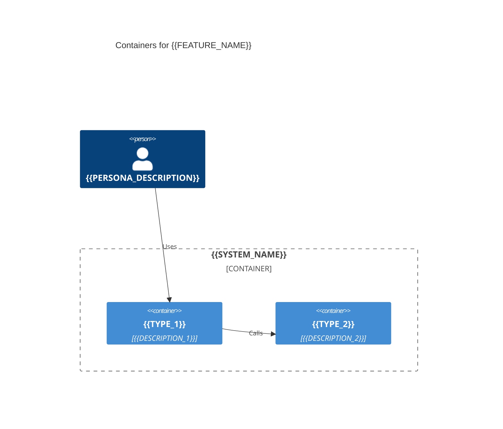

# C4 Container: {{FEATURE_NAME}}

```mermaid
C4Container
    title Containers for {{FEATURE_NAME}}

    Person({{PRIMARY_PERSONA}}, "{{PERSONA_DESCRIPTION}}")
    Container_Boundary(c1, "{{SYSTEM_NAME}}") {
        Container({{CONTAINER_1}}, "{{TYPE_1}}", "{{DESCRIPTION_1}}")
        Container({{CONTAINER_2}}, "{{TYPE_2}}", "{{DESCRIPTION_2}}")
    }

    Rel({{PRIMARY_PERSONA}}, {{CONTAINER_1}}, "Uses")
    Rel({{CONTAINER_1}}, {{CONTAINER_2}}, "Calls")
```
