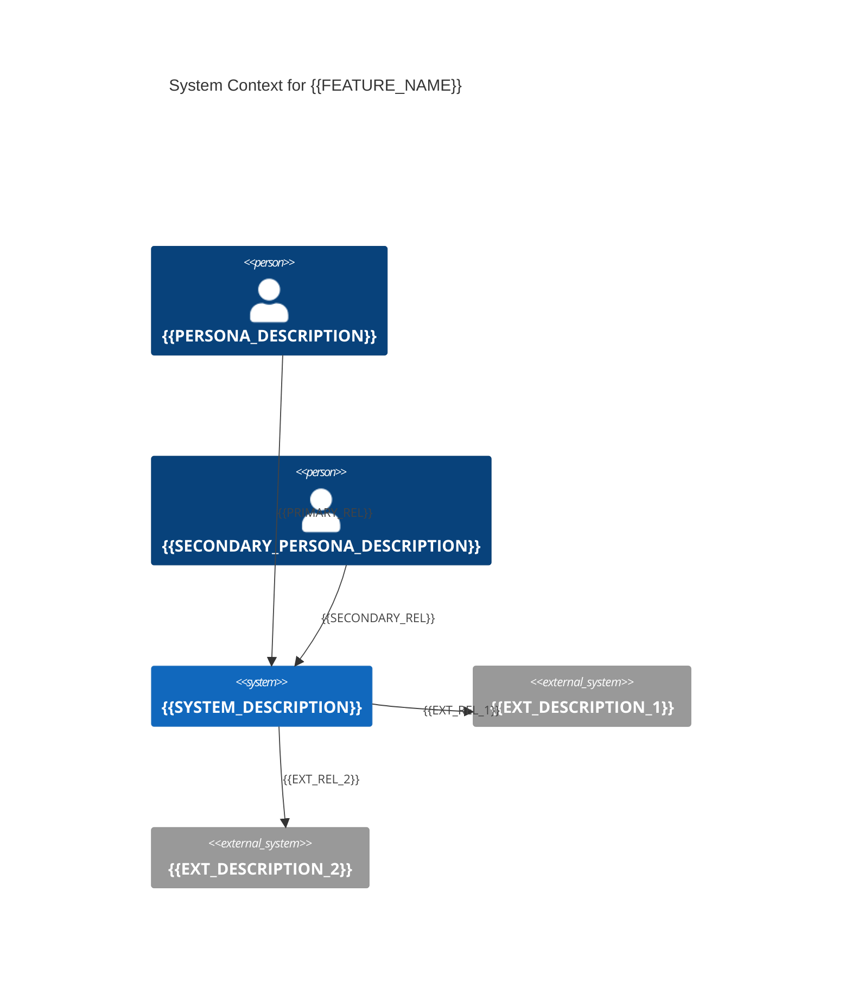

# C4 Context — {{FEATURE_NAME}}

<!-- preamble: ≥30 ≤200 words plain-language explanation of system context -->

This C4 Context diagram shows the system boundary and the external actors and
systems it interacts with. The single central box represents the system being
built; surrounding entities are people who use it (Person) or external services
it integrates with (System_Ext). Arrows show direction of interaction and label
the high-level purpose of each integration. This is the highest-level
architectural view: it tells you who needs the system, what it depends on, and
what it depends on having available. Reading this diagram is sufficient to
understand integration scope without needing to read the implementation plan.
Use it as a checklist when planning integration work, security reviews, or
onboarding documentation: every external dependency must show up here, and every
persona who interacts with the system must be represented as a Person box.

## Diagram

## Notes

{{NOTES}}
