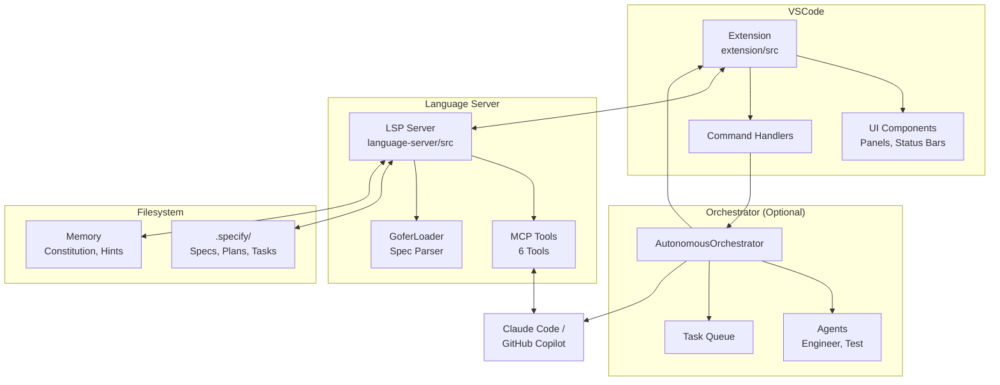
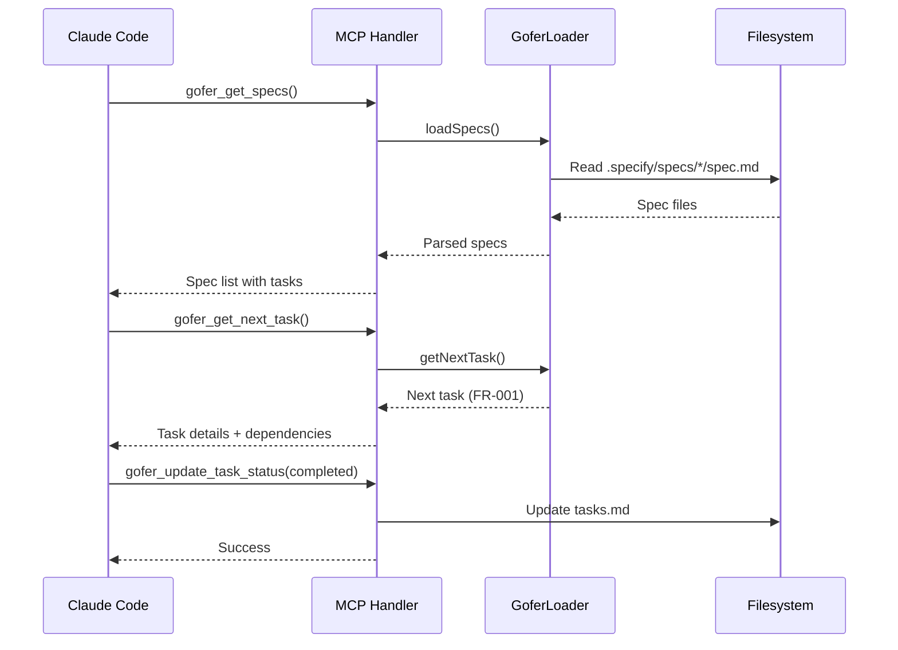
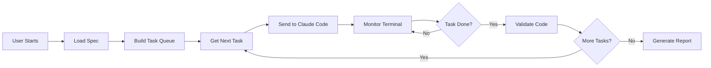
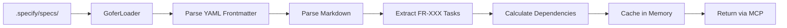
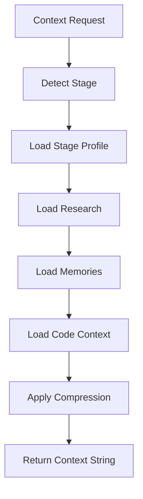
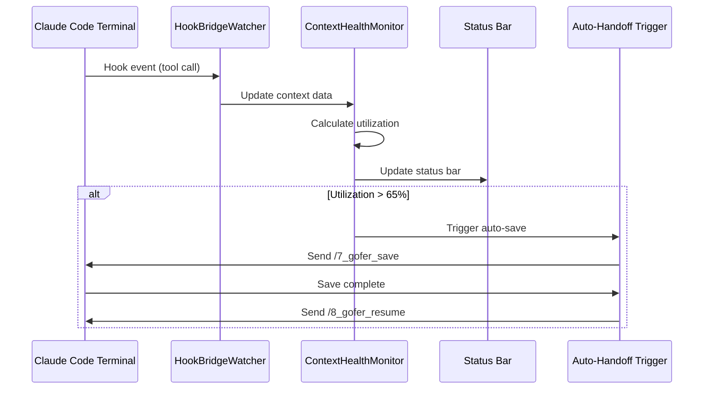

# Architecture

## System Overview

Gofer is a three-component system that enables AI assistants to autonomously
implement features from specifications.



## Component Breakdown

### 1. Extension (`extension/src/`)

**Purpose:** VSCode UI integration layer

**Key Modules:**

| Module                  | File                       | Description                               |
| ----------------------- | -------------------------- | ----------------------------------------- |
| Extension Entry         | `extension.ts`             | Main activation point, DI container setup |
| Progress Provider       | `progressProvider.ts`      | Spec tree view in sidebar                 |
| Constitution Provider   | `constitutionProvider.ts`  | Constitution tree view                    |
| Memory Provider         | `memoryProvider.ts`        | Memory management UI                      |
| Context Window Provider | `contextWindowProvider.ts` | Context health visualization              |
| LSP Client              | `lspClient.ts`             | Connects to language server               |
| Auto Updater            | `autoUpdater.ts`           | Checks for new releases                   |
| Branch Spec Manager     | `branchSpecManager.ts`     | Git branch-aware spec filtering           |

**Autonomous Subsystem:**

| Module                 | File                                 | Description                          |
| ---------------------- | ------------------------------------ | ------------------------------------ |
| Context Builder        | `autonomous/ContextBuilder.ts`       | Builds context for AI prompts        |
| Memory Manager         | `autonomous/MemoryManager.ts`        | Manages memory compaction            |
| Context Health Monitor | `autonomous/ContextHealthMonitor.ts` | Tracks context usage                 |
| Scope Guard            | `autonomous/ScopeGuard.ts`           | Enforces file access boundaries      |
| Cost Budget Enforcer   | `autonomous/CostBudgetEnforcer.ts`   | Tracks API costs                     |
| ACC Orchestrator       | `autonomous/ACCOrchestrator.ts`      | Auto-context-continuity orchestrator |

**Service Layer (DI Container):**

```typescript
// services/index.ts exports
-Logger - // Centralized logging
  StateManager - // Extension state
  DisposalService - // Resource cleanup
  EventHandlers - // Event coordination
  InitializationService - // Startup sequence
  CommandRegistry; // Command registration
```

**File Count:** 140 TypeScript files

### 2. Language Server (`language-server/src/`)

**Purpose:** Dual-protocol server (LSP + MCP)

**Key Modules:**

| Module           | File                   | Description                  |
| ---------------- | ---------------------- | ---------------------------- |
| Server Entry     | `server.ts`            | LSP connection + MCP handler |
| MCP Tool Handler | `mcp/toolHandler.ts`   | Implements 6 MCP tools       |
| Gofer Loader     | `utils/goferLoader.ts` | Parses spec.md files         |

**MCP Tools Implemented:**

1. **gofer_get_specs** - List all specs and tasks
2. **gofer_get_next_task** - Get next task based on dependencies
3. **gofer_execute_task** - Mark task in-progress, return context
4. **gofer_update_task_status** - Mark task completed/failed
5. **gofer_validate_code** - Check against constitution
6. **gofer_run_tests** - Execute Playwright tests

**Protocol Flow:**



### 3. Orchestrator (`src/`)

**Purpose:** Optional autonomous execution engine

**Key Modules:**

| Module                  | File                                         | Description                  |
| ----------------------- | -------------------------------------------- | ---------------------------- |
| Autonomous Orchestrator | `orchestrator/AutonomousOrchestrator_new.ts` | Main coordinator             |
| Spec Loader             | `orchestrator/SpecLoader.ts`                 | Loads specs from filesystem  |
| Task Queue              | `orchestrator/TaskQueue.ts`                  | Manages task execution order |
| Engineer Agent          | `agents/EngineerAgent.ts`                    | Code validation agent        |
| Test Agent              | `agents/TestAgent.ts`                        | Test execution agent         |
| Logger                  | `utils/Logger.ts`                            | Logging utility              |
| Notification Service    | `utils/NotificationService.ts`               | WhatsApp/Email notifications |

**Orchestrator Flow:**



## Data Flow

### Specification Read Flow



### Context Building Flow



### Context Health Monitoring



## Design Patterns

### 1. Dependency Injection (tsyringe)

**Pattern:** Constructor injection with decorators

```typescript
// Service definition
@injectable()
class ContextBuilder {
  constructor(
    @inject(Logger) private logger: Logger,
    @inject(MemoryManager) private memory: MemoryManager
  ) {}
}

// Container registration
container.register(ContextBuilder, { useClass: ContextBuilder });

// Resolution
const builder = container.resolve(ContextBuilder);
```

**Usage:** Extension initialization, service layer

### 2. Provider Pattern (VSCode TreeDataProvider)

**Pattern:** Tree view data providers

```typescript
class ProgressProvider implements vscode.TreeDataProvider<SpecItem> {
  getTreeItem(element: SpecItem): vscode.TreeItem { ... }
  getChildren(element?: SpecItem): Promise<SpecItem[]> { ... }
}
```

**Usage:** Progress panel, constitution panel, memory panel, context window
panel

### 3. Observer Pattern (Event Emitters)

**Pattern:** Event-driven state updates

```typescript
class ContextHealthMonitor {
  private _onDidChangeHealth = new vscode.EventEmitter<ContextHealth>();
  readonly onDidChangeHealth = this._onDidChangeHealth.event;

  updateHealth(health: ContextHealth) {
    this._onDidChangeHealth.fire(health);
  }
}
```

**Usage:** Context health monitoring, spec refreshes, memory updates

### 4. Strategy Pattern (Memory Layers)

**Pattern:** Pluggable memory storage strategies

```typescript
interface MemoryLayer {
  get(key: string): Promise<string | null>;
  set(key: string, value: string): Promise<void>;
}

class CoreLayer implements MemoryLayer { ... }
class RecallLayer implements MemoryLayer { ... }
class ArchivalLayer implements MemoryLayer { ... }
```

**Usage:** Layered memory management (MemGPT-inspired)

### 5. Command Pattern

**Pattern:** Encapsulated command execution

```typescript
commands.registerCommand('gofer.initialize', async () => {
  await initializationService.initializeRepository();
});
```

**Usage:** All VSCode commands (30+ commands)

### 6. Singleton Pattern (DI Container)

**Pattern:** Single instance per service

```typescript
export function getContainer(): DependencyContainer {
  return container;
}
```

**Usage:** Logger, StateManager, ConfigManager

## Key Abstractions

### Specification (`Spec`)

```typescript
interface Spec {
  feature: string;
  status: 'draft' | 'in-progress' | 'completed';
  created: string;
  title: string;
  description: string;
  requirements: Requirement[];
  successCriteria: string[];
}
```

### Task (`Task`)

```typescript
interface Task {
  id: string; // FR-001
  description: string;
  status: 'pending' | 'in-progress' | 'completed' | 'failed';
  dependencies: string[]; // [FR-002]
  assignedTo?: string;
}
```

### Context Profile (`StageProfile`)

```typescript
interface StageProfile {
  researchBudget: number; // 0.15 = 15% of context
  memoryBudget: number; // 0.25 = 25% of context
  codeBudget: number; // 0.40 = 40% of context
  observationWindow: number; // Keep last 5 turns
}
```

### Memory Entry (`MemoryEntry`)

```typescript
interface MemoryEntry {
  id: string;
  content: string;
  layer: 'core' | 'recall' | 'archival';
  timestamp: number;
  priority: number;
}
```

## Integration Points

### External Services

| Service       | Purpose                        | Configuration           |
| ------------- | ------------------------------ | ----------------------- |
| Anthropic API | Claude models for orchestrator | `gofer.anthropicApiKey` |
| Google AI API | Gemini models for LLM council  | `gofer.googleApiKey`    |
| OpenAI API    | GPT models for LLM council     | `gofer.openaiApiKey`    |
| Twilio        | WhatsApp notifications         | Environment variables   |
| GitHub API    | Extension auto-updates         | Public API              |

### VSCode Integration Points

- **Extension Host** - Main process
- **Language Server** - Separate process via stdio
- **Terminal API** - Claude Code session monitoring
- **File System Watcher** - Spec file changes
- **WebView API** - Context content panel
- **TreeView API** - Sidebar panels
- **Status Bar API** - Context health, activity indicators

### AI Assistant Integration

- **Claude Code** - Via native VSCode MCP support
- **GitHub Copilot** - Via same MCP tools
- **Custom AI Tools** - Any MCP-compatible client

## Performance Considerations

1. **Spec Parsing** - Cached in memory, invalidated on file change
2. **Context Building** - Chunked and compressed based on stage profiles
3. **Memory Compaction** - Triggered at 80% context threshold (configurable)
4. **File Watching** - Debounced with chokidar
5. **Terminal Monitoring** - Hook-based (non-polling)
6. **Language Server** - Single process for both LSP and MCP
