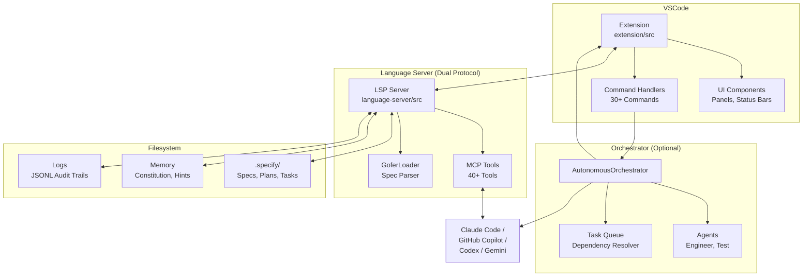
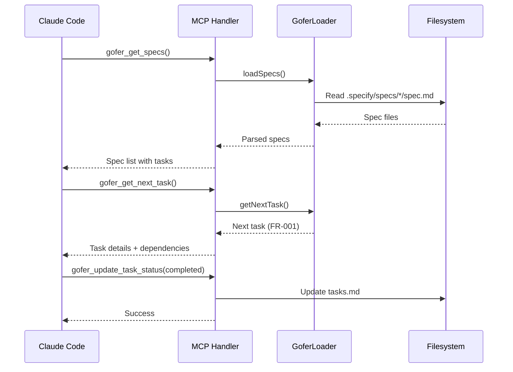
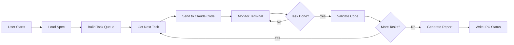
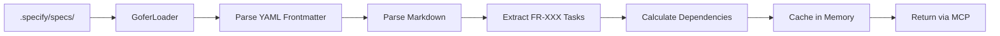
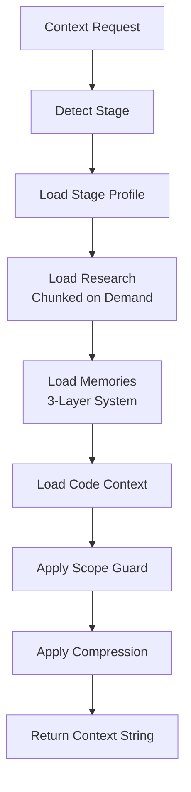
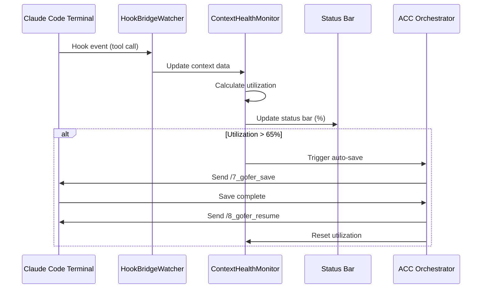
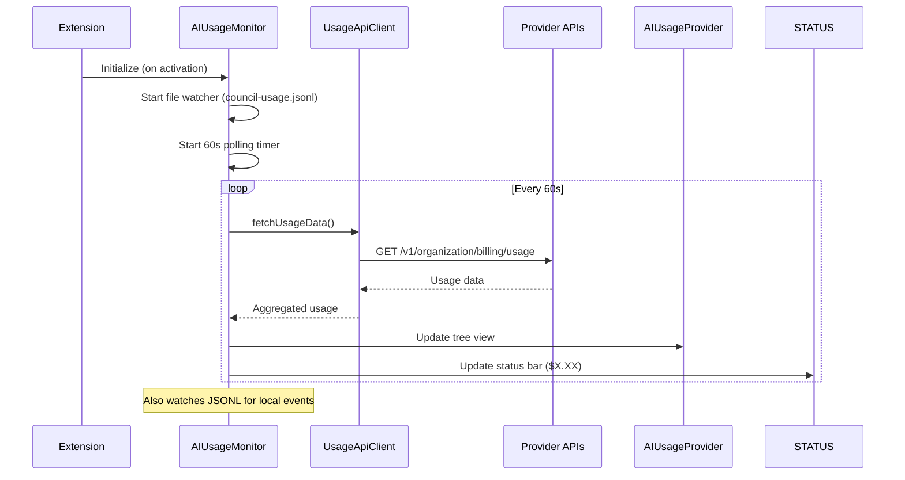

# Architecture

## System Overview

Gofer is a three-component system that enables AI assistants to autonomously implement features from specifications.



## Component Breakdown

### 1. Extension (`extension/src/`)

**Purpose:** VSCode UI integration layer

**Entry Point:** `extension.ts` (lines 173-287)
- Dependency injection container initialization (TSyringe)
- Command registration (30+ commands)
- Tree view provider registration (3 panels)
- Language server client startup
- File system watchers for real-time updates

**Key Modules:**

| Module                  | File                       | Description                               |
| ----------------------- | -------------------------- | ----------------------------------------- |
| Extension Entry         | `extension.ts`             | Main activation point, DI container setup |
| Progress Provider       | `progressProvider.ts`      | Spec tree view in sidebar                 |
| AI Usage Provider       | `ui/AIUsageProvider.ts`    | Token usage and cost tracking panel       |
| Constitution Provider   | `constitutionProvider.ts`  | Constitution tree view                    |
| Memory Provider         | `memoryProvider.ts`        | Memory management UI with filter toggle   |
| Context Window Provider | `contextWindowProvider.ts` | Context health visualization              |
| LSP Client              | `lspClient.ts`             | Connects to language server via stdio     |
| Auto Updater            | `autoUpdater.ts`           | Checks GitHub releases (24h interval)     |
| Branch Spec Manager     | `branchSpecManager.ts`     | Git branch-aware spec filtering           |

**Autonomous Subsystem (`src/autonomous/`):**

| Module                 | File                                 | Description                                |
| ---------------------- | ------------------------------------ | ------------------------------------------ |
| Context Builder        | `ContextBuilder.ts`                  | Builds context for AI prompts              |
| Memory Manager         | `MemoryManager.ts`                   | JSONL-based memory with 30min compaction   |
| Memory Storage         | `MemoryStorage.ts`                   | Append-only JSONL with in-memory index     |
| Memory Layer Manager   | `MemoryLayerManager.ts`              | MemGPT-inspired 3-layer memory             |
| Context Health Monitor | `ContextHealthMonitor.ts`            | Tracks context usage                       |
| Scope Guard            | `ScopeGuard.ts`                      | Enforces file access boundaries            |
| Cost Budget Enforcer   | `CostBudgetEnforcer.ts`              | Tracks API costs per run                   |
| ACC Orchestrator       | `ACCOrchestrator.ts`                 | Auto-context-continuity orchestrator       |
| AI Usage Monitor       | `AIUsageMonitor.ts`                  | File watcher + polling for usage data      |
| Usage API Client       | `UsageApiClient.ts`                  | Anthropic/OpenAI billing API integration   |
| Slop Reducer           | `SlopReducer.ts`                     | Auto-removes console.log, debugger         |
| Tool Audit Logger      | `ToolAuditLogger.ts`                 | Logs all tool access to JSONL              |
| Run Ledger             | `RunLedger.ts`                       | Pipeline run tracking for cost attribution |
| Observation Bridge     | `ObservationBridge.ts`               | Bridges terminal observations to context   |
| Resource Diagnostics   | `ResourceDiagnostics.ts`             | Lightweight performance snapshots (5min)   |
| Sub Agent Dispatcher   | `SubAgentDispatcher.ts`              | Dispatches work to specialized agents      |
| Continuous Memory      | `ContinuousMemoryWriter.ts`          | Background memory updates                  |
| Pipeline State Manager | `PipelineStateManager.ts`            | Per-spec pipeline state tracking           |
| Stage Detector         | `StageDetector.ts`                   | Detects current pipeline stage             |
| Observation Masker     | `ObservationMasker.ts`               | Redacts sensitive content from logs        |
| Hook Bridge Watcher    | `autonomous/HookBridgeWatcher.ts`    | Monitors Claude Code hook events           |
| Multi Session Watcher  | `autonomous/MultiSessionWatcher.ts`  | Tracks multiple Claude Code sessions       |
| Workspace Context      | `autonomous/WorkspaceContextProvider` | Provides workspace-wide context            |

**Service Layer (DI Container):**

```typescript
// services/index.ts exports
Logger                  // Centralized logging to Output Channel
StateManager            // Extension state (global + workspace)
DisposalService         // Resource cleanup coordination
EventHandlers           // Event coordination across modules
InitializationService   // Startup sequence orchestration
CommandRegistry         // Command registration
OptionalToolInstaller   // CLI tool installation helper
ConfigManager           // Settings management
```

**Cross-Platform Support (`src/council/`):**

| Module                       | File                               | Description                              |
| ---------------------------- | ---------------------------------- | ---------------------------------------- |
| Cross Platform Command Router | `CrossPlatformCommandRouter.ts`    | Routes to Claude/Codex/Copilot/Gemini    |
| Platform Detector            | `PlatformDetector.ts`              | Auto-detects installed CLIs              |
| Usage Logger                 | `UsageLogger.ts`                   | Logs usage to council-usage.jsonl        |
| LLM Council                  | `LLMCouncil.ts`                    | Multi-provider execution (Anthropic/Google/OpenAI) |

**File Count:** 140+ TypeScript files

### 2. Language Server (`language-server/src/`)

**Purpose:** Dual-protocol server (LSP + MCP)

**Entry Point:** `server.ts` (lines 129-537)

**Key Modules:**

| Module           | File                   | Description                       |
| ---------------- | ---------------------- | --------------------------------- |
| Server Entry     | `server.ts`            | LSP connection + MCP handler      |
| MCP Tool Handler | `mcp/toolHandler.ts`   | Implements 40+ MCP tools          |
| Gofer Loader     | `utils/goferLoader.ts` | Parses spec.md files              |
| Research Chunker | `utils/ResearchChunker.ts` | Chunks large research.md files |
| Spec Cache       | `utils/specCache.ts`   | In-memory spec caching            |
| Validation Service | `utils/ValidationService.ts` | Constitution validation      |
| Test Harness Generator | `utils/TestHarnessGenerator.ts` | Auto-generates test runners |

**MCP Tools Implemented (40+ tools):**

**Spec Management:**
1. `gofer_get_specs` - List all specs and tasks
2. `gofer_get_next_task` - Get next task based on dependencies
3. `gofer_execute_task` - Mark task in-progress, return context
4. `gofer_update_task_status` - Mark task completed/failed
5. `gofer_validate_code` - Check against constitution
6. `gofer_run_tests` - Execute tests (vitest/jest/pytest auto-detect)

**Context Management:**
7. `gofer_get_context_health` - Current context utilization
8. `gofer_expand_observation` - Expand masked observations
9. `gofer_trigger_handoff` - Trigger session save/resume

**Research Chunking:**
10. `gofer_get_research_index` - Get research.md chunk index
11. `gofer_load_research_chunk` - Load specific research chunk

**Observation Management:**
12. `gofer_peek_observation` - Preview observation without loading
13. `gofer_fold_observation` - Mask observation to save context
14. `gofer_grep_observations` - Search across observations

**Context REPL (Progressive Context Management):**
15. `gofer_context_peek` - Preview context section
16. `gofer_context_grep` - Search context by pattern
17. `gofer_context_fold` - Collapse context section
18. `gofer_context_expand` - Expand collapsed section
19. `gofer_context_undo` - Undo last context operation
20. `gofer_context_history` - Show context operation history
21. `gofer_context_repl` - Batch context operations

**Code Quality:**
22. `gofer_check_slop` - Detect console.log, debugger, @ts-ignore

**Additional Tools:** (20+ more tools for advanced workflows)

**LSP Custom Methods:**

- `gofer/getSpecs` - Spec list for extension UI
- `gofer/executeTask` - Task execution request
- `gofer/updateTaskStatus` - Task status update
- `gofer/taskProgress` - Notification to extension on task progress

**Protocol Flow:**



### 3. Orchestrator (`src/`)

**Purpose:** Optional autonomous execution engine

**Entry Point:** `src/index.ts` (lines 9-47)

**Key Modules:**

| Module                  | File                                         | Description                        |
| ----------------------- | -------------------------------------------- | ---------------------------------- |
| Autonomous Orchestrator | `orchestrator/AutonomousOrchestrator_new.ts` | Main coordinator                   |
| Spec Loader             | `orchestrator/SpecLoader.ts`                 | Loads specs from filesystem        |
| Task Queue              | `orchestrator/TaskQueue.ts`                  | Manages task execution order       |
| Engineer Agent          | `agents/EngineerAgent.ts`                    | Code validation agent              |
| Test Agent              | `agents/TestAgent.ts`                        | Test execution agent               |
| Logger                  | `utils/Logger.ts`                            | Logging utility                    |
| Notification Service    | `utils/NotificationService.ts`               | WhatsApp/Email notifications       |

**Orchestrator Flow:**



**IPC Communication:**

```typescript
// .specify/ipc/status.json
{
  "timestamp": "2026-04-30T22:50:00Z",
  "state": "working" | "idle" | "question",
  "last_output": "Completed task FR-001",
  "pending_input": null | "Answer required"
}
```

## Data Flow

### Specification Read Flow



### Context Building Flow



### Context Health Monitoring



### AI Usage Tracking Flow



## Design Patterns

### 1. Dependency Injection (tsyringe)

**Pattern:** Constructor injection with decorators

```typescript
// Service definition
@injectable()
class ContextBuilder {
  constructor(
    @inject(Logger) private logger: Logger,
    @inject(MemoryManager) private memory: MemoryManager
  ) {}
}

// Container registration (di/index.ts)
container.register(ContextBuilder, { useClass: ContextBuilder });

// Resolution
const builder = container.resolve(ContextBuilder);
```

**Usage:** Extension initialization, service layer

### 2. Provider Pattern (VSCode TreeDataProvider)

**Pattern:** Tree view data providers

```typescript
class ProgressProvider implements vscode.TreeDataProvider<SpecItem> {
  private _onDidChangeTreeData = new vscode.EventEmitter<SpecItem | undefined>();
  readonly onDidChangeTreeData = this._onDidChangeTreeData.event;

  getTreeItem(element: SpecItem): vscode.TreeItem { ... }
  getChildren(element?: SpecItem): Promise<SpecItem[]> { ... }

  refresh(): void {
    this._onDidChangeTreeData.fire(undefined);
  }
}
```

**Usage:** Progress panel, constitution panel, memory panel, context window panel, AI usage panel

### 3. Observer Pattern (Event Emitters)

**Pattern:** Event-driven state updates

```typescript
class ContextHealthMonitor {
  private _onDidChangeHealth = new vscode.EventEmitter<ContextHealth>();
  readonly onDidChangeHealth = this._onDidChangeHealth.event;

  updateHealth(health: ContextHealth) {
    this._onDidChangeHealth.fire(health);
  }
}
```

**Usage:** Context health monitoring, spec refreshes, memory updates, AI usage updates

### 4. Strategy Pattern (Memory Layers)

**Pattern:** Pluggable memory storage strategies

```typescript
interface MemoryLayer {
  get(key: string): Promise<string | null>;
  set(key: string, value: string): Promise<void>;
}

class CoreLayer implements MemoryLayer { ... }      // Always-loaded essentials
class RecallLayer implements MemoryLayer { ... }    // Recent context
class ArchivalLayer implements MemoryLayer { ... }  // Long-term storage
```

**Usage:** Layered memory management (MemGPT-inspired)

### 5. Command Pattern

**Pattern:** Encapsulated command execution

```typescript
commands.registerCommand('gofer.initialize', async () => {
  await initializationService.initializeRepository();
});

commands.registerCommand('gofer.startClaudeCode', async (specItem: SpecItem) => {
  await claudeCodeBridge.startSession(specItem.spec);
});
```

**Usage:** All VSCode commands (30+ commands)

### 6. Singleton Pattern (DI Container)

**Pattern:** Single instance per service

```typescript
export function getContainer(): DependencyContainer {
  return container;
}

export function getStateManager(): StateManager {
  return container.resolve(StateManager);
}
```

**Usage:** Logger, StateManager, ConfigManager, MemoryManager

### 7. Repository Pattern (JSONL Storage)

**Pattern:** Abstraction over data persistence

```typescript
class MemoryStorage {
  private indexById = new Map<string, Memory>();
  private indexByTag = new Map<string, Set<string>>();

  async append(memory: Memory): Promise<void> {
    // Append to JSONL
    // Update in-memory indexes
  }

  async findByTag(tag: string): Promise<Memory[]> {
    // Fast lookup via index
  }
}
```

**Usage:** Memory storage, usage logs, tool audit logs

## Key Abstractions

### Specification (`Spec`)

```typescript
interface Spec {
  feature: string;
  status: 'draft' | 'in-progress' | 'completed';
  created: string;
  title: string;
  description: string;
  requirements: Requirement[];
  successCriteria: string[];
  protectedBoundaries?: string[];  // ScopeGuard rules
}
```

### Task (`Task`)

```typescript
interface Task {
  id: string;           // FR-001, T001
  description: string;
  status: 'pending' | 'in-progress' | 'completed' | 'failed';
  dependencies: string[];  // [FR-002, T003]
  assignedTo?: string;
  estimatedTokens?: number;
}
```

### Context Profile (`StageProfile`)

```typescript
interface StageProfile {
  researchBudget: number;      // 0.15 = 15% of context
  memoryBudget: number;        // 0.25 = 25% of context
  codeBudget: number;          // 0.40 = 40% of context
  observationWindow: number;   // Keep last 5 turns
  enableChunking: boolean;     // Use research chunking
}
```

### Memory Entry (`Memory`)

```typescript
interface Memory {
  id: string;
  content: string;
  layer: 'core' | 'recall' | 'archival';
  timestamp: number;
  priority: number;
  category: 'user' | 'project' | 'technical';
  tags: string[];
  embedding?: number[];  // Future: Vector search
}
```

### Usage Record (`UsageRecord`)

```typescript
interface UsageRecord {
  provider: 'anthropic' | 'google' | 'openai';
  model: string;
  inputTokens: number;
  outputTokens: number;
  costUsd: number;
  timestamp: string;
  sessionId: string;
  councilId?: string;
}
```

## Integration Points

### External Services

| Service       | Purpose                        | Configuration                    |
| ------------- | ------------------------------ | -------------------------------- |
| Anthropic API | Claude models for orchestrator | `gofer.anthropicApiKey`          |
| Anthropic Admin API | Billing/usage data        | `gofer.anthropicAdminApiKey`     |
| Google AI API | Gemini models for LLM council  | `gofer.googleApiKey`             |
| OpenAI API    | GPT models for LLM council     | `gofer.openaiApiKey`             |
| OpenAI Admin API | Usage data                 | `gofer.openaiAdminApiKey`        |
| Twilio        | WhatsApp notifications         | Environment variables            |
| GitHub API    | Extension auto-updates         | Public API (no auth)             |

### VSCode Integration Points

- **Extension Host** - Main process (extension.ts)
- **Language Server** - Separate process via stdio (server.ts)
- **Terminal API** - Claude Code session monitoring (node-pty)
- **File System Watcher** - Spec file changes (chokidar)
- **WebView API** - Context content panel
- **TreeView API** - Sidebar panels (3 panels)
- **Status Bar API** - Context health, AI usage cost
- **Output Channel** - Centralized logging

### AI Assistant Integration

- **Claude Code** - Via native VSCode MCP support (40+ tools)
- **GitHub Copilot** - Via `.github/prompts/*.prompt.md` files
- **OpenAI Codex** - Via `.system/skills/*/SKILL.md` files
- **Gemini CLI** - Via `.gemini/commands/gofer/*.toml` files
- **Custom AI Tools** - Any MCP-compatible client

### File System Integration

**Watched Directories:**
- `.specify/specs/` - Spec changes trigger UI refresh
- `.specify/logs/council-usage.jsonl` - Usage data updates
- `.specify/memory/memories.jsonl` - Memory updates
- `.claude/commands/` - CLI command surface updates

**Written Files:**
- `.specify/logs/tool-audit.jsonl` - All file access
- `.specify/logs/slop-reduction.jsonl` - Code quality fixes
- `.specify/logs/gofer-run-ledger.jsonl` - Pipeline runs
- `.specify/current-stage.json` - Current pipeline stage
- `.specify/ipc/status.json` - Orchestrator IPC

## Performance Considerations

1. **Spec Parsing** - Cached in memory, invalidated on file change (chokidar)
2. **Context Building** - Chunked and compressed based on stage profiles
3. **Memory Compaction** - Triggered at 80% context threshold (configurable)
4. **File Watching** - Debounced with chokidar (500ms debounce)
5. **Terminal Monitoring** - Hook-based (non-polling) via HookBridgeWatcher
6. **Language Server** - Single process for both LSP and MCP
7. **Research Loading** - Chunked on-demand (default 50KB chunks)
8. **AI Usage Polling** - 60s minimum interval (Anthropic recommendation)
9. **Resource Snapshots** - 5min intervals (opt-in, lightweight)
10. **JSONL Indexing** - In-memory indexes for fast tag/category lookups

## Security Features

1. **Scope Guard** - Prevents AI from accessing files outside `.specify/specs/{spec-id}/protected-boundaries`
2. **Tool Audit Logging** - All file access logged with timestamps and scope violations
3. **API Key Storage** - VSCode settings (not committed to git)
4. **Path Traversal Protection** - CrossPlatformCommandRouter validates all paths
5. **Observation Masking** - Redacts sensitive content (API keys, credentials) from logs
6. **Budget Enforcement** - Prevents runaway API costs (default $10 cap)
