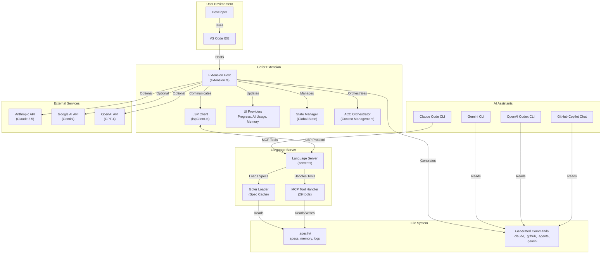
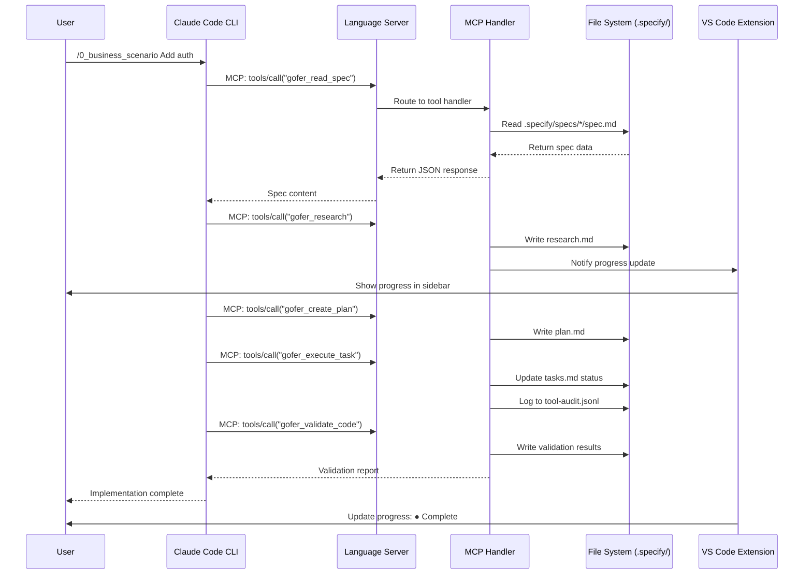
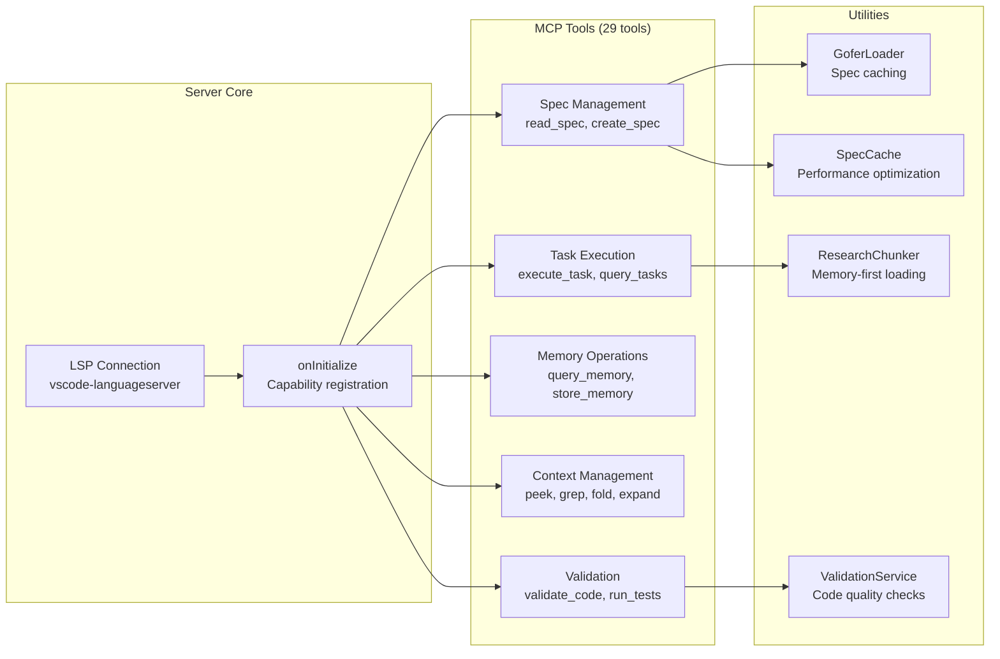
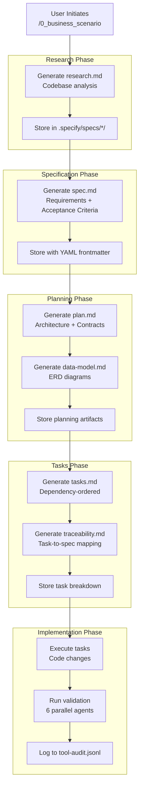
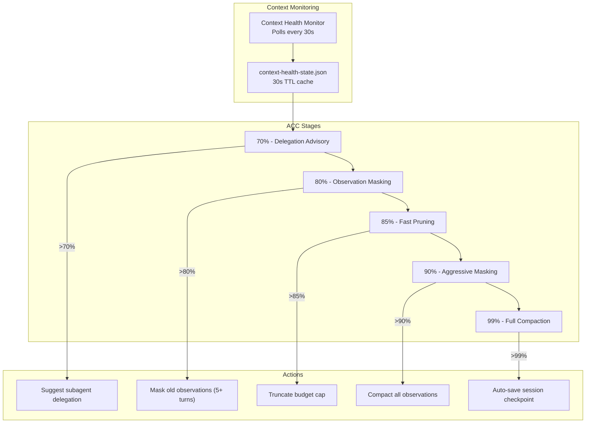

# Gofer - Architecture

## Executive Summary

Gofer implements a dual-protocol architecture (LSP + MCP) that bridges VSCode Extension API with AI assistant tools. The system uses dependency injection (tsyringe) for service lifecycle management and follows a progressive context management strategy through Adaptive Context Compaction (ACC). Trust boundaries are enforced via ScopeGuard, and all tool invocations are audited to `.specify/logs/tool-audit.jsonl`.

## High-Level System Context



## Runtime Flow: Feature Implementation



## Component Architecture

### Extension Layer (extension/src/)

```mermaid
flowchart TB
    subgraph "Extension Entry Point"
        Activate["activate()<br/>extension.ts"]
        DI["Dependency Injection<br/>tsyringe container"]
    end
    
    subgraph "Core Services"
        Config["ConfigManager<br/>settings.json"]
        State["StateManager<br/>workspace state"]
        Logger["Logger<br/>winston"]
        Disposals["DisposalService<br/>cleanup"]
    end
    
    subgraph "Autonomous Features"
        ACC["ACCOrchestrator<br/>Context management"]
        Memory["MemoryManager<br/>3-layer system"]
        ScopeGuard["ScopeGuard<br/>File protection"]
        Audit["ToolAuditLogger<br/>MCP audit log"]
        Budget["CostBudgetEnforcer<br/>Cost tracking"]
    end
    
    subgraph "UI Components"
        Progress["ProgressProvider<br/>Spec progress tree"]
        AIUsage["AIUsageProvider<br/>Token usage panel"]
        MemoryUI["MemoryProvider<br/>Memory tree view"]
        StatusBar["Context Health<br/>Status bar"]
    end
    
    subgraph "Command Generation"
        Council["LLM Council<br/>Multi-model validation"]
        CommandGen["CrossPlatformCommandRouter<br/>CLI surface generation"]
    end
    
    Activate --> DI
    DI --> Config
    DI --> State
    DI --> Logger
    DI --> Disposals
    
    Activate --> ACC
    Activate --> Memory
    Activate --> ScopeGuard
    Activate --> Audit
    Activate --> Budget
    
    Activate --> Progress
    Activate --> AIUsage
    Activate --> MemoryUI
    Activate --> StatusBar
    
    Activate --> Council
    Activate --> CommandGen
```



### Language Server Layer (language-server/src/)



## Data Flow Diagrams

### Spec-to-Implementation Flow



### Context Health Management



## Key Design Patterns

### 1. Dependency Injection (tsyringe)

- **Pattern:** Constructor injection with decorators
- **Location:** `extension/src/di/`, `extension/src/services/`
- **Purpose:** Service lifecycle management, testability, loose coupling
- **Example:**

```typescript
@injectable()
export class StateManager {
  constructor(
    @inject('Logger') private logger: Logger,
    @inject('ConfigManager') private config: ConfigManager
  ) {}
}
```

### 2. Provider Pattern (VS Code Tree Views)

- **Pattern:** Data provider with refresh notifications
- **Location:** `extension/src/progressProvider.ts`, `extension/src/ui/`
- **Purpose:** Reactive UI updates for spec progress, AI usage, memory
- **Example:** `ProgressProvider implements vscode.TreeDataProvider<SpecNode>`

### 3. Event-Driven Architecture

- **Pattern:** Event emitters for state changes
- **Location:** Throughout extension and language server
- **Purpose:** Decoupled communication between components
- **Example:** `onDidChangeConfiguration`, `onDidChangeState`

### 4. Repository Pattern

- **Pattern:** File-based data access abstraction
- **Location:** `language-server/src/utils/goferLoader.ts`
- **Purpose:** Centralized spec and memory access with caching
- **Example:** `GoferLoader.loadSpec()`, `GoferLoader.listSpecs()`

### 5. Strategy Pattern (CLI Command Generation)

- **Pattern:** Multiple output formats from single source
- **Location:** `extension/src/council/CrossPlatformCommandRouter.ts`
- **Purpose:** Generate Claude, Copilot, Codex, Gemini commands from canonical source
- **Example:** Single `.specify/commands/*.md` → 4 CLI surfaces

### 6. Observer Pattern (File Watching)

- **Pattern:** chokidar file system observers
- **Location:** `extension/src/fileMonitor.ts`
- **Purpose:** React to spec changes, memory updates, log files
- **Example:** Watch `.specify/specs/*/spec.md` for changes

### 7. Decorator Pattern (Tool Audit Logging)

- **Pattern:** Wrap MCP tool calls with audit logging
- **Location:** `extension/src/autonomous/ToolAuditLogger.ts`
- **Purpose:** Log all file access operations to JSONL
- **Example:** Every MCP tool call logged with timestamp, operation, files accessed

## Trust Boundaries and Security

### Authentication Flow

No authentication required - Gofer operates entirely locally within VS Code workspace. External API keys are optional and user-provided via VS Code settings.

### Authorization Controls

**ScopeGuard** enforces file access restrictions defined in specs:

- **Advisory Mode:** Logs warnings when AI accesses protected files
- **Warning Mode:** Prompts user before allowing access
- **Blocking Mode:** Prevents AI from accessing protected files entirely

Protected files defined in spec frontmatter:

```yaml
protected_files:
  - "src/auth/*.ts"
  - ".env"
  - "secrets/"
```

### Security Controls

1. **Tool Audit Logging** - All MCP tool invocations logged to `.specify/logs/tool-audit.jsonl`
2. **Cost Budget Enforcement** - Prevents runaway AI costs (default $10 limit per run)
3. **Environment Variable Validation** - `.env` files ignored by git, never committed
4. **API Key Protection** - Keys stored in VS Code settings (encrypted by VS Code)
5. **File System Sandboxing** - MCP tools restricted to workspace directory
6. **Input Validation** - Zod schemas validate all MCP tool inputs

### Data Sensitivity

- **Low Sensitivity:** Specifications, plans, tasks (intended for version control)
- **Medium Sensitivity:** Memory observations (may contain code snippets)
- **High Sensitivity:** API keys (never logged or committed)

## Integration Points

### VS Code Extension API

- **Commands:** 67+ registered commands via `contributes.commands`
- **Views:** 3 tree views (Progress, AI Usage, Memory)
- **Status Bars:** 2 status bar items (Context Health, AI Usage)
- **Configuration:** 91+ settings via `contributes.configuration`
- **Language Server:** Stdio transport via `LanguageClient`

### Model Context Protocol (MCP)

- **Tools:** 29 tools exposed via LSP custom requests
- **Transport:** LSP stdio (vs. HTTP or WebSocket)
- **Tool Discovery:** `tools/list` request
- **Tool Execution:** `tools/call` request with JSON-RPC 2.0 format

### AI Assistant Integrations

| Assistant      | Integration Method          | Command Discovery         | Tool Access            |
| -------------- | --------------------------- | ------------------------- | ---------------------- |
| Claude Code    | MCP via LSP                 | `.claude/commands/`       | Direct (29 tools)      |
| GitHub Copilot | Prompt files                | `.github/prompts/`        | Indirect (files only)  |
| OpenAI Codex   | Skill files                 | `.agents/skills/`         | Indirect (files only)  |
| Gemini CLI     | Command files               | `.gemini/commands/gofer/` | Indirect (files only)  |

### External Service Integrations

- **Anthropic API:** Optional, for autonomous orchestration
- **Google AI API:** Optional, for LLM Council validation
- **OpenAI API:** Optional, for LLM Council validation
- **Twilio API:** Optional, for WhatsApp notifications
- **GitHub API:** Optional, for auto-update checking

## Performance Characteristics

### Context Management

- **Spec Cache:** In-memory caching with 60s freshness TTL
- **Research Chunking:** On-demand loading, 30% memory coverage threshold
- **Observation Masking:** Triggered at 80% context utilization
- **Full Compaction:** Triggered at 99% context utilization

### File System Operations

- **Spec Loading:** Cached after first read, invalidated on file change
- **Memory Queries:** TF-IDF indexed, O(n log n) retrieval
- **Log Writing:** Append-only JSONL, no blocking
- **File Watching:** Debounced with 300ms delay

### API Rate Limiting

- **Anthropic API:** 50 requests/min (Sonnet), 1000 requests/min (Haiku)
- **Google AI API:** 60 requests/min (Gemini Pro), 1500 requests/min (Flash)
- **OpenAI API:** 10,000 requests/min (GPT-4o)
- **Cost Budget:** Default $10 per run, enforced by `CostBudgetEnforcer`

## Operational Notes

### Health Checks

- **Language Server:** Heartbeat via LSP connection
- **Extension Activation:** `onStartupFinished` event
- **Context Health:** Monitored via status bar with color indicators (green/yellow/orange/red)

### Logging

- **Extension Logs:** Winston logger, output channel in VS Code
- **Language Server Logs:** LSP connection console
- **Tool Audit Logs:** `.specify/logs/tool-audit.jsonl`
- **Council Usage Logs:** `.specify/logs/council-usage.jsonl`
- **Run Ledger:** `.specify/logs/gofer-run-ledger.jsonl`

### Monitoring

- **AI Usage Panel:** Real-time token usage and cost tracking
- **Progress Panel:** Spec status with Harvey ball icons (◔ ◑ ◕ ●)
- **Memory Panel:** Memory layer stats and recent observations
- **Context Health Status Bar:** Real-time context window percentage

### Error Handling

- **MCP Tool Errors:** Returned as JSON-RPC error responses
- **LSP Errors:** Logged to connection console
- **Extension Errors:** Logged to output channel, shown as notifications
- **Validation Failures:** Captured in validation report, shown in panel
