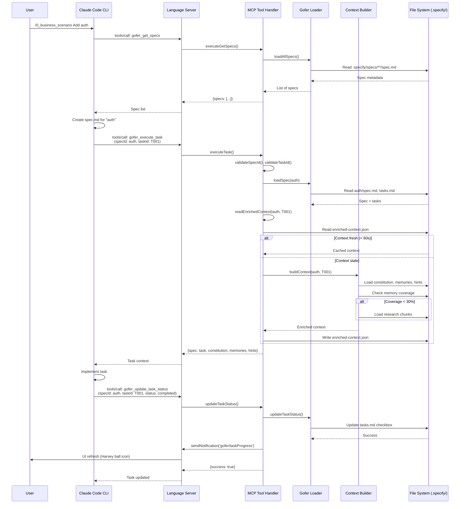

# Gofer - Architecture

## Executive Summary

Gofer implements a dual-protocol architecture (LSP + MCP) that bridges VSCode Extension API with AI assistant tools. The system uses dependency injection (tsyringe) for service lifecycle management and follows a progressive context management strategy through Adaptive Context Compaction (ACC). Trust boundaries are enforced via ScopeGuard, and all tool invocations are audited to `.specify/logs/tool-audit.jsonl`.

## High-Level System Context

```mermaid
flowchart TB
    subgraph "User Environment"
        VSCode["VS Code IDE"]
        User["Developer"]
    end

    subgraph "Gofer Extension"
        ExtHost["Extension Host<br/>(extension.ts)"]
        LSPClient["LSP Client<br/>(lspClient.ts)"]
        UI["UI Providers<br/>Progress, AI Usage, Memory"]
        StateManager["State Manager<br/>(Global State)"]
    end

    subgraph "Language Server"
        LSPServer["Language Server<br/>(server.ts)"]
        MCPHandler["MCP Tool Handler<br/>(29 tools)"]
        GoferLoader["Gofer Loader<br/>(Spec Cache)"]
    end

    subgraph "AI Assistants"
        Claude["Claude Code CLI"]
        Copilot["GitHub Copilot Chat"]
        Codex["OpenAI Codex CLI"]
        Gemini["Gemini CLI"]
    end

    subgraph "File System"
        Specify[".specify/<br/>specs, memory, logs"]
        Generated["Generated Commands<br/>.claude, .github, .agents, .gemini"]
    end

    subgraph "External Services"
        AnthropicAPI["Anthropic API<br/>(Claude 3.5)"]
        GoogleAPI["Google AI API<br/>(Gemini)"]
        OpenAIAPI["OpenAI API<br/>(GPT-4)"]
    end

    User -->|Invokes Commands| VSCode
    VSCode -->|Hosts| ExtHost
    ExtHost -->|Spawns| LSPServer
    ExtHost -->|IPC| LSPClient
    LSPClient <-->|LSP + MCP| LSPServer
    LSPServer -->|Executes| MCPHandler
    MCPHandler -->|Reads/Writes| Specify
    MCPHandler -->|Loads| GoferLoader
    
    ExtHost -->|Renders| UI
    ExtHost -->|Reads| StateManager
    ExtHost -->|Generates| Generated
    
    Claude -->|Calls MCP Tools| LSPServer
    Copilot -->|Calls MCP Tools| LSPServer
    Codex -->|Reads Skills| Generated
    Gemini -->|Reads Commands| Generated
    
    Claude -->|API Calls| AnthropicAPI
    Copilot -->|Built-in| OpenAIAPI
    Codex -->|API Calls| OpenAIAPI
    Gemini -->|API Calls| GoogleAPI

    style "Gofer Extension" fill:#e1f5ff
    style "Language Server" fill:#fff4e1
    style "AI Assistants" fill:#e8f5e9
    style "File System" fill:#f3e5f5
    style "External Services" fill:#fce4ec
```

## Runtime Flow: Task Execution



## Component Architecture

### Extension Layer (extension/src/)

```mermaid
flowchart LR
    subgraph "Entry Point"
        Activate["activate()<br/>extension.ts:171"]
    end

    subgraph "Dependency Injection"
        Container["TSyringe Container"]
        Logger["Logger Service"]
        Disposal["Disposal Service"]
        Init["Initialization Service"]
        CommandReg["Command Registry"]
    end

    subgraph "State Management"
        StateManager["State Manager<br/>(Global State)"]
        Config["Config Manager<br/>(Settings)"]
    end

    subgraph "UI Layer"
        ProgressProvider["Progress Provider<br/>(Spec Tree View)"]
        AIUsageProvider["AI Usage Provider<br/>(Token Tracking)"]
        MemoryProvider["Memory Provider<br/>(Rules & Memory)"]
        StatusBars["Status Bars<br/>(Context, AI Usage)"]
    end

    subgraph "Autonomous Layer"
        ContextBuilder["Context Builder<br/>(Memory-First)"]
        ACCOrch["ACC Orchestrator<br/>(5-Stage Compaction)"]
        ScopeGuard["Scope Guard<br/>(Boundary Enforcement)"]
        ObsBridge["Observation Bridge<br/>(Terminal Capture)"]
        MemoryMgr["Memory Manager<br/>(TF-IDF Retrieval)"]
    end

    subgraph "Services Layer"
        LSPClient["LSP Client<br/>(IPC Bridge)"]
        BranchSpec["Branch Spec Manager<br/>(Git Detection)"]
        AutoUpdater["Auto Updater"]
        ClaudeBridge["Claude Code Bridge"]
    end

    Activate -->|registerServices()| Container
    Container -->|Provides| Logger
    Container -->|Provides| Disposal
    Container -->|Provides| Init
    Container -->|Provides| CommandReg
    
    Activate -->|setupLSP()| LSPClient
    Activate -->|registerTreeViews()| ProgressProvider
    Activate -->|registerTreeViews()| AIUsageProvider
    Activate -->|registerTreeViews()| MemoryProvider
    Activate -->|initializeForWorkspace()| StateManager
    
    StateManager -->|Holds| ContextBuilder
    StateManager -->|Holds| ACCOrch
    StateManager -->|Holds| ScopeGuard
    StateManager -->|Holds| ObsBridge
    StateManager -->|Holds| MemoryMgr
    
    ContextBuilder -->|Uses| MemoryMgr
    ContextBuilder -->|Uses| ScopeGuard
    ACCOrch -->|Monitors| ContextBuilder
    ObsBridge -->|Feeds| ContextBuilder

    style "Dependency Injection" fill:#e1f5ff
    style "State Management" fill:#fff4e1
    style "UI Layer" fill:#e8f5e9
    style "Autonomous Layer" fill:#f3e5f5
    style "Services Layer" fill:#fce4ec
```

### Language Server Layer (language-server/src/)

```mermaid
flowchart TB
    subgraph "Server Entry"
        InitLSP["connection.onInitialize()<br/>server.ts:129"]
        RegisterTools["Register 29 MCP Tools<br/>server.ts:164-178"]
    end

    subgraph "LSP Protocol"
        LSPMethods["Custom LSP Methods<br/>gofer/*, tasks/*"]
        Notifications["Notifications<br/>gofer/taskProgress"]
    end

    subgraph "MCP Protocol"
        ToolCall["connection.onRequest('tools/call')<br/>server.ts:719"]
        ToolHandler["MCP Tool Handler<br/>toolHandler.ts"]
    end

    subgraph "Tool Categories"
        WorkflowTools["Workflow Tools<br/>gofer_get_specs<br/>gofer_execute_task<br/>gofer_update_task_status"]
        ContextTools["Context Tools<br/>gofer_get_context_health<br/>gofer_expand_observation<br/>gofer_peek_observation"]
        REPLTools["Context REPL<br/>gofer_context_peek<br/>gofer_context_grep<br/>gofer_context_fold"]
        QualityTools["Quality Tools<br/>gofer_check_slop<br/>gofer_validate_code<br/>gofer_run_tests"]
    end

    subgraph "Security Layer"
        Validate["Input Validation<br/>validateSpecId()<br/>validateTaskId()"]
        AuditLog["Security Audit<br/>logSecurityViolation()"]
    end

    subgraph "Data Layer"
        GoferLoader["Gofer Loader<br/>(Spec Cache, 5min TTL)"]
        EnrichedContext["Enriched Context Reader<br/>(60s freshness)"]
        SpecCache["Spec Cache<br/>(100 spec limit)"]
    end

    InitLSP -->|Registers| RegisterTools
    RegisterTools -->|Exposes| LSPMethods
    RegisterTools -->|Exposes| ToolCall
    
    ToolCall -->|Dispatches| ToolHandler
    ToolHandler -->|Validates| Validate
    Validate -->|Logs violations| AuditLog
    
    ToolHandler -->|Implements| WorkflowTools
    ToolHandler -->|Implements| ContextTools
    ToolHandler -->|Implements| REPLTools
    ToolHandler -->|Implements| QualityTools
    
    WorkflowTools -->|Loads| GoferLoader
    ContextTools -->|Reads| EnrichedContext
    GoferLoader -->|Caches| SpecCache

    style "LSP Protocol" fill:#e1f5ff
    style "MCP Protocol" fill:#fff4e1
    style "Tool Categories" fill:#e8f5e9
    style "Security Layer" fill:#ffebee
    style "Data Layer" fill:#f3e5f5
```

## Data Flow Architecture

### Spec Loading Pipeline

```mermaid
flowchart LR
    subgraph "File System"
        SpecMD[".specify/specs/{id}/spec.md"]
        TasksMD["tasks.md"]
        PlanMD["plan.md"]
        ResearchMD["research.md"]
    end

    subgraph "Branch Detection"
        GitBranch["Git Branch<br/>(async detection)"]
        BranchFilter["Branch-Aware Filtering"]
    end

    subgraph "Loading Layer"
        GoferLoader["Gofer Loader<br/>goferLoader.ts"]
        SpecCache["Spec Cache<br/>(5min TTL, 100 limit)"]
        Frontmatter["Frontmatter Parser<br/>(YAML + GitHub Gofer)"]
    end

    subgraph "Context Assembly"
        SpecLoader["Spec Loader<br/>(autonomous/)"]
        ContextBuilder["Context Builder"]
        EnrichedJSON["enriched-context.json<br/>(60s TTL)"]
    end

    subgraph "MCP Tools"
        GetSpecs["gofer_get_specs"]
        ExecuteTask["gofer_execute_task"]
    end

    SpecMD -->|Read| GoferLoader
    TasksMD -->|Read| GoferLoader
    PlanMD -->|Read| GoferLoader
    ResearchMD -->|Chunk| GoferLoader
    
    GoferLoader -->|Parse| Frontmatter
    GoferLoader -->|Cache| SpecCache
    GoferLoader -->|Filter| BranchFilter
    BranchFilter -->|Uses| GitBranch
    
    SpecCache -->|Provides| SpecLoader
    SpecLoader -->|Builds| ContextBuilder
    ContextBuilder -->|Writes| EnrichedJSON
    
    EnrichedJSON -->|Consumed by| GetSpecs
    EnrichedJSON -->|Consumed by| ExecuteTask

    style "File System" fill:#f3e5f5
    style "Loading Layer" fill:#e1f5ff
    style "Context Assembly" fill:#fff4e1
    style "MCP Tools" fill:#e8f5e9
```

### Context Building Pipeline (Memory-First)

```mermaid
flowchart TB
    subgraph "Input"
        TaskRequest["Task Request<br/>(specId, taskId)"]
    end

    subgraph "Priority 1: Task Context"
        TaskDesc["Task Description"]
        TaskDeps["Task Dependencies"]
    end

    subgraph "Priority 2: Hints"
        DirHints["Directory Hints<br/>(priority: 10)"]
        ProjHints["Project Hints<br/>(priority: 5)"]
        GlobalHints["Global Hints<br/>(priority: 1)"]
    end

    subgraph "Priority 3: Memory"
        MemoryMgr["Memory Manager<br/>(TF-IDF Retrieval)"]
        MemoryCoverage["Coverage Check<br/>(threshold: 30%)"]
    end

    subgraph "Priority 4: Research (Conditional)"
        ResearchIndex["Research Index<br/>(Chunk metadata)"]
        ResearchChunk["Load Chunk<br/>(On-demand)"]
    end

    subgraph "Priority 5: Constitution"
        ConstitutionMD["constitution.md"]
    end

    subgraph "Priority 6: Knowledge Graph"
        EntityGraph["Entity-Based Context<br/>(Affected files)"]
    end

    subgraph "Output"
        EnrichedContext["enriched-context.json<br/>(60s TTL)"]
    end

    TaskRequest -->|Extract| TaskDesc
    TaskRequest -->|Resolve| TaskDeps
    
    TaskDesc -->|Load| DirHints
    TaskDesc -->|Load| ProjHints
    TaskDesc -->|Load| GlobalHints
    
    DirHints -->|Query| MemoryMgr
    MemoryMgr -->|Calculate| MemoryCoverage
    
    MemoryCoverage -->|< 30%| ResearchIndex
    ResearchIndex -->|Load| ResearchChunk
    MemoryCoverage -->|>= 30%| ConstitutionMD
    
    ResearchChunk -->|Load| ConstitutionMD
    ConstitutionMD -->|Load| EntityGraph
    EntityGraph -->|Write| EnrichedContext

    style "Priority 1: Task Context" fill:#ffebee
    style "Priority 2: Hints" fill:#e8f5e9
    style "Priority 3: Memory" fill:#e1f5ff
    style "Priority 4: Research (Conditional)" fill:#fff4e1
    style "Priority 5: Constitution" fill:#f3e5f5
```

## Adaptive Context Compaction (ACC)

```mermaid
flowchart TB
    subgraph "Context Monitoring"
        HealthMonitor["Context Health Monitor<br/>(30s state TTL)"]
        TokenBreakdown["Token Breakdown<br/>spec, memories, hints,<br/>observations, system, conversation"]
    end

    subgraph "ACC Stages"
        Stage1["Stage 1: 70%<br/>Delegation Advisory"]
        Stage2["Stage 2: 80%<br/>Observation Masking<br/>(5-turn threshold)"]
        Stage3["Stage 3: 85%<br/>Fast Pruning<br/>(budget cap truncate)"]
        Stage4["Stage 4: 90%<br/>Aggressive Masking<br/>(force all masked)"]
        Stage5["Stage 5: 99%<br/>Full Compaction"]
    end

    subgraph "Compaction Actions"
        SubAgentDispatch["Sub-Agent Dispatcher<br/>(Delegate research)"]
        ObservationMasker["Observation Masker<br/>(3-tier decay)"]
        BudgetEnforcer["Budget Enforcer<br/>(Truncate mode)"]
        ContextCompactor["Context Compactor<br/>(Summarize history)"]
    end

    subgraph "Cooldown"
        Cooldown30s["30s Cooldown<br/>per stage"]
    end

    HealthMonitor -->|Tracks| TokenBreakdown
    HealthMonitor -->|Emits events| Stage1
    
    Stage1 -->|Triggers| SubAgentDispatch
    Stage1 -->|Check| Cooldown30s
    Cooldown30s -->|Proceed| Stage2
    
    Stage2 -->|Triggers| ObservationMasker
    Stage2 -->|Check| Cooldown30s
    Cooldown30s -->|Proceed| Stage3
    
    Stage3 -->|Triggers| BudgetEnforcer
    Stage3 -->|Check| Cooldown30s
    Cooldown30s -->|Proceed| Stage4
    
    Stage4 -->|Triggers| ObservationMasker
    Stage4 -->|Check| Cooldown30s
    Cooldown30s -->|Proceed| Stage5
    
    Stage5 -->|Triggers| ContextCompactor

    style "Context Monitoring" fill:#e1f5ff
    style "ACC Stages" fill:#fff4e1
    style "Compaction Actions" fill:#e8f5e9
    style "Cooldown" fill:#ffebee
```

## Trust Boundaries & Security

### ScopeGuard Enforcement

```mermaid
flowchart TB
    subgraph "Protected Boundaries"
        SpecMD["spec.md<br/>## Protected Boundaries"]
        Patterns["File Path Patterns<br/>path/to/protected/*.ts"]
    end

    subgraph "ScopeGuard"
        LoadPatterns["loadFromSpec()"]
        CheckPath["check(filePath)"]
        Modes["Enforcement Mode<br/>advisory | warning | blocking"]
    end

    subgraph "Enforcement Actions"
        Advisory["advisory:<br/>Log to console"]
        Warning["warning:<br/>Log + VSCode diagnostic"]
        Blocking["blocking:<br/>Throw ScopeViolationError"]
    end

    subgraph "Audit Trail"
        ToolAudit["tool-audit.jsonl"]
        RunLedger["gofer-run-ledger.jsonl"]
    end

    SpecMD -->|Parse| LoadPatterns
    LoadPatterns -->|Extract| Patterns
    Patterns -->|Validate against| CheckPath
    CheckPath -->|Apply| Modes
    
    Modes -->|advisory| Advisory
    Modes -->|warning| Warning
    Modes -->|blocking| Blocking
    
    Advisory -->|Log| ToolAudit
    Warning -->|Log| ToolAudit
    Blocking -->|Log| ToolAudit
    ToolAudit -->|Correlate| RunLedger

    style "Protected Boundaries" fill:#ffebee
    style "ScopeGuard" fill:#e1f5ff
    style "Enforcement Actions" fill:#fff4e1
    style "Audit Trail" fill:#f3e5f5
```

### MCP Tool Security

```mermaid
flowchart LR
    subgraph "Input Validation"
        SpecIdVal["validateSpecId()<br/>alphanumeric + - _<br/>≤ 100 chars"]
        TaskIdVal["validateTaskId()<br/>T001, #1, 1<br/>≤ 20 chars"]
        PathTraversal["Path Traversal Check<br/>.., /, \ detection"]
        UUIDVal["validateObservationId()<br/>UUID v4 format"]
    end

    subgraph "Audit Logging"
        SecurityViolation["logSecurityViolation()<br/>tool-audit.jsonl"]
        Outcome["Outcome:<br/>allowed, warned, blocked"]
    end

    subgraph "Tool Execution"
        ToolHandler["MCP Tool Handler"]
        ScopeGuard["Scope Guard Check"]
        Execute["Execute Tool Logic"]
    end

    SpecIdVal -->|Valid| ToolHandler
    TaskIdVal -->|Valid| ToolHandler
    PathTraversal -->|No traversal| ToolHandler
    UUIDVal -->|Valid| ToolHandler
    
    ToolHandler -->|Check boundaries| ScopeGuard
    ScopeGuard -->|Allowed| Execute
    ScopeGuard -->|Warned/Blocked| SecurityViolation
    Execute -->|Log| SecurityViolation
    SecurityViolation -->|Record| Outcome

    style "Input Validation" fill:#ffebee
    style "Audit Logging" fill:#f3e5f5
    style "Tool Execution" fill:#e1f5ff
```

## Key Design Patterns

### 1. Dependency Injection (TSyringe)

**Location:** `extension/src/di/index.ts`

```typescript
// Service registration
container.registerSingleton<Logger>(Logger);
container.registerSingleton<DisposalService>(DisposalService);
container.registerSingleton<StateManager>(StateManager);

// Service resolution
const logger = container.resolve(Logger);
```

**Benefits:**
- Testability (mock injection)
- Lifecycle management
- Decoupling

### 2. Repository Pattern (Gofer Loader)

**Location:** `language-server/src/utils/goferLoader.ts`

```typescript
class GoferLoader {
  private specCache = new SpecCache(5 * 60 * 1000, 100); // 5min TTL, 100 limit
  
  async loadSpec(specId: string): Promise<Spec> {
    const cached = this.specCache.get(specId);
    if (cached) return cached;
    
    const spec = await this.readSpecFromDisk(specId);
    this.specCache.set(specId, spec);
    return spec;
  }
}
```

**Benefits:**
- Caching layer
- Abstraction over file system
- Consistent error handling

### 3. Observer Pattern (Event Subscriptions)

**Location:** `extension/src/autonomous/ACCOrchestrator.ts:66-104`

```typescript
connect() {
  this.contextHealthMonitor.onUtilizationUpdate((util) => {
    if (util >= 0.70) this.handleDelegationAdvisory();
    if (util >= 0.80) this.handleObservationMasking();
    if (util >= 0.85) this.handleFastPruning();
    if (util >= 0.90) this.handleAggressiveMasking();
    if (util >= 0.99) this.handleFullCompaction();
  });
}
```

**Benefits:**
- Loose coupling
- Event-driven architecture
- Progressive enhancement

### 4. Strategy Pattern (Enforcement Modes)

**Location:** `extension/src/autonomous/ScopeGuard.ts`

```typescript
class ScopeGuard {
  check(filePath: string): CheckResult {
    const violation = this.detectViolation(filePath);
    if (!violation) return { allowed: true };
    
    switch (this.mode) {
      case 'advisory': return this.logOnly(violation);
      case 'warning': return this.logAndWarn(violation);
      case 'blocking': throw new ScopeViolationError(violation);
    }
  }
}
```

**Benefits:**
- Configurable behavior
- Runtime mode switching
- Policy encapsulation

### 5. Facade Pattern (State Manager)

**Location:** `extension/src/services/StateManager.ts`

```typescript
class StateManager {
  public progressProvider?: ProgressProvider;
  public memoryProvider?: MemoryProvider;
  public contextBuilder?: ContextBuilder;
  public scopeGuard?: ScopeGuard;
  // ... 20+ more services
  
  // Provides single access point to all services
}
```

**Benefits:**
- Simplified access
- Global coordination
- State isolation

## Performance Optimizations

### 1. Spec Cache (5-minute TTL)

- LRU eviction (100 spec limit)
- Reduces disk I/O
- Shared across all MCP tool calls

### 2. Enriched Context Cache (60s freshness)

- Avoids rebuilding context on every tool call
- Memory-first loading strategy (30% coverage threshold)
- Progressive invalidation

### 3. Non-Blocking Initialization

- LSP server setup deferred (`extension/src/extension.ts:204-216`)
- Workspace initialization async (`initializeForWorkspace()`, line 272-284)
- Git operations use `execFileAsync()` (no blocking `execSync`)

### 4. Observation Masking (3-tier decay)

- **Full**: Complete observation content
- **Key-points**: Summary only
- **Masked**: Observation ID only
- Automatic decay after N turns (configurable)

### 5. Research Chunking

- Index-based loading (`gofer_get_research_index`)
- On-demand chunk retrieval (`gofer_load_research_chunk`)
- Skipped when memory coverage >= 30%

### 6. Parallel Validation

- 6 validation agents run concurrently
- Reduced validation time from 90-120s to <60s

## Critical File References

### Entry Points
- `extension/src/extension.ts:171` - Extension activation
- `language-server/src/server.ts:129` - LSP+MCP server initialization
- `language-server/src/mcp/toolHandler.ts` - MCP tool implementations

### Autonomous Components
- `extension/src/autonomous/ContextBuilder.ts` - Context assembly
- `extension/src/autonomous/ACCOrchestrator.ts` - 5-stage compaction
- `extension/src/autonomous/ScopeGuard.ts` - Boundary enforcement
- `extension/src/autonomous/MemoryManager.ts` - TF-IDF memory retrieval
- `extension/src/autonomous/ObservationBridge.ts` - Terminal output capture
- `extension/src/autonomous/ContextHealthMonitor.ts` - Token tracking

### Data Layer
- `language-server/src/utils/goferLoader.ts` - Spec loading & caching
- `extension/src/autonomous/ResearchChunker.ts` - Research chunking
- `extension/src/autonomous/KnowledgeGraph.ts` - Entity relationships

### UI Providers
- `extension/src/progressProvider.ts` - Spec/task tree view
- `extension/src/ui/AIUsageProvider.ts` - Token usage panel
- `extension/src/memoryProvider.ts` - Memory panel

### Services
- `extension/src/services/StateManager.ts` - Global state
- `extension/src/config/index.ts` - Configuration manager
- `extension/src/services/InitializationService.ts` - Workspace init
- `extension/src/services/DisposalService.ts` - Resource cleanup
