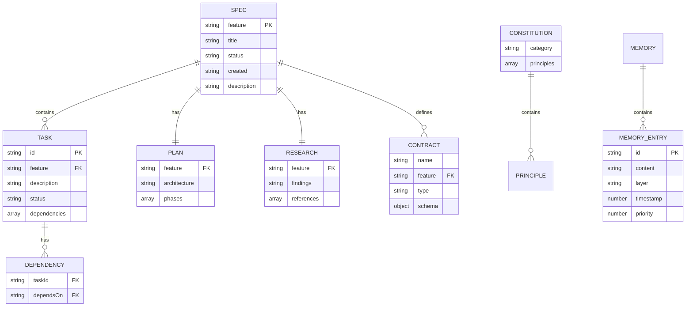

# Data Model

## Storage Architecture

Gofer uses a file-based storage architecture with no database dependencies. All data is stored in the `.specify/` directory using JSONL (JSON Lines), JSON, and Markdown formats, making it Git-friendly and human-readable.



## File System Schema

### Specification Directory

**Path:** `.specify/specs/{feature-id}/`

**Structure:**

```
.specify/specs/auth-001/
├── spec.md              # Feature specification
├── research.md          # Codebase research findings
├── plan.md              # Implementation plan
├── tasks.md             # Task breakdown with status
├── data-model.md        # Database schema (if applicable)
└── contracts/           # API contracts
    ├── api.yaml
    └── events.yaml
```

### Specification File (`spec.md`)

**Format:** Markdown with YAML frontmatter

**Schema:**

```yaml
---
feature: string # Unique feature ID (e.g., "auth-001")
status: enum # draft | in-progress | completed | archived
created: string # ISO date (YYYY-MM-DD)
updated?: string # ISO date (optional)
tags?: string[] # Optional tags
priority?: enum # low | medium | high | critical
---
```

**Markdown Sections:**

```markdown
# Feature Title

Brief description of the feature

## Functional Requirements

1. **FR-001**: First requirement
2. **FR-002**: Second requirement (depends on FR-001)
3. **FR-003**: Third requirement

## Success Criteria

- [ ] Criterion 1
- [ ] Criterion 2

## Protected Boundaries

Files that should not be modified by this feature:

- src/core/authentication.ts
- database/migrations/001_initial.sql

## Non-Functional Requirements

- Performance targets
- Security requirements
- Accessibility requirements
```

**Dependency Syntax:**

Tasks can declare dependencies:

```markdown
2. **FR-002**: Implement user model (depends on FR-001)
3. **FR-003**: Create API endpoint (depends on FR-002, FR-005)
```

### Tasks File (`tasks.md`)

**Format:** Markdown with checkboxes

**Structure:**

```markdown
# Tasks for Feature: auth-001

## Status

- Total: 5
- Completed: 2
- In Progress: 1
- Pending: 2

## Tasks

### Phase 1: Database

- [x] **FR-001**: Create database schema ✅ 2025-01-15
  - Status: completed
  - Dependencies: none
  - Notes: Used Prisma migrations

- [ ] **FR-002**: Implement user model
  - Status: in-progress
  - Dependencies: FR-001
  - Started: 2025-01-16

### Phase 2: API

- [ ] **FR-003**: Create authentication endpoint
  - Status: pending
  - Dependencies: FR-002
```

**Status Values:**

- `pending` - Not started
- `in-progress` - Currently being worked on
- `completed` - Done and validated
- `failed` - Attempted but blocked/failed

### Plan File (`plan.md`)

**Format:** Markdown

**Typical Sections:**

```markdown
# Implementation Plan: Feature Name

## Architecture Overview

High-level design decisions

## Component Breakdown

### Component 1: Authentication Service

- Responsibilities
- Dependencies
- API contracts

### Component 2: User Model

- Schema design
- Validation rules

## Implementation Phases

### Phase 1: Foundation (Est. 2 hours)

1. Task FR-001
2. Task FR-002

### Phase 2: Core Logic (Est. 4 hours)

3. Task FR-003

## Testing Strategy

- Unit tests
- Integration tests
- E2E scenarios

## Rollout Plan

- Feature flags
- Migration steps
- Rollback procedures
```

### Research File (`research.md`)

**Format:** Markdown

**Typical Sections:**

```markdown
# Research: Feature Name

## Codebase Analysis

### Existing Patterns

Found authentication pattern in:

- src/auth/provider.ts
- Uses JWT tokens
- Stores sessions in Redis

### Similar Implementations

Feature X (specs/feature-x) implemented similar pattern

## Technology Stack

- Framework: Express.js
- Database: PostgreSQL with Prisma ORM
- Auth library: Passport.js

## Recommendations

1. Reuse existing JWT implementation
2. Add refresh token support
3. Consider rate limiting

## Open Questions

- Should we support OAuth2?
- Session timeout duration?
```

## Constitution

**Path:** `.specify/memory/constitution.md`

**Format:** Markdown with categories

**Schema:**

```markdown
# Project Constitution

## Code Quality

### Principle 1: Type Safety

All functions must have explicit TypeScript types.

**Enforcement:** gofer_validate_code checks for:

- Return types on all functions
- Parameter types
- No use of `any` type

### Principle 2: Test Coverage

Minimum 80% code coverage for all features.

## Security

### Principle 1: Input Validation

All user input must be validated using Zod schemas.

### Principle 2: SQL Injection Prevention

Use parameterized queries only. Raw SQL forbidden.

## Performance

### Principle 1: API Response Time

All API endpoints must respond within 200ms (p95).
```

**Categories:**

- Code Quality
- Security
- Performance
- Accessibility
- Documentation
- Testing

## Memory System

### Memory Entry

**Path:** `.specify/memory/memories.jsonl`

**Format:** Append-only JSONL (one JSON object per line)

**Implementation:** `extension/src/autonomous/MemoryStorage.ts`

**Schema:**

```typescript
interface Memory {
  id: string;                    // 8-character hex ID
  content: string;               // Memory content
  category: string;              // user | project | technical | auto_decision | discovery
  tags: string[];                // Including #auto for system-generated
  scope: 'local' | 'global';     // Workspace-local or global
  layer?: 'core' | 'recall' | 'archival';  // MemGPT-inspired layers (opt-in)
  priority?: number;             // 0-10 (higher = more important)
  usedCount?: number;            // Access counter
  lastUsed?: number;             // Unix timestamp (ms)
  created: number;               // Unix timestamp (ms)
  learnedFrom?: string;          // Source (user | system | agent)
  agentId?: string;              // Agent that created memory
  relatedMemories?: RelatedMemory[];  // Graph edges
  backReferences?: string[];     // Incoming edges
  supersededBy?: string;         // Deprecation chain
  _deleted?: boolean;            // Soft deletion marker
}
```

**Example JSONL Entry:**
```json
{"id":"d16fcbc3","category":"discovery","tags":["#auto","#discovery","#spec-"],"scope":"local","content":"Research complete for spec . Memory coverage: 0.0%. Hints loaded: true","lastUsed":1771884921150,"usedCount":6,"learnedFrom":"","created":1770850738033}
```

**In-Memory Indexing:**
- Primary index: `Map<string, IndexEntry>` (by ID)
- Tag index: `Map<string, Set<string>>` (by tag)
- Category filtering: O(1) via `#auto` tag
- Token budget: 50,000 tokens max
- Concurrent write queue prevents corruption

**Layers (Optional - via `gofer.useLayeredMemory`):**

1. **Core Memory** - Always loaded, high priority
   - Project principles
   - Critical patterns
   - Common pitfalls

2. **Recall Memory** - Recent session context
   - Last 20 interactions
   - Current feature context
   - Recent decisions

3. **Archival Memory** - Searchable long-term storage
   - Historical decisions
   - Deprecated patterns
   - Migration notes

## Logs and Telemetry

### AI Usage/Council Usage Log

**Path:** `.specify/logs/council-usage.jsonl`

**Format:** Append-only JSONL

**Schema:**

```typescript
interface UsageRecord {
  provider: 'anthropic' | 'google' | 'openai';
  model: string;                 // claude-3-5-sonnet-20241022, gpt-4, etc.
  inputTokens: number;
  outputTokens: number;
  costUsd: number;               // Calculated from pricing.ts
  timestamp: string;             // ISO 8601
  sessionId: string;             // Claude Code session ID
  councilId?: string;            // LLM Council run ID
}
```

**Monitored By:** `extension/src/autonomous/AIUsageMonitor.ts`
- File watcher (chokidar) for real-time updates
- Fallback polling: 60s interval (configurable)
- Cached for 5s TTL

### Tool Audit Log

**Path:** `.specify/logs/tool-audit.jsonl`

**Format:** Append-only JSONL

**Schema:**

```typescript
interface ToolAuditEntry {
  timestamp: string;             // ISO 8601
  tool: string;                  // MCP tool name (gofer_get_specs, etc.)
  filePath?: string;             // File accessed
  scopeViolation: boolean;       // Whether access violated boundaries
  allowed: boolean;              // Whether access was allowed
  userId?: string;               // User or agent ID
  sessionId?: string;            // Session ID
}
```

**Purpose:** Security audit trail for ScopeGuard (`extension/src/autonomous/ScopeGuard.ts`)

### Slop Reduction Log

**Path:** `.specify/logs/slop-reduction.jsonl`

**Format:** Append-only JSONL

**Schema:**

```typescript
interface SlopReductionEntry {
  timestamp: string;             // ISO 8601
  filePath: string;              // File cleaned
  fixes: SlopFix[];              // List of fixes applied
  sessionId?: string;
}

interface SlopFix {
  type: 'console.log' | 'debugger' | '@ts-ignore';
  line: number;
  column: number;
  original: string;              // Original code
  replacement?: string;          // Replacement (empty for removal)
}
```

**Trigger:** 
- On file save (opt-in via `gofer.yoloSlopReduction.enabled`)
- Manual command: `Gofer: Check for Slop`
- Implementation: `extension/src/autonomous/SlopReducer.ts`

### Pipeline Run Ledger

**Path:** `.specify/logs/gofer-run-ledger.jsonl`

**Format:** Append-only JSONL

**Schema:**

```typescript
interface PipelineRunEntry {
  runId: string;                 // UUID
  specId: string;                // Spec being executed
  stage: string;                 // research | specify | plan | tasks | implement | validate
  startTime: string;             // ISO 8601
  endTime?: string;              // ISO 8601
  totalTokens: number;           // Input + output tokens
  costUsd: number;               // Total cost
  budgetExceeded: boolean;       // Whether budget was exceeded
  enforcementAction?: 'truncate' | 'block';
}
```

**Purpose:** Cost attribution and budget enforcement via `extension/src/autonomous/CostBudgetEnforcer.ts`

## Indexes and Constraints

### Primary Keys

- Specification: `feature` (string, unique)
- Task: `{feature}/{taskId}` (composite)
- Memory Entry: `id` (UUID)
- Log Entry: `timestamp` + `runId` (composite)

### Foreign Keys

- Task → Spec: `feature` references `spec.feature`
- Task Dependency: `dependsOn` references `task.id`

### Unique Constraints

- Spec `feature` must be globally unique
- Task `id` must be unique within a spec
- Memory `id` must be globally unique

### Validation Rules

**Spec Status Transitions:**

```mermaid
stateDiagram-v2
    [*] --> draft
    draft --> in-progress
    in-progress --> completed
    in-progress --> draft
    completed --> archived
    archived --> [*]
```

**Task Status Transitions:**

```mermaid
stateDiagram-v2
    [*] --> pending
    pending --> in-progress
    in-progress --> completed
    in-progress --> failed
    failed --> pending
    completed --> [*]
```

## File Locations Reference

```
.specify/
├── specs/
│   ├── {spec-id}/
│   │   ├── spec.md                    # Specification (Markdown + YAML frontmatter)
│   │   ├── tasks.md                   # Task breakdown (Markdown checklist)
│   │   ├── research.md                # Research notes
│   │   ├── research-index.json        # Chunk index (for files >50KB)
│   │   ├── plan.md                    # Implementation plan
│   │   └── .branch-info.json          # Git branch metadata
│   └── _archived/                     # Completed specs
├── memory/
│   ├── memories.jsonl                 # Active memories (append-only JSONL)
│   ├── archive.jsonl                  # Archived memories
│   ├── constitution.md                # Coding principles
│   ├── hints.md                       # User hints
│   ├── enriched-context.json          # Context metadata
│   └── knowledge-graph.json           # Memory graph
├── logs/
│   ├── council-usage.jsonl            # Token usage records
│   ├── tool-audit.jsonl               # File access audit
│   ├── slop-reduction.jsonl           # Code quality fixes
│   └── gofer-run-ledger.jsonl         # Pipeline run costs
├── ipc/
│   └── status.json                    # Orchestrator IPC status
├── current-stage.json                 # Active pipeline stage
└── spec-schema.json                   # JSON schema for specs
```

## Storage Characteristics

### Performance

| Operation | Time Complexity | Notes |
|-----------|----------------|-------|
| Spec lookup | O(1) | In-memory cache |
| Memory lookup by ID | O(1) | Hash map index |
| Memory lookup by tag | O(k) | k = memories with tag |
| Memory full scan | O(n) | n = total memories |
| Spec parse | O(m) | m = file size |
| JSONL append | O(1) | Atomic append |
| Index rebuild | O(n) | n = JSONL lines |

### Scale Limits

| Resource | Limit | Mitigation |
|----------|-------|------------|
| In-memory spec cache | ~100 specs | Lazy loading |
| Memory index tokens | 50,000 tokens | Compaction at 80% |
| JSONL file size | 8MB warning | Compaction to archive.jsonl |
| Research chunks | 50KB per chunk | On-demand loading |
| Concurrent writes | Serialized | Write queue |

### Data Integrity

**Write Safety:**
- Atomic file writes via `fs.writeFile` (overwrites)
- Append-only via serialized `fs.appendFile` (JSONL)
- Write queue prevents concurrent corruption (NFR-017)
- No partial writes (Node.js guarantees)

**Concurrency:**
- Extension: Single-threaded (V8 event loop)
- Language Server: Separate process (stdio IPC)
- Orchestrator: Separate process (file-based IPC)

**Crash Recovery:**
- JSONL: Last-writer-wins on duplicate IDs
- Soft deletion: `_deleted: true` markers preserved
- Index rebuild: Full rebuild on startup

**Migration:**
- Legacy `local.json` → JSONL (automatic on first run)
- Backward compatible: Old formats still readable

## Best Practices

### For Developers

1. **Use append-only writes for logs** - Never truncate JSONL files
2. **Serialize concurrent writes** - Use write queue pattern (`MemoryStorage.ts`)
3. **Invalidate caches on file changes** - Use `chokidar` watchers (500ms debounce)
4. **Implement soft deletion** - Set `_deleted: true` instead of removing
5. **Index for fast queries** - Build in-memory indexes on startup
6. **Chunk large files** - Use research chunking for files >50KB
7. **Set token budgets** - Prevent unbounded memory growth (50,000 token limit)

### For Users

1. **Commit `.specify/` to git** - All data is version-controlled
2. **Back up JSONL files** - Append-only means no automatic cleanup
3. **Monitor JSONL size** - Compact when warned (8MB threshold)
4. **Archive old specs** - Move completed specs to `_archived/`
5. **Review memory panel** - Filter system memories (533 → 0 by default via `#auto` tag)
6. **Check audit logs** - Review `tool-audit.jsonl` for scope violations

## Migration History

No database migrations - file-based storage only.

### Format Migrations

**v1.x → v3.0 (JSONL Memory Storage)**

- Migrated from `local.json` to `memories.jsonl` (append-only)
- Added in-memory indexing for fast queries
- Introduced soft deletion with `_deleted: true`
- Added token budget tracking (50,000 token limit)

**Migration Command:**

```bash
# Automatic migration on first run
# MemoryStorage.ts migrates legacy local.json → memories.jsonl
```

**v1.0 → v3.0 (Spec Format)**

- Migrated from JSON specs to Markdown with YAML frontmatter
- Added `.specify/` directory structure
- Introduced constitution.md
- Added memory system

**Migration Command:**

```bash
# Via extension
Gofer: Upgrade to Gofer Format
```
