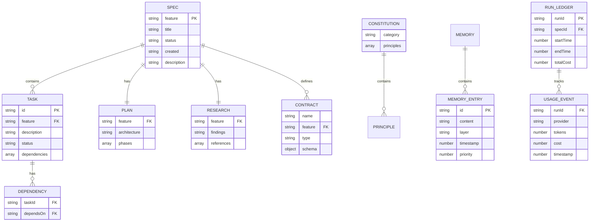

# Data Model

## Storage Architecture

Gofer uses a file-based storage architecture with no database dependencies. All
data is stored in the `.specify/` directory using JSONL (JSON Lines), JSON, and
Markdown formats, making it Git-friendly and human-readable.



## File System Schema

### Specification Directory

**Path:** `.specify/specs/{feature-id}/`

**Structure:**

```
.specify/specs/auth-001/
├── spec.md              # Feature specification
├── research.md          # Codebase research findings
├── plan.md              # Implementation plan
├── tasks.md             # Task breakdown with status
├── data-model.md        # Database schema (if applicable)
├── traceability.md      # Spec-to-task mapping
├── issues.md            # GitHub-ready issues
└── contracts/           # API contracts
    ├── api.yaml
    └── events.yaml
```

### Specification File (`spec.md`)

**Format:** Markdown with YAML frontmatter

**Schema:**

```yaml
---
feature: string # Unique feature ID (e.g., "auth-001")
status: enum # draft | in-progress | completed | archived
created: string # ISO date (YYYY-MM-DD)
updated?: string # ISO date (optional)
tags?: string[] # Optional tags
priority?: enum # low | medium | high | critical
---
```

**Markdown Sections:**

```markdown
# Feature Title

Brief description of the feature

## Functional Requirements

1. **FR-001**: First requirement
2. **FR-002**: Second requirement (depends on FR-001)
3. **FR-003**: Third requirement

## Success Criteria

- [ ] Criterion 1
- [ ] Criterion 2

## Protected Boundaries

Files that should not be modified by this feature:

- src/core/authentication.ts
- database/migrations/001_initial.sql

## Non-Functional Requirements

- Performance targets
- Security requirements
- Accessibility requirements
```

**Dependency Syntax:**

Tasks can declare dependencies:

```markdown
2. **FR-002**: Implement user model (depends on FR-001)
3. **FR-003**: Create API endpoint (depends on FR-002, FR-005)
```

### Tasks File (`tasks.md`)

**Format:** Markdown with checkboxes

**Structure:**

```markdown
# Tasks for Feature: auth-001

## Status

- Total: 5
- Completed: 2
- In Progress: 1
- Pending: 2

## Tasks

### Phase 1: Database

- [x] **FR-001**: Create database schema ✅ 2025-01-15
  - Status: completed
  - Dependencies: none
  - Notes: Used Prisma migrations

- [ ] **FR-002**: Implement user model
  - Status: in-progress
  - Dependencies: FR-001
  - Started: 2025-01-16

### Phase 2: API

- [ ] **FR-003**: Create authentication endpoint
  - Status: pending
  - Dependencies: FR-002
```

**Status Values:**

- `pending` - Not started
- `in-progress` - Currently being worked on
- `completed` - Done and validated
- `failed` - Attempted but blocked/failed

### Plan File (`plan.md`)

**Format:** Markdown

**Typical Sections:**

```markdown
# Implementation Plan: Feature Name

## Architecture Overview

High-level design decisions

## Component Breakdown

### Component 1: Authentication Service

- Responsibilities
- Dependencies
- API contracts

### Component 2: User Model

- Schema design
- Validation rules

## Implementation Phases

### Phase 1: Foundation (Est. 2 hours)

1. Task FR-001
2. Task FR-002

### Phase 2: Core Logic (Est. 4 hours)

3. Task FR-003

## Testing Strategy

- Unit tests
- Integration tests
- E2E scenarios

## Rollout Plan

- Feature flags
- Migration steps
- Rollback procedures
```

### Research File (`research.md`)

**Format:** Markdown

**Typical Sections:**

```markdown
# Research: Feature Name

## Codebase Analysis

### Existing Patterns

Found authentication pattern in:

- src/auth/provider.ts
- Uses JWT tokens
- Stores sessions in Redis

### Similar Implementations

Feature X (specs/feature-x) implemented similar pattern

## Technology Stack

- Framework: Express.js
- Database: PostgreSQL with Prisma ORM
- Auth library: Passport.js

## Recommendations

1. Reuse existing JWT implementation
2. Add refresh token support
3. Consider rate limiting

## Open Questions

- Should we support OAuth2?
- Session timeout duration?
```

## Constitution

**Path:** `.specify/memory/constitution.md`

**Format:** Markdown with categories

**Schema:**

```markdown
# Project Constitution

## Code Quality

### Principle 1: Type Safety

All functions must have explicit TypeScript types.

**Enforcement:** gofer_validate_code checks for:

- Return types on all functions
- Parameter types
- No use of `any` type

### Principle 2: Test Coverage

Minimum 80% code coverage for all features.

## Security

### Principle 1: Input Validation

All user input must be validated using Zod schemas.

### Principle 2: SQL Injection Prevention

Use parameterized queries only. Raw SQL forbidden.

## Performance

### Principle 1: API Response Time

All API endpoints must respond within 200ms (p95).
```

**Categories:**

- Code Quality
- Security
- Performance
- Accessibility
- Documentation
- Testing

## Memory System

### Memory Entry

**Path:** `.specify/memory/memories.jsonl`

**Format:** Append-only JSONL (one JSON object per line)

**Schema:**

```typescript
interface MemoryEntry {
  id: string; // UUID v4
  content: string; // Memory text
  layer: 'core' | 'recall' | 'archival'; // MemGPT layer
  timestamp: number; // Unix timestamp (ms)
  priority: number; // 0-100 (higher = more important)
  tags?: string[]; // Optional tags (#auto, #user, etc.)
  category?: string; // Optional category
  metadata?: {
    source?: string; // Where this memory came from
    lastAccessed?: number; // Last access timestamp
    accessCount?: number; // How many times accessed
  };
}
```

**Example:**

```jsonl
{"id":"mem_123","content":"Use Prisma for database access","layer":"core","timestamp":1704067200000,"priority":90,"tags":["#user"],"category":"database"}
{"id":"mem_124","content":"Validated spec auth-001 at 15:30","layer":"archival","timestamp":1704067800000,"priority":10,"tags":["#auto"],"category":"system"}
```

**Indexing:**

In-memory index built on load:

```typescript
interface MemoryIndex {
  byId: Map<string, MemoryEntry>;
  byLayer: Map<string, Set<string>>; // layer -> memory IDs
  byTag: Map<string, Set<string>>; // tag -> memory IDs
  byCategory: Map<string, Set<string>>; // category -> memory IDs
}
```

### Memory Compaction

**Trigger:** Every 30 minutes (configurable)

**Process:**

1. Identify low-priority archival memories (priority < 20)
2. Combine similar memories
3. Update priorities based on access patterns
4. Write compacted entries back to JSONL

**Preserved:**

- All core layer memories
- Recent recall layer memories (last 7 days)
- High-priority archival memories (priority ≥ 50)

## Logs

### Council Usage Log

**Path:** `.specify/logs/council-usage.jsonl`

**Format:** JSONL

**Schema:**

```typescript
interface CouncilUsageEntry {
  timestamp: number; // Unix timestamp (ms)
  provider: 'anthropic' | 'google' | 'openai';
  model: string; // e.g., "claude-3-5-sonnet-20241022"
  inputTokens: number;
  outputTokens: number;
  totalTokens: number;
  cost: number; // USD
  runId?: string; // Optional run ID for cost attribution
  specId?: string; // Optional spec ID
  stage?: string; // Optional pipeline stage
}
```

**Example:**

```jsonl
{
  "timestamp": 1704067200000,
  "provider": "anthropic",
  "model": "claude-3-5-sonnet-20241022",
  "inputTokens": 5000,
  "outputTokens": 2000,
  "totalTokens": 7000,
  "cost": 0.06,
  "runId": "run_xyz",
  "specId": "auth-001",
  "stage": "implement"
}
```

### Tool Audit Log

**Path:** `.specify/logs/tool-audit.jsonl`

**Format:** JSONL

**Schema:**

```typescript
interface ToolAuditEntry {
  timestamp: number;
  tool: string; // MCP tool name
  operation: 'read' | 'write' | 'execute';
  path?: string; // File path if applicable
  allowed: boolean; // Whether operation was allowed
  scopeViolation?: boolean; // Whether ScopeGuard blocked it
  userId?: string; // Optional user ID
}
```

**Example:**

```jsonl
{"timestamp":1704067200000,"tool":"gofer_execute_task","operation":"read","path":".specify/specs/auth-001/spec.md","allowed":true}
{"timestamp":1704067300000,"tool":"gofer_validate_code","operation":"read","path":"src/core/authentication.ts","allowed":false,"scopeViolation":true}
```

### Slop Reduction Log

**Path:** `.specify/logs/slop-reduction.jsonl`

**Format:** JSONL

**Schema:**

```typescript
interface SlopReductionEntry {
  timestamp: number;
  file: string; // File path
  fixes: {
    console: number; // console.log removals
    debugger: number; // debugger removals
    tsIgnore: number; // @ts-ignore upgrades
  };
  trigger: 'save' | 'manual' | 'continuous';
}
```

**Example:**

```jsonl
{
  "timestamp": 1704067200000,
  "file": "src/auth.ts",
  "fixes": {
    "console": 3,
    "debugger": 1,
    "tsIgnore": 0
  },
  "trigger": "save"
}
```

### Run Ledger

**Path:** `.specify/logs/gofer-run-ledger.jsonl`

**Format:** JSONL

**Schema:**

```typescript
interface RunLedgerEntry {
  runId: string; // UUID v4
  specId: string;
  stage: string; // Pipeline stage
  startTime: number;
  endTime?: number;
  status: 'running' | 'completed' | 'failed';
  totalTokens: number;
  totalCost: number; // USD
  providers: {
    [key: string]: {
      // provider name
      tokens: number;
      cost: number;
    };
  };
}
```

**Example:**

```jsonl
{
  "runId": "run_xyz",
  "specId": "auth-001",
  "stage": "implement",
  "startTime": 1704067200000,
  "endTime": 1704074400000,
  "status": "completed",
  "totalTokens": 150000,
  "totalCost": 0.75,
  "providers": {
    "anthropic": {
      "tokens": 150000,
      "cost": 0.75
    }
  }
}
```

## State Management

### Current Stage

**Path:** `.specify/current-stage.json`

**Format:** JSON

**Schema:**

```json
{
  "stage": "implement",
  "specId": "auth-001",
  "lastUpdated": 1704067200000,
  "stale": false
}
```

**Staleness Detection:**

If `lastUpdated` is older than 30 minutes (configurable), mark as `stale: true`
and fall back to heuristic detection.

### IPC Status

**Path:** `.specify/ipc/status.json`

**Format:** JSON

**Schema:**

```json
{
  "orchestratorRunning": true,
  "currentTask": "FR-003",
  "progress": {
    "total": 5,
    "completed": 2,
    "inProgress": 1,
    "pending": 2
  },
  "lastHeartbeat": 1704067200000
}
```

**Purpose:** Orchestrator status signaling to extension UI

## Migration History

Gofer does not use traditional database migrations. All data is file-based.

**Schema Evolution:**

- **v1.0 → v1.5:** Added JSONL memory format (replaced JSON)
- **v1.5 → v2.0:** Added layered memory system (core/recall/archival)
- **v2.0 → v3.0:** Added run ledger for cost attribution
- **v3.0 → v3.2:** Added skills pipeline augmentation support

**Migration Tools:**

- `Gofer: Migrate Memories to Layered Format` - VSCode command
- Automatic backward compatibility for reading old formats

## Indexes and Constraints

### File System Constraints

- Spec IDs must be unique within `.specify/specs/`
- Spec ID format: `{number}-{kebab-case-name}` (e.g., `001-authentication`)
- Memory IDs must be UUID v4
- Run IDs must be UUID v4

### Integrity Checks

**Extension Startup:**

1. Verify `.specify/` directory exists
2. Verify memory JSONL is valid (parseable)
3. Rebuild in-memory indexes
4. Detect orphaned specs (no spec.md file)

**MCP Tools:**

- `gofer_get_specs` - Validates all spec.md files have valid frontmatter
- `gofer_execute_task` - Validates task ID exists in tasks.md
- `gofer_validate_code` - Validates constitution.md is parseable

## Data Retention

**Logs:**

- Council usage: Indefinite (user can manually purge)
- Tool audit: Indefinite (user can manually purge)
- Slop reduction: Indefinite (user can manually purge)
- Run ledger: Indefinite (user can manually purge)

**Memory:**

- Core layer: Never purged
- Recall layer: 7-day retention (compacted after)
- Archival layer: Low-priority entries compacted every 30 minutes

**Specs:**

- Active specs: Indefinite
- Archived specs: Moved to `.specify/specs/_archived/`

**User Control:**

- `Gofer: Clear Memory` - Clears all memory except core layer
- `Gofer: Forget Memory` - Removes specific memory entry
- Manual deletion of JSONL log files
