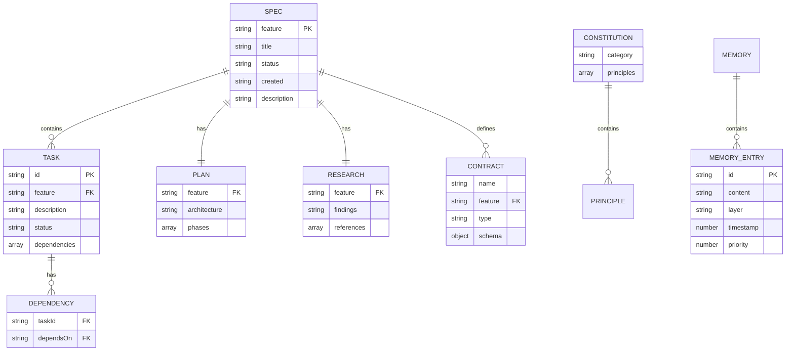

# Data Model

## Storage Architecture

Gofer uses a file-based storage model with structured directories and markdown files.



## File System Schema

### Specification Directory

**Path:** `.specify/specs/{feature-id}/`

**Structure:**
```
.specify/specs/auth-001/
├── spec.md              # Feature specification
├── research.md          # Codebase research findings
├── plan.md              # Implementation plan
├── tasks.md             # Task breakdown with status
├── data-model.md        # Database schema (if applicable)
└── contracts/           # API contracts
    ├── api.yaml
    └── events.yaml
```

### Specification File (`spec.md`)

**Format:** Markdown with YAML frontmatter

**Schema:**
```yaml
---
feature: string           # Unique feature ID (e.g., "auth-001")
status: enum             # draft | in-progress | completed | archived
created: string          # ISO date (YYYY-MM-DD)
updated?: string         # ISO date (optional)
tags?: string[]          # Optional tags
priority?: enum          # low | medium | high | critical
---
```

**Markdown Sections:**
```markdown
# Feature Title

Brief description of the feature

## Functional Requirements

1. **FR-001**: First requirement
2. **FR-002**: Second requirement (depends on FR-001)
3. **FR-003**: Third requirement

## Success Criteria

- [ ] Criterion 1
- [ ] Criterion 2

## Protected Boundaries

Files that should not be modified by this feature:
- src/core/authentication.ts
- database/migrations/001_initial.sql

## Non-Functional Requirements

- Performance targets
- Security requirements
- Accessibility requirements
```

**Dependency Syntax:**

Tasks can declare dependencies:
```markdown
2. **FR-002**: Implement user model (depends on FR-001)
3. **FR-003**: Create API endpoint (depends on FR-002, FR-005)
```

### Tasks File (`tasks.md`)

**Format:** Markdown with checkboxes

**Structure:**
```markdown
# Tasks for Feature: auth-001

## Status

- Total: 5
- Completed: 2
- In Progress: 1
- Pending: 2

## Tasks

### Phase 1: Database

- [x] **FR-001**: Create database schema ✅ 2025-01-15
  - Status: completed
  - Dependencies: none
  - Notes: Used Prisma migrations

- [ ] **FR-002**: Implement user model
  - Status: in-progress
  - Dependencies: FR-001
  - Started: 2025-01-16

### Phase 2: API

- [ ] **FR-003**: Create authentication endpoint
  - Status: pending
  - Dependencies: FR-002
```

**Status Values:**
- `pending` - Not started
- `in-progress` - Currently being worked on
- `completed` - Done and validated
- `failed` - Attempted but blocked/failed

### Plan File (`plan.md`)

**Format:** Markdown

**Typical Sections:**
```markdown
# Implementation Plan: Feature Name

## Architecture Overview

High-level design decisions

## Component Breakdown

### Component 1: Authentication Service
- Responsibilities
- Dependencies
- API contracts

### Component 2: User Model
- Schema design
- Validation rules

## Implementation Phases

### Phase 1: Foundation (Est. 2 hours)
1. Task FR-001
2. Task FR-002

### Phase 2: Core Logic (Est. 4 hours)
3. Task FR-003

## Testing Strategy

- Unit tests
- Integration tests
- E2E scenarios

## Rollout Plan

- Feature flags
- Migration steps
- Rollback procedures
```

### Research File (`research.md`)

**Format:** Markdown

**Typical Sections:**
```markdown
# Research: Feature Name

## Codebase Analysis

### Existing Patterns

Found authentication pattern in:
- src/auth/provider.ts
- Uses JWT tokens
- Stores sessions in Redis

### Similar Implementations

Feature X (specs/feature-x) implemented similar pattern

## Technology Stack

- Framework: Express.js
- Database: PostgreSQL with Prisma ORM
- Auth library: Passport.js

## Recommendations

1. Reuse existing JWT implementation
2. Add refresh token support
3. Consider rate limiting

## Open Questions

- Should we support OAuth2?
- Session timeout duration?
```

## Constitution

**Path:** `.specify/memory/constitution.md`

**Format:** Markdown with categories

**Schema:**
```markdown
# Project Constitution

## Code Quality

### Principle 1: Type Safety
All functions must have explicit TypeScript types.

**Enforcement:** gofer_validate_code checks for:
- Return types on all functions
- Parameter types
- No use of `any` type

### Principle 2: Test Coverage
Minimum 80% code coverage for all features.

## Security

### Principle 1: Input Validation
All user input must be validated using Zod schemas.

### Principle 2: SQL Injection Prevention
Use parameterized queries only. Raw SQL forbidden.

## Performance

### Principle 1: API Response Time
All API endpoints must respond within 200ms (p95).
```

**Categories:**
- Code Quality
- Security
- Performance
- Accessibility
- Documentation
- Testing

## Memory System

### Memory Entry

**Path:** `.specify/memory/memories/{id}.md`

**Format:** Markdown with YAML frontmatter

**Schema:**
```yaml
---
id: string              # UUID
layer: enum             # core | recall | archival
priority: number        # 1-10 (10 = highest)
created: number         # Unix timestamp
updated: number         # Unix timestamp
tags: string[]          # ["api", "authentication"]
---

Memory content in markdown format...
```

**Layers:**

1. **Core Memory** - Always loaded, high priority
   - Project principles
   - Critical patterns
   - Common pitfalls

2. **Recall Memory** - Recent session context
   - Last 20 interactions
   - Current feature context
   - Recent decisions

3. **Archival Memory** - Searchable long-term storage
   - Historical decisions
   - Deprecated patterns
   - Migration notes

### Compaction History

**Path:** `.specify/memory/compaction-history.jsonl`

**Format:** JSON Lines (one entry per compaction)

**Schema:**
```json
{
  "timestamp": 1642534800000,
  "beforeSize": 150000,
  "afterSize": 95000,
  "compressionRatio": 0.63,
  "entriesProcessed": 42,
  "entriesArchived": 15,
  "duration": 234
}
```

## Logs and Telemetry

### Task Execution Log

**Path:** `.specify/logs/task-execution.jsonl`

**Schema:**
```json
{
  "timestamp": "2025-01-15T10:30:00Z",
  "feature": "auth-001",
  "taskId": "FR-002",
  "action": "started",
  "agent": "claude-code",
  "context": {
    "branch": "feature/auth-001",
    "commit": "a1b2c3d4"
  }
}
```

### Tool Audit Log

**Path:** `.specify/logs/tool-audit.jsonl`

**Schema:**
```json
{
  "timestamp": "2025-01-15T10:30:00Z",
  "tool": "gofer_execute_task",
  "parameters": {
    "feature": "auth-001",
    "taskId": "FR-002"
  },
  "result": "success",
  "duration": 123,
  "scopeViolations": []
}
```

### Context Usage Log

**Path:** `.specify/logs/context-usage.jsonl`

**Schema:**
```json
{
  "timestamp": "2025-01-15T10:30:00Z",
  "sessionId": "session-123",
  "stage": "implement",
  "contextSize": 125000,
  "maxSize": 200000,
  "utilization": 0.625,
  "components": {
    "research": 18750,
    "memory": 31250,
    "code": 50000,
    "observations": 25000
  }
}
```

### Cost Ledger

**Path:** `.specify/logs/gofer-run-ledger.jsonl`

**Schema:**
```json
{
  "runId": "run-20250115-1030",
  "feature": "auth-001",
  "startTime": "2025-01-15T10:30:00Z",
  "endTime": "2025-01-15T11:45:00Z",
  "provider": "anthropic",
  "model": "claude-3-5-sonnet-20241022",
  "tokens": {
    "input": 125000,
    "output": 35000,
    "total": 160000
  },
  "cost": {
    "input": 0.375,
    "output": 1.05,
    "total": 1.425
  }
}
```

### Slop Reduction Log

**Path:** `.specify/logs/slop-reduction.jsonl`

**Schema:**
```json
{
  "timestamp": "2025-01-15T10:30:00Z",
  "file": "src/models/User.ts",
  "fixes": [
    {
      "type": "console.log",
      "line": 42,
      "removed": "console.log('User created:', user);"
    },
    {
      "type": "@ts-ignore",
      "line": 56,
      "upgraded": "@ts-expect-error - Legacy code to be refactored"
    }
  ]
}
```

## Indexes and Constraints

### Primary Keys

- Specification: `feature` (string, unique)
- Task: `{feature}/{taskId}` (composite)
- Memory Entry: `id` (UUID)
- Log Entry: `timestamp` + `runId` (composite)

### Foreign Keys

- Task → Spec: `feature` references `spec.feature`
- Task Dependency: `dependsOn` references `task.id`

### Unique Constraints

- Spec `feature` must be globally unique
- Task `id` must be unique within a spec
- Memory `id` must be globally unique

### Validation Rules

**Spec Status Transitions:**
```mermaid
stateDiagram-v2
    [*] --> draft
    draft --> in-progress
    in-progress --> completed
    in-progress --> draft
    completed --> archived
    archived --> [*]
```

**Task Status Transitions:**
```mermaid
stateDiagram-v2
    [*] --> pending
    pending --> in-progress
    in-progress --> completed
    in-progress --> failed
    failed --> pending
    completed --> [*]
```

## Migration History

No database migrations - file-based storage only.

### Format Migrations

**v1.0 → v1.17 (GitHub Gofer Format)**
- Migrated from JSON specs to Markdown with YAML frontmatter
- Added `.specify/` directory structure
- Introduced constitution.md
- Added memory system

**Migration Command:**
```bash
# Via extension
Gofer: Upgrade to Gofer Format

# Automatically converts:
# feature-001.json → .specify/specs/feature-001/spec.md
```
