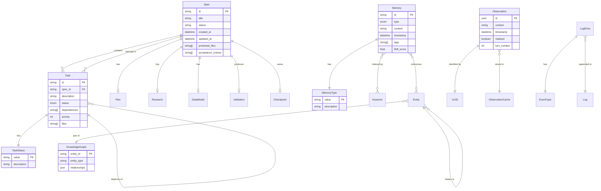

# Gofer - Data Model

## Executive Summary

Gofer uses a **file-based data model** with no database required. All data is
stored in the `.specify/` directory as Markdown, JSON, and JSONL files, making
it Git-friendly and human-readable. The schema follows a specification-centric
design where each spec has its own directory containing all related artifacts
(tasks, research, planning, validation results).

## Storage Technology

- **Format:** Markdown (specs, tasks, plans) + JSON (state, config) + JSONL
  (logs, memory)
- **Location:** `.specify/` directory in repository root
- **Version Control:** All files are Git-tracked except logs and cache
- **No Database:** Pure file-based storage for simplicity and transparency

## Directory Structure

```
.specify/
├── specs/                      # Feature specifications
│   └── {spec-id}/              # One directory per specification
│       ├── spec.md             # Main specification (Markdown + YAML frontmatter)
│       ├── tasks.md            # Task breakdown (checklist format)
│       ├── plan.md             # Implementation plan
│       ├── data-model.md       # Data model and ERD diagrams
│       ├── research.md         # Codebase research findings
│       ├── contracts.md        # API and integration contracts
│       ├── traceability.md     # Task-to-requirement mapping
│       ├── issues.md           # Known issues and blockers
│       ├── validation/         # Validation results
│       └── checkpoint.json     # Session checkpoint for resumption
├── memory/                     # Memory management
│   ├── memories.jsonl          # Legacy flat memory store (deprecated)
│   ├── core/                   # Core memories (layered system)
│   ├── recall/                 # Recall memories (layered system)
│   ├── archival/               # Archival memories (layered system)
│   ├── enriched-context.json   # Current task context (60s freshness)
│   ├── context-health-state.json # Context window health (30s TTL)
│   ├── observation-cache/      # UUID-indexed observations
│   │   ├── index.json          # Observation metadata index
│   │   └── {uuid}.json         # Individual observations
│   ├── knowledge-graph.json    # Entity relationships
│   └── constitution.md         # Project coding principles
├── logs/                       # Append-only logs
│   ├── context-usage.jsonl     # Local CLI/session usage observations
│   ├── tool-audit.jsonl        # MCP tool access audit
│   ├── slop-reduction.jsonl    # Code slop removal log
│   └── gofer-run-ledger.jsonl  # Pipeline run ledger with costs
├── templates/                  # Document templates
│   ├── spec-template.md
│   ├── plan-template.md
│   └── visual/                 # Visual artifact templates
│       ├── impact-canvas.md
│       ├── c4-context.md
│       └── ...
├── commands/                   # Canonical command definitions
│   ├── 0_business_scenario.md
│   ├── 1_gofer_research.md
│   └── ...
├── hooks/                      # Git hooks and automation
├── scripts/                    # Automation scripts
│   ├── bash/
│   └── node/
├── current-stage.json          # Current pipeline stage
├── ipc/                        # Inter-process communication
│   └── status.json             # Orchestrator status
└── .gofer-version              # Gofer format version
```

## Entity Relationship Diagram



## Data Schemas

### Specification Schema (spec.md)

**Format:** Markdown with YAML frontmatter

```yaml
---
id: "001-login-feature"
title: "User Login Feature"
status: "in_progress" # pending | in_progress | testing | completed | blocked
created_at: "2026-05-20T10:00:00Z"
updated_at: "2026-05-20T15:30:00Z"
branch: "feature/login"
protected_files:
  - "src/auth/*.ts"
  - ".env"
stage: "implement" # research | specify | plan | tasks | implement | validate
---

# User Login Feature

## Overview
...

## Requirements
...

## Acceptance Criteria
- [ ] Users can log in with email/password
- [ ] Invalid credentials show error
- [ ] Session expires after 1 hour

## Out of Scope
...
```

### Task Schema (tasks.md)

**Format:** Markdown checklist with task IDs

```markdown
## T001: Create User Model

**Status:** ✅ completed **Dependencies:** None **Priority:** P0 **Files:**
`src/models/User.ts`

Implementation notes...

## T002: Implement Password Hashing

**Status:** 🔄 in_progress **Dependencies:** T001 **Priority:** P0 **Files:**
`src/auth/password.ts`

Use bcrypt for hashing...

## T003: Create Login Endpoint

**Status:** ⏸️ pending **Dependencies:** T001, T002 **Priority:** P1 **Files:**
`src/api/auth.ts`
```

### Memory Schema (memories.jsonl)

**Format:** JSONL (newline-delimited JSON)

```json
{"id":"mem_001","type":"procedural","content":"Use bcrypt for password hashing","timestamp":"2026-05-20T10:00:00Z","tags":["auth","security"],"tfidf_score":0.87}
{"id":"mem_002","type":"semantic","content":"JWT tokens expire after 1 hour","timestamp":"2026-05-20T10:05:00Z","tags":["auth","jwt"],"tfidf_score":0.92}
```

**Memory Types:**

- `procedural` - How to do things
- `semantic` - What things mean
- `episodic` - What happened
- `decision` - Decisions made
- `prospective` - Future intentions

### Observation Schema (observation-cache/index.json)

**Format:** JSON

```json
{
  "observations": [
    {
      "id": "550e8400-e29b-41d4-a716-446655440000",
      "timestamp": "2026-05-20T10:00:00Z",
      "turn_number": 42,
      "masked": true,
      "summary": "Implemented JWT authentication",
      "size_bytes": 4096
    }
  ]
}
```

### Context Health Schema (context-health-state.json)

**Format:** JSON (30s TTL cache)

```json
{
  "timestamp": 1716206400000,
  "utilizationPercent": 72.5,
  "tokensUsed": 145000,
  "tokensAvailable": 200000,
  "stage": "80%-threshold",
  "breakdown": {
    "spec": 12000,
    "tasks": 8000,
    "memories": 25000,
    "observations": 45000,
    "constitution": 5000,
    "code": 30000,
    "other": 20000
  }
}
```

### Tool Audit Log Schema (tool-audit.jsonl)

**Format:** JSONL

```json
{"timestamp":"2026-05-20T10:00:00.123Z","tool":"gofer_execute_task","params":{"specId":"001-login-feature","taskId":"T001"},"files_accessed":["src/models/User.ts"],"success":true}
{"timestamp":"2026-05-20T10:01:00.456Z","tool":"gofer_validate_code","params":{"files":["src/models/User.ts"]},"files_accessed":["src/models/User.ts",".specify/memory/constitution.md"],"success":true}
```

### Run Ledger Schema (gofer-run-ledger.jsonl)

**Format:** JSONL

```json
{
  "run_id": "run_001",
  "spec_id": "001-login-feature",
  "start_time": "2026-05-20T10:00:00Z",
  "end_time": "2026-05-20T10:30:00Z",
  "stages_completed": ["research", "specify", "plan"],
  "cost_usd": 2.45,
  "tokens_used": { "sonnet": 50000, "haiku": 30000 },
  "status": "completed"
}
```

## Data Indexes

### Memory TF-IDF Index

- **Location:** In-memory (rebuilt on load)
- **Algorithm:** Term Frequency-Inverse Document Frequency
- **Purpose:** Fast keyword-based memory retrieval
- **Complexity:** O(n log n) for query

### Observation Cache Index

- **Location:** `.specify/memory/observation-cache/index.json`
- **Key:** UUID v4
- **Purpose:** Fast observation lookup by ID
- **Complexity:** O(1) for lookup

### Spec Cache

- **Location:** In-memory (language server)
- **TTL:** 60 seconds
- **Invalidation:** File change events via chokidar
- **Purpose:** Avoid redundant file reads

## Data Constraints

### Spec Constraints

- **ID Format:** Lowercase alphanumeric + hyphens (e.g., `001-login-feature`)
- **Status Values:** `pending`, `in_progress`, `testing`, `completed`, `blocked`
- **Frontmatter:** Required YAML block at top of spec.md
- **Protected Files:** Array of glob patterns

### Task Constraints

- **ID Format:** `T` + zero-padded number (e.g., `T001`, `T012`)
- **Status Values:** Same as spec status + `failed`
- **Dependencies:** Array of task IDs (must exist in same spec)
- **Circular Dependencies:** Detected and rejected

### Memory Constraints

- **ID Format:** `mem_` + incremental number
- **Type Values:** `procedural`, `semantic`, `episodic`, `decision`,
  `prospective`
- **Content:** Max 10,000 characters
- **Tags:** Max 10 tags per memory

### Observation Constraints

- **ID Format:** UUID v4 (RFC 4122)
- **Masking:** Automatic after 5 turns idle or 80% context utilization
- **Retention:** No automatic deletion (manual compaction only)

## Migration Notes

### Legacy Format Migration

- **Old Format:** `specs/` directory (no `.specify/` wrapper)
- **Migration Command:** `gofer.upgrade` (VS Code) or `gofer.fixSpecPaths` (fix
  references)
- **Backwards Compatibility:** Read-only support for old format

### Memory Layer Migration

- **Old Format:** Flat `.specify/memory/memories.jsonl`
- **New Format:** Layered `.specify/memory/{core,recall,archival}/`
- **Migration Command:** `gofer.migrateMemoriesToLayered`
- **Opt-in:** Old format still supported

## Performance Characteristics

### File Read Performance

- **Spec Load:** ~10ms (cached), ~50ms (uncached)
- **Memory Query:** ~20ms for 1000 memories (TF-IDF indexed)
- **Observation Expand:** ~5ms (UUID lookup)

### File Write Performance

- **Task Status Update:** ~15ms (single file write)
- **Memory Store:** ~10ms (append to JSONL)
- **Log Entry:** ~5ms (append-only, no blocking)

### Caching Strategy

- **Spec Cache:** 60s TTL, invalidated on file change
- **Context Health:** 30s TTL, no invalidation
- **Observation Index:** Loaded once, updated on add/remove

## Data Sensitivity Classification

| Data Type                    | Sensitivity | Rationale                     |
| ---------------------------- | ----------- | ----------------------------- |
| Specifications               | Low         | Intended for version control  |
| Tasks                        | Low         | Intended for version control  |
| Memory (procedural/semantic) | Low         | General project knowledge     |
| Memory (episodic/decision)   | Medium      | May contain code snippets     |
| Observations                 | Medium      | May contain sensitive context |
| API Keys                     | High        | Never logged or committed     |
| Logs                         | Low         | Audit trail only, no secrets  |

## Backup and Recovery

- **Version Control:** All `.specify/` content except `logs/` is Git-tracked
- **Checkpoint Files:** `.specify/specs/*/checkpoint.json` for session
  resumption
- **No Point-in-Time Recovery:** Rely on Git history
- **Disaster Recovery:** Restore from Git + regenerate logs
