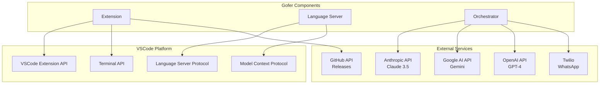
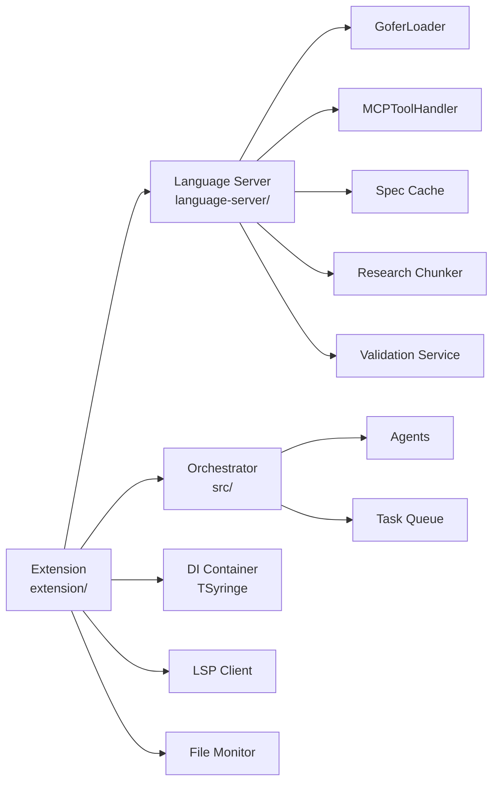

# Dependencies

## Dependency Overview

## Upstream Dependencies

Services that Gofer **calls** or **depends on**.

### 1. VSCode Platform (Required)

**Dependency:** VSCode Extension API **Type:** Platform **Version:** 1.85.0+
**Usage:** Core extension functionality **Critical:** Yes

**APIs Used:**

- Commands API - Command registration
- TreeView API - Sidebar panels
- WebView API - Content panels
- File System API - Spec file operations
- Terminal API - Claude Code monitoring
- Configuration API - Settings
- Language Client API - LSP connection

**Failure Impact:** Extension cannot run

---

### 2. Anthropic API (Optional)

**Dependency:** Claude 3.5 Sonnet, Claude 3.5 Haiku **Type:** External API
**Configuration:** `gofer.anthropicApiKey` **Usage:** Autonomous mode, LLM
council **Critical:** No (optional feature)

**Endpoints Used:**

- `POST /v1/messages` - Chat completions
- `GET /v1/organization/usage` - Billing data (admin key)
- Models:
  - `claude-3-5-sonnet-20241022` - Main orchestrator
  - `claude-3-5-haiku-20241022` - Quick decisions

**Rate Limits:**

- Free tier: 50 requests/day
- Paid tier: Based on subscription

**Failure Handling:**

- Autonomous mode disabled
- Falls back to manual operation
- User notified via status bar

**Cost per 1M tokens:**

- Sonnet input: $3.00, output: $15.00
- Haiku input: $0.80, output: $4.00

---

### 3. Google AI API (Optional)

**Dependency:** Gemini 1.5 Pro, Gemini 1.5 Flash **Type:** External API
**Configuration:** `gofer.googleApiKey` **Usage:** LLM council (multi-provider
validation) **Critical:** No

**Endpoints Used:**

- `POST /v1beta/models/{model}:generateContent`
- Models:
  - `gemini-1.5-pro`
  - `gemini-1.5-flash`

**Rate Limits:**

- Free tier: 60 requests/minute
- Paid tier: Based on subscription

**Failure Handling:**

- Council continues with remaining providers
- Minimum 2 providers required for voting

---

### 4. OpenAI API (Optional)

**Dependency:** GPT-4, GPT-4 Turbo **Type:** External API **Configuration:**
`gofer.openaiApiKey` **Usage:** LLM council (optional) **Critical:** No

**Endpoints Used:**

- `POST /v1/chat/completions`
- `GET /v1/usage` - Billing data (admin key with `api.usage.read` scope)
- Models:
  - `gpt-4-turbo`
  - `gpt-4`

**Rate Limits:**

- Tier 1: 500 requests/day
- Tier 5: 10,000 requests/day

**Failure Handling:**

- Same as Google AI - council continues

---

### 5. Twilio API (Optional)

**Dependency:** Twilio WhatsApp Business API **Type:** External API
**Configuration:** Environment variables **Usage:** Autonomous execution
notifications **Critical:** No

**Endpoints Used:**

- `POST /2010-04-01/Accounts/{AccountSid}/Messages.json`

**Configuration Required:**

- `TWILIO_ACCOUNT_SID`
- `TWILIO_AUTH_TOKEN`
- `TWILIO_PHONE_NUMBER`

**Failure Handling:**

- Notifications skipped
- Execution continues
- Error logged to output channel

---

### 6. GitHub API (Optional)

**Dependency:** GitHub REST API **Type:** External API **Usage:** Extension
auto-update checks **Critical:** No

**Endpoints Used:**

- `GET /repos/enterpriseaigroup/tech-docs/releases/latest`

**Rate Limits:**

- Unauthenticated: 60 requests/hour
- Authenticated: 5,000 requests/hour

**Failure Handling:**

- Auto-update checks disabled
- Extension continues normal operation

---

## Downstream Dependents

Services and tools that **depend on** Gofer.

### 1. Claude Code CLI (Optional Integration)

**Type:** AI CLI Tool **Version:** Latest **Usage:** MCP tool consumer

**Integration:**

- Calls Gofer MCP tools via stdio
- Reads `.claude/commands/` for slash commands
- Monitors `.specify/` directory for specs

**Benefits:**

- Full access to 40+ MCP tools
- Autonomous implementation workflows
- Context management

---

### 2. GitHub Copilot Chat (Optional Integration)

**Type:** AI Chat Tool **Version:** Latest **Usage:** Prompt consumer

**Integration:**

- Reads `.github/prompts/` for prompt commands
- Discovers Gofer pipeline stages
- Limited to chat-based interactions (no MCP)

**Benefits:**

- Core Gofer pipeline stages available
- Multi-platform workflow support

---

### 3. OpenAI Codex CLI (Optional Integration)

**Type:** AI CLI Tool **Version:** Latest **Usage:** Skill consumer

**Integration:**

- Reads `.agents/skills/` for skill definitions
- Discovers Gofer pipeline stages
- Limited to skill-based interactions (no MCP)

**Benefits:**

- Full feature support via skill system
- Budget diagnostics via `gofer:codex-doctor`

---

### 4. Gemini CLI (Optional Integration)

**Type:** AI CLI Tool **Version:** Latest **Usage:** Command file consumer

**Integration:**

- Reads `.gemini/commands/gofer/` for TOML command files
- Namespace support with `/gofer:*` prefix
- Limited to command file-based interactions (no MCP)

**Benefits:**

- Core pipeline stages available
- Namespace isolation

---

## External Service Dependencies

### NPM Registry

**Type:** Package Registry **Usage:** Dependency installation **Critical:** Yes
(build time only)

**Packages:**

- 47 production dependencies
- 54 development dependencies
- Total: 101 packages

**Failure Handling:**

- Build fails
- Use `npm ci --offline` for offline builds
- Lock file ensures reproducibility

---

### Node.js Runtime

**Type:** JavaScript Runtime **Version:** 20.x **Usage:** Extension runtime,
build tools **Critical:** Yes

**Requirements:**

- Node.js ≥20.0.0
- npm ≥10.0.0

---

## Dependency Diagram (Internal)

---

## Third-Party Package Dependencies

### Production Dependencies (Extension)

| Package                     | Version       | Purpose                         |
| --------------------------- | ------------- | ------------------------------- |
| @anthropic-ai/sdk           | ^0.67.0       | Anthropic API client            |
| @google/generative-ai       | ^0.21.0       | Google Gemini API client        |
| openai                      | ^4.104.0      | OpenAI API client               |
| vscode-languageclient       | ^9.0.1        | LSP client                      |
| tsyringe                    | ^4.10.0       | Dependency injection            |
| ws                          | ^8.18.0       | WebSocket support               |
| node-pty-prebuilt-multiarch | ^0.10.1-pre.5 | Terminal emulation              |
| chokidar                    | ^3.5.3        | File watching                   |
| fast-glob                   | ^3.3.2        | Fast file globbing              |
| graphlib                    | ^2.1.8        | Dependency graph resolution     |
| ajv                         | ^8.18.0       | JSON schema validation          |
| jszip                       | ^3.10.1       | ZIP file handling               |
| express                     | ^5.1.0        | HTTP server (optional features) |
| twilio                      | ^5.3.0        | WhatsApp notifications          |
| uuid                        | ^10.0.0       | UUID generation                 |

### Production Dependencies (Root)

| Package           | Version | Purpose                  |
| ----------------- | ------- | ------------------------ |
| @anthropic-ai/sdk | ^0.32.1 | Anthropic API client     |
| zod               | ^3.24.1 | Schema validation        |
| winston           | ^3.17.0 | Logging                  |
| gray-matter       | ^4.0.3  | YAML frontmatter parsing |
| reflect-metadata  | ^0.2.2  | TypeScript decorators    |

### Development Dependencies

| Package      | Version | Purpose             |
| ------------ | ------- | ------------------- |
| typescript   | ^5.7.2  | TypeScript compiler |
| webpack      | ^5.89.0 | Bundler             |
| vitest       | ^3.2.4  | Testing framework   |
| playwright   | ^1.49.1 | E2E testing         |
| eslint       | ^9.26.0 | Linting             |
| prettier     | ^3.0.0  | Code formatting     |
| @vscode/vsce | ^3.7.1  | VSIX packaging      |

---

## Security Considerations

### Dependency Scanning

- **npm audit** - Runs on every install
- **Dependabot** - Automated security updates (GitHub)
- **Lock files** - Ensure reproducible builds

### Known Vulnerabilities

**As of 2026-05-02:** 0 known critical vulnerabilities

**Monitoring:**

- Weekly `npm audit` checks
- Automated Dependabot PRs
- Manual review for major updates

### Update Policy

- **Critical security updates:** Immediate
- **Major version updates:** Monthly review
- **Minor/patch updates:** Automated (Dependabot)

---

## Offline Mode Support

Gofer can operate in offline mode with limited functionality:

**Offline Features:**

- ✅ Spec file editing
- ✅ Task management
- ✅ Local validation
- ✅ Constitution checking
- ✅ File system operations

**Requires Internet:**

- ❌ Autonomous mode (Claude API)
- ❌ LLM council (Anthropic/Google/OpenAI APIs)
- ❌ Auto-update checks (GitHub API)
- ❌ WhatsApp notifications (Twilio API)
- ❌ AI Usage Panel billing data (provider APIs)

---

## Dependency Health

**Status:** ✅ All dependencies healthy

**Last Audit:** 2026-05-02 **Critical Vulnerabilities:** 0 **High
Vulnerabilities:** 0 **Outdated Packages:** 0 major, 2 minor

**Automated Monitoring:**

- Dependabot alerts enabled
- Weekly dependency review
- Quarterly major version upgrade review
