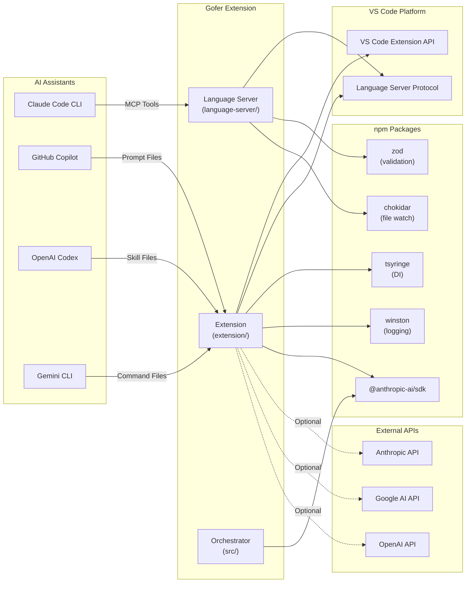

# Gofer - Dependencies

## Executive Summary

Gofer has three dependency categories:

1. **Production Dependencies** (npm packages) - 8 core packages
2. **Development Dependencies** - 26 packages for build, test, lint
3. **External Service Dependencies** - 3 optional AI APIs (Anthropic, Google,
   OpenAI)

All dependencies are managed via npm with lock files for reproducible builds.
External services are optional and user-configured.

## Upstream Dependencies (Services This Repo Calls)

### External APIs (Optional)

| Service           | Purpose                                               | Authentication           | Rate Limit                                | Criticality |
| ----------------- | ----------------------------------------------------- | ------------------------ | ----------------------------------------- | ----------- |
| **Anthropic API** | Claude 3.5 Sonnet/Haiku for autonomous implementation | API Key (user-provided)  | 50 req/min (Sonnet), 1000 req/min (Haiku) | Optional    |
| **Google AI API** | Gemini 1.5 Pro/Flash for LLM Council validation       | API Key (user-provided)  | 60 req/min (Pro), 1500 req/min (Flash)    | Optional    |
| **OpenAI API**    | GPT-4o for LLM Council validation                     | API Key (user-provided)  | 10,000 req/min                            | Optional    |
| **Twilio API**    | WhatsApp notifications (orchestrator only)            | Account SID + Auth Token | Varies by plan                            | Optional    |
| **GitHub API**    | Auto-update checking                                  | No auth (public API)     | 60 req/hour (unauthenticated)             | Optional    |

### VS Code Platform

| Service                              | Purpose                              | Version               | Criticality |
| ------------------------------------ | ------------------------------------ | --------------------- | ----------- |
| **VS Code Extension API**            | Extension host, commands, views, LSP | 1.93.0+               | Required    |
| **VS Code Language Server Protocol** | Communication with language server   | 9.0.1                 | Required    |
| **VS Code MCP Bridge**               | MCP tool exposure to AI assistants   | 1.102+ (experimental) | Core        |

## Downstream Dependents (Services That Call This Repo)

### AI Assistant CLIs

| Assistant               | Integration Method                        | Tool Access                   | Status  |
| ----------------------- | ----------------------------------------- | ----------------------------- | ------- |
| **Claude Code CLI**     | MCP via LSP                               | 22+ tools (direct invocation) | Primary |
| **GitHub Copilot Chat** | Prompt files (`.github/prompts/`)         | Indirect (files only)         | Core    |
| **OpenAI Codex CLI**    | Skill files (`.agents/skills/`)           | Indirect (files only)         | Core    |
| **Gemini CLI**          | Command files (`.gemini/commands/gofer/`) | Indirect (files only)         | Core    |

### VS Code Extension Consumers

| Consumer              | Integration         | Purpose                       |
| --------------------- | ------------------- | ----------------------------- |
| **VS Code User**      | Direct installation | Primary user interface        |
| **GitHub Codespaces** | Auto-installation   | Cloud development environment |

## Production npm Dependencies

### Core Runtime Dependencies

| Package             | Version | Purpose                                  | License      |
| ------------------- | ------- | ---------------------------------------- | ------------ |
| `@anthropic-ai/sdk` | 0.32.1  | Anthropic API client for Claude models   | MIT          |
| `chokidar`          | 4.0.3   | File system watching for spec changes    | MIT          |
| `dotenv`            | 16.6.1  | Environment variable loading             | BSD-2-Clause |
| `gray-matter`       | 4.0.3   | YAML frontmatter parsing for specs       | MIT          |
| `reflect-metadata`  | 0.2.2   | TypeScript decorator metadata            | Apache-2.0   |
| `tsyringe`          | 4.10.0  | Dependency injection container           | MIT          |
| `winston`           | 3.19.0  | Logging framework                        | MIT          |
| `ws`                | 8.19.0  | WebSocket support (future MCP transport) | MIT          |
| `zod`               | 3.25.76 | Schema validation for MCP tools          | MIT          |

**Total Production Dependencies:** 9 packages

### Extension-Specific Dependencies

Additional dependencies in `extension/package.json`:

| Package             | Version | Purpose                                  | License |
| ------------------- | ------- | ---------------------------------------- | ------- |
| `graphlib`          | 2.1.8   | Task dependency graph resolution         | MIT     |
| `uuid`              | 10.0.0  | Observation ID generation                | MIT     |
| `@anthropic-ai/sdk` | 0.67.1  | Anthropic API client (extension version) | MIT     |

## Development Dependencies

### Build & Compilation

| Package       | Version  | Purpose                          |
| ------------- | -------- | -------------------------------- |
| `typescript`  | 5.9.3    | TypeScript compiler              |
| `tsx`         | 4.21.0   | TypeScript execution for scripts |
| `@types/node` | 22.19.15 | Node.js type definitions         |

### Testing

| Package                 | Version | Purpose                          |
| ----------------------- | ------- | -------------------------------- |
| `vitest`                | 3.2.4   | Test runner (unit & integration) |
| `@vitest/ui`            | 3.2.4   | Vitest UI for test visualization |
| `@vitest/coverage-v8`   | 3.2.4   | Coverage reporting               |
| `@playwright/test`      | 1.58.2  | E2E testing framework            |
| `@vscode/test-cli`      | 0.0.12  | VS Code extension testing CLI    |
| `@vscode/test-electron` | 2.5.2   | VS Code extension test runner    |

### Linting & Formatting

| Package                            | Version | Purpose                      |
| ---------------------------------- | ------- | ---------------------------- |
| `eslint`                           | 9.39.4  | JavaScript/TypeScript linter |
| `@eslint/js`                       | 9.39.4  | ESLint JavaScript rules      |
| `typescript-eslint`                | 8.56.1  | TypeScript ESLint plugin     |
| `@typescript-eslint/parser`        | 8.56.1  | TypeScript parser for ESLint |
| `@typescript-eslint/eslint-plugin` | 8.56.1  | TypeScript ESLint rules      |
| `prettier`                         | 3.8.1   | Code formatter               |
| `lint-staged`                      | 16.3.2  | Run linters on staged files  |
| `husky`                            | 9.1.7   | Git hooks                    |

### Optional Development APIs

| Package                 | Version | Purpose                         |
| ----------------------- | ------- | ------------------------------- |
| `openai`                | 4.104.0 | OpenAI API client (dev only)    |
| `@google/generative-ai` | 0.21.0  | Google AI API client (dev only) |

**Total Development Dependencies:** 26 packages

## Dependency Diagram



## Dependency Update Strategy

### Automated Updates

- **Renovate Bot:** Configured for automated dependency PRs
- **Frequency:** Weekly scans
- **Auto-Merge:** Patch updates only (after CI passes)
- **Major Updates:** Manual review required

### Security Updates

- **npm audit:** Run during CI pipeline
- **GitHub Dependabot:** Security alerts enabled
- **Response Time:** < 48 hours for critical vulnerabilities

### Version Constraints

- **Production:** Pin to specific versions (`@anthropic-ai/sdk@0.32.1`)
- **Development:** Allow minor updates (`vitest@^3.2.4`)
- **VS Code API:** Minimum version (`^1.93.0`)

## Dependency Overrides

Security and compatibility overrides in `package.json`:

```json
{
  "overrides": {
    "diff": "^8.0.3", // Security fix for CVE
    "postcss": "^8.5.10", // Security fix
    "serialize-javascript": "^7.0.0" // Security fix
  }
}
```

## Critical Dependency Risks

### Anthropic SDK (@anthropic-ai/sdk)

- **Risk:** Breaking API changes
- **Mitigation:** Pin to specific version, monitor changelog
- **Fallback:** Graceful degradation (optional dependency)

### VS Code Extension API

- **Risk:** Minimum version compatibility
- **Mitigation:** Test against VS Code 1.93.0+ in CI
- **Fallback:** Document minimum required version

### tsyringe (Dependency Injection)

- **Risk:** Core service lifecycle management
- **Mitigation:** Extensive unit tests, DI abstraction layer
- **Fallback:** Manual service initialization (deprecated)

### chokidar (File Watching)

- **Risk:** File system event reliability
- **Mitigation:** Debounce events, cache with TTL
- **Fallback:** Manual refresh commands

## License Compliance

All production and development dependencies use permissive licenses:

- **MIT:** 90% of dependencies
- **Apache-2.0:** `reflect-metadata`
- **BSD-2-Clause:** `dotenv`

No copyleft licenses (GPL, AGPL) are used.

## Dependency Size Analysis

### Production Bundle Size

- **Extension:** ~10MB (VSIX package)
- **Agent Plugin:** ~500KB (ZIP)
- **Language Server:** ~2MB (bundled in extension)

### node_modules Size

- **Production:** ~50MB
- **Development:** ~300MB

## Removal & Deprecation

### Recently Removed

- `node-pty-prebuilt-multiarch` (v3.0) - Removed due to native dependency
  issues, replaced with WebSocket terminal

### Deprecated

- `.specify/memory/memories.jsonl` (flat memory) - Replaced by layered memory
  system (opt-in migration)

### Planned Removal

- `src/orchestrator/` (CLI-based orchestrator) - Replaced by extension-based
  ACCOrchestrator

## Installation Requirements

### Minimum Node.js Version

- **Node.js:** 24.x (LTS)
- **npm:** 9.x or 10.x

### VS Code Version

- **Minimum:** 1.93.0
- **Recommended:** Latest stable

### Operating System

- **Windows:** 10/11 (x64, arm64)
- **macOS:** 11+ (x64, arm64)
- **Linux:** Ubuntu 20.04+, Debian 11+, RHEL 8+

## Troubleshooting

### Issue: npm install fails

- **Cause:** Node.js version mismatch or npm cache corruption
- **Fix:**
  ```bash
  rm -rf node_modules package-lock.json
  nvm use 24
  npm install
  ```

### Issue: Extension fails to activate

- **Cause:** Missing reflect-metadata import
- **Fix:** Ensure `import 'reflect-metadata';` is first import in `extension.ts`

### Issue: MCP tools not working

- **Cause:** Language server not starting or Zod validation failure
- **Fix:** Check VS Code Output → "Gofer" for errors, verify params match schema
