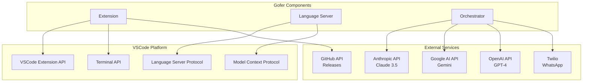
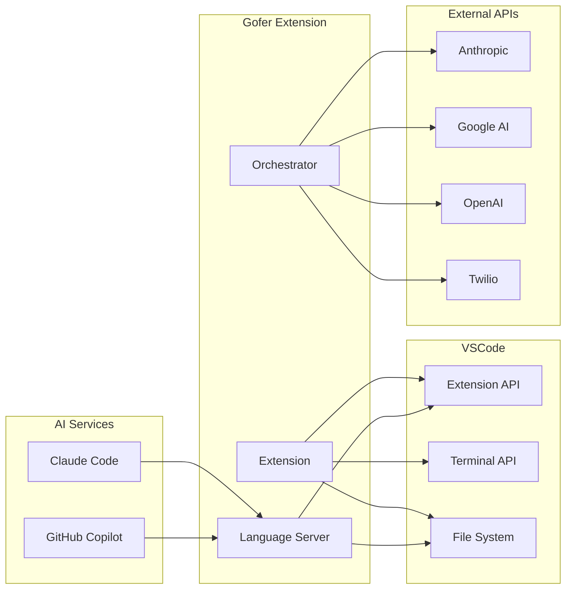

# Dependencies

## Dependency Overview



## Upstream Dependencies

Services that Gofer **calls** or **depends on**.

### 1. VSCode Platform (Required)

**Dependency:** VSCode Extension API **Type:** Platform **Version:** 1.85.0+
**Usage:** Core extension functionality **Critical:** Yes

**APIs Used:**

- Commands API - Command registration
- TreeView API - Sidebar panels
- WebView API - Content panels
- File System API - Spec file operations
- Terminal API - Claude Code monitoring
- Configuration API - Settings
- Language Client API - LSP connection

**Failure Impact:** Extension cannot run

---

### 2. Anthropic API (Optional)

**Dependency:** Claude 3.5 Sonnet, Claude 3.5 Haiku **Type:** External API
**Configuration:** `gofer.anthropicApiKey` **Usage:** Autonomous mode, LLM
council **Critical:** No (optional feature)

**Endpoints Used:**

- `POST /v1/messages` - Chat completions
- Models:
  - `claude-3-5-sonnet-20241022` - Main orchestrator
  - `claude-3-5-haiku-20241022` - Quick decisions

**Rate Limits:**

- Free tier: 50 requests/day
- Paid tier: Based on subscription

**Failure Handling:**

- Autonomous mode disabled
- Falls back to manual operation
- User notified via status bar

**Cost per 1M tokens:**

- Sonnet input: $3.00, output: $15.00
- Haiku input: $0.80, output: $4.00

---

### 3. Google AI API (Optional)

**Dependency:** Gemini 1.5 Pro, Gemini 1.5 Flash **Type:** External API
**Configuration:** `gofer.googleApiKey` **Usage:** LLM council (multi-provider
validation) **Critical:** No

**Endpoints Used:**

- `POST /v1beta/models/{model}:generateContent`
- Models:
  - `gemini-1.5-pro`
  - `gemini-1.5-flash`

**Rate Limits:**

- Free tier: 60 requests/minute
- Paid tier: Based on subscription

**Failure Handling:**

- Council continues with remaining providers
- Minimum 2 providers required for voting

---

### 4. OpenAI API (Optional)

**Dependency:** GPT-4, GPT-4 Turbo **Type:** External API **Configuration:**
`gofer.openaiApiKey` **Usage:** LLM council (optional) **Critical:** No

**Endpoints Used:**

- `POST /v1/chat/completions`
- Models:
  - `gpt-4-turbo`
  - `gpt-4`

**Rate Limits:**

- Tier 1: 500 requests/day
- Tier 5: 10,000 requests/day

**Failure Handling:**

- Same as Google AI - council continues

---

### 5. Twilio API (Optional)

**Dependency:** Twilio WhatsApp Business API **Type:** External API
**Configuration:** Environment variables **Usage:** Autonomous execution
notifications **Critical:** No

**Endpoints Used:**

- `POST /2010-04-01/Accounts/{AccountSid}/Messages.json`

**Environment Variables:**

- `TWILIO_ACCOUNT_SID`
- `TWILIO_AUTH_TOKEN`
- `TWILIO_PHONE_NUMBER`

**Rate Limits:**

- 1 message/second default
- Configurable per account

**Failure Handling:**

- Falls back to VSCode notifications
- Logs error to console

---

### 6. GitHub API (Optional)

**Dependency:** GitHub Releases API **Type:** External API **Authentication:**
Public API (no auth required) **Usage:** Auto-update checks **Critical:** No

**Endpoints Used:**

- `GET /repos/eai-tools/gofer/releases/latest`

**Rate Limits:**

- Unauthenticated: 60 requests/hour
- Authenticated: 5000 requests/hour

**Failure Handling:**

- Update check fails silently
- User can still update manually

---

## Downstream Dependents

Services/tools that **depend on** Gofer.

### 1. Claude Code (Primary)

**Type:** AI Assistant (CLI tool) **Integration:** MCP tools via VSCode
**Usage:** Reads specs, executes tasks, validates code **Version:** Latest

**Depends on:**

- MCP tools (6 tools)
- `.specify/` directory structure
- Spec file format

**Breaking Changes Impact:**

- Tool signature changes → Claude Code may fail
- Spec format changes → Parsing errors

---

### 2. GitHub Copilot (Experimental)

**Type:** AI Assistant **Integration:** MCP tools via VSCode **Usage:** Same as
Claude Code **Status:** Experimental support

---

### 3. Custom AI Tools (Future)

**Type:** Any MCP-compatible client **Integration:** MCP tools **Requirements:**

- Must support MCP protocol
- Must run in VSCode context
- Must have file system access

---

## NPM Dependencies

### Production Dependencies (Root)

| Package             | Version | Purpose                  | Critical |
| ------------------- | ------- | ------------------------ | -------- |
| `@anthropic-ai/sdk` | ^0.32.1 | Claude API client        | No       |
| `chokidar`          | ^4.0.3  | File system watching     | Yes      |
| `dotenv`            | ^16.4.5 | Environment variables    | No       |
| `gray-matter`       | ^4.0.3  | YAML frontmatter parsing | Yes      |
| `reflect-metadata`  | ^0.2.2  | DI metadata              | Yes      |
| `tsyringe`          | ^4.10.0 | Dependency injection     | Yes      |
| `winston`           | ^3.17.0 | Logging                  | Yes      |
| `ws`                | ^8.18.0 | WebSocket server         | No       |
| `zod`               | ^3.24.1 | Schema validation        | Yes      |

### Production Dependencies (Extension)

| Package                 | Version  | Purpose                | Critical |
| ----------------------- | -------- | ---------------------- | -------- |
| `@anthropic-ai/sdk`     | ^0.67.0  | Claude API             | No       |
| `@google/generative-ai` | ^0.21.0  | Gemini API             | No       |
| `ajv`                   | ^8.18.0  | JSON schema validation | Yes      |
| `chokidar`              | ^3.5.3   | File watching          | Yes      |
| `express`               | ^5.1.0   | HTTP server (council)  | No       |
| `graphlib`              | ^2.1.8   | Dependency graphs      | Yes      |
| `node-pty`              | ^1.0.0   | Terminal emulation     | Yes      |
| `openai`                | ^4.104.0 | OpenAI API             | No       |
| `twilio`                | ^5.3.0   | WhatsApp               | No       |
| `vscode-languageclient` | ^9.0.1   | LSP client             | Yes      |
| `ws`                    | ^8.18.0  | WebSocket              | No       |

### Production Dependencies (Language Server)

| Package                              | Version | Purpose       | Critical |
| ------------------------------------ | ------- | ------------- | -------- |
| `vscode-languageserver`              | ^9.0.1  | LSP server    | Yes      |
| `vscode-languageserver-textdocument` | ^1.0.11 | Document sync | Yes      |
| `yaml`                               | ^2.3.4  | YAML parsing  | Yes      |
| `gray-matter`                        | ^4.0.3  | Frontmatter   | Yes      |
| `@anthropic-ai/sdk`                  | ^0.30.0 | Claude API    | No       |
| `chokidar`                           | ^3.5.3  | File watching | Yes      |

### Dev Dependencies

| Package                 | Version | Purpose             |
| ----------------------- | ------- | ------------------- |
| `typescript`            | ^5.7.2  | TypeScript compiler |
| `webpack`               | ^5.89.0 | Extension bundler   |
| `vitest`                | ^3.2.4  | Test runner         |
| `@playwright/test`      | ^1.49.1 | E2E tests           |
| `eslint`                | ^9.26.0 | Linting             |
| `prettier`              | ^3.0.0  | Code formatting     |
| `@vscode/vsce`          | ^3.7.1  | Extension packaging |
| `@vscode/test-electron` | ^2.5.2  | Extension testing   |

---

## Dependency Diagram



---

## Critical Path Analysis

**Must-have for basic functionality:**

1. VSCode Extension API ✅ (platform)
2. vscode-languageserver ✅ (MCP tools)
3. gray-matter ✅ (spec parsing)
4. chokidar ✅ (file watching)
5. tsyringe ✅ (DI container)
6. graphlib ✅ (task dependencies)

**Optional for enhanced functionality:**

- Anthropic SDK - Autonomous mode
- Google AI SDK - LLM council
- OpenAI SDK - LLM council
- Twilio SDK - WhatsApp notifications
- node-pty - Terminal monitoring

**Failure modes:**

| Dependency      | Failure Impact             | Mitigation                   |
| --------------- | -------------------------- | ---------------------------- |
| VSCode API      | Extension won't load       | None - platform required     |
| Language Server | MCP tools unavailable      | Extension still provides UI  |
| Anthropic API   | Autonomous mode disabled   | Manual operation still works |
| File watching   | Specs won't auto-refresh   | Manual refresh available     |
| node-pty        | Terminal monitoring broken | Fallback to polling          |

---

## Version Constraints

### Node.js

**Required:** 20.x **Tested:** 20.10.0+ **Maximum:** < 21.0.0

**Reason:** VSCode Electron runtime uses Node 20.x

### VSCode

**Minimum:** 1.85.0 **Tested:** 1.85.0 - 1.95.0 **Recommended:** Latest stable

**Breaking changes:**

- Extension API changes tracked via `engines.vscode` in package.json

---

## Security Considerations

### Supply Chain

**NPM packages verified:**

- All packages from official registries
- Lock files committed (`package-lock.json`)
- Automated security scanning via `npm audit`

**High-risk dependencies:**

- `node-pty` - Native module (requires rebuild)
- `ws` - WebSocket server (network exposure)

**Mitigation:**

- Regular updates
- Security scanning in CI/CD
- Minimal native dependencies

### API Keys

**Storage:**

- Never stored in code
- VSCode secure storage (keychain/credential manager)
- Environment variables for local dev

**Transmission:**

- HTTPS only for all APIs
- Keys never logged
- Keys never sent to telemetry

---

## Update Strategy

### Dependency Updates

**Automated:**

- Dependabot alerts for security issues
- Monthly dependency review

**Manual:**

- Major version updates tested thoroughly
- Breaking changes documented in changelog

**Testing:**

```bash
# Before updating
npm run test:all

# Update
npm update

# Verify
npm run test:all
npm run build:all
```

---

## Vendor Lock-in

**VSCode Platform:**

- ✅ Locked in - Extension requires VSCode
- Alternative: Could port to other Electron-based editors

**AI Providers:**

- ⚠️ Minimal lock-in - Abstracted via LLM council
- Easy to swap providers

**MCP Protocol:**

- ⚠️ Minimal lock-in - Open protocol
- Compatible with any MCP client

**File Format:**

- ✅ No lock-in - Markdown + YAML (open standards)
- Portable to other tools
