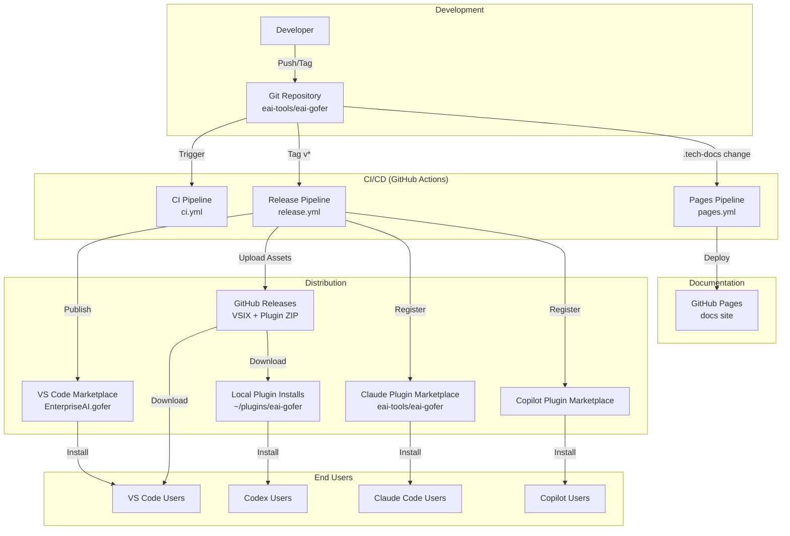

# Gofer - Deployment

## Executive Summary

Gofer is deployed through three distribution channels:

1. **VS Code Marketplace** - Extension VSIX (primary)
2. **GitHub Releases** - VSIX + agent plugin ZIP + source tarball
3. **Agent Plugin Marketplaces** - Claude Code, Copilot CLI, Codex local installations

All deployments are automated via GitHub Actions CI/CD pipelines with version tagging and semantic versioning.

## Deployment Architecture



## Infrastructure

### GitHub Repository

- **Repository:** [enterpriseaigroup/tech-docs](https://github.com/enterpriseaigroup/tech-docs)
- **Primary Branch:** `main`
- **Protected Branches:** `main`, `develop`
- **Required Checks:** CI tests, linting, type checking

### CI/CD Pipelines

#### CI Pipeline (`.github/workflows/ci.yml`)

**Triggers:**
- Push to `main`, `develop`, `feature/*`, `hotfix/*`
- Pull requests to `main`, `develop`

**Jobs:**
1. **Code Quality Gates** (10min timeout)
   - Install dependencies
   - Run linter (`npm run lint`)
   - Run type checker (`npm run typecheck`)
   - Run tests (`npm test`)
   - Generate coverage report

2. **Extension Build** (15min timeout)
   - Build extension (`cd extension && npm run compile`)
   - Build language server (`cd language-server && npm run build`)
   - Package VSIX (`npx vsce package`)
   - Upload VSIX as artifact

**Node Version:** 24.x

#### Release Pipeline (`.github/workflows/release.yml`)

**Triggers:**
- Push tags matching `v*.*.*`
- Manual workflow dispatch with version input

**Jobs:**
1. **Build and Publish Release** (30min timeout)
   - Checkout repository
   - Install dependencies
   - Run tests
   - Build all components (`npm run build:all`)
   - Generate command surfaces (`npm run gofer:generate`)
   - Package agent plugin (`npm run gofer:package-plugin -- --version X.Y.Z --sync-repo`)
   - Package extension VSIX (`npx vsce package`)
   - Create GitHub Release
   - Upload release assets:
     - `eai-gofer-X.Y.Z.vsix`
     - `eai-gofer-agent-plugin-X.Y.Z.zip`
     - `gofer-vX.Y.Z.tar.gz` (source)
   - Publish to VS Code Marketplace (if `VSCE_PAT` configured)

**Required Secrets:**
- `VSCE_PAT` - VS Code Marketplace Personal Access Token (optional)
- `GITHUB_TOKEN` - Automatically provided by GitHub Actions

#### Pages Pipeline (`.github/workflows/pages.yml`)

**Triggers:**
- Push to `main` with changes to `.tech-docs/**` or `docs-site/**`
- Manual workflow dispatch
- Workflow call from release pipeline

**Jobs:**
1. **Deploy GitHub Pages** (15min timeout)
   - Checkout repository
   - Install docs-site dependencies (`cd docs-site && npm ci`)
   - Build Docusaurus site (`npm run build`)
   - Verify required files exist
   - Upload artifact
   - Deploy to GitHub Pages

**Published URL:** [enterpriseaigroup.github.io/tech-docs](https://enterpriseaigroup.github.io/tech-docs)

### GitHub Pages

- **Source:** `docs-site/build` directory
- **Framework:** Docusaurus 3.6.3
- **Node Version:** 24.x
- **Deployment:** Automated via Pages workflow
- **Custom Domain:** Not configured

## Health Checks

### Extension Health

- **Activation:** `onStartupFinished` event in VS Code
- **Language Server:** Heartbeat via LSP connection
- **Status Bar:** Context health indicator (green/yellow/orange/red)

### CI Health Monitoring

- **GitHub Actions Status:** [enterpriseaigroup/tech-docs/actions](https://github.com/enterpriseaigroup/tech-docs/actions)
- **Coverage Reports:** Artifacts uploaded to GitHub Actions
- **Test Results:** CTRF JSON reports

## Deployment Process

### Manual Deployment Steps

1. **Bump Version Numbers**
   ```bash
   # Update package.json files
   npm version minor  # or major, patch
   cd extension && npm version minor
   cd ../language-server && npm version minor
   ```

2. **Generate Command Surfaces**
   ```bash
   npm run gofer:generate
   ```

3. **Package Agent Plugin**
   ```bash
   npm run gofer:package-plugin -- --version 3.4.0 --sync-repo
   ```

4. **Test Locally**
   ```bash
   npm test
   npm run build:all
   cd extension && npx vsce package
   code --install-extension gofer-3.4.0.vsix
   ```

5. **Create Git Tag**
   ```bash
   git add -A
   git commit -m "chore: bump version to 3.4.0"
   git tag v3.4.0
   git push origin main --tags
   ```

6. **Monitor Release Pipeline**
   - Watch GitHub Actions for release workflow
   - Verify assets uploaded to GitHub Release
   - Verify VS Code Marketplace publish (if configured)

### Automated Deployment (Recommended)

1. **Create and Push Tag**
   ```bash
   git tag v3.4.0
   git push origin v3.4.0
   ```

2. **Automated Steps** (GitHub Actions handles):
   - Run CI tests
   - Build extension and agent plugin
   - Package VSIX and ZIP
   - Create GitHub Release
   - Upload release assets
   - Publish to VS Code Marketplace (if `VSCE_PAT` set)
   - Deploy documentation site

## Release Assets

Each GitHub Release includes:

| Asset | Description | Size |
| ----- | ----------- | ---- |
| `eai-gofer-X.Y.Z.vsix` | VS Code extension package | ~10MB |
| `eai-gofer-agent-plugin-X.Y.Z.zip` | Agent plugin for Claude/Copilot/Codex | ~500KB |
| `gofer-vX.Y.Z.tar.gz` | Source code tarball | ~2MB |

## Agent Plugin Distribution

### Claude Code Plugin

**Marketplace Registration:**
```bash
claude plugin marketplace add eai-tools/eai-gofer --scope user
claude plugin install eai-gofer@eai-gofer --scope user
```

**Local Installation (for testing):**
```bash
# Download release ZIP
gh release download v3.4.0 \
  --repo eai-tools/eai-gofer \
  --pattern "eai-gofer-agent-plugin-3.4.0.zip" \
  --dir /tmp/eai-gofer-plugin

# Extract to stable location
rm -rf ~/plugins/eai-gofer
unzip /tmp/eai-gofer-plugin/eai-gofer-agent-plugin-3.4.0.zip -d ~/plugins

# Register local marketplace
claude plugin marketplace add ~/plugins/eai-gofer --scope user
claude plugin install eai-gofer@eai-gofer-local --scope user
```

### Copilot CLI Plugin

**Marketplace Registration:**
```bash
copilot plugin marketplace add eai-tools/eai-gofer
copilot plugin install eai-gofer@eai-gofer
```

**Local Installation:**
```bash
copilot plugin marketplace add ~/plugins/eai-gofer
copilot plugin install eai-gofer@eai-gofer-local
```

### Codex Plugin

**Local Installation Only:**
- Extract agent plugin ZIP to `~/plugins/eai-gofer/`
- Add via Codex local marketplace/import
- Keep path stable for updates

## Rollback Procedures

### Rollback Extension

1. **Identify Last Known Good Version**
   - Check GitHub Releases: [enterpriseaigroup/tech-docs/releases](https://github.com/enterpriseaigroup/tech-docs/releases)
   - Example: `v3.3.1`

2. **Download Previous VSIX**
   ```bash
   gh release download v3.3.1 --repo eai-tools/eai-gofer --pattern "*.vsix"
   ```

3. **Uninstall Current Version**
   ```bash
   code --uninstall-extension EnterpriseAI.gofer
   ```

4. **Install Previous Version**
   ```bash
   code --install-extension eai-gofer-3.3.1.vsix
   ```

5. **Disable Auto-Update** (temporary)
   - VS Code Settings: `"extensions.autoUpdate": false`

### Rollback Agent Plugin

1. **Remove Current Plugin**
   ```bash
   claude plugin uninstall eai-gofer@eai-gofer
   ```

2. **Install Previous Version**
   ```bash
   # Download previous release
   gh release download v3.3.1 \
     --repo eai-tools/eai-gofer \
     --pattern "eai-gofer-agent-plugin-3.3.1.zip"
   
   # Install previous version
   unzip eai-gofer-agent-plugin-3.3.1.zip -d ~/plugins/eai-gofer-3.3.1
   claude plugin marketplace add ~/plugins/eai-gofer-3.3.1
   claude plugin install eai-gofer@eai-gofer-local
   ```

## Monitoring

### Deployment Metrics

- **GitHub Actions:** Monitor workflow runs for failures
- **VS Code Marketplace:** Check download stats (if published)
- **GitHub Release Downloads:** Track asset download counts
- **Documentation Site:** GitHub Pages deployment status

### Alerts

- **CI Failure:** Email notification to repository maintainers
- **Release Failure:** GitHub Actions workflow failure notification
- **Pages Deployment Failure:** GitHub Pages build failure notification

## Security Considerations

### Secrets Management

- **VSCE_PAT:** Stored in GitHub repository secrets (encrypted)
- **GITHUB_TOKEN:** Auto-generated, scoped to repository
- **API Keys:** Never committed, stored in VS Code settings or `.env`

### Code Signing

- **VSIX Signing:** Not currently implemented
- **Agent Plugin Signing:** Not currently implemented
- **Release Verification:** Use GitHub Release checksums

### Supply Chain Security

- **Dependency Scanning:** Renovate bot for dependency updates
- **npm Audit:** Run during CI
- **License Compliance:** MIT license, compatible dependencies

## Disaster Recovery

### Repository Loss

1. **Source Code:** Backed up by GitHub (distributed Git)
2. **Release Assets:** Stored in GitHub Releases (persistent)
3. **Documentation Site:** Rebuilds from `.tech-docs/` and `docs-site/`

### Rebuild from Scratch

```bash
# Clone repository
git clone https://github.com/enterpriseaigroup/tech-docs.git
cd eai-gofer

# Install dependencies
npm install
cd extension && npm install
cd ../language-server && npm install
cd ..

# Build all components
npm run build:all

# Generate command surfaces
npm run gofer:generate

# Package agent plugin
npm run gofer:package-plugin -- --version 3.4.0 --sync-repo

# Package extension
cd extension && npx vsce package
```

### Recovery Time Objective (RTO)

- **Extension Rebuild:** < 1 hour (automated CI)
- **Agent Plugin Rebuild:** < 30 minutes (automated)
- **Documentation Site:** < 15 minutes (automated)
- **Full Repository Restore:** < 2 hours (manual)

## Environment-Specific Configuration

### Development

- **Branch:** `develop` or `feature/*`
- **Auto-Deploy:** No
- **Testing:** Local VS Code Extension Development Host

### Staging

- **Branch:** `main` (pre-release)
- **Auto-Deploy:** No
- **Testing:** Manual VSIX installation

### Production

- **Branch:** `main` (tagged release)
- **Auto-Deploy:** Yes (on tag push)
- **Distribution:** VS Code Marketplace + GitHub Releases + Agent Plugin Marketplaces
