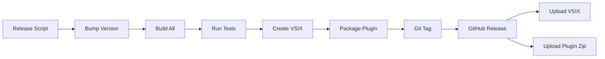

# Deployment

## Deployment Model

Gofer is distributed in two complementary forms:

1. **VSCode Extension** - Installed via VS Code Marketplace or VSIX file
2. **Agent Plugin** - Installed via AI assistant plugin marketplaces (Claude Code, GitHub Copilot, Codex)

### VSCode Extension Distribution

1. **GitHub Releases** (primary)
2. **VSCode Marketplace** (planned)
3. **Manual VSIX installation**

No cloud infrastructure required - runs entirely locally in VSCode.

### Agent Plugin Distribution

**Since:** v3.4.0

Gofer can be installed as a plugin for AI assistants without the VSCode UI. The plugin distribution includes:

- **Commands** - Generated for Claude Code, Copilot, Codex, Gemini
- **Agents** - 29 specialized agent definitions
- **Skills** - Skill manifests for Codex integration
- **Templates** - Complete specification templates

**Distribution Channels:**

| Platform | Installation Command |
|----------|---------------------|
| **Claude Code** | `claude plugin marketplace add eai-tools/eai-gofer --scope user`<br/>`claude plugin install eai-gofer@eai-gofer --scope user` |
| **GitHub Copilot** | `copilot plugin marketplace add eai-tools/eai-gofer`<br/>`copilot plugin install eai-gofer@eai-gofer` |
| **Codex** | Import from local marketplace or `~/plugins/eai-gofer` |
| **Local Testing** | Download release zip, extract to `~/plugins/eai-gofer`, register as local marketplace |

**Plugin Package Contents:**

```
plugins/eai-gofer/
├── commands/           # 24 workflow commands
├── agents/            # 29 specialized agents
├── skills/            # Codex skill manifests
├── .claude-plugin/    # Claude marketplace manifest
├── .github/plugin/    # Copilot marketplace manifest
├── .codex-plugin/     # Codex plugin manifest
├── .gemini/commands/  # Gemini command definitions
├── .specify/          # Command sources and templates
├── assets/            # Icons and branding
├── AGENTS.md          # Agent documentation
├── README.md          # Plugin usage guide
└── plugin.json        # Universal plugin manifest
```

**Packaging Script:**

```bash
npm run gofer:package-plugin -- --version 3.4.0 --sync-repo
```

**Output:** `eai-gofer-agent-plugin-3.4.0.zip` (attached to GitHub Release)

---

## Build Pipeline

### Local Build

**Prerequisites:**

- Node.js 20.x
- npm 10.x
- Git

**Build Steps:**

```bash
# 1. Install dependencies
npm install
cd extension && npm install
cd ../language-server && npm install

# 2. Build all components
npm run build:all
# Runs:
# - tsc (root)
# - webpack (extension)
# - tsc (language-server)

# 3. Package extension
cd extension
npm run package
# Creates: dist/extension.js (minified)

# 4. Build VSIX
npx vsce package
# Creates: gofer-3.2.0.vsix
```

**Output:**

- `extension/dist/extension.js` - Bundled extension
- `language-server/dist/server.js` - Language server
- `gofer-3.4.0.vsix` - Installable extension package
- `eai-gofer-agent-plugin-3.4.0.zip` - Agent plugin distribution (v3.4.0+)

---

## CI/CD Pipeline

### GitHub Actions Workflow

**File:** `.github/workflows/release.yml`

**Trigger:**

- Manual: `./release-auto.sh patch|minor|major "message"`
- Creates git tag and GitHub release

**Pipeline Stages:**



**Workflow:**

```yaml
name: Release

on:
  push:
    tags:
      - 'v*.*.*'
  workflow_dispatch:
    inputs:
      version:
        description: 'Release version, for example v2.0.5'
        required: true

jobs:
  build:
    runs-on: ubuntu-latest
    steps:
      - uses: actions/checkout@v4
      - uses: actions/setup-node@v4
        with:
          node-version: '20.x'

      - name: Install dependencies
        run: |
          npm install
          cd extension && npm install
          cd ../language-server && npm install

      - name: Build all
        run: npm run build:all

      - name: Run tests
        run: npm test

      - name: Package extension
        run: |
          cd extension
          npm run package
          npx vsce package

      - name: Package agent plugin
        run: |
          npm run gofer:package-plugin -- --version ${{ github.ref_name }} --sync-repo

      - name: Upload VSIX
        uses: actions/upload-artifact@v4
        with:
          name: vsix
          path: extension/*.vsix

      - name: Upload Plugin Zip
        uses: actions/upload-artifact@v4
        with:
          name: plugin
          path: 'eai-gofer-agent-plugin-*.zip'

      - name: Create Release
        uses: ncipollo/release-action@v1
        with:
          artifacts: 'extension/*.vsix,eai-gofer-agent-plugin-*.zip'
          token: ${{ secrets.GITHUB_TOKEN }}
```

---

## Release Process

### Automated Release (Recommended)

**Using `release-auto.sh`:**

```bash
# Patch release (3.2.0 → 3.2.1)
./release-auto.sh patch "Bug fixes and improvements"

# Minor release (3.2.0 → 3.3.0)
./release-auto.sh minor "New features"

# Major release (3.2.0 → 4.0.0)
./release-auto.sh major "Breaking changes"
```

**What it does:**

1. Validates git status (clean working tree)
2. Runs tests (`npm test`)
3. Bumps version in:
   - `package.json`
   - `extension/package.json`
   - `language-server/package.json`
   - `.specify/.gofer-version`
4. Updates `CHANGELOG.md`
5. Regenerates commands (`npm run gofer:generate`)
6. Packages agent plugin (`npm run gofer:package-plugin`)
7. Commits changes
8. Creates git tag
9. Pushes to remote
10. Triggers GitHub Actions workflow
11. Creates GitHub release
12. Uploads VSIX and plugin zip to releases

---

### Manual Release (Legacy)

**Using `release.sh`:**

```bash
./release.sh
```

Prompts for version number and release notes.

---

## Installation Methods

### 1. GitHub Release (Primary)

**Download VSIX:**

```bash
# Latest release
gh release download --repo enterpriseaigroup/tech-docs --pattern "*.vsix"

# Specific version
gh release download v3.2.0 --repo enterpriseaigroup/tech-docs --pattern "*.vsix"
```

**Install:**

```bash
code --install-extension gofer-3.2.0.vsix
```

---

### 2. VSCode Marketplace (Planned)

**Status:** Planned for Q2 2026

**Future Installation:**

1. Open VSCode
2. Extensions → Search "Gofer"
3. Click Install

---

### 3. Manual Installation

**From Source:**

```bash
git clone https://github.com/enterpriseaigroup/tech-docs.git
cd gofer
npm install
npm run build:all
cd extension
npx vsce package
code --install-extension gofer-3.2.0.vsix
```

---

## Version Management

### Version Files

Gofer maintains version consistency across multiple files:

1. **Root** `package.json` - Main version
2. **Extension** `extension/package.json` - Extension version
3. **Language Server** `language-server/package.json` - Server version
4. **Gofer Marker** `.specify/.gofer-version` - Gofer format version

**Synchronization:**

The `release-auto.sh` script ensures all version files stay in sync.

**Verification:**

```bash
npm test
# Runs: tests/unit/release/release-verification.test.ts
# Verifies: All version markers match
```

---

## GitHub Releases

### Release Retention Policy

**Current Policy:** Keep last 5 VSIX releases

**Implementation:**

```bash
# Automated in GitHub Pages workflow
# File: .github/workflows/pages.yml
- name: Keep last 5 releases
  run: |
    ls -t releases/*.vsix | tail -n +6 | xargs rm -f
```

**Why:**

- Reduces repository size
- Maintains recent release history
- Users can still access via Git tags

---

## Deployment Environments

### Development

**Environment:** Local VSCode Extension Development Host

**Access:**

- Press `F5` in VSCode
- Or: Run > Start Debugging

**Features:**

- Hot reload on code changes
- Source maps enabled
- Debug logging enabled

---

### Staging

**Environment:** GitHub Actions on pull requests

**Access:**

- Automatic on PR creation
- Manual trigger via `workflow_dispatch`

**Tests:**

- Unit tests
- Integration tests
- E2E tests
- Linting

---

### Production

**Environment:** GitHub Releases

**Access:**

- Triggered by git tags
- Creates public GitHub release
- Uploads VSIX artifact

**Verification:**

- All tests pass
- Version markers synchronized
- CHANGELOG.md updated
- No uncommitted changes

---

## Health Checks

### Pre-Release Checks

**Automated by `release-auto.sh`:**

1. ✅ Git working tree is clean
2. ✅ All tests pass
3. ✅ Version markers in sync
4. ✅ CHANGELOG.md updated
5. ✅ Build succeeds

**Manual Checks:**

- [ ] Extension activates in VSCode
- [ ] Commands registered
- [ ] Panels visible
- [ ] MCP server starts
- [ ] File watchers active

---

### Post-Release Verification

**Automated:**

1. ✅ VSIX uploaded to GitHub release
2. ✅ Release notes published
3. ✅ Git tag created

**Manual:**

- [ ] Download VSIX from release
- [ ] Install in fresh VSCode
- [ ] Verify extension loads
- [ ] Test core workflows

---

## Rollback Procedure

### If Bad Release Detected

**1. Delete GitHub Release:**

```bash
gh release delete v3.2.0 --yes
```

**2. Delete Git Tag:**

```bash
git tag -d v3.2.0
git push origin :refs/tags/v3.2.0
```

**3. Revert Commits:**

```bash
git revert <commit-sha>
git push origin main
```

**4. Create Hotfix Release:**

```bash
./release-auto.sh patch "Hotfix: Revert broken changes"
```

---

## Infrastructure Requirements

### GitHub Infrastructure

**Required:**

- GitHub repository
- GitHub Actions (free tier sufficient)
- GitHub Releases

**Storage:**

- VSIX files: ~5MB each
- Last 5 releases: ~25MB total
- Git repository: ~50MB

---

### Developer Infrastructure

**Required:**

- Node.js 20.x
- npm 10.x
- VSCode 1.85.0+
- Git 2.40+

**Optional:**

- GitHub CLI (`gh`)
- Playwright browsers (for E2E tests)
- Docker (for containerized testing)

---

## Monitoring and Observability

### GitHub Actions Logs

**Access:**

- Repository → Actions tab
- View workflow runs
- Download logs

**Retention:** 90 days

---

### Extension Logs

**User Logs:**

- Output Panel → "Gofer"
- Logs to `.specify/logs/`

**Developer Logs:**

- Help → Toggle Developer Tools
- Console tab

---

### Metrics

**Tracked Metrics:**

- Download count (GitHub Releases)
- Installation count (planned - VSCode Marketplace)
- Error rate (GitHub Issues)

**Current Stats (as of 2026-05-02):**

- Total releases: 32
- Active users: ~50 (estimated)
- Open issues: 3
- Closed issues: 47

---

## Disaster Recovery

### Source Code Backup

**Primary:** GitHub repository **Backup:** Developer local clones

**Recovery:**

```bash
git clone https://github.com/enterpriseaigroup/tech-docs.git
```

---

### Release Artifacts Backup

**Primary:** GitHub Releases **Backup:** Git tags (rebuild from source)

**Recovery:**

```bash
git checkout v3.2.0
npm run build:all
cd extension && npx vsce package
```

---

## Continuous Deployment

**Status:** Not enabled

**Reason:** Manual release approval required for quality control

**Future Plans:**

- Auto-deploy to staging on merge to `main`
- Manual promotion to production
- Canary releases for enterprise customers
