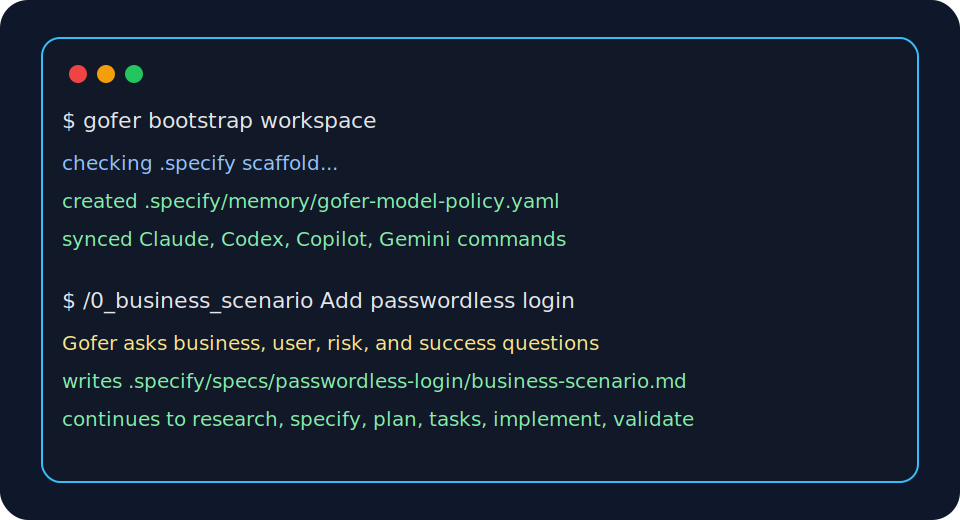

# EAI Gofer

EAI Gofer is a business specification-driven delivery workflow for repositories.
It gives teams one shared pipeline from business scenario through validation,
keeps the working artifacts in `.specify/`, and ships across VS Code, Claude
Code, Codex, GitHub Copilot, and Gemini.

EAI Gofer is designed to be easy to adopt in an existing repo:

- helps everyone, not just coders, write good code, that delivers a business
  outcome
- Work with AI to generate what you need whether it is business case, executive
  summary, technical diagram of otherwise for you and your stakeholders to know
  what will be built, not find out it is wrong later
- one core `0-6` delivery pipeline
- closed-loop goal reconciliation with repo-owned goal ledgers and drift checks
- repo-owned artifacts and templates
- install paths for VS Code and AI coding CLIs
- generated command surfaces that stay aligned across hosts

## Quick Start



1. Install the VS Code extension or add the public plugin marketplace for your
   preferred CLI.
2. For a first EAI Platform app, run `/gofer:eai-first-run`. It checks Git,
   Node.js, npm, EAI CLI, login, tenant access, the EAI app template, and the
   Gofer repo scaffold before the pipeline starts.
3. If you only need to add Gofer to an existing repo, run **Gofer: Initialize
   Repository** in VS Code or `/gofer:bootstrap-workspace` from a CLI host.
4. Start with `/0_business_scenario` and move through the core pipeline.

If `/0_business_scenario` is unknown in a new repo, the host has not loaded the
Gofer plugin or repo commands yet. Install/update the plugin first, then run
`/gofer:eai-first-run` to prepare the workspace and start the app build.

For copy-paste commands across VS Code, Claude Code, Codex, Copilot, and Gemini,
see the [5-minute first run guide](./.tech-docs/first-run.md).

## Core Pipeline

| Stage             | Command                | Main output                                    |
| ----------------- | ---------------------- | ---------------------------------------------- |
| Business scenario | `/0_business_scenario` | Full pipeline kickoff                          |
| Research          | `/1_gofer_research`    | `research.md`                                  |
| Specify           | `/2_gofer_specify`     | `spec.md`                                      |
| Plan              | `/3_gofer_plan`        | `plan.md`, `data-model.md`, `contracts/`       |
| Tasks             | `/4_gofer_tasks`       | `tasks.md`, `traceability.md`, `issues.md`     |
| Implement         | `/5_gofer_implement`   | Code and documentation changes                 |
| Validate          | `/6_gofer_validate`    | Validation artifacts and final review evidence |

`/6_gofer_validate` is the terminal quality gate. The previous standalone
engineering-review stage is now folded into validation.

Gofer now treats the pipeline as a closed loop, not just a straight line:

- `/1_gofer_research` seeds `goal-ledger.json` with business goals, metrics,
  owners, delivery states, and re-loop triggers.
- `/4_gofer_tasks` keeps `traceability.md` as the requirement-to-task-to-code
  contract.
- `/6_gofer_validate` runs the objective outcome gate, refreshes code/test
  evidence, and writes `goal-rebaseline-report.md` when goals, assumptions,
  contracts, UX scope, or implementation drift.

Optional helpers stay outside the core 0-6 flow:

- `/0a_problem_validation`
- `/7_gofer_save`
- `/8_gofer_resume`
- `/9_gofer_tests`
- `/7a_stakeholder_comms`
- `/gofer:check-workspace`
- `/gofer:bootstrap-workspace`
- `/gofer:eai-first-run`

## Model And Cost Policy

EAI Gofer bootstraps a repo-owned model policy at:

```text
.specify/memory/gofer-model-policy.yaml
```

The shipped default comes from `.specify/templates/gofer-model-policy.yaml`.
Bootstrap creates the memory copy when it is missing and does not overwrite
local edits.

Default posture:

- Claude: Haiku for simple scouting, Sonnet for normal work, Opus for hard
  security/architecture/release gates.
- Codex/OpenAI: GPT mini for simple coding, GPT nano only for mechanical
  locate/classify/summarize work, GPT-5.3-Codex or flagship GPT for hard
  tool-heavy coding and arbitration.
- Gemini: Flash-Lite for cheap large-context scanning, Flash for normal
  synthesis, Pro for hard large-context architecture/research gates.
- Copilot: `Auto` for simple/default work; ask before selecting a paid/high-tier
  picker model for hard review.

## Install

### VS Code

Recommended: install from the VS Code Marketplace so users receive normal
Marketplace updates. Manual `.vsix` installs remain supported, but VS Code does
not auto-update VSIX installs by default.

- Marketplace docs:
  [Use extensions in Visual Studio Code](https://code.visualstudio.com/docs/getstarted/extensions)
- Publishing/update behavior:
  [Publishing Extensions](https://code.visualstudio.com/api/working-with-extensions/publishing-extension)
- VSIX update note:
  [Extension Marketplace](https://code.visualstudio.com/docs/editor/extension-marketplace?azure-portal=true)

Public release assets:

- Latest VSIX:
  `https://eai-tools.github.io/eai-gofer/releases/eai-gofer-latest.vsix`
- Versioned releases: `https://eai-tools.github.io/eai-gofer/releases/`

### Claude Code

Recommended install path:

```bash
claude plugin marketplace add eai-tools/eai-gofer --scope user --sparse .claude-plugin --sparse plugins/eai-gofer
claude plugin install eai-gofer@eai-gofer --scope user
```

References:

- [Discover and install plugins](https://code.claude.com/docs/en/discover-plugins)
- [Create and distribute a plugin marketplace](https://code.claude.com/docs/en/plugin-marketplaces)
- [Plugins reference](https://code.claude.com/docs/en/plugins-reference)

### Codex

Recommended install path:

```bash
codex plugin marketplace add https://github.com/eai-tools/eai-gofer --sparse .agents/plugins --sparse plugins/eai-gofer
codex plugin add eai-gofer@eai-gofer
```

### GitHub Copilot CLI

Recommended install path:

```bash
copilot plugin marketplace add https://github.com/eai-tools/eai-gofer
copilot plugin install eai-gofer@eai-gofer
```

References:

- [Finding and installing Copilot CLI plugins](https://docs.github.com/en/copilot/how-tos/copilot-cli/customize-copilot/plugins-finding-installing)
- [Copilot CLI plugin marketplace](https://docs.github.com/en/copilot/how-tos/copilot-cli/customize-copilot/plugins-marketplace)

### Gemini CLI

Recommended install path:

```bash
gemini extensions install https://github.com/eai-tools/eai-gofer --auto-update
```

Reference:

- [Gemini CLI extensions reference](https://github.com/google-gemini/gemini-cli/blob/main/docs/extensions/reference.md)

### Downloadable Bundle

For offline testing or pinned installs, use the public agent bundle zip:

```bash
curl -fsSL https://eai-tools.github.io/eai-gofer/releases/eai-gofer-agent-plugin-latest.zip \
  -o /tmp/eai-gofer-agent-plugin-latest.zip
```

The public release feed is:

```text
https://eai-tools.github.io/eai-gofer/releases.json
```

## First EAI Platform App Setup

`/gofer:eai-first-run` replaces the long website setup prompt for users who have
installed a supported AI coding host. It works as a plugin-level command, so it
can run before `.specify/` exists in the target repo.

The command:

- detects Claude Code, Codex, Copilot, Gemini, VS Code, GitHub Codespaces, OS,
  shell, and workspace folder
- checks Git, Node.js, npm, the scoped EAI npm registry, and `eai --version`
- asks before installing Git, Node.js, npm, EAI CLI, opening browser login, or
  changing tenant/project state
- uses
  `npm config set @eai-tools:registry https://eai-tools.github.io/eai/registry/ --location=user`
  and `npm install -g @eai-tools/cli` when EAI CLI installation is approved
- runs `eai update --check`, `eai --describe`, `eai whoami`, and
  `eai tenant list --format json` before assuming CLI syntax or tenant readiness
- asks for the project display name, proposes a lowercase kebab-case CLI name,
  confirms the active tenant, then runs
  `eai init <project-name> --skip-prompts --company-tenant <active-tenant-id>`
  when approved
- treats `E001` from `eai verify`, `eai template check`, or
  `eai doctor --check-updates` as "this repo is not yet an EAI app project",
  then offers initialization instead of leaving the user at a dead end
- runs `eai template check --format json` and
  `eai gofer refresh --check --format json` when the repo already looks like an
  EAI app so Gofer can see EAI template drift and Gofer scaffold drift early
- uses `eai resources schema --format json` and
  `eai workflow readiness --format json` later in the pipeline to ground block,
  data, and workflow choices in actual platform capabilities
- verifies `.specify/` and Gofer files created by `eai init`, runs
  `/gofer:bootstrap-workspace` if the repo scaffold is missing or stale, and
  writes a safe `.specify/logs/eai-first-run-report.md`

Cross-platform behavior:

| Environment       | Behavior                                                                               |
| ----------------- | -------------------------------------------------------------------------------------- |
| macOS             | Use Homebrew only when it already exists; otherwise use standard installers.           |
| Linux             | Prefer existing tools; detect `apt`, `dnf`, `yum`, or `zypper` if install is approved. |
| Windows           | Use PowerShell-safe commands and prefer `winget`; do not assume Git Bash.              |
| GitHub Codespaces | Prefer devcontainer/user-level npm and avoid `sudo` unless explicitly approved.        |

## Repository Layout

| Path                  | Purpose                                       |
| --------------------- | --------------------------------------------- |
| `extension/`          | VS Code extension package                     |
| `language-server/`    | Language server and MCP-facing support        |
| `src/`                | Node-based orchestration and utilities        |
| `.specify/commands/`  | Canonical command source                      |
| `.specify/templates/` | Repo bootstrap templates and helpers          |
| `.specify/specs/`     | Local working artifacts created per feature   |
| `plugins/eai-gofer/`  | Portable plugin bundle for CLI hosts          |
| `.tech-docs/`         | Public documentation source for the docs site |

## Development

```bash
npm install
cd extension && npm run compile
cd ..
npm run build
npm run lint
npm run typecheck
npm test
npm run gofer:closed-loop-audit -- --feature-dir .specify/specs/<feature>
npm run gofer:generate
npm run gofer:package-plugin -- --sync-repo
```

## Community

- Questions and usage help:
  [GitHub Discussions](https://github.com/eai-tools/eai-gofer/discussions)
- Bugs and feature requests:
  [GitHub Issues](https://github.com/eai-tools/eai-gofer/issues)
- Project wiki: [GitHub Wiki](https://github.com/eai-tools/eai-gofer/wiki)
- Security guidance: [SECURITY.md](./SECURITY.md)
- Contribution guidance: [CONTRIBUTING.md](./CONTRIBUTING.md)
- Support policy: [SUPPORT.md](./SUPPORT.md)

Roadmap-fit issues may also receive an automation-generated draft intake PR so a
human reviewer can scope the work before implementation starts.

## Related Projects And References

EAI Gofer sits in the same broader ecosystem as specification-driven and
agent-oriented developer tooling. Useful references:

- [GitHub Spec Kit docs](https://github.github.com/spec-kit/index.html)
- [github/spec-kit](https://github.com/github/spec-kit)
- [GitHub repository best practices](https://docs.github.com/en/repositories/creating-and-managing-repositories/best-practices-for-repositories)
- [GitHub Discussions quickstart](https://docs.github.com/discussions/quickstart)
- [Setting guidelines for contributors](https://docs.github.com/en/communities/setting-up-your-project-for-healthy-contributions/setting-guidelines-for-repository-contributors?apiVersion=2022-11-28)

## What Helps A Repo Get Forks And Stars

The basics are not optional:

- a permissive open-source license
- a 5-minute quick start that actually works
- clear screenshots or demos
- active issue triage and visible roadmap items
- contributor docs, security policy, and support routing
- predictable releases and changelog discipline
- public install/update paths for every supported host

EAI Gofer now uses the Apache-2.0 license. `Enterprise AI` and `EnterpriseAI`
remain Enterprise AI Pty Ltd marks; see [TRADEMARKS.md](./TRADEMARKS.md) and the
current legal page at
[enterpriseaigroup.com/terms-of-use](https://enterpriseaigroup.com/terms-of-use).

The remaining work before a real public launch is the final legacy-enterprise
cleanup.
