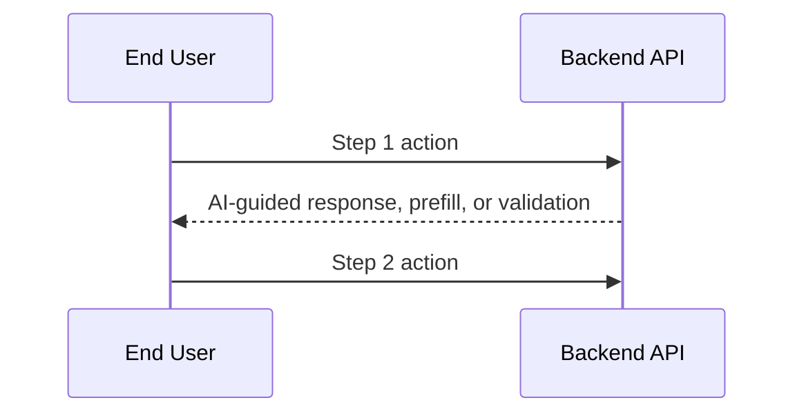

---
description: Triage business scenario and orchestrate the unified Gofer pipeline
---

# Gofer Orchestrator

## Token And Cost Policy
<!-- gofer:token-cost-policy:start -->

Before spawning agents, calling tools, or loading large files:

1. Treat `.specify/memory/gofer-model-policy.yaml` as the repo-owned source of truth for simple, medium, hard, and arbiter model routing. If it is missing, run `/gofer:bootstrap-workspace` before continuing.
2. Use the cheapest capable model first.
   - Claude: Haiku for scouting/extraction; Sonnet for normal implementation, synthesis, validation, and security; Opus for high-risk arbitration or release-critical failures.
   - Codex/OpenAI: GPT mini for simple coding; GPT nano only for locate/classify/summarize/mechanical work; GPT-5.3-Codex or flagship GPT for tool-heavy coding, architecture, and release-critical validation.
   - Gemini: Flash-Lite for cheap large-context scan/summarize; Flash for default research synthesis; Pro for large-context architecture or high-risk arbitration.
   - Copilot: prefer Auto for simple and default work; ask the user before choosing a paid/high-tier picker model for hard security, architecture, or release gates.
3. Keep raw tool output out of the main conversation context. Save stable findings to `.specify/specs/{feature}/context-bundle.md`, then work from summaries.
4. Use provider prompt/context caching only for stable, non-secret prefixes: Gofer scaffold, AGENTS/CLAUDE/Copilot instructions, constitution, repo map, stage contracts, and validation rubric.
5. Before continuing after large research, planning, implementation, or validation bursts, checkpoint the durable artifacts and compact/clear/resume context when the host supports it.
6. Escalate model tier only when a cheaper pass is low-confidence, contradictory, security-sensitive, or blocking release quality.
<!-- gofer:token-cost-policy:end -->

## Workspace Preflight

Before doing stage/helper work:

1. Resolve the repository root.
2. Check the core Gofer sentinels:
   - `.specify/.gofer-version`
   - `.specify/commands/0_business_scenario.md`
   - `.specify/templates/spec-template.md`
   - `.specify/scripts/bash/create-new-feature.sh`
   - `.specify/scripts/node/parse-stage-command.mjs`
   - `.specify/scripts/hooks/post-tool-use.mjs`
   - `.specify/scripts/powershell/install-optional-tools.ps1`
   - `.specify/templates/gofer-model-policy.yaml`
   - `.specify/memory/gofer-model-policy.yaml`
   - `.specify/specs/`
   - `.specify/memory/`
3. Check host-specific repo-owned files when relevant:
   - Claude: `AGENTS.md`, `CLAUDE.md`, `.claude/settings.json`
   - Codex: `AGENTS.md`
   - Copilot: `.github/copilot-instructions.md`
   - VS Code extension mirrors Claude/Copilot/Gemini resources itself and should still keep the core scaffold healthy
4. If the repo already has the workspace checker script, prefer running:
   - `node .specify/scripts/node/gofer-workspace-check.mjs --host auto --json`
5. If the workspace is missing or stale, ask exactly:
   - **"This repo is missing or stale for Gofer. Initialize/update it now?"**
6. If the user says yes, run the Gofer workspace bootstrap helper and then resume this command from the top.
7. If the user says no, stop and explain that Gofer stage/helper work depends on the repo-owned scaffold.

## EAI App Delivery Preflight

Run this after the Gofer workspace preflight and before application-delivery
discovery whenever the request is an app build, dashboard, portal, workflow,
form, chatbot, vertical application, tenant-scoped business experience, or any
durable user-facing product. App delivery in EAI Gofer means EAI Platform
delivery by default. Do not run this for explicit non-app work. If the user asks
for a non-EAI app stack, pause and confirm that they are intentionally leaving
the EAI Gofer app-delivery path before continuing.

Use current public EAI documentation as the safe source of truth:

- EAI CLI docs: `https://eai-tools.github.io/eai/docs/overview`
- EAI API reference: `https://eai-tools.github.io/eai/docs/api-reference`
- EAI static registry: `https://eai-tools.github.io/eai/registry/`
- EAI scenario library: `https://eai-tools.github.io/eai/scenarios`
- EAI app template: `https://github.com/eai-tools/eai-app-template`

### EAI Platform And Azure App Stack Policy

For application delivery, Gofer MUST use this stack order:

1. **EAI Platform first, including the EAI app template**: EAI app template, EAI
   CLI, PublicAPI, object types, workflows, block catalog, ResourceAPI/resource
   schema, tenant/app enrollment, identity, provisioning, diagnostics, and
   documented EAI platform services are one EAI Platform app substrate.
2. **Azure second**: Azure services that are already part of, documented for, or
   compatible with the EAI Platform operating model, especially deployment,
   identity, storage, observability, and integration services.
3. **Everything else only by explicit exception**: Firebase, Supabase, Vercel as
   the primary runtime, AWS, GCP, bespoke backends, unmanaged databases, or
   unrelated SaaS platforms must not be recommended as the primary app substrate.
   They may appear only as integration targets, migration references, or
   approved exceptions with rationale, owner, expiry, and validation evidence.

Application-specific logic, adapters, UI extensions, and tests belong inside the
EAI Platform/EAI app template scaffold and must obey package-profile,
public-readiness, tenant, and security constraints. They are implementation
inside the primary substrate, not a separate stack tier.

If a required capability is not accessible in EAI Platform or Azure, record it
in `{FEATURE_DIR}/service-fit-matrix.md` as `unavailable without new platform
work`, `operator_required`, or `upgrade_required`. Do not silently replace it
with an unrelated non-EAI stack.

### EAI Preflight Checks

1. **Classify the build path**
   - Treat the work as EAI app delivery when the user asks to build an app,
     dashboard, portal, workflow, form, chatbot, vertical application,
     tenant-scoped business experience, or durable user-facing product.
   - If the user is only doing research, docs, audit, migration planning, or
     non-EAI application work, record that EAI preflight is not applicable.
   - If the user asks for a non-EAI app stack, ask whether they want to leave the
     EAI Gofer app-delivery path. If yes, record the exception and stop EAI app
     implementation guidance; if no, keep the EAI Platform/Azure stack policy.
2. **Run first-run setup when prerequisites are missing**
   - If Git, Node.js, npm, `eai`, login, tenant access, the EAI app template, or
     the Gofer scaffold is missing or stale, run `/gofer:eai-first-run` before
     research, specification, planning, or implementation.
   - `/gofer:eai-first-run` is the cross-platform setup contract for macOS,
     Linux, Windows, GitHub Codespaces, Claude Code, Codex, Copilot, Gemini, and
     VS Code. It checks first, asks only when action is needed, installs the EAI
     CLI when approved, checks `eai update --check`, confirms login and tenant,
     runs `eai init <project-name> --skip-prompts --company-tenant
     <active-tenant-id>` when approved, verifies Gofer files, and then returns
     here.
   - If `/0_business_scenario` is unavailable in a new repo, the user should run
     the plugin-level `/gofer:eai-first-run` command after installing or
     updating the Gofer plugin.
3. **Install or update the EAI CLI when needed**
   - Check `git --version`, `node --version`, `npm --version`, `npm config get
     @eai-tools:registry`, and `eai --version`.
   - If `eai` is missing and the user approves, install it:
     ```bash
     npm config set @eai-tools:registry https://eai-tools.github.io/eai/registry/ --location=user
     npm install -g @eai-tools/cli
     eai --version
     ```
   - On Windows, use the same npm commands in PowerShell and avoid shell
     redirection. In GitHub Codespaces, prefer user-level npm and avoid `sudo`
     unless the user explicitly approves. If install fails, stop EAI app
     delivery and give the user the exact commands above plus the EAI
     account/setup link. Continue only if the user explicitly chooses a non-EAI
     path.
   - If `eai` is already installed, run `eai update --check`. If the CLI is
     behind, record `upgrade_required` and ask before running `eai update`.
4. **Discover CLI capabilities before assuming syntax**
   - Run `eai --describe` and prefer advertised subcommands/options over stale
     remembered syntax.
   - Use JSON only where the CLI advertises it. `eai tenant list --format json`
     is suitable for automation; `eai whoami` may be plain text on current
     versions.
   - Record whether the installed CLI advertises `eai vertical`, `eai resources
     schema`, `eai workflow readiness`, `eai template check`, `eai gofer
     refresh --check`, and `eai blocks`.
5. **Check account, login, and tenant readiness**
   - Run `eai whoami` to confirm login, active tenant, profile, token status,
     and PublicAPI context.
   - If not logged in or the token is expired, run `eai login` and then
     `eai tenant select`.
   - Run `eai tenant list --format json` and require at least one usable tenant
     membership for EAI app delivery. Prefer a `tenant-admin` membership because
     app enrollment and provisioning are tenant-admin actions.
   - If no tenant is available, tell the user they need an EAI Platform account
     and tenant access before Gofer can build an EAI app. Do not fabricate
     tenant IDs or continue into implementation.
6. **Check EAI template/project readiness**
   - Detect existing template markers before scaffolding:
     - `src/eai.config/object-types.ts`
     - `src/eai.config/register.ts`
     - `.env.example`
     - `.npmrc`
     - `package.json`
   - Run `eai verify` only when the repo appears to be an EAI project. If
     `eai verify` reports `E001` or "Not in an EAI project", treat the repo as
     not initialized from the EAI app template.
   - If the repo appears to be an EAI project and the commands are advertised,
     run `eai template check --format json` and `eai gofer refresh --check
     --format json` to identify EAI template or Gofer scaffold drift before
     planning implementation.
   - For a new or empty app workspace, ask:
     **"This looks like an EAI app build, but this repo has not been initialized from the EAI app template. Initialize it with `eai init <app-name>` now?"**
   - If the repo is non-empty or already contains source files, do not scaffold
     over it silently. Ask whether to initialize a new sibling EAI app directory
     with `eai init <app-name>`, or to stop and let the user prepare the repo.
7. **Check app enrollment capability before build planning**
   - Once app name and tenant are confirmed, run `eai vertical list --format
     json` to confirm the tenant's current app enrollments.
   - Before creating anything remote, ask the user to confirm the app name,
     app key, company tenant, and any child-tenant boundary.
   - If confirmed, use `eai vertical create <name> --tenant-id <tenant-id>
     --format json` or the currently advertised equivalent from `eai
     --describe`.
   - Record the selected app key with `eai vertical select <key> --format json`
     when available.
   - Provision storage, Entra app registration, environment sync, object types,
     and deployment only in the later plan/tasks/implement stages after the
     business scenario and UI approval gates are complete.
8. **Check template block and platform knowledge for research**
   - Run or plan to run `eai blocks list --format json`, `eai blocks readiness
     --package-profile <external|internal|hybrid> --format json`, and `eai
     blocks describe <id> --format json` for candidate UI blocks.
   - Run or plan to run `eai resources schema --format json` and
     `eai workflow readiness --format json` so later stages can cite actual
     platform resource fields, actions, events, and workflow availability
     instead of guessing.
   - Use the EAI scenario library to map the business problem to the common
     four-step pattern: capture demand/context, prepare the decision, execute
     and collaborate, then resolve/explain/improve.
   - Keep private tenant IDs, tokens, secrets, and `.env.local` contents out of
     Gofer artifacts. Record only product-safe readiness states and evidence.

### EAI Preflight Artifact

For EAI app delivery, create or update
`.specify/specs/{feature}/eai-preflight.md` with:

| Field | Required Content |
| ----- | ---------------- |
| CLI install | `eai` path, version, install/update action taken |
| CLI release status | `eai update --check` result and whether upgrade is required |
| CLI capability source | `eai --describe` timestamp and relevant commands found |
| Login status | Logged in / needs login / account required, without tokens or secrets |
| Tenant readiness | Active tenant status, role category, whether app enrollment is allowed |
| Template readiness | Already EAI template / needs `eai init` / non-EAI repo decision |
| Drift readiness | `eai template check` / `eai gofer refresh --check` result or `E001` explanation |
| App enrollment | Existing app, new app to create, or blocked pending user confirmation |
| Block catalog readiness | Available block commands and package profile compatibility evidence |
| App stack policy | EAI Platform including app template first, Azure second, or approved exception |
| Next action | Continue discovery, initialize template, request account/tenant access, or stop |

You are the Gofer orchestrator. Your job is to understand the user's business
scenario and route them through the **unified Gofer pipeline**.

## The Unified Gofer Pipeline

```text
┌─────────────────────────────────────────────────────────────────┐
│                    UNIFIED GOFER PIPELINE                        │
├─────────────────────────────────────────────────────────────────┤
│                                                                  │
│  0. /0_business_scenario → kickoff, routing, discovery          │
│     Business scenario intake + optional problem validation       │
│                         ↓ AUTO                                   │
│  1. /1_gofer_research    → research.md                           │
│     Deep codebase exploration + supporting review context        │
│                         ↓ AUTO                                   │
│  2. /2_gofer_specify     → spec.md                              │
│     Feature specification informed by research                   │
│                         ↓ AUTO                                   │
│  3. /3_gofer_plan        → plan.md, data-model.md, contracts/   │
│     Technical architecture and design                            │
│                         ↓ AUTO                                   │
│  4. /4_gofer_tasks       → tasks.md, traceability.md, issues.md │
│     Dependency-ordered task breakdown                            │
│                         ↓ AUTO                                   │
│  5. /5_gofer_implement   → [source code]                        │
│     Execute tasks phase by phase                                 │
│                         ↓ AUTO                                   │
│  6. /6_gofer_validate    → validation artifacts                 │
│     Validation, blast radius, and final engineering review       │
│                                                                  │
│  All artifacts go to: .specify/specs/{feature}/                 │
└─────────────────────────────────────────────────────────────────┘
```

## Auxiliary Gofer Commands

| Command                       | Purpose                                                 |
| ----------------------------- | ------------------------------------------------------- |
| `/0a_problem_validation`      | Optional deeper problem framing before research         |
| `/7_gofer_save`               | Save session checkpoint mid-implementation              |
| `/8_gofer_resume`             | Resume work from saved checkpoint                       |
| `/9_gofer_tests`              | Define acceptance test cases using DSL                  |
| `/10_gofer_cloud`             | READ-ONLY cloud infrastructure analysis                 |
| `/7a_stakeholder_comms`       | Optional post-validation communications package         |
| `/gofer_hydrate`              | Reverse-engineer spec from existing code                |
| `/gofer_constitution`         | Create/update project constitution                      |
| `/gofer:check-workspace`      | Check whether the repo scaffold is healthy              |
| `/gofer:bootstrap-workspace`  | Create or update the repo-owned Gofer scaffold          |

---

## Step 1: Quick Context Scan

Before asking questions, scan the workspace for existing state:

```bash
# Check for Gofer artifacts
ls -la .specify/specs/ 2>/dev/null

# Check for session checkpoints
find .specify/specs -name "session-checkpoint.md" -type f 2>/dev/null

# Check for constitution
ls -la .specify/memory/constitution.md 2>/dev/null
```

### What to Look For

| Artifact                | Location                    | Indicates                    |
| ----------------------- | --------------------------- | ---------------------------- |
| `spec.md`               | `.specify/specs/{feature}/` | Feature specified            |
| `research.md`           | `.specify/specs/{feature}/` | Research complete            |
| `proposal-review.md`    | `.specify/specs/{feature}/` | Optional supporting review context |
| `plan.md`               | `.specify/specs/{feature}/` | Planning complete            |
| `tasks.md`              | `.specify/specs/{feature}/` | Ready for implement          |
| `session-checkpoint.md` | `.specify/specs/{feature}/` | Work paused (resumable)      |
| `validation-report.md`  | `.specify/specs/{feature}/` | Feature validated            |
| `constitution.md`       | `.specify/memory/`          | Project principles set       |

Report what you found before proceeding.

---

## Step 2: Determine Scenario

**ALWAYS ask the user what they want to do** - even if artifacts exist. Existing
artifacts might be for OTHER features, not what the user wants to work on now.

**"What would you like to accomplish today?"**

Present these options using the AskUserQuestion tool:

| Option                  | Description                                              |
| ----------------------- | -------------------------------------------------------- |
| **A. New Feature**      | Build something new from scratch with clear requirements |
| **B. Modify Existing**  | Change or extend existing functionality in the codebase  |
| **C. Fix a Bug**        | Diagnose and fix a specific issue                        |
| **D. Explore/Research** | Understand the codebase before making changes            |
| **E. Resume Work**      | Continue from where I left off                           |
| **F. Setup Project**    | Initialize constitution and project guidelines           |

### For Existing Codebases

If the context scan found existing artifacts, list them and ask:

**"I found these existing features/work items:"**

- List each spec in `.specify/specs/*/` with its name and status
- Note any session checkpoints (paused work)

Then ask: **"Do you want to continue one of these, or start something new?"**

---

## Step 2.5: Consultative Discovery (For New Features, Modifications, Bug Fixes)

When the user selects **A. New Feature**, **B. Modify Existing**, or **C. Fix a
Bug**, conduct a consultative discovery interview BEFORE routing to the
pipeline.

**First, offer the option to skip:**

| Option                      | Description                                                             |
| --------------------------- | ----------------------------------------------------------------------- |
| **Continue with Discovery** | Answer a few questions to ensure we build the right thing (Recommended) |
| **Skip Discovery**          | I have clear requirements, go straight to implementation                |

If user selects "Skip Discovery", proceed directly to Step 3.

### Discovery Question 1: Problem Statement

**"What problem are you trying to solve?"**

**Recommended:** Based on initial context, suggest the most likely problem type.

| Option | Description                             | Implications                          |
| ------ | --------------------------------------- | ------------------------------------- |
| A      | Users can't find what they need quickly | Focus on search/navigation UX         |
| B      | Manual processes taking too much time   | Focus on automation/efficiency        |
| C      | Data is siloed across systems           | Focus on integration/consolidation    |
| D      | Quality/reliability issues              | Focus on testing/monitoring           |
| E      | [Context-specific suggestion]           | [Based on user's initial description] |
| Custom | Describe your specific problem          | We'll tailor the approach             |

You can reply with the option letter, accept the recommendation by saying "yes",
or provide your own answer.

**Store response** in discovery context.

### Discovery Question 2: Target Users

**"Who are the primary users of this feature?"**

**Recommended:** Suggest based on problem type selected.

| Option | Description                | Implications                      |
| ------ | -------------------------- | --------------------------------- |
| A      | End customers (external)   | Focus on UX, onboarding, support  |
| B      | Internal team members      | Focus on efficiency, integrations |
| C      | Developers/technical users | Focus on APIs, documentation      |
| D      | Business stakeholders      | Focus on reporting, dashboards    |
| Custom | Describe your users        | We'll create appropriate personas |

**Store response** in discovery context.

### Discovery Question 3: Value Proposition

**"What specific value should this deliver?"**

**Recommended:** Suggest based on problem and user type.

| Option | Description                               | Implications                         |
| ------ | ----------------------------------------- | ------------------------------------ |
| A      | Time savings (reduce X by Y%)             | Need baseline metrics, time tracking |
| B      | Cost reduction (save $X/month)            | Need cost analysis, ROI tracking     |
| C      | Quality improvement (reduce errors by Y%) | Need error tracking, quality metrics |
| D      | User satisfaction (increase NPS by Y)     | Need feedback collection, surveys    |
| Custom | Define your value metric                  | We'll build appropriate tracking     |

**Store response** in discovery context.

### Discovery Question 4: Success Metrics

**"How will you measure success?"**

Based on the value type selected, suggest relevant metrics:

| Value Type     | Suggested Metrics                                |
| -------------- | ------------------------------------------------ |
| Time savings   | Task completion time, manual steps eliminated    |
| Cost reduction | Monthly costs before/after, resource utilization |
| Quality        | Error rate, defect count, test coverage          |
| Satisfaction   | NPS score, support tickets, feature adoption     |

Ask user to confirm or customize the metrics.

### Optional: Competitive Research

**"Would you like me to research how leading companies solve this problem?"**

| Option | Description                                |
| ------ | ------------------------------------------ |
| Yes    | Research competitors and document insights |
| Skip   | Continue without competitive analysis      |

If user selects Yes, note for research phase. If skipped, mark "Competitive
Analysis: Skipped".

### Adaptive Depth

If user responds with uncertainty signals ("I'm not sure", "what would you
suggest?", "not certain"):

- Offer to explore deeper: **"I notice you might want more clarity on this.
  Would you like me to ask a few more questions to help narrow down the
  approach?"**
- If yes, ask context-appropriate follow-up questions
- If no, proceed with best recommendation

### Create Discovery Artifact

After completing discovery questions, create
`.specify/specs/{feature}/discovery.md`:

```markdown
---
feature: '[Feature Name]'
created: '[ISO timestamp]'
discoveredBy: Claude + [User]
status: complete
---

# Business Discovery: [Feature Name]

## Problem Statement

**Pain Point**: [From Question 1] **Current State**: [If mentioned] **Impact**:
[If mentioned]

## Target Users

### Primary Users

- **Persona**: [From Question 2]
- **Technical Level**: [Inferred or asked]
- **Key Needs**: [Captured from context]

## Value Proposition

**Primary Value**: [From Question 3] **Quantified Goal**: [From Question 4]

## Success Metrics

| Metric     | Target   | Measurement    |
| ---------- | -------- | -------------- |
| [Metric 1] | [Target] | [How measured] |

## Competitive Analysis

**Status**: [Researched / Skipped] [Insights if researched]

## Discovery Decisions

| Decision      | Choice   | Rationale |
| ------------- | -------- | --------- |
| Problem Focus | [Choice] | [Why]     |
| User Target   | [Choice] | [Why]     |
| Value Metric  | [Choice] | [Why]     |

## AI-Readable Blocks Bridge

| Field | Decision |
| ----- | -------- |
| Profile Choice | External / Internal / Hybrid |
| Package Lane | {{public-package | internal-app | hybrid-adapter | app-local}} |
| Coupling Status | {{source-platform-coupled | source-platform-decoupled | hybrid-adapter}} |
| Public-Readiness Target | {{required | deferred | not-applicable}} |
| Block Porting Need | {{reuse | port | custom-block-exception}} |
```

### Store in Memory

Create Memory entries for key discovery findings:

```
Category: 'discovery'
Tags: ['#problem', '#feature-{id}']
Content: 'Problem: [pain point]. Impact: [who affected].'

Category: 'discovery'
Tags: ['#users', '#personas', '#feature-{id}']
Content: 'Primary users: [persona]. Technical level: [level]. Key needs: [needs].'

Category: 'discovery'
Tags: ['#value', '#metrics', '#feature-{id}']
Content: 'Primary value: [benefit]. Success metric: [metric] target [goal].'
```

### Edge Cases

- **Mid-flow abandonment**: If user cancels during discovery, save partial
  discovery.md with `status: incomplete`
- **Re-running discovery**: If discovery.md already exists, ask: "Discovery
  already exists for this feature. Would you like to merge new insights or
  replace it?"
- **Web search failure**: If competitive research fails, continue without it and
  note the failure

---

## Step 2.6: Application Classification and AI Process Default

Before journey mapping, classify the request as **application delivery** or
**non-application work**.

In EnterpriseAI mode, assume the request is application delivery unless the
user's intent is clearly non-app. Roughly 90% of Gofer business requests should
be treated this way: the user is trying to improve a customer journey or
business process by building an app, workflow, portal, dashboard, mobile
experience, form, assistant, or vertical application.

For app delivery in any profile, apply the **EAI Platform And Azure App Stack
Policy**: EAI Platform is the primary app substrate, Azure is the preferred
cloud/infrastructure substrate, and unrelated non-EAI stacks are exceptions
only.

### Application Signals

Treat the request as application delivery when it includes any of these signals:

- Build an app, tool, dashboard, portal, workflow, form, chatbot, or vertical.
- Improve how a customer, employee, advisor, agent, or operator completes work.
- Replace a manual process with a guided digital process.
- Use EnterpriseAI data, object types, screens, APIs, or tenant context.
- Add generative AI to help users complete a business outcome.

### Non-Application Signals

Classify as non-app only when the user is asking for work such as:

- Strategy, research, market analysis, board papers, or written advice.
- Documentation, executive summaries, or slide decks without an app to build.
- Codebase exploration, cloud audit, engineering review, or migration planning.
- A one-off analysis task where no durable user workflow will be implemented.

If non-app, record this explicitly in `discovery.md`:

```markdown
## Application Classification

| Field | Decision |
| ----- | -------- |
| Classification | Non-application work |
| Reason | {{why-this-is-not-an-app-or-workflow}} |
| Four-step AI journey required | No |
```

Then continue through the pipeline without creating a four-step AI-augmented app
journey.

If app delivery is selected or inferred, continue to Step 2.7 and create the
AI-augmented journey.

### Shared Numbered Stage Contract

Gofer MUST keep the same numbered stages for both classifications. The
classification changes the behavior inside the shared stages; it does **not**
remove existing non-app functionality or fork Gofer into unrelated products.

| Mode | Stage Behavior |
| ---- | -------------- |
| Application delivery | Shared stages gain EAI Platform/Azure stack enforcement, a UI-first interview, a Vertical Template constrained preview loop, preview self-review, optional branding intake, an explicit UI approval gate, and a post-approval EnterpriseAI service-fit gate before plan/tasks are finalized |
| Non-app work | Shared stages preserve the current research, documentation, exploration, bug-fix, migration, audit, and other non-app workflows without app-only preview, branding, or service-fit requirements |

---

## Step 2.7: AI-Augmented Journey Confirmation (For Application Delivery)

When the request is classified as **application delivery**, confirm the
customer journey before routing to the rest of the pipeline. For application
delivery, the default target is a concise **four-step or fewer AI-augmented
process**. Even when the current business process has more than four steps,
Gofer should use generative AI to compress, combine, or simplify the process
into four business-goal-driven stages unless the user explicitly rejects that
structure.

Before journey mapping for EAI app delivery, complete the **EAI App Delivery
Preflight** above. If the EAI CLI, login, tenant, template, or app enrollment
readiness is blocked, pause the EAI build path and explain the smallest next
step. Do not proceed to plan/tasks/implementation for an EAI app until
`.specify/specs/{feature}/eai-preflight.md` records a ready or explicitly
deferred status.

### UI-First App-Delivery Default

For app delivery, the default early process is:

1. **Interview and visual brief** — understand the MVP outcome, must-have
   screens, target users, workflow goals, and whether client branding or logos
   must be applied.
2. **Constrained MVP preview** — generate the first preview from the Vertical
   Template blocks already installed in the project by `eai`, rather than
   from an unconstrained custom UI.
3. **Preview self-review and approval** — use screenshot or Playwright-style
   local review before showing the preview, then iterate with the stakeholder
   until the UI is explicitly approved.
4. **EnterpriseAI service-fit gate** — after UI approval, review which
   platform services are accessible now, purchasable but unavailable now, or
   unsupported, and lock that decision before plan/tasks are treated as
   complete.

### AI-Readable Blocks Bridge Intake

For EnterpriseAI app delivery, the interview must also capture the packaging
and coupling path before research starts:

| Intake Field | Required Decision |
| ------------ | ----------------- |
| Profile choice | External, internal, or hybrid package profile |
| Package lane | Public reusable block package, internal vertical app, hybrid adapter, or app-local implementation |
| Coupling status | source-platform-coupled, source-platform-decoupled, or hybrid adapter boundary |
| Public-readiness target | Whether the first delivery must be ready for external package consumers |
| Block porting need | Reuse existing block, port a Vertical Template block, or request a custom-block exception |

External and hybrid profile choices require explicit public-readiness,
block-porting, source-platform decoupling, Storybook, and theme-override evidence in the
later Gofer artifacts. Restricted-source choices still record why public readiness
is not required now.

**First, offer the option to skip:**

| Option                                   | Description                                                                 |
| ---------------------------------------- | --------------------------------------------------------------------------- |
| **Confirm AI Journey (Recommended)**     | Review the four-step AI-augmented process for this app                      |
| **Classify as Non-App / Skip AI Journey** | Use only when this is strategy, research, documentation, audit, or analysis |

If the user selects "Classify as Non-App / Skip AI Journey", capture the
non-application rationale in discovery and proceed directly to Step 3. If the
request is still an app, do not silently skip journey mapping; create a draft
four-step journey with assumptions and ask the user to confirm or correct it.

### Journey Extraction

Based on the discovery answers, extract:

1. **Actors**: Who interacts with this feature?
   - User types (e.g., "End User", "Admin")
   - AI agents (if applicable)
   - Systems (e.g., "Auth Service", "Database")

2. **Steps**: What is the main flow?
   - Compress the flow into four steps or fewer
   - Number each step (1, 2, 3, 4)
   - Identify which actor performs each step
   - State the business goal and completion outcome for each step
   - Note which generative AI assistance improves that step
   - For app delivery, default the steps to: brief -> preview -> approval ->
     service fit unless the user clearly needs a different four-step shape

3. **Touchpoints**: Where do interactions happen?
   - UI touchpoints (screens, buttons)
   - API touchpoints
   - Notifications
   - Local preview touchpoints such as browser views, screenshots, or
     Playwright/self-review outputs when the feature includes a UI

4. **AI augmentation**: How does generative AI help?
   - Conversational help: chatbot, voice, accessibility, translations, or
     guided explanation
   - Contextual prefill: populate fields from screen context, known data,
     user profile, customer record, document, or prior workflow state
   - Step-goal assistance: understand the goal of the step, recommend next
     actions, validate completeness, and drive the user to successful
     completion
   - Human control: show confidence, evidence, edit controls, escalation path,
     and audit trail
   - Preview critique: review the generated MVP before presentation and suggest
     concrete fixes when the first pass is visually weak or off-brief

### Journey Confirmation Questions

Use AskUserQuestion to present the extracted journey:

**Question 1: Confirm Actors**

"Based on your description, I've identified these actors in the journey:"

| Option | Description                        |
| ------ | ---------------------------------- |
| A      | **[Actor 1]** - [role description] |
| B      | **[Actor 2]** - [role description] |
| C      | **[System]** - [role description]  |
| Custom | Add or modify actors               |

**Question 2: Confirm Journey Steps**

"Here's the main flow I've identified:"

| Option | Description                                                                                         |
| ------ | --------------------------------------------------------------------------------------------------- |
| A      | Step 1: [goal] → Step 2: [goal] → Step 3: [goal] → Step 4: [goal] (Confirm this AI-augmented flow) |
| B      | I need to modify some steps                                                                         |
| C      | Show me all steps, AI assistance, and completion criteria in detail first                           |

**Question 2a: Confirm AI Assistance**

"For each step, how should generative AI help the user complete the goal?"

| Option | Description                                                                         |
| ------ | ----------------------------------------------------------------------------------- |
| A      | Chat/voice/accessibility/translations help the user understand and complete the step |
| B      | Prefill or recommend data using screen context, user context, and EnterpriseAI data  |
| C      | Validate completion, explain missing information, and guide the user to success      |
| D      | Mix all of the above, with human review and audit trail controls                    |
| Custom | Describe the AI assistance for each step                                            |

**Question 3: Identify Key Touchpoints**

"What are the main interaction points for this feature?"

| Option | Description                                    |
| ------ | ---------------------------------------------- |
| A      | UI-heavy: Multiple screens and forms           |
| B      | API-driven: Primarily backend/integration work |
| C      | Mixed: Both UI and API touchpoints             |
| Custom | Describe your touchpoints                      |

### Save Confirmed Journey

After confirmation, save to `.specify/specs/{feature}/journeys/base-journey.md`:

````markdown
---
id: {{feature-id}}-journey
name: {{journey-name}}
featureId: {{feature-id}}
status: confirmed
created: {{ISO-timestamp}}
modified: {{ISO-timestamp}}
applicationClassification: app
aiAugmentedJourney: true
maxSteps: 4
---

# AI-Augmented Customer Journey: {{feature-name}}

## Overview

{{discovery-problem-statement}}

## Actors

| ID     | Name        | Type   | Role                        |
| ------ | ----------- | ------ | --------------------------- |
| user   | End User    | user   | Primary user of the feature |
| system | Backend API | system | Handles business logic      |

## Journey Steps

### Step 1: {{business-goal}}

**Actor**: {{actor-id}}
**User action**: {{action-description}}
**AI assistance**:
{{chatbot-or-voice-or-accessibility-or-translation-or-prefill-or-guidance}}
**Context used**: {{screen-context-user-data-enterpriseai-data-documents}}
**Completion criteria**: {{how-we-know-this-step-is-successful}}
**Controls**: {{human-review-confidence-evidence-audit-escalation}}

### Step 2: {{business-goal}}

...

### Step 4: {{business-goal}}

...

## Journey Diagram



## AI Augmentation Matrix

| Step | Business Goal | AI Assistance | Data / Context Used | Completion Signal |
| ---- | ------------- | ------------- | ------------------- | ----------------- |
| 1    | {{goal}}      | {{assist}}    | {{context}}         | {{signal}}        |
| 2    | {{goal}}      | {{assist}}    | {{context}}         | {{signal}}        |
| 3    | {{goal}}      | {{assist}}    | {{context}}         | {{signal}}        |
| 4    | {{goal}}      | {{assist}}    | {{context}}         | {{signal}}        |

## Touchpoints

| ID         | Type | Description             | Actors | Steps |
| ---------- | ---- | ----------------------- | ------ | ----- |
| login-form | ui   | Login screen            | user   | 1     |
| auth-api   | api  | Authentication endpoint | system | 1, 2  |

## Confirmation

- [x] Actors confirmed
- [x] Steps confirmed
- [x] Touchpoints identified

````

### Store Journey in Memory

```
Category: 'journey' Tags: ['#journey', '#feature-{id}', '#confirmed'] Content:
'Journey for {feature}: {actor-count} actors, {step-count} steps. Main flow:
{step-summary}.'
```

---

## Step 3: Route to Gofer Command

Based on user selection and detected state:

### Route A/B/C: New Feature, Modify Existing, or Fix Bug

All three scenarios use the same pipeline - the difference is in the research
focus:

| Scenario        | Research Focus                                             |
| --------------- | ---------------------------------------------------------- |
| New Feature     | Technology research + codebase patterns                    |
| Modify Existing | Understanding existing implementation + integration points |
| Fix Bug         | Root cause analysis + affected code paths                  |

#### Determine Starting Point

**Pipeline State Check (Priority)**:

Before file-existence checks, read `pipeline-state.json` for authoritative
resume information:

```bash
.specify/scripts/bash/pipeline-state.sh read --json
````

If `pipeline-state.json` exists and `status` is `in_progress`, resume from
`currentStage`. This takes priority over file-existence heuristics because
pipeline-state.json is updated atomically by each stage on completion.

**Fallback — File-existence heuristics** (used when no pipeline-state.json
exists):

| Has This                                  | Missing This                | Start At             |
| ----------------------------------------- | --------------------------- | -------------------- |
| tasks.md (unchecked)                      | -                           | `/5_gofer_implement` |
| plan.md                                   | tasks.md                    | `/4_gofer_tasks`     |
| spec.md                                   | plan.md                     | `/3_gofer_plan`      |
| research.md                               | spec.md                     | `/2_gofer_specify`   |
| Nothing                                   | research.md                 | `/1_gofer_research`  |
| Nothing                                   | Everything                  | `/1_gofer_research`  |

#### For New Features

1. Ask: **"What would you like to call this feature?"** (use AskUserQuestion)
2. Create the spec directory: `.specify/specs/{feature-name}/`
3. Invoke `/1_gofer_research` to start the pipeline

Output:

```
ROUTING: GOFER PIPELINE
FEATURE: {feature-name}
STARTING: /1_gofer_research
AUTO-CHAIN: research → specify → plan → tasks → implement → validate
NOTE: research may also create optional supporting review artifacts
REASON: [explanation]
```

#### For Existing Features

If user chose to continue an existing feature:

1. Detect most advanced artifact
2. Route to appropriate command
3. Pipeline auto-chains from there

Output:

```
ROUTING: GOFER PIPELINE
FEATURE: {feature-name}
STARTING: /[N]_gofer_[stage]
REMAINING: [remaining stages]
REASON: Continuing from existing artifacts
```

### Route D: Explore/Research

Start with `/1_gofer_research` without auto-chaining:

```
ROUTING: GOFER RESEARCH (STANDALONE)
COMMAND: /1_gofer_research
AUTO-CHAIN: disabled after research until the user asks to continue
REASON: User wants to explore the codebase first
```

### Route E: Resume Work

Check for session checkpoints:

```bash
find .specify/specs -name "session-checkpoint.md" -type f 2>/dev/null
```

If checkpoint found → Invoke `/8_gofer_resume`

If no checkpoint but unchecked tasks exist:

1. Find features with `- [ ]` in tasks.md
2. Present options to user
3. Resume with `/5_gofer_implement`

Output:

```
ROUTING: GOFER RESUME
FEATURE: {feature-name}
COMMAND: /8_gofer_resume
CHECKPOINT: {path to checkpoint}
REASON: Resuming from saved session
```

### Route F: Setup Project

For new projects or establishing guidelines:

```
ROUTING: GOFER CONSTITUTION
COMMAND: /gofer_constitution
REASON: User wants to establish project principles
```

---

## Step 4: Invoke the Routed Command

After determining the route:

1. Output the routing decision clearly
2. Invoke the target command using the Skill tool
3. Let that command take over the workflow

### Auto-Chaining Behavior

The unified Gofer pipeline automatically chains commands:

```text
/1_gofer_research completes  → auto-invokes /2_gofer_specify unless user pauses
/2_gofer_specify completes  → auto-invokes /3_gofer_plan
/3_gofer_plan completes     → auto-invokes /4_gofer_tasks
/4_gofer_tasks completes    → auto-invokes /5_gofer_implement
/5_gofer_implement completes→ auto-invokes /6_gofer_validate
/6_gofer_validate completes → pipeline complete
```

**The user only needs to run `/0_business_scenario` once** - the orchestrator
handles everything else automatically.

---

## Step 5: Handle Interruptions

If the user needs to pause:

1. Invoke `/7_gofer_save` to create checkpoint
2. Document current state
3. User can resume later with `/8_gofer_resume`

If context window is filling up:

1. Save progress with `/7_gofer_save`
2. Recommend user start new conversation
3. User runs `/8_gofer_resume` in new session

---

## Important Notes

- Keep the interview SHORT - max 2-3 questions
- **ALWAYS ask what the user wants to do** - don't assume existing artifacts are
  relevant
- Show existing features and let user choose to continue OR start new
- Technology architecture decisions must be asked **one-by-one** with a
  discussion loop so users can ask clarifying questions before finalizing each
  answer
- Document the routing decision for debugging
- If user seems confused, default to research first

---

## Quick Reference: Core Pipeline And Helpers

### Core Pipeline

| Stage | Command               | Main output                        | Description                               |
| ----- | --------------------- | ---------------------------------- | ----------------------------------------- |
| 0     | `/0_business_scenario`| Full pipeline kickoff              | Business scenario intake and routing      |
| 1     | `/1_gofer_research`   | research.md                        | Research and supporting review prep       |
| 2     | `/2_gofer_specify`    | spec.md                            | Feature specification                     |
| 3     | `/3_gofer_plan`       | plan.md, data-model.md, contracts/ | Technical architecture and contracts      |
| 4     | `/4_gofer_tasks`      | tasks.md, traceability.md, issues.md | Dependency-ordered task breakdown       |
| 5     | `/5_gofer_implement`  | Code and doc changes               | Execute the planned work                  |
| 6     | `/6_gofer_validate`   | Validation artifacts               | Terminal quality gate, including review   |

### Helper Commands

| Command                        | Purpose                                          |
| ----------------------------- | ------------------------------------------------ |
| `/0a_problem_validation`      | Optional deeper problem framing before research  |
| `/7_gofer_save`               | Save session checkpoint                          |
| `/7a_stakeholder_comms`       | Post-validation communications                   |
| `/8_gofer_resume`             | Resume from checkpoint                           |
| `/9_gofer_tests`              | Define test cases (DSL approach)                 |
| `/10_gofer_cloud`             | Cloud infrastructure analysis (READ-ONLY)        |
| `/gofer_hydrate`              | Reverse-engineer spec from code                  |
| `/gofer_constitution`         | Project principles and standards                 |
| `/gofer:check-workspace`      | Check whether the repo scaffold is healthy       |
| `/gofer:bootstrap-workspace`  | Create or update the repo-owned scaffold         |

---

## EnterpriseAI Profile Extensions

The standard Gofer workflow is the public default. EnterpriseAI guidance is a
legacy compatibility profile and must be used only when `workflowProfile` is
explicitly set to `enterpriseai` or the user asks for that migration path. The
sections below add EnterpriseAI guardrails on top of the standard orchestrator;
standard-profile outputs remain unchanged.

### EnterpriseAI-First Discovery Framing (MANDATORY)

When the workflow profile is explicitly `enterpriseai`:

- Frame every discovery option as an EnterpriseAI platform delivery outcome.
- Do **not** present non-EAI platforms as primary recommendations.
- Non-EAI platforms must never be presented as primary recommendations during
  discovery. They may only appear as optional reference material in the research
  stage, clearly labelled as non-primary.
- All recommended scenarios must map to an EnterpriseAI vertical application
  (business analysis → EAI services → deployment target).
- Maintain a running domain model using the user's vocabulary. Ask adaptive
  follow-up questions that clarify actors, object types, workflows, tenant
  boundaries, decision owners, and measurable value.
- Before recommending a new object type, API, workflow, module, or spec concept,
  require a reuse-before-create scan: reuse existing, extend existing, or create
  new with rationale.

### EnterpriseAI Contract and Context Guardrails (MANDATORY)

Every EnterpriseAI discovery must preserve enough information for downstream
stages to create these artifacts without re-interviewing the user:

| Artifact | Required Content |
| -------- | ---------------- |
| `journeys/base-journey.md` | Application classification, four-step-or-fewer AI-augmented customer journey, step goals, AI assistance, context used, controls, completion criteria |
| `ui-preview-brief.md` | App-delivery-only preview brief: target screens, Vertical Template component constraints, branding inputs, preview validation expectations |
| `ui-review-log.md` | App-delivery-only iteration log: preview evidence, requested changes, accepted changes, unresolved issues |
| `ui-approval.md` | App-delivery-only approval gate: approved preview, approved branding, approved component exceptions, approver and timestamp |
| `service-fit-matrix.md` | App-delivery-only service selection evidence: desired platform capability, evidence source, accessible now vs purchasable vs unavailable, selected direction |
| `eai-preflight.md` | App-delivery-only EAI readiness evidence: CLI install/version, login status, tenant role, template initialization state, app enrollment readiness, block catalog readiness, and next action |
| `context-bundle.md` | Compact feature context, selected scenario, app/non-app decision, AI-augmented journey summary, EnterpriseAI object types, tenant assumptions, API surfaces, deployment assumptions, validation criteria |
| `contract-pack.md` | Actors, object types, workflows/journeys, four-step AI assistance contract, permissions, tenant boundaries, APIs/events, runtime assumptions, acceptance tests |
| `reuse-scan.md` | Existing specs, platform references, object types, APIs, workflows, modules, and the reuse/extend/create decision |
| `audit-history.md` | Stable finding IDs, recurring-finding history, accepted exceptions, owner, expiry, and review cadence |

Use these artifacts as decision evidence for executive, architecture, CISO,
data, delivery, CIO, CFO, COO, and risk/compliance stakeholders.

For application delivery, downstream stages must preserve the four-step
AI-augmented journey as the default scope spine. If a later stage expands beyond
four user-facing steps, it must explain why the extra complexity is necessary
and whether generative AI could combine or automate the additional steps.
Non-app work keeps the same numbered stages without requiring the app-delivery
preview, branding, approval, or service-fit artifacts.

### Novice Walkthrough Guardrail (MANDATORY)

Assume the user is a first-time student or business learner with no prior
platform experience.

- Do not require external documentation to complete discovery.
- Provide recommended options and plain-language implications for every
  question. Each recommendation must explain, in one sentence, what choosing it
  means for the next stage.
- Pipeline auto-chains from there: once discovery inputs are confirmed, the
  orchestrator progresses through research → specify → plan → tasks → implement
  → validate without requiring the user to invoke each stage by hand.

---

## Observability

Log orchestrator routing:

```bash
.specify/scripts/bash/log-stage.sh 0_orchestrator --route [command] --feature [name]
```
