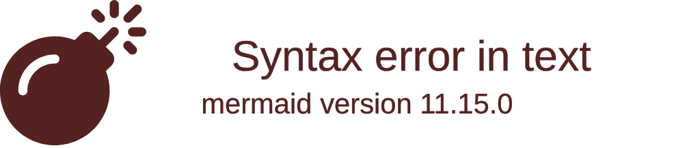

# Impact Canvas: {{FEATURE_NAME}}

**Date**: {{DATE}} **Pass**: {{PASS}}

## Problem

{{PROBLEM_STATEMENT}}

## Personas

{{PERSONA_LIST}}

## AI-Leverage Distribution

## Top Three Risks

<!-- pass-1: heuristic from spec NFRs and Out-of-Scope -->
<!-- pass-2: replaced with validation council output -->

1. {{RISK_1}}
2. {{RISK_2}}
3. {{RISK_3}}

## Outcomes

{{OUTCOMES}}
